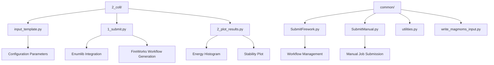
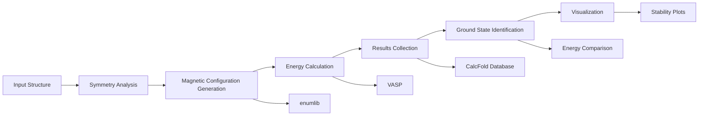
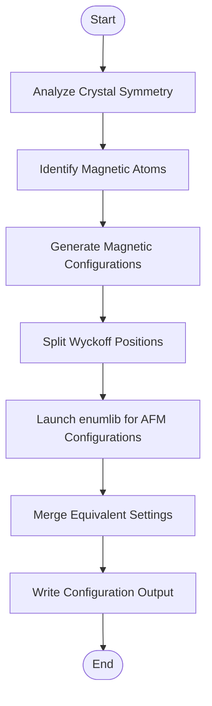
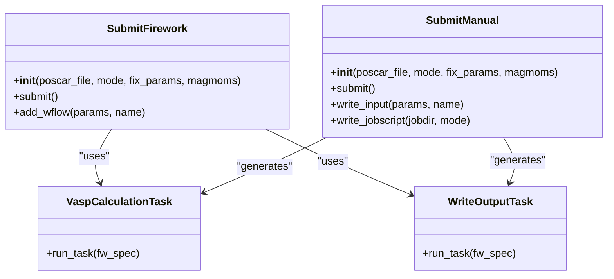
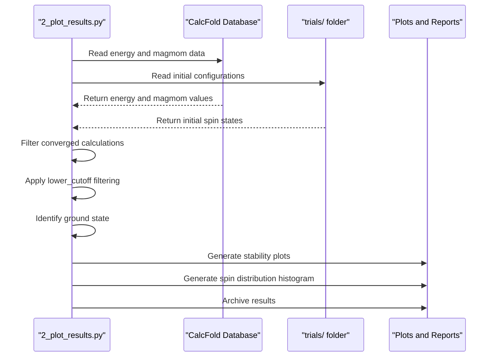
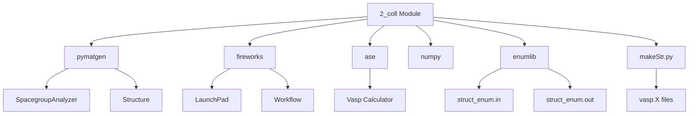

# Collinear Magnetic Search Module

<cite>
**Referenced Files in This Document**   
- [2_coll/input_template.py](file://2_coll/input_template.py)
- [2_coll/1_submit.py](file://2_coll/1_submit.py)
- [2_coll/2_plot_results.py](file://2_coll/2_plot_results.py)
- [common/SubmitFirework.py](file://common/SubmitFirework.py)
- [common/SubmitManual.py](file://common/SubmitManual.py)
- [common/utilities.py](file://common/utilities.py)
- [common/write_magmoms_input.py](file://common/write_magmoms_input.py)
</cite>

## Table of Contents
1. [Introduction](#introduction)
2. [Project Structure](#project-structure)
3. [Core Components](#core-components)
4. [Architecture Overview](#architecture-overview)
5. [Detailed Component Analysis](#detailed-component-analysis)
6. [Dependency Analysis](#dependency-analysis)
7. [Performance Considerations](#performance-considerations)
8. [Troubleshooting Guide](#troubleshooting-guide)
9. [Conclusion](#conclusion)

## Introduction
The Collinear Magnetic Search Module is designed to systematically explore magnetic configurations in crystalline materials using the enumlib algorithm for symmetry-based enumeration. This module enables researchers to identify ground magnetic states by generating all possible collinear spin arrangements, computing their energies via VASP (or other calculators), and determining the most stable configuration. The implementation leverages pymatgen for crystal symmetry analysis, FireWorks for workflow management, and automated plotting for result visualization. It supports both high-throughput computational campaigns and manual job submission through flexible configuration options.

## Project Structure
The collinear magnetic search functionality resides in the `2_coll` directory, which contains three primary components: an input template, a submission script, and a results plotting script. This structure follows a consistent pattern across the automag framework, where each analysis stage (convergence tests, linear response, collinear magnetism, Monte Carlo, magnetic anisotropy) maintains its own configuration and execution scripts.

**Diagram sources**
- [2_coll/input_template.py](file://2_coll/input_template.py#L1-L67)
- [2_coll/1_submit.py](file://2_coll/1_submit.py#L1-L387)
- [2_coll/2_plot_results.py](file://2_coll/2_plot_results.py#L1-L325)
- [common/SubmitFirework.py](file://common/SubmitFirework.py#L1-L260)
- [common/SubmitManual.py](file://common/SubmitManual.py#L1-L870)

**Section sources**
- [2_coll](file://2_coll)
- [common](file://common)

## Core Components
The collinear magnetic search module consists of three core components: the input template that defines material and calculation parameters, the submission script that generates magnetic configurations and launches calculations, and the results analysis script that processes output and identifies ground states. These components work together to automate the entire workflow from magnetic state enumeration to ground state identification.

**Section sources**
- [2_coll/input_template.py](file://2_coll/input_template.py#L1-L67)
- [2_coll/1_submit.py](file://2_coll/1_submit.py#L1-L387)
- [2_coll/2_plot_results.py](file://2_coll/2_plot_results.py#L1-L325)

## Architecture Overview
The collinear magnetic search module implements a pipeline architecture that begins with crystal structure input and ends with ground state identification. The process starts with symmetry analysis of the input structure using pymatgen's SpacegroupAnalyzer, followed by magnetic configuration generation through enumlib. Each generated configuration is submitted as a FireWorks workflow (or manual job) for single-point energy calculation. After completion, results are collected and analyzed to determine the most stable magnetic state based on relative energies.

**Diagram sources**
- [2_coll/1_submit.py](file://2_coll/1_submit.py#L150-L380)
- [common/SubmitFirework.py](file://common/SubmitFirework.py#L1-L260)
- [2_coll/2_plot_results.py](file://2_coll/2_plot_results.py#L1-L325)

## Detailed Component Analysis

### Magnetic Configuration Generation
The magnetic configuration generation process begins with symmetry analysis of the input crystal structure to identify Wyckoff positions and their multiplicities. For each magnetic species specified in the `spin_values` parameter, the code determines possible magnetic moment values. The algorithm then systematically splits Wyckoff positions to generate both ferromagnetic and antiferromagnetic configurations while respecting crystal symmetry.

**Diagram sources**
- [2_coll/1_submit.py](file://2_coll/1_submit.py#L150-L300)

**Section sources**
- [2_coll/1_submit.py](file://2_coll/1_submit.py#L150-L300)

### Energy Calculation and Workflow Management
The module supports two modes of calculation submission: FireWorks-based workflow management and manual job submission. When `use_fireworks = True`, the SubmitFirework class creates Firework objects for single-point energy calculations and optional recalculation steps. Each Firework includes VaspCalculationTask for running VASP and WriteOutputTask for recording results. For manual submission, SubmitManual generates job scripts and input files directly.

**Diagram sources**
- [common/SubmitFirework.py](file://common/SubmitFirework.py#L25-L259)
- [common/SubmitManual.py](file://common/SubmitManual.py#L24-L853)
- [common/utilities.py](file://common/utilities.py#L1-L278)

**Section sources**
- [common/SubmitFirework.py](file://common/SubmitFirework.py#L1-L260)
- [common/SubmitManual.py](file://common/SubmitManual.py#L1-L870)

### Results Analysis and Visualization
The results analysis component reads energy and magnetic moment data from the CalcFold database, filters configurations based on convergence and magnetic moment criteria, and generates visualizations. The primary outputs include energy stability plots that show relative energies of all configurations and histograms of final magnetic moments. The module identifies the ground state as the configuration with the lowest energy that maintains its initial magnetic structure.

**Diagram sources**
- [2_coll/2_plot_results.py](file://2_coll/2_plot_results.py#L1-L325)

**Section sources**
- [2_coll/2_plot_results.py](file://2_coll/2_plot_results.py#L1-L325)

## Dependency Analysis
The collinear magnetic search module depends on several external packages and internal components. The primary dependencies include pymatgen for crystal structure manipulation and symmetry analysis, fireworks for workflow management, ase for VASP interface, and numpy for numerical operations. The module also relies on enumlib for magnetic configuration enumeration, which must be available in the system path.

**Diagram sources**
- [2_coll/1_submit.py](file://2_coll/1_submit.py#L1-L387)
- [common/SubmitFirework.py](file://common/SubmitFirework.py#L1-L260)

**Section sources**
- [2_coll/1_submit.py](file://2_coll/1_submit.py#L1-L387)
- [common/SubmitFirework.py](file://common/SubmitFirework.py#L1-L260)

## Performance Considerations
The performance of the collinear magnetic search module is primarily determined by the number of magnetic configurations generated, which grows exponentially with the number of magnetic atoms and their possible spin states. The use of symmetry through enumlib significantly reduces the configuration space by eliminating equivalent arrangements. For large systems, the `parallel_over_configurations` parameter can be set to distribute calculations across multiple nodes. The module also includes optimization through magnetic moment filtering via the `lower_cutoff` parameter, which excludes low-spin configurations from detailed analysis.

## Troubleshooting Guide
Common issues in the collinear magnetic search module include incomplete configuration generation, energy convergence problems, and missing result files. If enumlib fails to generate configurations, verify that the enum.x and makeStr.py executables are in the system path. For convergence issues, check VASP input parameters in the `params` dictionary, particularly `encut`, `kpts`, and `sigma` values. If results are not being collected, ensure the `AUTOMAG_PATH` environment variable is correctly set and the CalcFold directory exists. The `lower_cutoff` parameter can be adjusted if high-spin configurations are being incorrectly filtered out.

**Section sources**
- [2_coll/1_submit.py](file://2_coll/1_submit.py#L1-L387)
- [2_coll/2_plot_results.py](file://2_coll/2_plot_results.py#L1-L325)
- [common/SubmitFirework.py](file://common/SubmitFirework.py#L1-L260)

## Conclusion
The Collinear Magnetic Search Module provides a comprehensive framework for exploring magnetic ground states in crystalline materials. By integrating symmetry analysis, automated workflow generation, and systematic results analysis, it enables efficient identification of stable magnetic configurations. The modular design allows flexibility in calculation methods and supports both FireWorks-based and manual job submission. With proper configuration of parameters such as `supercell_size`, `spin_values`, and `lower_cutoff`, researchers can effectively navigate complex magnetic energy landscapes to discover novel magnetic materials.