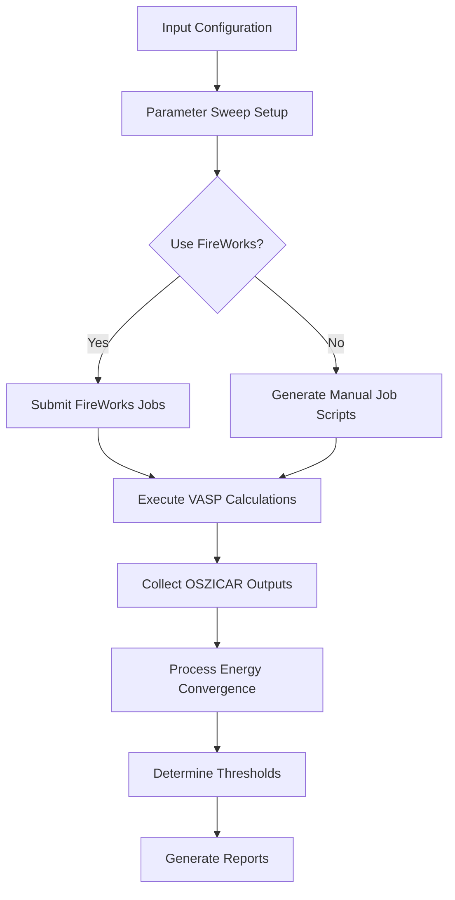
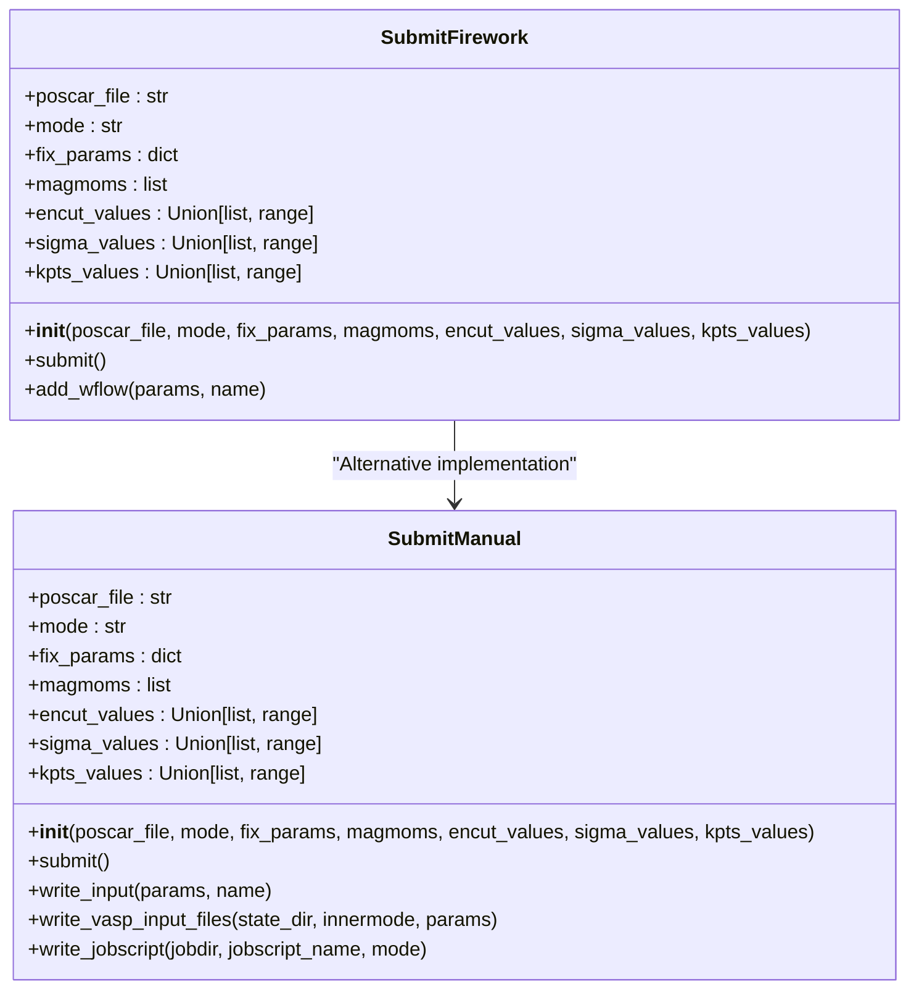
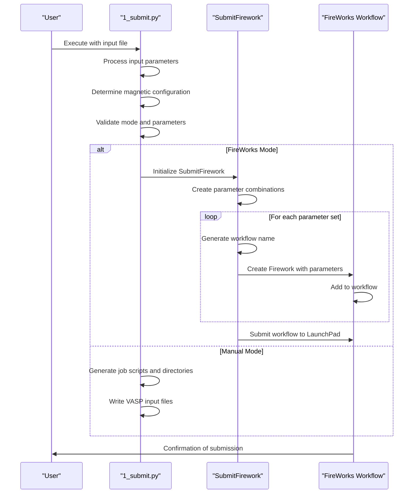
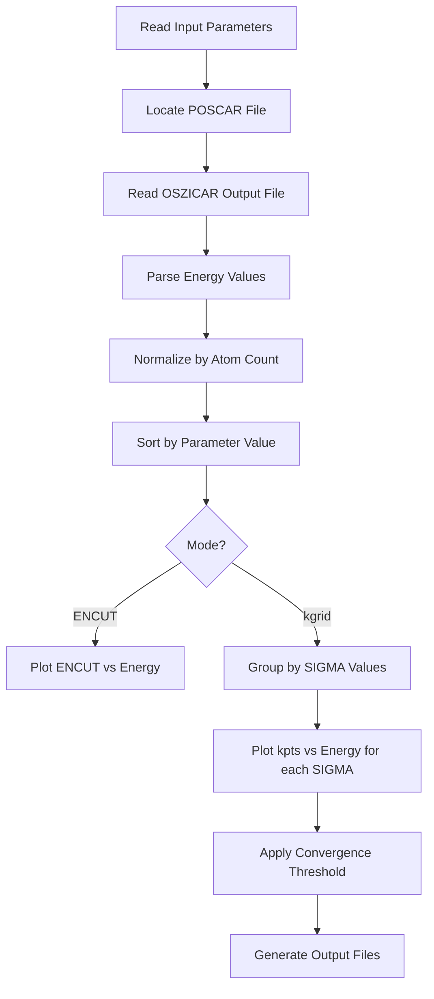

# Convergence Testing Module

<cite>
**Referenced Files in This Document**   
- [1_submit.py](file://0_conv_tests/1_submit.py)
- [2_plot_results.py](file://0_conv_tests/2_plot_results.py)
- [input_template.py](file://1_lin_response/input_template.py)
- [SubmitFirework.py](file://common/SubmitFirework.py)
- [utilities.py](file://common/utilities.py)
- [SubmitManual.py](file://common/SubmitManual.py)
- [input.py](file://3_monte_carlo/Fe12O18/input.py)
</cite>

## Table of Contents
1. [Introduction](#introduction)
2. [Convergence Testing Workflow Overview](#convergence-testing-workflow-overview)
3. [Parameter Configuration and Input System](#parameter-configuration-and-input-system)
4. [FireWorks Job Generation in 1_submit.py](#fireworks-job-generation-in-1_submitpy)
5. [Results Processing in 2_plot_results.py](#results-processing-in-2_plot_resultspy)
6. [Energy Convergence Threshold Determination](#energy-convergence-threshold-determination)
7. [Configuration Options and Custom Parameter Sweeps](#configuration-options-and-custom-parameter-sweeps)
8. [Common Issues and Troubleshooting](#common-issues-and-troubleshooting)
9. [Conclusion](#conclusion)

## Introduction

The convergence testing module in the automag framework provides a systematic approach for determining optimal VASP calculation parameters through automated workflows. This module focuses on two primary convergence tests: energy cutoff (ENCUT) and k-point grid (kpts) convergence, which are critical for ensuring accurate and reliable density functional theory (DFT) calculations. The system consists of two main scripts: `1_submit.py` for generating FireWorks jobs for single-point energy calculations and `2_plot_results.py` for processing OSZICAR outputs to determine energy convergence thresholds. The module integrates with the FireWorks workflow management system to automate the execution of parameter sweeps and result collection, enabling researchers to efficiently identify converged parameters while minimizing computational overhead.

## Convergence Testing Workflow Overview

The convergence testing module follows a two-stage workflow: job submission and results analysis. The process begins with parameter configuration through input files, followed by automated job generation for systematic parameter sweeps. After execution, results are processed to determine convergence thresholds based on energy differences per atom.



**Diagram sources**
- [1_submit.py](file://0_conv_tests/1_submit.py)
- [2_plot_results.py](file://0_conv_tests/2_plot_results.py)

**Section sources**
- [1_submit.py](file://0_conv_tests/1_submit.py)
- [2_plot_results.py](file://0_conv_tests/2_plot_results.py)

## Parameter Configuration and Input System

The convergence testing module utilizes a flexible input system that allows users to customize parameters through configuration files. The system supports both default values and user-defined overrides, enabling tailored convergence tests for specific materials systems.

### Input File Structure

The input system follows a hierarchical structure where parameters can be defined in multiple locations, with later definitions taking precedence. The primary input file (`input.py`) contains material-specific configurations, while default values are defined within the script files themselves.

```python
# Example input.py structure
poscar_file = 'Fe2O3-alpha_conventional.vasp'
calculator = 'vasp'
mode = 'encut'  # or 'kgrid'
magnetic_atoms = ['Fe']
configuration = [4.0, 4.0, 4.0, 4.0, 4.0, 4.0, 0.0, 0.0, 0.0, 0.0, 0.0, 0.0]
params = {
    'xc': 'PBE',
    'encut': 650,
    'kpts': 50,
    'sigma': 0.2,
    'ismear': 0,
}
```

**Section sources**
- [input.py](file://3_monte_carlo/Fe12O18/input.py)
- [input_template.py](file://1_lin_response/input_template.py)

### Default Parameter Ranges

The module provides sensible default parameter ranges for convergence testing, which can be customized based on system requirements:

- **ENCUT values**: Range from 500 to 1000 eV in 10 eV increments (500, 510, ..., 1000)
- **SIGMA values**: Range from 0.05 to 0.20 in 0.05 increments (0.05, 0.10, 0.15, 0.20)
- **kpts values**: Range from 20 to 100 in 10 increment steps (20, 30, ..., 100)

These defaults are defined in `1_submit.py` and can be overridden in the input file:

```python
# Default values in 1_submit.py
if mode == 'encut':
    if 'encut_values' not in globals():
        encut_values = range(500, 1010, 10)

if mode == 'kgrid':
    if 'sigma_values' not in globals():
        sigma_values = [item / 100 for item in range(5, 25, 5)]

    if 'kpts_values' not in globals():
        kpts_values = range(20, 110, 10)
```

**Section sources**
- [1_submit.py](file://0_conv_tests/1_submit.py#L50-L65)

## FireWorks Job Generation in 1_submit.py

The `1_submit.py` script serves as the entry point for convergence testing, responsible for generating FireWorks jobs or manual job scripts based on the specified mode and parameters.

### Job Submission Architecture

The script implements a modular architecture that supports both FireWorks-managed workflows and manual job submission. The choice between these modes is controlled by the `use_fireworks` boolean flag.



**Diagram sources**
- [SubmitFirework.py](file://common/SubmitFirework.py)
- [SubmitManual.py](file://common/SubmitManual.py)

**Section sources**
- [1_submit.py](file://0_conv_tests/1_submit.py)

### Workflow Generation Process

The job generation process follows a systematic approach to create parameter sweeps for convergence testing:

1. **Input Processing**: The script first processes input parameters, either from a specified input file or the default `input.py`
2. **Magnetic Configuration**: Determines the magnetic configuration for the system, automatically identifying transition metal atoms or using user-specified magnetic atoms
3. **Parameter Validation**: Validates the mode and required parameter ranges
4. **Workflow Creation**: Generates FireWorks workflows or manual job scripts based on the selected mode



**Diagram sources**
- [1_submit.py](file://0_conv_tests/1_submit.py)
- [SubmitFirework.py](file://common/SubmitFirework.py)

**Section sources**
- [1_submit.py](file://0_conv_tests/1_submit.py)
- [SubmitFirework.py](file://common/SubmitFirework.py)

### ENCUT and kpts Workflow Implementation

The script implements distinct workflows for ENCUT and kpts convergence testing, each with specific parameter handling:

#### ENCUT Convergence Workflow
When `mode = 'encut'`, the script generates a series of single-point calculations with varying energy cutoff values while keeping other parameters fixed:

```python
if mode == 'encut':
    if 'encut_values' not in globals():
        encut_values = range(500, 1010, 10)
    
    if use_fireworks:
        convtest = SubmitFirework(path_to_poscar, struct_suffix=struct_suffix, mode='encut', 
                                fix_params=params, magmoms=configuration,
                                encut_values=encut_values)
        convtest.submit()
```

#### kpts Convergence Workflow
When `mode = 'kgrid'`, the script performs a two-dimensional parameter sweep over both SIGMA and kpts values:

```python
if mode == 'kgrid':
    if 'sigma_values' not in globals():
        sigma_values = [item / 100 for item in range(5, 25, 5)]
    
    if 'kpts_values' not in globals():
        kpts_values = range(20, 110, 10)
    
    if use_fireworks:
        convtest = SubmitFirework(path_to_poscar, struct_suffix=struct_suffix, mode='kgrid', 
                                fix_params=params, magmoms=configuration,
                                sigma_values=sigma_values, kpts_values=kpts_values)
        convtest.submit()
```

**Section sources**
- [1_submit.py](file://0_conv_tests/1_submit.py#L45-L85)

## Results Processing in 2_plot_results.py

The `2_plot_results.py` script processes the output from convergence tests, extracting energy values from OSZICAR files and generating convergence plots to determine optimal parameters.

### Results Processing Pipeline

The results processing follows a structured pipeline that transforms raw VASP output into meaningful convergence analysis:



**Diagram sources**
- [2_plot_results.py](file://0_conv_tests/2_plot_results.py)

**Section sources**
- [2_plot_results.py](file://0_conv_tests/2_plot_results.py)

### OSZICAR Output Processing

The script reads energy values from the OSZICAR output file, which contains the total energy for each ionic step of a VASP calculation. For convergence testing, only the final energy value is used.

```python
# Read OSZICAR output
lines = []
calcfold = os.path.join(os.environ.get('AUTOMAG_PATH'), 'CalcFold')
with open(os.path.join(calcfold, f"{atoms.get_chemical_formula(mode='metal')}{struct_suffix}_{mode}_{calculator}.txt"), 'r') as f:
    for line in f:
        if line[0] != ' ':
            lines.append(line)

# Extract results
paramss, energies = [], []
for line in lines:
    values = line.split()
    paramss.append(values[0].strip(mode))
    energies.append(values[-1].split('=')[1])
```

The processing logic handles both ENCUT and kgrid modes differently:
- For ENCUT mode, parameters are single values representing the energy cutoff
- For kgrid mode, parameters are compound values in the format "sigma-kpts" that are split for analysis

**Section sources**
- [2_plot_results.py](file://0_conv_tests/2_plot_results.py#L60-L90)

## Energy Convergence Threshold Determination

The module implements a systematic approach to determine energy convergence thresholds based on a 1 meV/atom criterion, which is a standard threshold for DFT calculations.

### Convergence Criteria Implementation

The convergence threshold is determined by comparing the energy at each parameter value with the energy at the most accurate (highest parameter) setting:

```python
def single_plot(X, Y, label=None):
    X = np.array(X, dtype=int)
    Y = np.array(Y, dtype=float) / len(atoms)
    
    # Sort arrays by parameter value
    indices = np.argsort(X)
    X = X[indices]
    Y = Y[indices]
    
    # Find first parameter value meeting convergence criterion
    for x, y in zip(X[:-1], Y[:-1]):
        if abs(y - Y[-1]) < 0.001:  # 1 meV/atom threshold
            if mode == 'encut':
                result_string = f"ENCUT = {x} eV gives an error of less than 1 meV/atom w.r.t. the most accurate result"
            else:
                result_string = f"kpts = {x} with {label} gives an error of less than 1 meV/atom w.r.t. the most accurate result"
            print(result_string)
            break
```

### Visualization and Reporting

The script generates publication-quality plots showing the convergence behavior and saves results to text files for further analysis:

```python
# Generate convergence plot
plt.figure(figsize=(16, 9))
if mode == 'encut':
    single_plot(paramss, energies)
elif mode == 'kgrid':
    # Plot separate lines for each SIGMA value
    for sigma_value in sigma_values:
        indices = np.where(sigmas == sigma_value)
        single_plot(kptss[indices], energies[indices], label=f'SIGMA = {sigma_value}')
    plt.legend()

plt.xlabel('ENCUT (eV)' if mode == 'encut' else r'$R_k$')
plt.ylabel('energy (eV/atom)')
plt.savefig(f'{mode}_convergence_{calculator}.png', bbox_inches='tight')

# Save results to file
with open(f"{atoms.get_chemical_formula(mode='metal')}{struct_suffix}_{mode}_convergence_{calculator}.txt",'w') as f:
    f.write(result_string)
```

The results are organized in a dedicated folder structure for easy access and archiving.

**Section sources**
- [2_plot_results.py](file://0_conv_tests/2_plot_results.py#L20-L130)

## Configuration Options and Custom Parameter Sweeps

The convergence testing module provides extensive configuration options that allow users to customize the testing parameters and workflow behavior.

### Magnetic Configuration Options

The module supports flexible magnetic configuration through several input options:

- **Automatic detection**: When no `magnetic_atoms` are specified, the script automatically identifies transition metal atoms as magnetic
- **User-specified atoms**: Users can define which atomic species are considered magnetic using the `magnetic_atoms` list
- **Custom magnetic moments**: The `configuration` parameter allows users to specify initial magnetic moments for each atom

```python
# Magnetic configuration logic
if 'configuration' not in globals():
    configuration = []
    structure = Structure.from_file(path_to_poscar)
    for atom in structure.species:
        if 'magnetic_atoms' not in globals():
            if atom.is_transition_metal:
                configuration.append(4.0)
            else:
                configuration.append(0.0)
        else:
            if atom in magnetic_atoms:
                configuration.append(4.0)
            else:
                configuration.append(0.0)
```

### Custom Parameter Sweeps

Users can define custom parameter ranges by overriding the default values in their input file:

```python
# Custom ENCUT sweep
encut_values = [400, 450, 500, 550, 600, 650, 700]

# Custom kpts and sigma sweep
sigma_values = [0.05, 0.10, 0.15]
kpts_values = [20, 30, 40, 50, 60]
```

This flexibility allows researchers to focus computational resources on specific parameter ranges of interest or to perform more granular sweeps in critical regions.

### Execution Mode Configuration

The module supports two execution modes controlled by the `use_fireworks` parameter:

- **FireWorks mode**: When `use_fireworks = True`, jobs are submitted to a FireWorks database for distributed execution and workflow management
- **Manual mode**: When `use_fireworks = False`, the script generates job scripts and directory structures for manual execution on HPC systems

Each mode requires different configuration parameters:
- FireWorks mode requires database connection settings
- Manual mode requires job header specifications and calculator commands for the target HPC environment

**Section sources**
- [1_submit.py](file://0_conv_tests/1_submit.py#L30-L45)
- [input.py](file://3_monte_carlo/Fe12O18/input.py)

## Common Issues and Troubleshooting

### Insufficient Energy Cutoff

One common issue is selecting an energy cutoff that is too low for accurate calculations. The convergence testing module helps identify this issue by showing the energy convergence behavior:

- **Symptoms**: Energy continues to decrease significantly with increasing ENCUT values
- **Solution**: Extend the ENCUT range to higher values until convergence is achieved
- **Prevention**: Use the module's default range (500-1000 eV) as a starting point, adjusting based on the elements in the system

### Poor k-Point Sampling

Inadequate k-point sampling can lead to inaccurate band structure and total energy calculations:

- **Symptoms**: Energy oscillations or slow convergence with increasing kpts values
- **Solution**: Perform a systematic kpts convergence test using the module, ensuring sufficient sampling of the Brillouin zone
- **Guidance**: For metals, use smaller SIGMA values (0.05-0.10); for insulators/semiconductors, larger SIGMA values (0.10-0.20) may be appropriate

### Workflow Execution Failures

When using FireWorks mode, workflow execution failures can occur due to:

- **Database connection issues**: Verify the launchpad file path and database accessibility
- **Resource limitations**: Ensure sufficient computational resources are available
- **File path issues**: Confirm that the AUTOMAG_PATH environment variable is correctly set

For manual mode, common issues include:
- **Incorrect job headers**: Ensure SLURM/PBS directives match the target HPC system
- **Missing dependencies**: Verify that VASP and required modules are properly configured
- **File permissions**: Ensure write permissions in the calculation directory

**Section sources**
- [SubmitFirework.py](file://common/SubmitFirework.py)
- [SubmitManual.py](file://common/SubmitManual.py)

## Conclusion

The convergence testing module provides a comprehensive framework for determining optimal VASP calculation parameters through automated workflows. By systematically testing ENCUT and kpts convergence, researchers can ensure the accuracy and reliability of their DFT calculations while minimizing computational costs. The module's flexible configuration system allows for customization of parameter ranges, magnetic configurations, and execution modes, making it adaptable to various research needs and computational environments. The integration with FireWorks enables efficient workflow management and distributed execution, while the results processing pipeline provides clear visualization and quantitative determination of convergence thresholds. This systematic approach to parameter optimization is essential for producing high-quality computational materials science research.