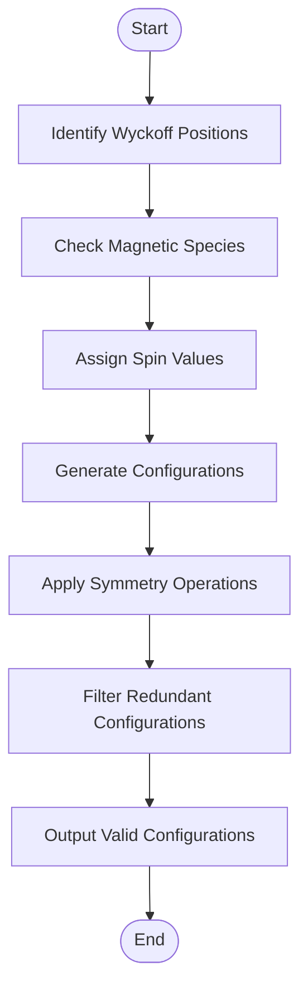
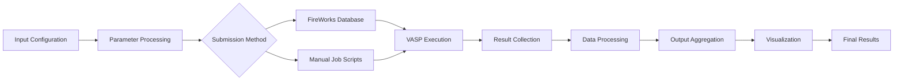
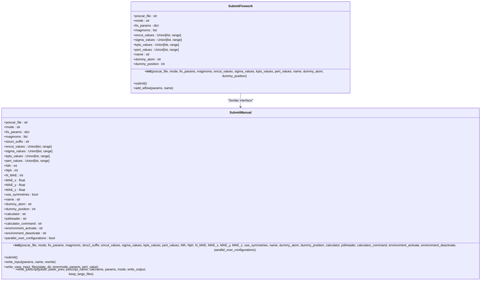
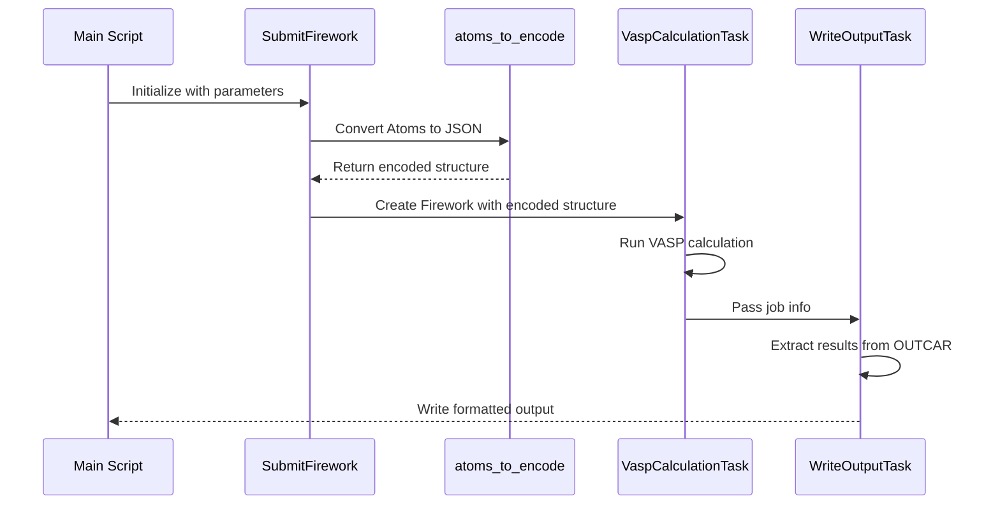

# Core Concepts

<cite>
**Referenced Files in This Document**   
- [SubmitFirework.py](file://common/SubmitFirework.py)
- [SubmitManual.py](file://common/SubmitManual.py)
- [utilities.py](file://common/utilities.py)
- [run_vasp.py](file://ase/run_vasp.py)
- [1_submit.py](file://2_coll/1_submit.py)
</cite>

## Table of Contents
1. [VASP Parameters](#vasp-parameters)
2. [Magnetic Configuration Generation](#magnetic-configuration-generation)
3. [FireWorks Workflow Management](#fireworks-workflow-management)
4. [Data Flow Architecture](#data-flow-architecture)
5. [Workflow Orchestration Implementation](#workflow-orchestration-implementation)
6. [Utility Functions](#utility-functions)
7. [Integration with ASE and pymatgen](#integration-with-ase-and-pymatgen)
8. [Common Issues](#common-issues)
9. [Performance Considerations](#performance-considerations)

## VASP Parameters

The system utilizes key VASP parameters for electronic structure calculations, with specific focus on ENCUT, SIGMA, and kpts. The ENCUT parameter defines the plane-wave basis set cutoff energy in eV, controlling the accuracy of the wavefunction representation. The SIGMA parameter determines the Gaussian smearing width for partial occupancies, affecting electronic convergence. The kpts parameter specifies the k-point mesh density for Brillouin zone sampling, with higher values providing better integration accuracy but increased computational cost. These parameters are systematically varied in convergence tests to ensure reliable results, with the SubmitFirework and SubmitManual classes providing infrastructure for parameter sweeps across multiple values.

**Section sources**
- [SubmitFirework.py](file://common/SubmitFirework.py#L34-L69)
- [SubmitManual.py](file://common/SubmitManual.py#L32-L65)

## Magnetic Configuration Generation

Magnetic configurations are generated using Wyckoff positions to systematically explore possible magnetic orderings. The implementation analyzes crystal symmetry to identify equivalent atomic sites and generates magnetic moment configurations based on allowed spin states. For each magnetic species, spin values are assigned according to the element's magnetic properties, with options for multiple spin states per Wyckoff position. The system handles both collinear and non-collinear magnetic configurations, with special consideration for antiferromagnetic arrangements. The generation process accounts for symmetry operations to avoid redundant configurations and ensures proper treatment of magnetic unit cells.

**Diagram sources**
- [1_submit.py](file://2_coll/1_submit.py#L233-L327)

## FireWorks Workflow Management

The FireWorks-based workflow management system provides automated execution of VASP calculations through a database-driven approach. The SubmitFirework class interfaces with the FireWorks launchpad to submit workflows, with each workflow consisting of multiple Fireworks representing individual calculation steps. Workflows are constructed with proper dependencies to ensure correct execution order, with job routing handled by the FireWorks queue adapter. The system supports various calculation modes including single-point, convergence tests, and perturbation studies. Each Firework contains specific tasks such as VaspCalculationTask for running VASP and WriteOutputTask for processing results, with job information passed between steps through the _job_info specification.

**Section sources**
- [SubmitFirework.py](file://common/SubmitFirework.py#L0-L259)

## Data Flow Architecture

The data flow architecture follows a structured pipeline from input configuration to result visualization. Input parameters and structure files are processed to generate calculation inputs, which are then executed through either FireWorks automation or manual job submission. Results are collected and processed through specialized tasks that extract relevant physical quantities. The output is organized in a hierarchical directory structure based on compound and calculation type, with results aggregated into summary files for analysis. Visualization scripts then process these summary files to generate plots and reports, completing the workflow from raw input to interpretable results.

**Diagram sources**
- [SubmitFirework.py](file://common/SubmitFirework.py#L0-L259)
- [SubmitManual.py](file://common/SubmitManual.py#L0-L869)

## Workflow Orchestration Implementation

The workflow orchestration is implemented through the SubmitFirework and SubmitManual classes, which construct FireWorks workflows with proper dependencies and job routing. The SubmitFirework class creates workflows by defining Firework objects for each calculation step and establishing dependency links through the links_dict parameter. For single-point calculations, the workflow includes both the initial calculation and a recalculation step using magnetic moments from the first run. The add_wflow method packages Fireworks into a Workflow object and submits it to the launchpad. Job routing is configured through the _queueadapter specification, with resource requirements defined for output processing tasks. The system handles different calculation modes by varying the workflow structure, with perturbation studies requiring additional Fireworks for NSC and SC calculations.

**Diagram sources**
- [SubmitFirework.py](file://common/SubmitFirework.py#L25-L258)
- [SubmitManual.py](file://common/SubmitManual.py#L24-L853)

## Utility Functions

Key utility functions include atoms_to_encode for serializing atomic structures to JSON format and charge response analysis for extracting U parameters from perturbation calculations. The atoms_to_encode function converts ASE Atoms objects to a JSON-serializable dictionary containing cell, scaled positions, atomic numbers, and periodic boundary conditions. This encoding enables transmission of structure data between FireWorks tasks. The charge response analysis is implemented in the WriteChargesTask Firetask, which processes OUTCAR files from NSC and SC calculations to extract orbital-resolved charges and compute response coefficients. The system also includes utilities for magnetic moment handling, output formatting, and structure analysis using pymatgen.

**Diagram sources**
- [utilities.py](file://common/utilities.py#L24-L39)
- [utilities.py](file://common/utilities.py#L55-L277)

## Integration with ASE and pymatgen

The system integrates with ASE for VASP execution and pymatgen for structure handling through well-defined interfaces. ASE is used for creating Vasp calculator objects and writing input files (INCAR, POSCAR, KPOINTS, POTCAR), with the run_vasp.py script defining the execution command. The integration allows for seamless calculation setup and execution within the FireWorks framework. pymatgen is utilized for advanced structure analysis, including space group determination through SpacegroupAnalyzer and electronic structure parsing from INCAR and OUTCAR files. The combination of ASE for calculation management and pymatgen for structural analysis provides comprehensive materials simulation capabilities.

**Section sources**
- [run_vasp.py](file://ase/run_vasp.py#L0-L21)
- [utilities.py](file://common/utilities.py#L55-L277)

## Common Issues

Common issues include job submission failures due to resource limitations or configuration errors, and inconsistent magnetic moment initialization. Job submission failures can occur when the FireWorks launchpad is unreachable or when job scripts contain syntax errors in the SLURM/PBS directives. Inconsistent magnetic moment initialization may arise when the initial magmoms array does not match the number of atoms in the structure, or when symmetry operations are not properly applied to magnetic configurations. The system includes validation checks to detect these issues, with warnings generated when final magnetic moments differ significantly from initial values. For perturbation calculations, issues can occur if the dummy atom POTCAR is not properly handled during U parameter calculations.

**Section sources**
- [SubmitFirework.py](file://common/SubmitFirework.py#L104-L258)
- [SubmitManual.py](file://common/SubmitManual.py#L526-L633)

## Performance Considerations

Performance considerations are critical for large supercells and high k-mesh densities, which significantly increase computational cost. The system addresses these through several strategies: convergence testing to identify optimal parameter values, parallel execution of independent calculations, and efficient data handling to minimize I/O overhead. For large systems, the choice of ENCUT and kpts requires careful balancing between accuracy and computational feasibility. The implementation supports parallelization over configurations to utilize available computing resources effectively. Memory usage is managed by removing large files like WAVECAR and CHGCAR after they are no longer needed, and calculation chaining minimizes redundant computations by reusing wavefunctions between successive runs.

**Section sources**
- [SubmitFirework.py](file://common/SubmitFirework.py#L79-L102)
- [SubmitManual.py](file://common/SubmitManual.py#L115-L185)