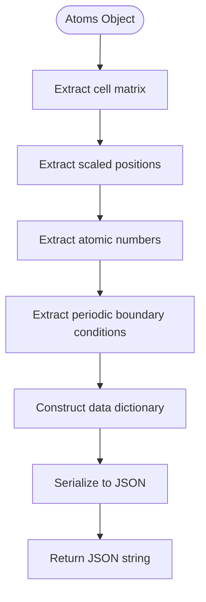
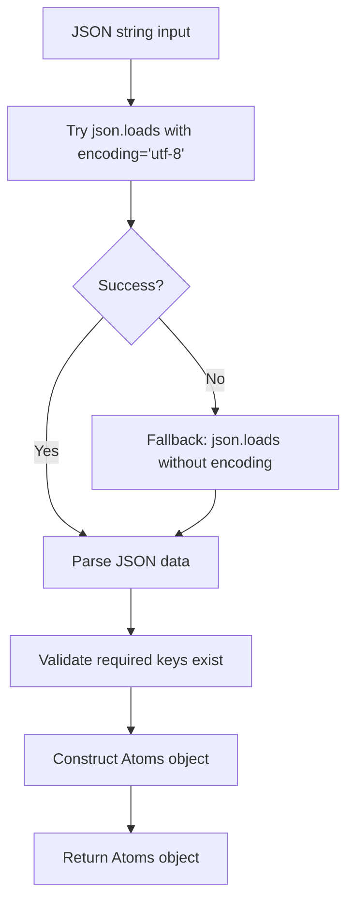
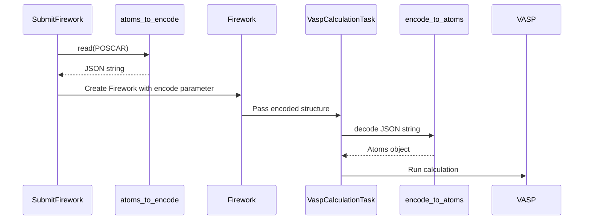

# Data Encoding Utilities

<cite>
**Referenced Files in This Document**  
- [common/utilities.py](file://common/utilities.py)
- [common/SubmitFirework.py](file://common/SubmitFirework.py)
</cite>

## Table of Contents
1. [Introduction](#introduction)
2. [Core Encoding Functions](#core-encoding-functions)
3. [Integration with FireWorks Workflow](#integration-with-fireworks-workflow)
4. [Error Handling and Data Integrity](#error-handling-and-data-integrity)
5. [Performance Considerations](#performance-considerations)
6. [Best Practices](#best-practices)
7. [Troubleshooting Common Issues](#troubleshooting-common-issues)
8. [Conclusion](#conclusion)

## Introduction

The data encoding utilities in the `automag` framework provide essential serialization and deserialization capabilities for atomic structures used in computational materials science workflows. These utilities enable the transmission of atomic configuration data between FireWorks tasks through JSON serialization, ensuring data integrity and compatibility across workflow steps. The core functionality revolves around two primary functions: `atoms_to_encode` for converting ASE Atoms objects to JSON strings, and `encode_to_atoms` for reconstructing Atoms objects from JSON data. This document details their implementation, integration with FireWorks, and best practices for reliable workflow execution.

## Core Encoding Functions

The encoding utilities provide bidirectional conversion between ASE Atoms objects and JSON-serializable representations, enabling persistent storage and transmission of atomic structure data.

### atoms_to_encode Function

The `atoms_to_encode` function serializes an ASE Atoms object into a JSON string by extracting essential structural properties. It captures the complete atomic configuration including lattice parameters, atomic positions, elemental identities, and periodic boundary conditions.



**Diagram sources**  
- [common/utilities.py](file://common/utilities.py#L24-L39)

**Section sources**  
- [common/utilities.py](file://common/utilities.py#L24-L39)

### encode_to_atoms Function

The `encode_to_atoms` function deserializes a JSON string back into an ASE Atoms object. It handles Python version compatibility by gracefully managing the `encoding` parameter in `json.loads`, which was deprecated in Python 3.9+.



**Diagram sources**  
- [common/utilities.py](file://common/utilities.py#L42-L60)

**Section sources**  
- [common/utilities.py](file://common/utilities.py#L42-L60)

## Integration with FireWorks Workflow

The encoding utilities are tightly integrated with the FireWorks workflow management system, enabling atomic structure transmission between Firetasks.

### Workflow Structure

The encoding process is initiated in the `SubmitFirework` class, where atomic structures are encoded before being passed to `VaspCalculationTask` Firetasks. This enables the preservation of structural data across workflow steps without relying on file system persistence.



**Diagram sources**  
- [common/utilities.py](file://common/utilities.py#L24-L60)
- [common/SubmitFirework.py](file://common/SubmitFirework.py#L140-L145)

**Section sources**  
- [common/SubmitFirework.py](file://common/SubmitFirework.py#L140-L145)
- [common/utilities.py](file://common/utilities.py#L72-L80)

### Magnetic Structure Encoding Example

The following example demonstrates how a magnetic structure is encoded for transmission through a FireWorks workflow:

1. An ASE Atoms object is created from a POSCAR file
2. The atomic structure is encoded using `atoms_to_encode`
3. The encoded JSON string is passed to `VaspCalculationTask` with magnetic moments
4. Subsequent Firetasks reconstruct the structure using `encode_to_atoms`

This approach ensures that the complete atomic configuration, including magnetic properties, is preserved throughout the workflow execution.

## Error Handling and Data Integrity

The encoding utilities implement robust error handling to maintain data integrity across workflow steps.

### Python Version Compatibility

The `encode_to_atoms` function handles Python version differences in the `json.loads` method:

```python
try: 
    data = json.loads(encode, encoding='utf-8')
except TypeError: 
    data = json.loads(encode)
```

This try-except block ensures compatibility across Python versions, gracefully handling the deprecation of the `encoding` parameter in Python 3.9+ while maintaining functionality in earlier versions.

### Data Validation

The reconstruction process assumes the presence of required keys (`cell`, `scaled_positions`, `numbers`, `pbc`). Missing keys will raise a `KeyError` during Atoms object construction, preventing the creation of invalid structures.

**Section sources**  
- [common/utilities.py](file://common/utilities.py#L42-L60)

## Performance Considerations

The encoding utilities are optimized for performance with large unit cells and complex structures.

### Memory Efficiency

The serialization process converts NumPy arrays to Python lists using the `tolist()` method, which creates copies of the data. For very large unit cells, this can increase memory usage temporarily during encoding/decoding.

### Serialization Overhead

The JSON serialization overhead is generally minimal for typical unit cells (hundreds of atoms). However, for extremely large systems (thousands of atoms), the encoding/decoding process may become a bottleneck in workflow execution.

**Section sources**  
- [common/utilities.py](file://common/utilities.py#L24-L60)

## Best Practices

To ensure reliable workflow execution, follow these best practices when using the encoding utilities:

1. Always validate that the original Atoms object contains all required properties before encoding
2. Ensure consistent atomic ordering between encoding and decoding steps
3. Use the encoding utilities for transient data transmission rather than long-term storage
4. Monitor memory usage when working with large unit cells
5. Test workflow steps independently to verify encoding/decoding integrity

## Troubleshooting Common Issues

### Malformed JSON Input

When encountering malformed JSON input, verify that:
- The JSON string is properly formatted
- All required keys are present
- Array dimensions match (3x3 for cell, N×3 for positions, etc.)

### Missing Keys

If a required key is missing during decoding:
- Verify the encoding process completed successfully
- Check for data corruption during transmission
- Ensure the original Atoms object had the required property

### Atomic Number Mismatches

Atomic number mismatches typically occur when:
- Chemical symbols are modified between encoding and decoding
- Dummy atoms are used in perturbation calculations
- The atomic ordering has changed

Ensure consistent atomic labeling throughout the workflow.

**Section sources**  
- [common/utilities.py](file://common/utilities.py#L24-L60)
- [common/SubmitFirework.py](file://common/SubmitFirework.py#L140-L145)

## Conclusion

The data encoding utilities provide a robust mechanism for serializing and deserializing atomic structures in the automag framework. By leveraging JSON serialization, they enable reliable transmission of structural data between FireWorks tasks, supporting complex computational workflows for materials science research. The implementation balances simplicity with functionality, providing essential error handling and compatibility across Python versions while maintaining integration with the ASE and FireWorks ecosystems.