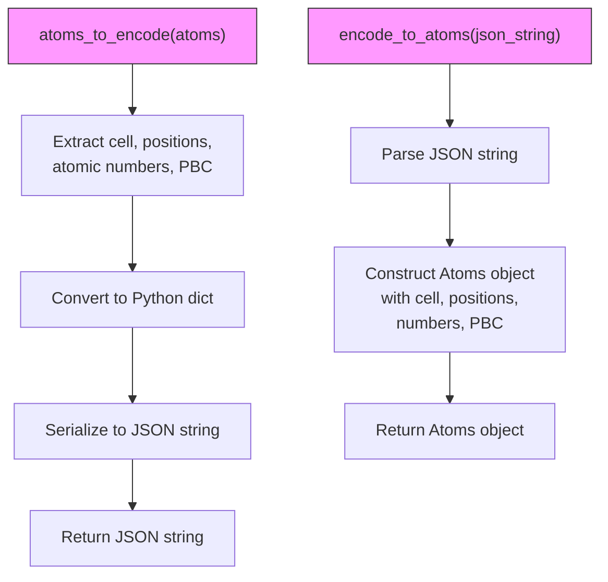
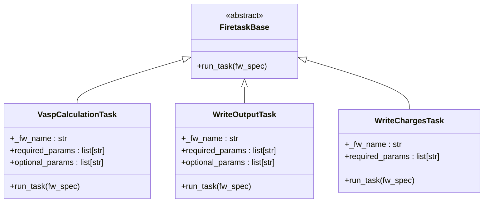
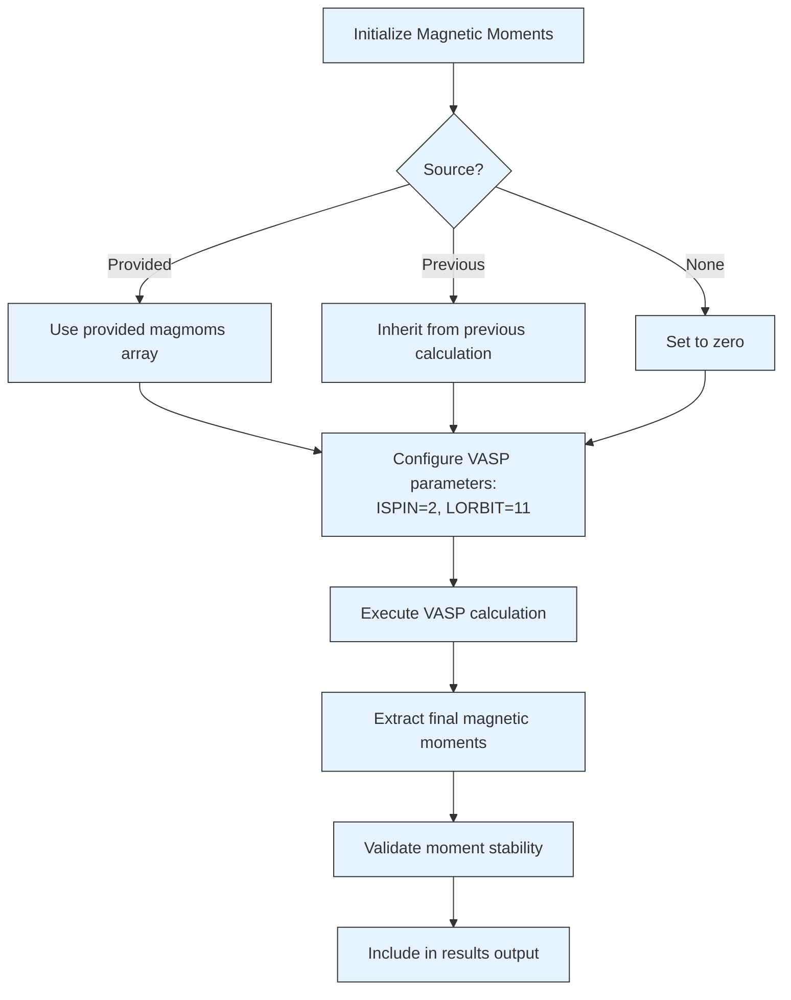
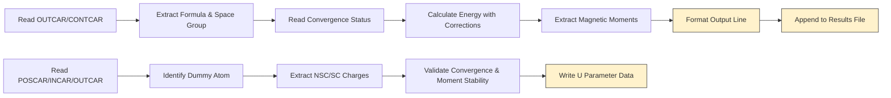
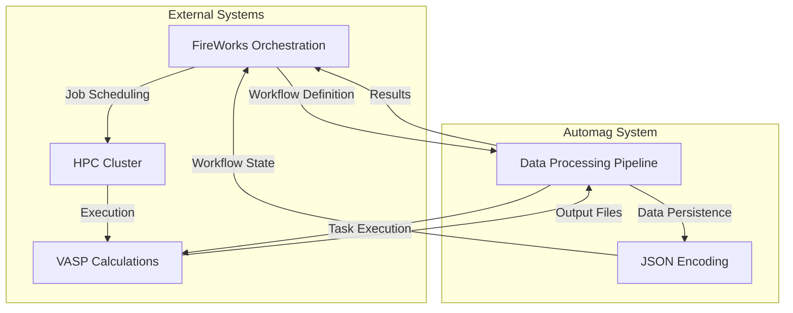

# Data Processing Pipeline

<cite>
**Referenced Files in This Document**   
- [common/utilities.py](file://common/utilities.py)
- [common/write_output.py](file://common/write_output.py)
- [common/write_charges.py](file://common/write_charges.py)
- [common/get_magmoms_vasp.py](file://common/get_magmoms_vasp.py)
- [common/write_magmoms_input.py](file://common/write_magmoms_input.py)
- [README.md](file://README.md)
</cite>

## Table of Contents
1. [Introduction](#introduction)
2. [Core Data Encoding Utilities](#core-data-encoding-utilities)
3. [Firetask Implementations](#firetask-implementations)
4. [Magnetic Moment Management](#magnetic-moment-management)
5. [Results Output Processing](#results-output-processing)
6. [Integration with Workflow Orchestration](#integration-with-workflow-orchestration)
7. [Common Issues and Troubleshooting](#common-issues-and-troubleshooting)
8. [Performance Considerations](#performance-considerations)
9. [Conclusion](#conclusion)

## Introduction

The data processing pipeline in the Automag software framework handles the complete workflow for magnetic materials calculations, from input encoding and magnetic moment management to results output. This system integrates with the FireWorks workflow orchestration engine to manage VASP calculations for determining ground state magnetic configurations and critical temperatures. The pipeline provides utilities for serializing atomic structures, executing calculation tasks, and formatting results for analysis. The system is designed to handle complex magnetic calculations including convergence testing, linear response U parameter calculation, and Monte Carlo simulations for critical temperature estimation.

## Core Data Encoding Utilities

The pipeline includes bidirectional serialization utilities that convert atomic structures between Python objects and JSON format for workflow transmission. These functions enable the persistence and transfer of structural data across different stages of the computational workflow.

**Diagram sources**
- [common/utilities.py](file://common/utilities.py#L24-L60)

**Section sources**
- [common/utilities.py](file://common/utilities.py#L24-L60)

### atoms_to_encode Function

The `atoms_to_encode` function serializes an ASE Atoms object into a JSON string representation. It extracts essential structural properties including the unit cell dimensions, atomic positions (in scaled coordinates), atomic numbers, and periodic boundary conditions. These properties are organized into a Python dictionary and then serialized to JSON format using the standard json.dumps function. This encoding preserves all necessary information to reconstruct the atomic structure while providing a lightweight, transferable format suitable for workflow specifications.

### encode_to_atoms Function

The `encode_to_atoms` function performs the inverse operation, deserializing a JSON string back into an ASE Atoms object. It handles potential encoding issues by attempting to parse the JSON with UTF-8 encoding first, falling back to default encoding if a TypeError occurs. The function reconstructs the Atoms object by passing the extracted structural parameters (cell, scaled positions, atomic numbers, and PBC) to the Atoms constructor. This ensures faithful reconstruction of the original atomic structure for subsequent calculations in the workflow.

## Firetask Implementations

The pipeline implements several Firetask classes that extend FireWorks' FiretaskBase to perform specific computational operations within the workflow orchestration system. These tasks encapsulate VASP calculations and results processing with proper error handling and state management.

**Diagram sources**
- [common/utilities.py](file://common/utilities.py#L64-L276)

**Section sources**
- [common/utilities.py](file://common/utilities.py#L64-L276)

### VaspCalculationTask

The `VaspCalculationTask` executes VASP calculations with configurable parameters. It supports two input modes: direct structure specification via encoded JSON or retrieval from previous workflow steps. For magnetic calculations, it initializes magnetic moments either from provided values or by inheriting from previous calculations. The task automatically configures VASP parameters for magnetic calculations (ISPIN=2, LORBIT=11) when magnetic moments are specified. It also handles perturbation calculations for U parameter determination by setting up LDAU parameters and copying necessary wavefunction files (WAVECAR, CHGCAR). The task records convergence status in a local "is_converged" file for subsequent processing steps.

### WriteOutputTask

The `WriteOutputTask` generates comprehensive output files containing calculation results and metadata. It collects convergence status from all workflow steps, chemical formula, space group information, and energy values (either enthalpy or potential energy with optional kinetic energy error correction). For magnetic calculations, it includes both initial and final magnetic moments. The output is formatted with consistent spacing and appended to a designated results file in the CalcFold directory. The task retrieves data from previous workflow steps using the _job_info array in the FireWorks specification, ensuring access to all necessary output files.

### WriteChargesTask

The `WriteChargesTask` extracts charge response data for U parameter calculations. It identifies the dummy atom position from the POSCAR file and validates that only one dummy atom exists in the structure. The task reads charge data from both non-self-consistent (NSC) and self-consistent (SC) calculations, typically from f-orbitals for lanthanides/actinides or d-orbitals for transition metals. It implements quality control by checking for convergence and ensuring magnetic moments don't deviate excessively (less than 50% decrease or 100% increase) from reference values. Only when all quality criteria are met is the charge data written to the output file with the corresponding perturbation value.

## Magnetic Moment Management

The pipeline provides comprehensive functionality for initializing, propagating, and managing magnetic moments throughout the calculation workflow. This ensures consistent magnetic configuration handling across different calculation stages.

**Diagram sources**
- [common/utilities.py](file://common/utilities.py#L115-L135)
- [common/utilities.py](file://common/utilities.py#L175-L218)

**Section sources**
- [common/utilities.py](file://common/utilities.py#L115-L135)
- [common/utilities.py](file://common/utilities.py#L175-L218)
- [common/get_magmoms_vasp.py](file://common/get_magmoms_vasp.py)
- [common/write_magmoms_input.py](file://common/write_magmoms_input.py)

### Initialization Methods

Magnetic moments can be initialized through multiple pathways. The most direct method passes a numpy array of magnetic moments through the 'magmoms' parameter. Alternatively, the 'previous' option inherits magnetic moments from the immediately preceding calculation in the workflow, accessed via the OUTCAR file. When no magnetic moments are specified, the system defaults to non-magnetic calculations. For perturbation calculations, magnetic moments are automatically inherited from the bare calculation to maintain consistency across the response curve.

### Propagation Through Calculations

The pipeline ensures magnetic moment consistency by propagating moment values between consecutive calculations. After each VASP run, final magnetic moments are extracted and can be used to initialize subsequent calculations. The `get_magmoms_vasp.py` and `write_magmoms_input.py` utilities facilitate this by reading magnetic moments from OUTCAR files and updating the MAGMOM parameter in INCAR files for the next calculation. This creates a feedback loop where optimized magnetic configurations inform subsequent calculations, improving convergence and physical accuracy.

## Results Output Processing

The pipeline includes specialized modules for processing and formatting calculation results, ensuring consistent output structure and facilitating post-processing analysis.

**Diagram sources**
- [common/write_output.py](file://common/write_output.py)
- [common/write_charges.py](file://common/write_charges.py)

**Section sources**
- [common/write_output.py](file://common/write_output.py)
- [common/write_charges.py](file://common/write_charges.py)

### write_output.py Module

This standalone script processes VASP output files to generate formatted results. It determines the output mode based on command-line arguments, supporting different quantities (magmoms, energy) and calculators (vasp). The script extracts structural information from CONTCAR, convergence status from VASP convergence checks, and energy values from OUTCAR. For magnetic calculations, it reads initial magnetic moments from a separate file and final moments from the OUTCAR. The output is carefully formatted with fixed-width fields for easy parsing and appended to a compound-specific results file in the CalcFold directory.

### write_charges.py Module

This module processes charge response data from perturbation calculations. It scans the calculation directory for numeric subdirectories representing different perturbation values, sorts them numerically, and processes each in sequence. For each perturbation, it extracts charge values from both non-self-consistent and self-consistent calculations, typically from f-orbitals for lanthanides/actinides. The module implements quality control by checking convergence status and monitoring magnetic moment stability relative to the bare calculation. Only data passing all quality checks is written to the output file, ensuring reliable U parameter determination.

## Integration with Workflow Orchestration

The data processing pipeline is tightly integrated with the FireWorks workflow orchestration system, enabling automated execution of complex calculation sequences across distributed computing environments.

**Diagram sources**
- [common/utilities.py](file://common/utilities.py)
- [README.md](file://README.md)

**Section sources**
- [common/utilities.py](file://common/utilities.py)
- [README.md](file://README.md)

### FireWorks Integration Pattern

The pipeline components are implemented as Firetasks that conform to the FireWorks execution model. Each task operates on the FireWorks specification (fw_spec) which contains the _job_info array tracking previous workflow steps. This enables tasks to access output files from preceding calculations by referencing their launch directories. The FireWorks launcher (qlaunch) manages job submission to the cluster's queue system, while the pipeline tasks handle the computational logic and data processing. This separation of concerns allows the orchestration system to focus on job management while the pipeline handles scientific computation.

### Environment Configuration

Proper integration requires specific environment variables to be set in the user's shell configuration. The AUTOMAG_PATH variable points to the Automag installation directory, enabling tasks to locate the CalcFold results directory. The PYTHONPATH includes the Automag directory for module imports, while VASP_SCRIPT specifies the ASE VASP interface script. The VASP_PP_PATH points to the pseudopotential library, and FireWorks requires a my_launchpad.yaml configuration file to connect to the MongoDB database. These configurations ensure seamless communication between the pipeline, VASP, and the workflow database.

## Common Issues and Troubleshooting

The pipeline may encounter various issues during execution. Understanding these common problems and their solutions is essential for reliable operation.

### Data Serialization Errors

Serialization issues typically occur when the JSON encoding/decoding process fails due to data type incompatibilities. Ensure that all numerical arrays are properly converted to Python lists before serialization. Verify that the JSON string is properly formatted and doesn't contain invalid characters. When deserializing, handle both UTF-8 and default encoding scenarios as shown in the `encode_to_atoms` function. Check that all required structural parameters (cell, positions, numbers, PBC) are present in the encoded data.

### Magnetic Moment Initialization Failures

Initialization failures often stem from dimension mismatches between the magmoms array and the number of atoms. Verify that the magnetic moments array has the same length as the number of atoms in the structure. When inheriting moments from previous calculations, ensure the structural composition hasn't changed. For perturbation calculations, confirm that the dummy atom approach is properly implemented with the correct POTCAR files. Check that the ISPIN and LORBIT parameters are correctly set when magnetic calculations are intended.

### Output Formatting Problems

Formatting issues usually involve incorrect field widths or missing data in the output files. Verify that all required parameters are provided to the WriteOutputTask (system, filename, read_enthalpy, energy_convergence). Ensure the CalcFold directory exists and is writable. Check that the _job_info array in the FireWorks specification contains valid references to previous calculation directories. For charge output, confirm that the dummy atom position is correctly identified and that only one dummy atom exists in the structure.

**Section sources**
- [common/utilities.py](file://common/utilities.py)
- [common/write_output.py](file://common/write_output.py)
- [common/write_charges.py](file://common/write_charges.py)

## Performance Considerations

The pipeline's performance is influenced by several factors, particularly when handling large atomic structures or extensive calculation workflows.

### Large Structure Handling

For large atomic structures, memory usage and I/O operations become critical. The JSON serialization approach used by `atoms_to_encode` and `encode_to_atoms` is generally efficient, but very large structures may benefit from binary serialization formats. When processing output, minimize memory usage by processing files line-by-line rather than loading entire files into memory. For structures with many atoms, optimize magnetic moment operations by using numpy arrays for vectorized calculations rather than Python loops.

### I/O Operations Optimization

I/O performance can be improved by minimizing file operations. The pipeline already implements efficient patterns by copying only essential VASP files (WAVECAR, CHGCAR) rather than entire directories. Consider implementing file buffering for output operations, especially when multiple tasks write to the same results file. For high-throughput workflows, batch multiple output writes to reduce filesystem overhead. When reading VASP output, use efficient parsing methods that stop reading once the required data is found, rather than processing entire files.

### Parallelization Opportunities

While the current pipeline follows a sequential workflow pattern, opportunities exist for parallelization. Independent perturbation calculations in U parameter determination could be executed concurrently. Similarly, different magnetic configurations in ground state searches are naturally parallelizable. Implementing these parallel patterns would require modifications to the FireWorks workflow definition but could significantly reduce total computation time for large studies.

**Section sources**
- [common/utilities.py](file://common/utilities.py)
- [common/write_output.py](file://common/write_output.py)
- [common/write_charges.py](file://common/write_charges.py)

## Conclusion

The data processing pipeline in Automag provides a robust framework for managing magnetic materials calculations from input encoding through results output. The bidirectional serialization utilities enable reliable data transfer between workflow stages, while the Firetask implementations encapsulate complex VASP operations with proper error handling. Magnetic moment management ensures consistent treatment of spin configurations across calculations, and the results processing modules generate standardized output for analysis. Integration with FireWorks enables automated execution on HPC systems, making the pipeline suitable for large-scale materials discovery. By addressing common issues and optimizing performance, this pipeline supports efficient and reliable computational studies of magnetic materials.