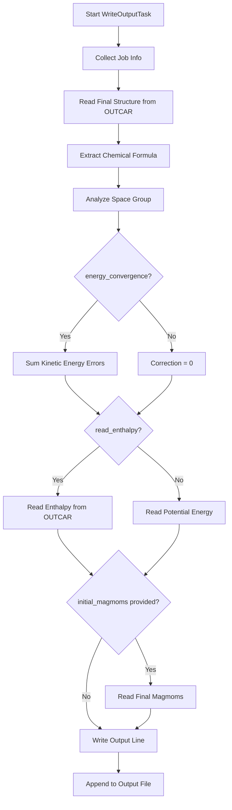
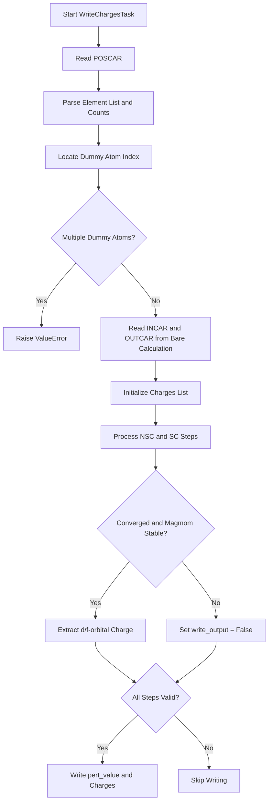
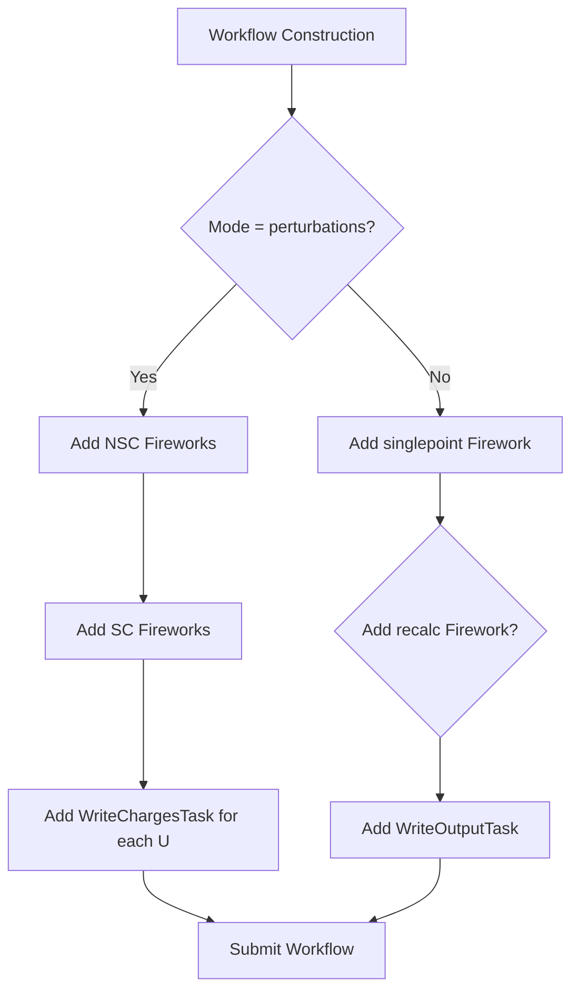

# Output Management Tasks

<cite>
**Referenced Files in This Document**  
- [common/utilities.py](file://common/utilities.py#L155-L276)
- [common/SubmitFirework.py](file://common/SubmitFirework.py#L206-L258)
</cite>

## Table of Contents
1. [Introduction](#introduction)
2. [WriteOutputTask: Calculation Result Aggregation](#writeoutputtask-calculation-result-aggregation)
3. [WriteChargesTask: Hubbard U Response Data Collection](#writechargestask-hubbard-u-response-data-collection)
4. [Workflow Integration and Data Aggregation](#workflow-integration-and-data-aggregation)
5. [Error Handling and Robustness](#error-handling-and-robustness)
6. [Performance and Data Consistency](#performance-and-data-consistency)
7. [Conclusion](#conclusion)

## Introduction

The automag-1 framework employs specialized Firetasks for managing and formatting computational results from VASP calculations. Two key components—`WriteOutputTask` and `WriteChargesTask`—are responsible for collecting, processing, and persisting critical data such as energies, convergence states, magnetic moments, and charge responses. These tasks operate within a FireWorks-based workflow system, ensuring structured data aggregation across distributed computational jobs. This document details their implementation, integration, and behavior under various conditions, with emphasis on data integrity, error resilience, and performance.

**Section sources**
- [common/utilities.py](file://common/utilities.py#L155-L276)

## WriteOutputTask: Calculation Result Aggregation

`WriteOutputTask` is responsible for aggregating and formatting key results from one or more VASP calculations into a standardized output file. It captures convergence status, chemical composition, crystallographic information, energy values, and magnetic moment evolution.

### Required and Optional Parameters

The task requires four parameters:
- **system**: Identifier for the material system (e.g., USPEX structure ID)
- **filename**: Output file name where results are appended
- **read_enthalpy**: Boolean flag to determine whether to extract enthalpy (True) or total energy (False)
- **energy_convergence**: Boolean flag to enable kinetic energy error correction

An optional parameter, **initial_magmoms**, allows specification of initial magnetic moments for comparison with final values.



**Diagram sources**
- [common/utilities.py](file://common/utilities.py#L166-L218)

**Section sources**
- [common/utilities.py](file://common/utilities.py#L155-L218)

### Convergence Status Aggregation

The task aggregates convergence status from multiple VASP runs by reading `is_converged` files generated by preceding `VaspCalculationTask` instances. Each run's convergence state (converged/NONCONVERGED) is recorded with its job name, enabling traceability across workflow stages such as "singlepoint" and "recalc".

### Chemical and Structural Metadata Extraction

The final structure is read from the last job's `OUTCAR`, and its chemical formula is extracted using ASE's `get_chemical_formula(mode='metal')`. The space group symbol is determined via `pymatgen`'s `SpacegroupAnalyzer` applied to the `CONTCAR` structure.

### Energy Correction and Selection

When `energy_convergence` is enabled, the task scans the `OUTCAR` for "kinetic energy error" entries, sums them weighted by ion counts, and applies the correction to the final energy. If `read_enthalpy` is True, the enthalpy value from `OUTCAR` is used; otherwise, the potential energy from the ASE atoms object is recorded.

### Magnetic Moment Tracking

If `initial_magmoms` is provided, both initial and final magnetic moments are written to the output. The final moments are read from the atoms object, with a fallback to zero vectors if magnetic data is unavailable.

## WriteChargesTask: Hubbard U Response Data Collection

`WriteChargesTask` specializes in collecting charge response data for linear response calculations of Hubbard U parameters. It focuses on a designated "dummy atom" and extracts d- or f-orbital charges from non-self-consistent (NSC) and self-consistent (SC) perturbation runs.

### Required Parameters

- **filename**: Output file for charge response data
- **pert_value**: Perturbation strength (U value) for this calculation
- **dummy_atom**: Chemical symbol of the atom under perturbation

### Dummy Atom Identification

The task locates the dummy atom by parsing the `POSCAR` file from the final job's launch directory. It reads element symbols and ion counts, then iterates through the structure to find the first occurrence of the dummy atom. An error is raised if multiple dummy atoms are present.



**Diagram sources**
- [common/utilities.py](file://common/utilities.py#L228-L276)

**Section sources**
- [common/utilities.py](file://common/utilities.py#L221-L276)

### Charge Extraction and Validation

For each step (NSC and SC), the task reads the `OUTCAR` to extract charge values. It checks for 'f' orbital charges first; if absent, it defaults to 'd' orbitals. Magnetic moment stability is validated by comparing final moments against the bare calculation. If any moment changes by more than 50% or 200%, or if the calculation is non-converged, output is suppressed.

### Output Format

Valid charge response data is formatted as:
```
5.00  0.1234  0.5678
```
where the first column is the perturbation value (U), the second is the NSC charge, and the third is the SC charge. This data is appended to the specified output file in the `CalcFold` directory.

## Workflow Integration and Data Aggregation

Both tasks are integrated into the FireWorks workflow via `SubmitFirework`, which constructs and submits workflows based on calculation mode.

### Conditional Task Inclusion

In `SubmitFirework.add_wflow`, the output task is selected based on mode:
- For `perturbations` mode, `WriteChargesTask` is included for each perturbation value
- For other modes, `WriteOutputTask` is used to summarize the calculation



**Diagram sources**
- [common/SubmitFirework.py](file://common/SubmitFirework.py#L206-L258)

**Section sources**
- [common/SubmitFirework.py](file://common/SubmitFirework.py#L206-L258)

### Data Flow and Dependencies

`WriteOutputTask` reads from the `OUTCAR`, `CONTCAR`, and `is_converged` files of preceding jobs, using `fw_spec['_job_info']` to locate launch directories. `WriteChargesTask` similarly accesses `POSCAR`, `INCAR`, and `OUTCAR` files from multiple steps, ensuring data consistency across the perturbation workflow.

## Error Handling and Robustness

The output tasks implement several safeguards to maintain data integrity under failure conditions.

### Missing OUTCAR Files

While direct handling of missing `OUTCAR` files is not implemented in the tasks themselves, the upstream `VaspCalculationTask` ensures `OUTCAR` generation by checking VASP convergence. If VASP fails to produce output, the workflow typically terminates before reaching the output tasks.

### Space Group Determination Failures

The `SpacegroupAnalyzer` from `pymatgen` is robust to minor structural distortions. However, no explicit exception handling is present in `WriteOutputTask` for space group determination failures, which could result in task failure if the structure is severely distorted.

### Charge Output Suppression

`WriteChargesTask` proactively suppresses output when:
- Magnetic moments deviate significantly (>50% or <200%) from the reference
- Any step is marked as non-converged
- Multiple dummy atoms are detected

This prevents corrupted or misleading data from entering the response dataset.

## Performance and Data Consistency

### File I/O Strategy

Both tasks use append mode (`'a'`) when writing to output files, enabling multiple workflows to contribute to the same dataset without overwriting. This is critical for distributed execution where multiple perturbation calculations run in parallel.

### Data Consistency Across Distributed Executions

The use of atomic file appends and centralized output files in `CalcFold` ensures that results from independent workflows are aggregated reliably. The `AUTOMAG_PATH` environment variable standardizes the output location across compute nodes.

### Performance Considerations

- **Minimized I/O**: Each task performs a single write operation, reducing filesystem overhead
- **Efficient Parsing**: Only necessary lines are read from large files like `OUTCAR`
- **Parallel Workflow Execution**: Independent perturbation calculations can run concurrently, with results safely merged in post-processing

## Conclusion

The `WriteOutputTask` and `WriteChargesTask` components provide robust, structured output management for the automag-1 computational framework. By aggregating convergence data, energies, structural metadata, and charge responses, they enable systematic analysis of magnetic materials and Hubbard U parameters. Their integration within FireWorks workflows ensures reliable execution across distributed environments, while validation checks and error suppression mechanisms maintain data quality. Future enhancements could include explicit handling of structural analysis failures and improved resilience to missing output files.