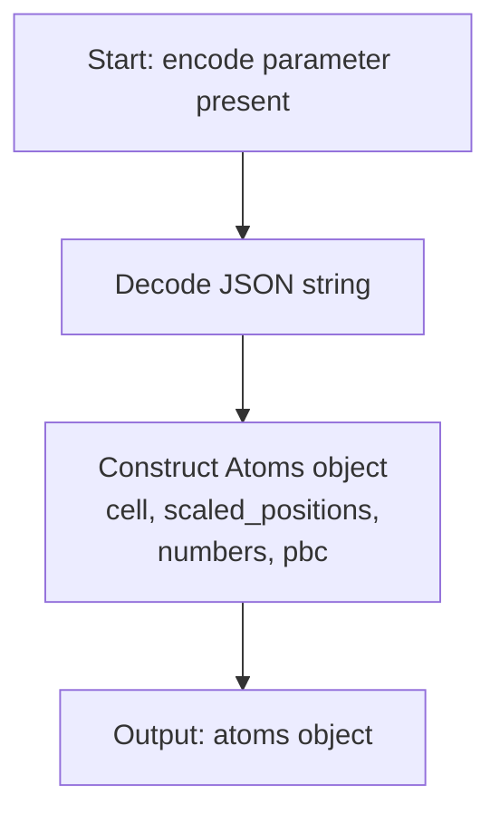
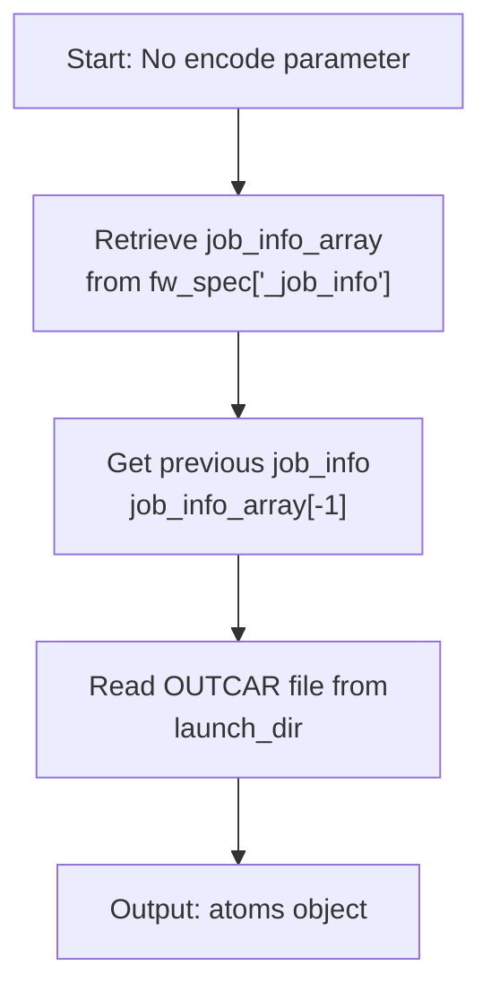
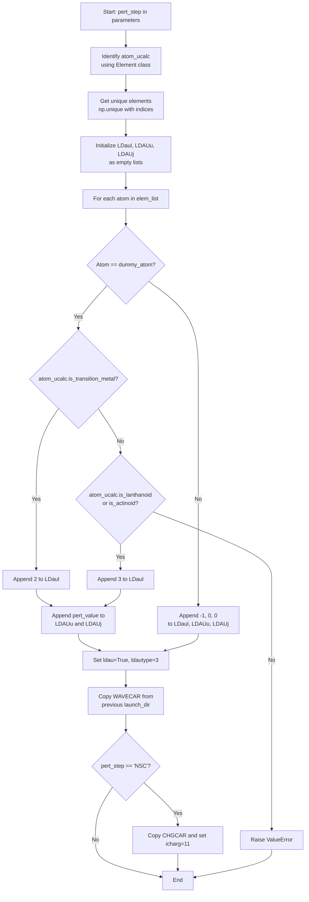
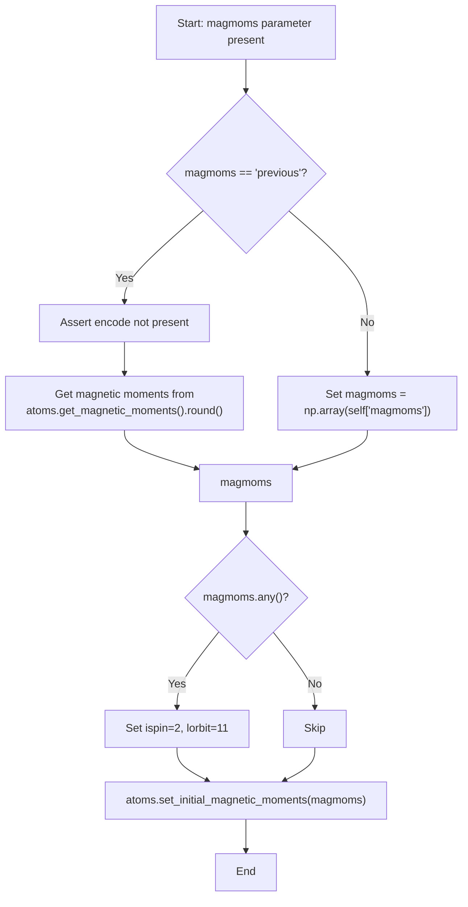
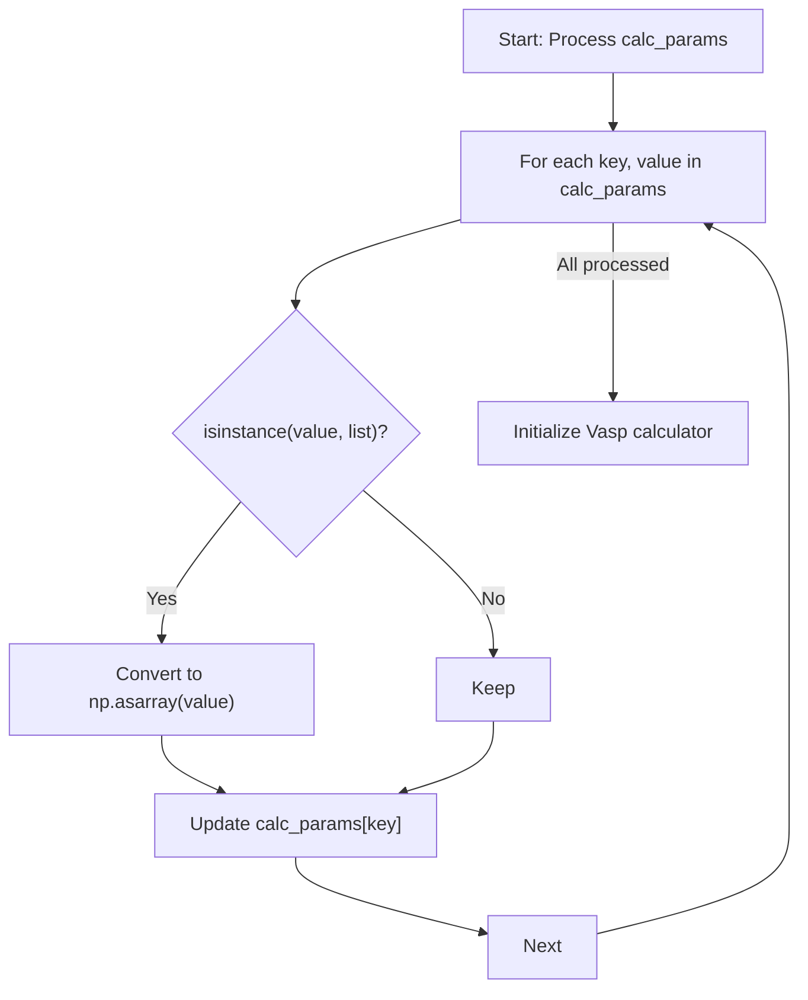
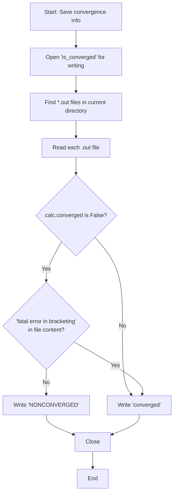

# VaspCalculationTask

<cite>
**Referenced Files in This Document**   
- [utilities.py](file://common/utilities.py)
</cite>

## Table of Contents
1. [Introduction](#introduction)
2. [Core Parameters](#core-parameters)
3. [Atomic Structure Initialization](#atomic-structure-initialization)
4. [Hubbard U Perturbation Setup](#hubbard-u-perturbation-setup)
5. [Magnetic Moment Handling](#magnetic-moment-handling)
6. [VASP Parameter Processing](#vasp-parameter-processing)
7. [Convergence Status Tracking](#convergence-status-tracking)
8. [Common Issues and Troubleshooting](#common-issues-and-troubleshooting)
9. [Performance Considerations](#performance-considerations)

## Introduction
The VaspCalculationTask Firetask executes VASP calculations within automated workflows, managing atomic structure initialization, magnetic configurations, and Hubbard U parameter setups. It serves as a core component for materials science simulations, particularly in magnetic property calculations and linear response methods for determining Hubbard U parameters. The task integrates with FireWorks workflow management to enable complex multi-step computational protocols.

**Section sources**
- [utilities.py](file://common/utilities.py#L64-L151)

## Core Parameters
The VaspCalculationTask requires specific parameters to configure VASP calculations and supports several optional parameters for specialized workflows.

### Required Parameter
- **calc_params**: Dictionary containing VASP calculation parameters that will be passed to the ASE Vasp calculator. This is the only required parameter and must include all necessary VASP input settings.

### Optional Parameters
- **encode**: JSON-encoded string representation of an atomic structure. When provided, this serves as the input structure instead of reading from a previous calculation's OUTCAR.
- **magmoms**: Specifies magnetic moment initialization. Can be set to 'previous' to inherit from prior calculation or provide explicit magnetic moment values as a list/array.
- **pert_step**: Indicates perturbation calculation step ('NSC' for non-self-consistent). Triggers special handling of WAVECAR and CHGCAR files.
- **pert_value**: Value of the perturbation parameter, typically the U value in eV for Hubbard U calculations.
- **dummy_atom**: Chemical symbol of the dummy atom used in perturbation calculations where a specific element is replaced.
- **atom_ucalc**: Chemical symbol of the atom for which Hubbard U is being calculated, used to determine appropriate LDAUL values.

**Section sources**
- [utilities.py](file://common/utilities.py#L64-L89)

## Atomic Structure Initialization
The task implements two distinct methods for initializing atomic structures based on workflow requirements.

### JSON-Encoded Input
When the 'encode' parameter is provided, the task decodes the JSON string to reconstruct the atomic structure using the `encode_to_atoms` function. This method allows passing atomic configurations between workflow steps without file I/O.



**Diagram sources**
- [utilities.py](file://common/utilities.py#L50-L62)

### Previous Calculation Output
In the absence of an encoded structure, the task retrieves atomic coordinates from the OUTCAR file of the immediately preceding calculation in the workflow. This enables chained calculations where the output of one step becomes the input for the next.



**Diagram sources**
- [utilities.py](file://common/utilities.py#L74-L77)

## Hubbard U Perturbation Setup
The task provides specialized functionality for linear response calculations to determine Hubbard U parameters, implementing the methodology described by Cococcioni and de Gironcoli.

### LDAXU Parameter Configuration
When 'pert_step' is specified, the task automatically configures LDA+U parameters (LDaul, LDAUu, LDAUj) for the target atom while setting non-interacting parameters for other elements.



**Diagram sources**
- [utilities.py](file://common/utilities.py#L79-L107)

### WAVECAR and CHGCAR Management
For perturbation calculations, the task handles checkpoint files appropriately:
- Always copies WAVECAR from the previous calculation to ensure proper wavefunction initialization
- For NSC (non-self-consistent) steps, also copies CHGCAR and sets icharg=11 to read charge density
- This file management enables efficient continuation of electronic structure calculations

**Section sources**
- [utilities.py](file://common/utilities.py#L108-L112)

## Magnetic Moment Handling
The task provides comprehensive support for magnetic calculations, automatically configuring VASP parameters and initializing magnetic moments.

### Magnetic Moment Initialization
The task supports two methods for setting initial magnetic moments:



**Diagram sources**
- [utilities.py](file://common/utilities.py#L114-L127)

### Automatic Parameter Configuration
When non-zero magnetic moments are detected, the task automatically adds essential VASP parameters:
- **ISPIN = 2**: Enables spin-polarized calculations
- **LORBIT = 11**: Requests calculation of orbital projections and magnetic moments
These parameters are crucial for accurate magnetic property calculations and are set automatically to prevent configuration errors.

### Example: Collinear Magnetic Calculation
To launch a collinear magnetic calculation with custom MAGMOM settings:

```python
sp_firetask = VaspCalculationTask(
    calc_params=params,
    encode=encode,
    magmoms=[5.0, 5.0, 0.0, 0.0]  # Custom magnetic moments
)
```

This configuration would set initial magnetic moments of 5.0 μB for the first two atoms and 0.0 μB for the remaining atoms, enabling a collinear magnetic calculation with the specified spin configuration.

**Section sources**
- [utilities.py](file://common/utilities.py#L114-L127)

## VASP Parameter Processing
The task includes preprocessing steps to ensure VASP parameters are in the correct format for the ASE calculator.

### List to Array Conversion
All list values in calc_params are converted to NumPy arrays, which is the expected format for many VASP parameters in the ASE interface:



**Diagram sources**
- [utilities.py](file://common/utilities.py#L129-L133)

## Convergence Status Tracking
The task implements robust convergence monitoring and reporting mechanisms.

### Convergence Determination
The task writes convergence status to a file named 'is_converged' using multiple criteria:
- Checks the Vasp calculator's converged attribute
- Examines output files for convergence status
- Specifically handles fatal errors in bracketing that might otherwise be misclassified



**Diagram sources**
- [utilities.py](file://common/utilities.py#L135-L144)

## Common Issues and Troubleshooting
### Non-Converged Calculations
- **Symptoms**: 'is_converged' file contains 'NONCONVERGED'
- **Causes**: Insufficient electronic convergence, structural instability, or inappropriate initial magnetic moments
- **Solutions**: Adjust electronic convergence parameters (EDIFF), increase number of electronic steps (NELM), or modify initial magnetic configuration

### Incorrect Perturbation Setup
- **Symptoms**: Unphysical U values or convergence failures in perturbation calculations
- **Causes**: Mismatch between dummy_atom and atom_ucalc, incorrect pert_value range, or missing WAVECAR/CHGCAR files
- **Solutions**: Verify element compatibility, ensure proper file copying between steps, and validate perturbation values are within reasonable physical ranges

### Magnetic Moment Propagation Failures
- **Symptoms**: Unexpected magnetic configurations or convergence issues in magnetic calculations
- **Causes**: Conflicting 'encode' and 'magmoms=previous' parameters, zero magnetic moments when ISPIN=2 is required
- **Solutions**: Avoid combining encoded structures with 'previous' magnetic moments, ensure non-zero magnetic moments are specified when enabling spin polarization

**Section sources**
- [utilities.py](file://common/utilities.py#L135-L144)

## Performance Considerations
### I/O Operations
- **Checkpoint File Management**: Copying WAVECAR and CHGCAR files between directories can be I/O intensive for large systems. Consider using symbolic links when possible to reduce disk usage and copy time.
- **File Reading**: Reading OUTCAR files for atomic structure retrieval involves parsing large text files. The implementation efficiently extracts only necessary structural information.

### Memory Efficiency
- The JSON encoding/decoding of atomic structures provides a memory-efficient way to pass structural data between workflow steps without intermediate file writing.
- NumPy array conversion of parameter lists ensures efficient memory usage during VASP parameter processing.

### Workflow Optimization
- The task design enables efficient chaining of calculations by reusing wavefunctions (WAVECAR) and charge densities (CHGCAR), significantly reducing computational cost for sequential calculations.
- For high-throughput studies, consider implementing file compression or archiving strategies for completed calculations to manage storage requirements.

**Section sources**
- [utilities.py](file://common/utilities.py#L108-L112)