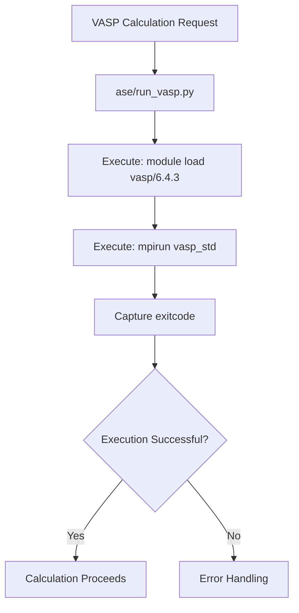
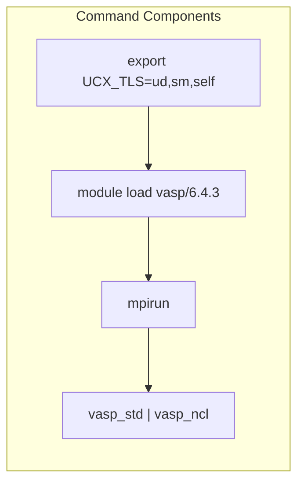

# VASP Execution Mechanism

<cite>
**Referenced Files in This Document**   
- [ase/run_vasp.py](file://ase/run_vasp.py)
- [common/utilities.py](file://common/utilities.py)
- [1_lin_response/input_template.py](file://1_lin_response/input_template.py)
- [2_coll/input_template.py](file://2_coll/input_template.py)
- [4_mae/input_template.py](file://4_mae/input_template.py)
</cite>

## Table of Contents
1. [Introduction](#introduction)
2. [Core Execution Mechanism](#core-execution-mechanism)
3. [Command Structure and Environment Configuration](#command-structure-and-environment-configuration)
4. [Integration with ASE Framework](#integration-with-ase-framework)
5. [Execution Contexts and Configuration Patterns](#execution-contexts-and-configuration-patterns)
6. [Common Issues and Troubleshooting](#common-issues-and-troubleshooting)
7. [Performance Considerations](#performance-considerations)
8. [Conclusion](#conclusion)

## Introduction

The VASP execution mechanism in the automag framework is designed to interface with the Atomic Simulation Environment (ASE) to launch VASP calculations on high-performance computing (HPC) systems. This document details how the framework orchestrates VASP simulations through system-level commands, focusing on the core execution script `ase/run_vasp.py` and its integration with various components across the codebase. The mechanism relies on direct system calls to load required modules and initiate parallel execution via MPI, with configuration patterns that ensure consistency across different computational workflows.

**Section sources**
- [ase/run_vasp.py](file://ase/run_vasp.py#L0-L21)
- [common/utilities.py](file://common/utilities.py#L64-L151)

## Core Execution Mechanism

The fundamental mechanism for executing VASP calculations is implemented in `ase/run_vasp.py`, which serves as the bridge between ASE and the VASP binary. The script uses Python's `os.system()` function to execute shell commands that load the appropriate VASP module and launch the calculation through `mpirun`.

The current implementation is configured for VASP 6.4.3, loading the module with the command `module load vasp/6.3.4` followed by `mpirun vasp_std` to initiate the standard version of VASP. The script demonstrates multiple configuration patterns, including commented-out alternatives for VASP 5.4.4 with both local installations and module-based loading, indicating an evolution toward standardized module management.

The execution flow is straightforward: the `os.system()` call combines module loading and VASP invocation into a single shell command, capturing the exit code to determine success or failure. This approach bypasses ASE's default calculator execution mechanisms, providing direct control over the runtime environment and execution parameters.



**Diagram sources**
- [ase/run_vasp.py](file://ase/run_vasp.py#L15-L21)

**Section sources**
- [ase/run_vasp.py](file://ase/run_vasp.py#L15-L21)

## Command Structure and Environment Configuration

The VASP execution command follows a consistent structure across the codebase, combining environment variables, module loading, and MPI invocation. The primary command pattern is:

```
export UCX_TLS=ud,sm,self; module load vasp/6.4.3; mpirun vasp_std
```

This command sequence performs three critical functions:
1. **Environment Configuration**: The `UCX_TLS` export configures the transport layer selection for UCX (Unified Communication X), optimizing communication between MPI processes.
2. **Module Loading**: The `module load` command activates the VASP 6.4.3 environment, ensuring all dependencies (compiler libraries, MPI, MKL) are properly configured.
3. **Parallel Execution**: `mpirun` launches VASP with MPI parallelization, using the default number of processes determined by the job scheduler.

Alternative variants exist for non-collinear calculations, using `vasp_ncl` instead of `vasp_std`, as seen in specific MAE (Magnetic Anisotropy Energy) calculations. This demonstrates context-specific adaptation of the execution mechanism based on the physical requirements of the simulation.



**Diagram sources**
- [ase/run_vasp.py](file://ase/run_vasp.py#L20)
- [1_lin_response/input_template.py](file://1_lin_response/input_template.py#L50)
- [4_mae/input_template.py](file://4_mae/input_template.py#L114)

**Section sources**
- [ase/run_vasp.py](file://ase/run_vasp.py#L20)
- [1_lin_response/input_template.py](file://1_lin_response/input_template.py#L50)
- [2_coll/input_template.py](file://2_coll/input_template.py#L58)
- [4_mae/input_template.py](file://4_mae/input_template.py#L114)

## Integration with ASE Framework

The VASP execution mechanism integrates with ASE through the `VaspCalculationTask` class in `common/utilities.py`, which orchestrates the calculation workflow. When a VASP calculation is initiated, ASE's calculator interface invokes the external script `ase/run_vasp.py` to handle the actual execution.

The integration follows a clear sequence:
1. The `VaspCalculationTask` prepares the atomic structure and calculation parameters
2. ASE's `Vasp` calculator is initialized with the specified parameters
3. The `calc.calculate(atoms)` method triggers the external execution script
4. The `ase/run_vasp.py` script executes the shell command to run VASP
5. Results are captured and processed back through the ASE framework

This architecture separates configuration management from execution, allowing the scientific logic (handled by ASE) to remain independent from system-specific execution details (handled by the external script).

```mermaid
sequenceDiagram
participant Task as VaspCalculationTask
participant Calc as Vasp Calculator
participant Script as run_vasp.py
participant System as HPC System
Task->>Calc : Initialize with params
Calc->>Script : Trigger calculation
Script->>System : os.system("module load...; mpirun...")
System-->>Script : VASP Execution
Script-->>Calc : Return exit code
Calc-->>Task : Complete calculation
```

**Diagram sources**
- [common/utilities.py](file://common/utilities.py#L64-L151)
- [ase/run_vasp.py](file://ase/run_vasp.py#L20)

**Section sources**
- [common/utilities.py](file://common/utilities.py#L64-L151)

## Execution Contexts and Configuration Patterns

The VASP execution mechanism is employed across multiple scientific workflows, each with specific requirements reflected in their configuration patterns. Analysis of input templates reveals consistent usage of the VASP 6.4.3 module across different computational contexts:

- **Linear Response Calculations** (`1_lin_response`): Uses standard VASP execution for perturbation analysis
- **Collinear Calculations** (`2_coll`): Employs the same execution pattern for magnetic configuration studies
- **Magnetic Anisotropy Energy** (`4_mae`): Utilizes both `vasp_std` and `vasp_ncl` variants depending on spin configuration requirements

All contexts share the same core execution command, indicating a standardized approach to VASP invocation. The `calculator_command` variable in input templates consistently contains the module loading and MPI invocation sequence, ensuring reproducibility across different types of calculations.

The configuration also includes job scheduler directives (SLURM) that specify resource allocation, with variations in walltime and partition depending on the computational intensity of the task. This layered configuration approach separates execution mechanics from resource management, allowing the same execution mechanism to be applied across different computational scales.

**Section sources**
- [1_lin_response/input_template.py](file://1_lin_response/input_template.py#L50)
- [2_coll/input_template.py](file://2_coll/input_template.py#L58)
- [4_mae/input_template.py](file://4_mae/input_template.py#L114)

## Common Issues and Troubleshooting

The current VASP execution mechanism presents several potential failure points that require careful management:

**Module Loading Failures**: Hard-coded module names like `vasp/6.4.3` may not exist on all HPC systems or may be renamed. Users must verify module availability with `module avail vasp` and adjust the command accordingly.

**MPI Configuration Problems**: The `UCX_TLS` environment variable setting may conflict with system-specific MPI configurations. Issues often manifest as communication errors between MPI processes, requiring adjustment or removal of the UCX configuration.

**Path Resolution Errors**: The reliance on the module system assumes proper configuration of environment variables. Missing or incorrect `PATH` settings can prevent `mpirun` or `vasp_std` from being found, even when modules are loaded successfully.

**Version Compatibility**: The mechanism assumes compatibility between the VASP binary, MPI library, and compiler runtime libraries. Mixing incompatible versions (e.g., Intel MPI with GCC-compiled VASP) typically results in segmentation faults or library loading errors.

Troubleshooting typically involves:
1. Verifying module availability and exact naming
2. Testing the execution command interactively before job submission
3. Checking MPI library compatibility with the compute nodes
4. Ensuring proper environment inheritance in job scripts

**Section sources**
- [ase/run_vasp.py](file://ase/run_vasp.py#L20)
- [1_lin_response/input_template.py](file://1_lin_response/input_template.py#L50)

## Performance Considerations

The VASP execution mechanism has significant performance implications that vary with configuration and system architecture:

**Parallelization Strategy**: The use of `mpirun` without explicit process count relies on the job scheduler's default allocation. For optimal performance, users should specify the number of processes with `mpirun -n N` where N matches the allocated cores, avoiding oversubscription or underutilization.

**VASP Version Impact**: VASP 6.4.3 includes performance improvements over earlier versions, particularly in hybrid functional calculations and memory management. The choice of `vasp_std` versus `vasp_ncl` affects performance, with non-collinear calculations typically requiring more computational resources.

**Communication Optimization**: The `UCX_TLS=ud,sm,self` setting optimizes communication for InfiniBand networks (ud) and shared memory (sm), potentially improving performance on systems with high-speed interconnects. However, this may degrade performance on Ethernet-based clusters.

**I/O Considerations**: The execution mechanism does not include specific I/O optimization parameters. For large-scale calculations, adding MPI-IO directives or using parallel file systems can significantly improve performance.

The current implementation prioritizes simplicity and reproducibility over performance tuning, making it suitable for standard calculations but potentially suboptimal for large-scale or highly parallel simulations.

**Section sources**
- [ase/run_vasp.py](file://ase/run_vasp.py#L20)
- [1_lin_response/input_template.py](file://1_lin_response/input_template.py#L50)

## Conclusion

The VASP execution mechanism in the automag framework provides a straightforward and consistent approach to launching VASP calculations through ASE. By leveraging system calls to manage module loading and MPI execution, the mechanism ensures that calculations run in a properly configured environment across different HPC systems. The hard-coded reliance on VASP 6.4.3 and specific module names represents a trade-off between simplicity and portability, requiring users to adapt the configuration to their local environment. Future improvements could include dynamic module detection and more sophisticated error handling, but the current implementation effectively serves the framework's primary use cases in magnetic materials research.