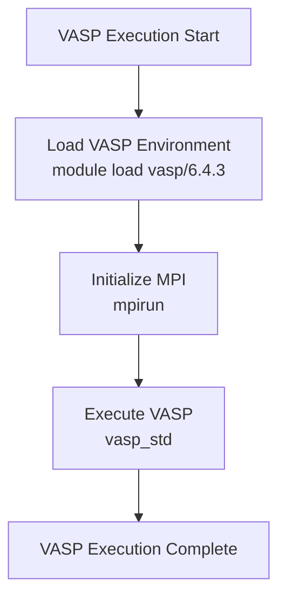
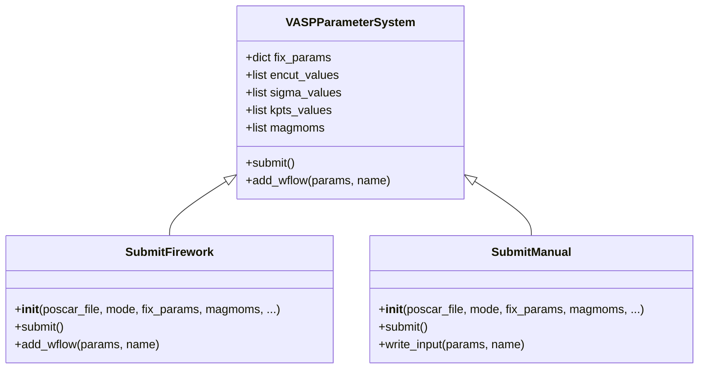
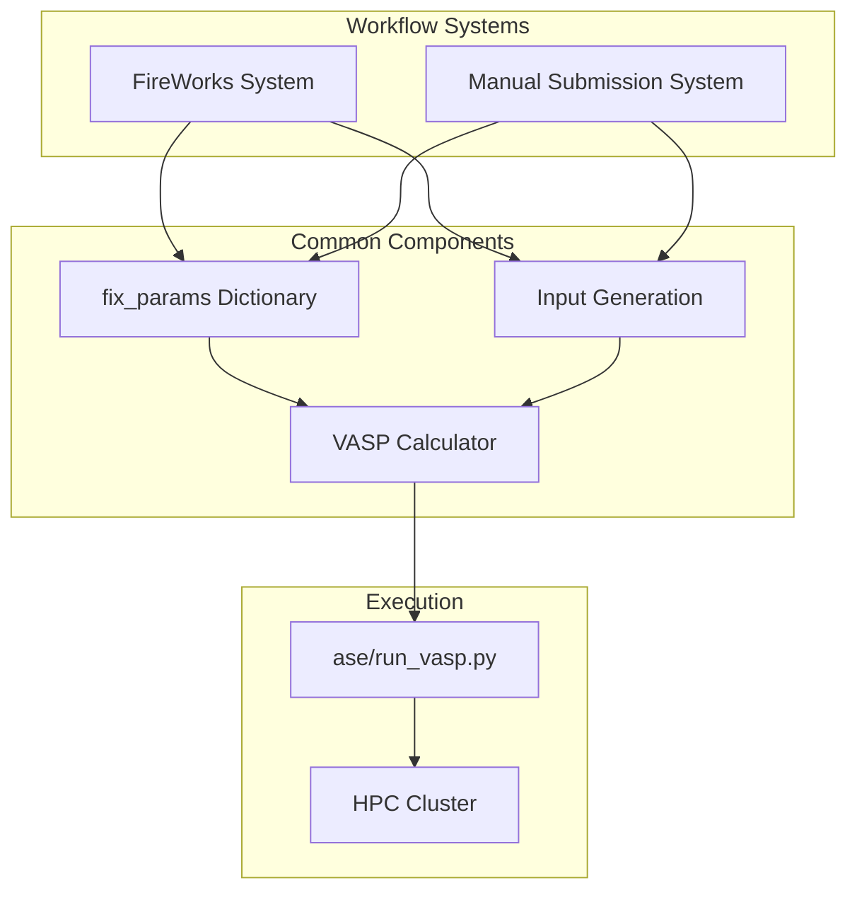
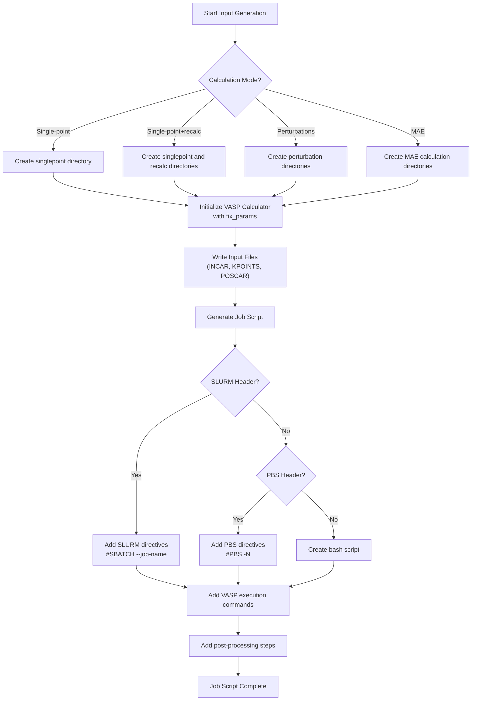
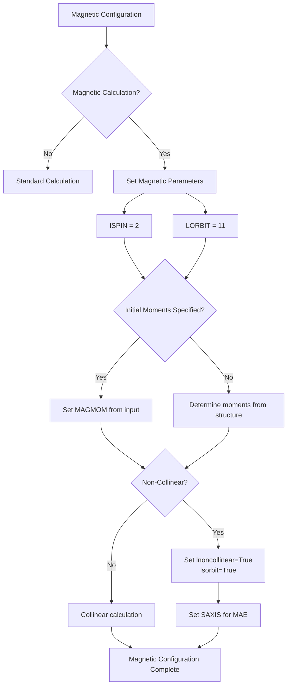

<cite>
**Referenced Files in This Document**   
- [ase/run_vasp.py](file://ase/run_vasp.py)
- [common/SubmitFirework.py](file://common/SubmitFirework.py)
- [common/SubmitManual.py](file://common/SubmitManual.py)
- [common/utilities.py](file://common/utilities.py)
</cite>

# VASP Integration

## Table of Contents
1. [Introduction](#introduction)
2. [VASP Execution Environment](#vasp-execution-environment)
3. [Parameter Management System](#parameter-management-system)
4. [Workflow Integration](#workflow-integration)
5. [Input Generation and Job Scripting](#input-generation-and-job-scripting)
6. [Magnetic Configuration Handling](#magnetic-configuration-handling)
7. [Common Issues and Troubleshooting](#common-issues-and-troubleshooting)
8. [Performance Considerations](#performance-considerations)
9. [Conclusion](#conclusion)

## Introduction

The VASP computational engine integration in the automag framework provides a comprehensive solution for ab initio calculations through two distinct workflow systems: automated FireWorks orchestration and manual submission. This document details the implementation of VASP execution, parameter management, and workflow integration across both systems, with a focus on critical parameters such as ENCUT, SIGMA, kpts, and magnetic settings.

The integration architecture enables researchers to perform various types of calculations including convergence tests, perturbation studies, and magnetic anisotropy energy (MAE) computations. The system is designed to handle complex parameter configurations while maintaining compatibility with different VASP versions and parallel execution environments.

**Section sources**
- [ase/run_vasp.py](file://ase/run_vasp.py#L1-L22)
- [common/SubmitFirework.py](file://common/SubmitFirework.py#L1-L260)
- [common/SubmitManual.py](file://common/SubmitManual.py#L1-L870)

## VASP Execution Environment

The VASP execution environment is configured through the `ase/run_vasp.py` script, which serves as the interface between the ASE (Atomic Simulation Environment) framework and the VASP computational engine. This script handles the environment loading and process invocation required for VASP calculations.

The current implementation uses a module-based approach for VASP 6.4.3, loading the appropriate environment through the command `module load vasp/6.4.3; mpirun vasp_std`. This approach simplifies environment management by leveraging the system's module system to handle dependencies such as MPI and Intel MKL libraries.

The script demonstrates flexibility in environment configuration, with commented alternatives for different VASP versions (5.4.4) and installation methods (local vs. module-based). This allows users to adapt the execution environment to their specific computational infrastructure without modifying the core workflow logic.

**Diagram sources**
- [ase/run_vasp.py](file://ase/run_vasp.py#L1-L22)

**Section sources**
- [ase/run_vasp.py](file://ase/run_vasp.py#L1-L22)

## Parameter Management System

The parameter management system is centered around the `fix_params` dictionary, which serves as the primary mechanism for configuring VASP calculations in both workflow systems. This dictionary contains key VASP parameters that control the computational accuracy and physical models used in the simulations.

In both `SubmitFirework` and `SubmitManual` classes, the `fix_params` dictionary is initialized during object construction and subsequently used to configure VASP calculations. Critical parameters managed through this system include:

- **ENCUT**: Energy cutoff for plane waves
- **SIGMA**: Smearing width for partial occupancies
- **kpts**: k-point mesh for Brillouin zone sampling
- Magnetic settings: Including `magmoms`, `ispin`, and `lorbit`

The system supports both fixed parameters (via `fix_params`) and variable parameters that are iterated over during convergence tests. For example, in convergence testing mode, the system can systematically vary ENCUT values while keeping other parameters fixed, enabling systematic accuracy studies.

**Diagram sources**
- [common/SubmitFirework.py](file://common/SubmitFirework.py#L1-L260)
- [common/SubmitManual.py](file://common/SubmitManual.py#L1-L870)

**Section sources**
- [common/SubmitFirework.py](file://common/SubmitFirework.py#L72-L72)
- [common/SubmitManual.py](file://common/SubmitManual.py#L85-L85)

## Workflow Integration

The VASP integration supports two distinct workflow systems: automated FireWorks orchestration and manual submission. Each system provides different capabilities for managing VASP calculations, with the FireWorks system offering automated workflow management and the manual system providing direct control over job execution.

### FireWorks Integration

The `SubmitFirework` class implements integration with the FireWorks workflow management system, creating structured workflows that can include multiple calculation steps. The system creates Firework objects for different calculation stages, including:

- Single-point calculations
- Recalculation with updated magnetic moments
- Perturbation studies
- Output generation

The workflow structure is defined by the `add_wflow` method, which constructs a directed graph of Firework tasks with appropriate dependencies between them. This enables complex calculation sequences where subsequent steps depend on the results of previous calculations.

### Manual Submission System

The `SubmitManual` class provides a more direct approach to VASP execution, generating input files and job scripts for manual submission to computational clusters. This system offers greater flexibility in job configuration and is particularly useful for complex calculations that require custom execution environments.

The manual system supports various calculation modes including convergence testing, perturbation studies, and MAE calculations, with specialized logic for each type of computation.

**Diagram sources**
- [common/SubmitFirework.py](file://common/SubmitFirework.py#L104-L258)
- [common/SubmitManual.py](file://common/SubmitManual.py#L526-L633)

**Section sources**
- [common/SubmitFirework.py](file://common/SubmitFirework.py#L104-L258)
- [common/SubmitManual.py](file://common/SubmitManual.py#L526-L633)

## Input Generation and Job Scripting

The input generation and job scripting system handles the creation of VASP input files (INCAR, POSCAR, KPOINTS, POTCAR) and job submission scripts for computational clusters. This system is implemented differently in the two workflow approaches but shares common principles.

### Input File Generation

Both systems use the ASE VASP calculator to generate input files, passing the `fix_params` dictionary directly to the calculator constructor. The `write_vasp_input_files` method in `SubmitManual` handles the creation of input files for different calculation modes, including single-point calculations, recalculation steps, and perturbation studies.

The system automatically handles the creation of appropriate directories for different calculation stages and ensures that input files are written to the correct locations.

### Job Script Generation

The job scripting system generates shell scripts for submitting VASP calculations to computational clusters. The `write_jobscript` method supports different job schedulers through customizable job headers (SLURM, PBS, or generic bash).

Key features of the job scripting system include:
- Automatic generation of job names based on material composition
- Support for different calculation modes (single-point, recalculation, perturbation)
- Integration with environment activation/deactivation scripts
- Post-processing steps for extracting results
- Options for managing large files (WAVECAR, CHGCAR)

**Diagram sources**
- [common/SubmitManual.py](file://common/SubmitManual.py#L646-L853)

**Section sources**
- [common/SubmitManual.py](file://common/SubmitManual.py#L526-L633)
- [common/SubmitManual.py](file://common/SubmitManual.py#L646-L853)

## Magnetic Configuration Handling

The VASP integration includes comprehensive support for magnetic calculations, with specialized handling for initial magnetic moments, spin polarization, and non-collinear magnetism. The magnetic configuration system is implemented consistently across both workflow approaches.

### Magnetic Moment Management

The system manages magnetic moments through the `magmoms` parameter, which can be specified as:
- Fixed values for initial magnetic moments
- 'previous' to use magnetic moments from a prior calculation
- Automatic determination based on element types

The `set_magmoms` method in `SubmitManual` and equivalent logic in `VaspCalculationTask` ensure that appropriate VASP parameters (`ISPIN`, `LORBIT`, `MAGMOM`) are set when magnetic calculations are requested.

### Non-Collinear and Spin-Orbit Coupling

For advanced magnetic calculations, the system supports non-collinear magnetism and spin-orbit coupling through parameters such as:
- `lnoncollinear`: Enables non-collinear magnetic calculations
- `lsorbit`: Enables spin-orbit coupling
- `saxis`: Specifies the spin quantization axis

These parameters are particularly important for MAE calculations, where the energy difference between different magnetization directions must be computed accurately.

**Diagram sources**
- [common/SubmitManual.py](file://common/SubmitManual.py#L508-L552)
- [common/utilities.py](file://common/utilities.py#L72-L151)

**Section sources**
- [common/SubmitManual.py](file://common/SubmitManual.py#L508-L552)
- [common/utilities.py](file://common/utilities.py#L72-L151)

## Common Issues and Troubleshooting

The VASP integration system may encounter several common issues that require troubleshooting. Understanding these issues and their solutions is critical for successful computational workflows.

### Parameter Passing Issues

Incorrect parameter passing is a frequent source of problems. Common issues include:
- Missing required parameters in `fix_params`
- Type mismatches (e.g., passing strings instead of numbers)
- Incompatible parameter combinations

To avoid these issues, ensure that all required parameters are included in the `fix_params` dictionary and that their types match VASP's expectations.

### Environment Configuration Problems

Environment configuration issues can prevent VASP from executing properly. Common problems include:
- Missing module loads in `ase/run_vasp.py`
- Incorrect MPI configuration
- Path issues with VASP executables

Verify that the environment configuration in `ase/run_vasp.py` matches your computational infrastructure and that all required modules are properly loaded.

### VASP Execution Failures

VASP execution failures can occur due to various reasons:
- Insufficient computational resources (memory, time)
- Convergence issues in electronic structure calculations
- File system permission problems
- Incorrect POTCAR files

The system includes convergence monitoring through the `is_converged` file, which helps identify calculations that fail to converge.

## Performance Considerations

The VASP integration system includes several performance considerations for different computational scenarios.

### VASP Version Compatibility

The system is configured for VASP 6.4.3, but can be adapted for other versions. Performance characteristics may vary between VASP versions due to improvements in algorithms and parallelization.

### Parallel Execution Configuration

The system supports parallel execution through MPI, with the number of processes determined by the job scheduler configuration. Optimal performance requires matching the number of MPI processes to the available computational resources.

### Resource Management

The job scripting system includes options for managing computational resources:
- Wall time limits through job scheduler directives
- Memory requirements specification
- Control over large file creation (WAVECAR, CHGCAR)

These features help optimize resource utilization and prevent job failures due to resource exhaustion.

## Conclusion

The VASP integration in the automag framework provides a robust and flexible system for ab initio calculations through both automated workflow management and manual submission approaches. The central `fix_params` dictionary enables consistent parameter management across different calculation types, while specialized classes handle the unique requirements of each workflow system.

The integration with ASE provides a powerful interface for VASP execution, while the comprehensive job scripting system ensures compatibility with various computational environments. The system's support for magnetic calculations, convergence testing, and advanced features like MAE computations makes it suitable for a wide range of materials science applications.

Future improvements could include enhanced error handling, more sophisticated parameter optimization algorithms, and tighter integration with data analysis pipelines to create a complete computational materials science workflow.