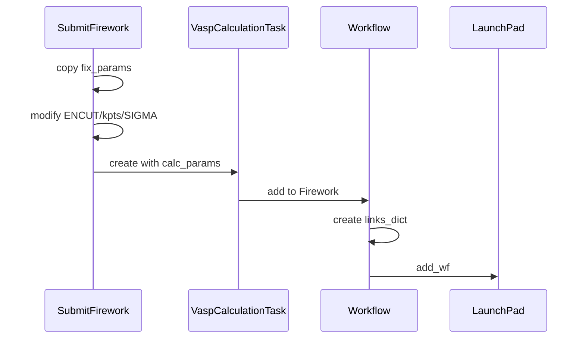
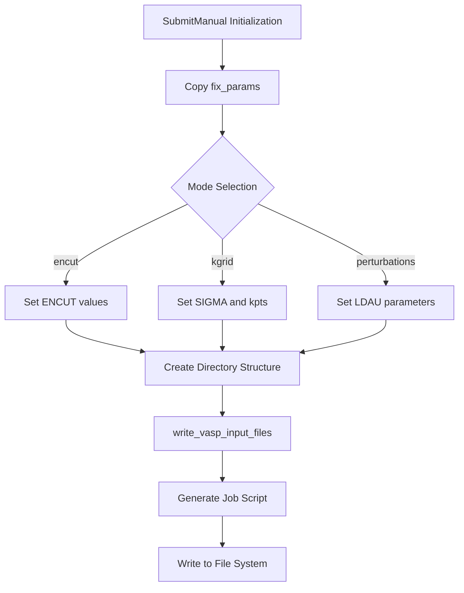
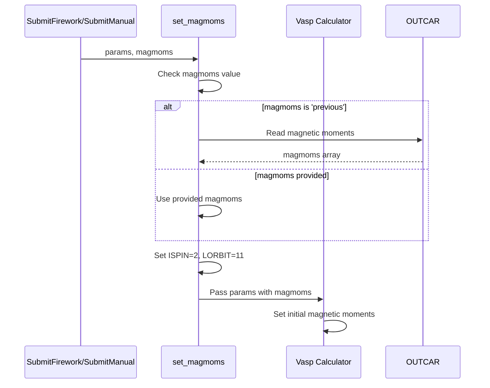
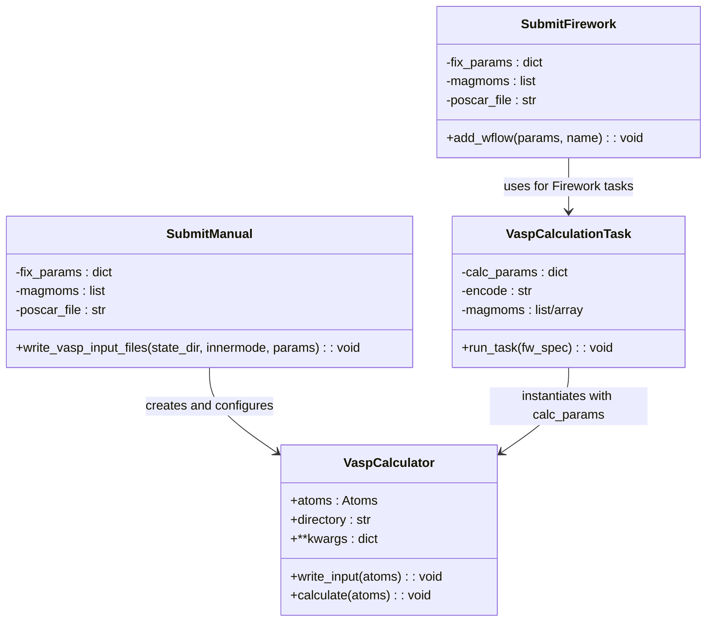

# VASP Parameter Management

<cite>
**Referenced Files in This Document**   
- [SubmitFirework.py](file://common/SubmitFirework.py)
- [SubmitManual.py](file://common/SubmitManual.py)
- [utilities.py](file://common/utilities.py)
- [get_magmoms_vasp.py](file://common/get_magmoms_vasp.py)
- [write_magmoms_input.py](file://common/write_magmoms_input.py)
- [run_vasp.py](file://ase/run_vasp.py)
</cite>

## Table of Contents
1. [Introduction](#introduction)
2. [Core Parameter Management Classes](#core-parameter-management-classes)
3. [Fix_Params Dictionary Structure](#fix_params-dictionary-structure)
4. [Parameter Handling in FireWorks Mode](#parameter-handling-in-fireworks-mode)
5. [Parameter Handling in Manual Mode](#parameter-handling-in-manual-mode)
6. [Magnetic Moment Initialization and Propagation](#magnetic-moment-initialization-and-propagation)
7. [VASP Calculator Integration](#vasp-calculator-integration)
8. [Common Parameter Issues and Solutions](#common-parameter-issues-and-solutions)
9. [Performance Considerations](#performance-considerations)
10. [Best Practices for Parameter Consistency](#best-practices-for-parameter-consistency)

## Introduction

This document provides comprehensive documentation on VASP parameter management within the automag framework, focusing on the implementation and usage of the `fix_params` dictionary in both workflow-driven (FireWorks) and file-based (manual) execution modes. The system enables systematic control of key VASP INCAR parameters including ENCUT, SIGMA, kpts, MAGMOM, LORBIT, ISPIN, LDAU, and NSC/SC settings through two primary classes: `SubmitFirework` and `SubmitManual`. These classes provide distinct approaches to parameter management, with FireWorks enabling automated workflow execution and manual mode supporting direct file-based submission. The document details how parameters are passed to the VASP calculator via ASE's Vasp() interface, explains magnetic moment initialization and propagation, addresses common parameter issues, and provides performance optimization guidance.

## Core Parameter Management Classes

The automag framework implements two primary classes for VASP parameter management: `SubmitFirework` for workflow automation and `SubmitManual` for direct file-based submission. Both classes share a common design pattern centered around the `fix_params` dictionary, which contains the fixed VASP parameters for calculations, while supporting variable parameters through specific modes like 'encut', 'kgrid', and 'perturbations'. The classes handle magnetic moment initialization, directory structure creation, and job script generation, with FireWorks providing automated workflow orchestration and manual mode offering direct control over input file generation.

**Section sources**
- [SubmitFirework.py](file://common/SubmitFirework.py#L1-L260)
- [SubmitManual.py](file://common/SubmitManual.py#L1-L870)

## Fix_Params Dictionary Structure

The `fix_params` dictionary serves as the central mechanism for controlling VASP INCAR parameters in both execution modes. This dictionary contains key-value pairs corresponding to VASP input parameters, which are passed directly to the ASE Vasp calculator. The structure supports both scalar values (e.g., `ENCUT=500`) and array values (e.g., `MAGMOM=[5, -5, 0]`). Critical parameters managed through this dictionary include ENCUT (plane-wave cutoff energy), SIGMA (Fermi smearing width), kpts (k-point mesh), MAGMOM (initial magnetic moments), LORBIT (partial charge and density of states calculation), ISPIN (spin polarization), and LDAU (Hubbard U correction parameters). The dictionary also supports advanced settings like NSC (non-self-consistent) and SC (self-consistent) calculation flags through the `icharg` parameter.

**Section sources**
- [SubmitFirework.py](file://common/SubmitFirework.py#L79-L102)
- [SubmitManual.py](file://common/SubmitManual.py#L526-L633)

## Parameter Handling in FireWorks Mode

In FireWorks mode, parameter management is implemented through the `SubmitFirework` class, which creates automated workflows for VASP calculations. The class processes the `fix_params` dictionary and combines it with variable parameters defined by the calculation mode (e.g., 'encut' or 'kgrid'). For convergence tests, the class generates multiple workflow instances with varying parameter values, creating Firework tasks that execute sequentially. The parameter flow begins with copying the `fix_params` dictionary, then modifying specific values based on the current iteration, and finally passing the complete parameter set to the `VaspCalculationTask`. The workflow structure ensures proper dependency management, with recalculation steps using magnetic moments from previous calculations when specified.

**Diagram sources**
- [SubmitFirework.py](file://common/SubmitFirework.py#L79-L102)
- [SubmitFirework.py](file://common/SubmitFirework.py#L104-L258)

**Section sources**
- [SubmitFirework.py](file://common/SubmitFirework.py#L79-L258)
- [utilities.py](file://common/utilities.py#L64-L151)

## Parameter Handling in Manual Mode

Manual mode parameter management is implemented through the `SubmitManual` class, which generates input files and job scripts for direct VASP execution. Unlike the FireWorks approach, this mode creates directory structures and input files on the filesystem rather than submitting workflows to a database. The parameter handling follows a similar pattern of copying `fix_params` and modifying specific values based on the calculation mode, but the execution flow is file-oriented rather than task-oriented. The class creates appropriate directory hierarchies (e.g., CalcFold/compound/vasp/convergence/encut), writes INCAR, KPOINTS, and POTCAR files through the ASE Vasp calculator interface, and generates job scripts for cluster execution. This approach provides greater transparency and control over the calculation setup while maintaining compatibility with the same parameter dictionary structure.

**Diagram sources**
- [SubmitManual.py](file://common/SubmitManual.py#L526-L633)
- [SubmitManual.py](file://common/SubmitManual.py#L646-L853)

**Section sources**
- [SubmitManual.py](file://common/SubmitManual.py#L1-L870)
- [SubmitManual.py](file://common/SubmitManual.py#L526-L633)

## Magnetic Moment Initialization and Propagation

Magnetic moment management is a critical aspect of VASP parameter control, implemented consistently across both execution modes. The system initializes magnetic moments through the `magmoms` parameter passed to both `SubmitFirework` and `SubmitManual` classes, which is then processed by the `set_magmoms` method. This method automatically enables spin-polarized calculations by setting `ISPIN=2` and configures partial density of states calculations with `LORBIT=11` when magnetic moments are present. For recalculation steps, the system supports propagation of magnetic moments from previous calculations by setting `magmoms='previous'`, which retrieves moments from the OUTCAR file of the preceding step. The framework also includes utility scripts like `get_magmoms_vasp.py` and `write_magmoms_input.py` that extract magnetic moments from output files and update input parameters accordingly.

**Diagram sources**
- [SubmitManual.py](file://common/SubmitManual.py#L509-L523)
- [get_magmoms_vasp.py](file://common/get_magmoms_vasp.py#L1-L43)
- [write_magmoms_input.py](file://common/write_magmoms_input.py#L1-L51)

**Section sources**
- [SubmitManual.py](file://common/SubmitManual.py#L509-L523)
- [get_magmoms_vasp.py](file://common/get_magmoms_vasp.py#L1-L43)
- [write_magmoms_input.py](file://common/write_magmoms_input.py#L1-L51)

## VASP Calculator Integration

The integration with ASE's Vasp calculator is implemented through the `write_vasp_input_files` method in the `SubmitManual` class and the `VaspCalculationTask` in the FireWorks workflow. Both approaches use the same underlying mechanism of instantiating a Vasp calculator object with the parameters from the `fix_params` dictionary and calling `write_input()` to generate the necessary input files (INCAR, KPOINTS, POTCAR). The calculator handles parameter validation and file format conversion automatically, ensuring compatibility with VASP requirements. For advanced calculations like non-collinear magnetism or spin-orbit coupling, additional parameters such as `lnoncollinear`, `lsorbit`, and `voskown` are included in the parameter dictionary. The integration also supports LDA+U calculations by dynamically constructing `LDAUL`, `LDAUU`, and `LDAUJ` arrays based on the chemical composition and specified Hubbard U values.

**Diagram sources**
- [SubmitManual.py](file://common/SubmitManual.py#L526-L633)
- [utilities.py](file://common/utilities.py#L64-L151)

**Section sources**
- [SubmitManual.py](file://common/SubmitManual.py#L526-L633)
- [utilities.py](file://common/utilities.py#L64-L151)
- [run_vasp.py](file://ase/run_vasp.py#L1-L22)

## Common Parameter Issues and Solutions

Several common issues arise in VASP parameter management that the automag framework addresses through its design. Incorrect parameter formatting, such as providing scalar values where arrays are expected or vice versa, is mitigated by the framework's automatic type handling and validation. Missing required tags are prevented by the systematic parameter setting in the `set_magmoms` method, which ensures `ISPIN` and `LORBIT` are set when magnetic moments are present. Conflicts between parameter sets, such as incompatible combinations of `ICHARG` and `ISTART` values, are resolved through the framework's mode-specific parameter logic. For example, in non-self-consistent calculations (NSC), the framework automatically sets `ICHARG=11` and copies WAVECAR from previous calculations, while self-consistent (SC) calculations use `ICHARG=0`. The system also handles POTCAR path resolution and ensures consistent pseudopotential selection across calculations.

**Section sources**
- [SubmitManual.py](file://common/SubmitManual.py#L526-L633)
- [SubmitManual.py](file://common/SubmitManual.py#L646-L853)
- [utilities.py](file://common/utilities.py#L64-L151)

## Performance Considerations

Performance optimization in VASP parameter selection involves careful consideration of computational cost versus accuracy. The framework supports systematic convergence testing through the 'encut' and 'kgrid' modes, allowing users to identify optimal parameter values that balance accuracy and efficiency. For ENCUT selection, the framework enables testing across a range of values to find the point of diminishing returns in energy convergence. Similarly, k-point mesh optimization is supported through systematic testing of different kpts values. The implementation includes performance-enhancing features such as automatic cleanup of large files (WAVECAR, CHGCAR) after calculations when specified, and support for parallel execution over configurations. For magnetic calculations, the framework optimizes by reusing converged charge densities and wavefunctions when appropriate, reducing the number of electronic iterations required in subsequent calculations.

**Section sources**
- [SubmitFirework.py](file://common/SubmitFirework.py#L79-L102)
- [SubmitManual.py](file://common/SubmitManual.py#L646-L853)

## Best Practices for Parameter Consistency

Maintaining parameter consistency across calculation types is essential for reliable results, and the automag framework provides several best practices to achieve this. First, the shared `fix_params` dictionary structure between FireWorks and manual modes ensures identical parameter sets can be used across different execution methods. Second, the framework encourages the use of consistent directory structures and naming conventions, making it easier to track and compare results. Third, the implementation of utility scripts for magnetic moment extraction and input file updating promotes consistency in spin-polarized calculations. Additional best practices include using environment variables (AUTOMAG_PATH, VASP_PP_PATH) for path resolution, maintaining consistent pseudopotential selections through the `setups` parameter, and using the energy_convergence flag to apply appropriate corrections for ENCUT convergence testing. The framework also supports the use of crystal symmetries in magnetic anisotropy energy (MAE) calculations through the use_symmetries parameter, ensuring consistent treatment of symmetrically equivalent directions.

**Section sources**
- [SubmitFirework.py](file://common/SubmitFirework.py#L1-L260)
- [SubmitManual.py](file://common/SubmitManual.py#L1-L870)
- [utilities.py](file://common/utilities.py#L1-L278)