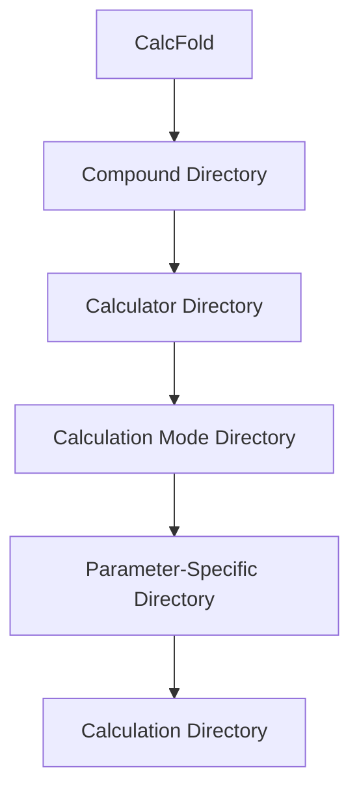
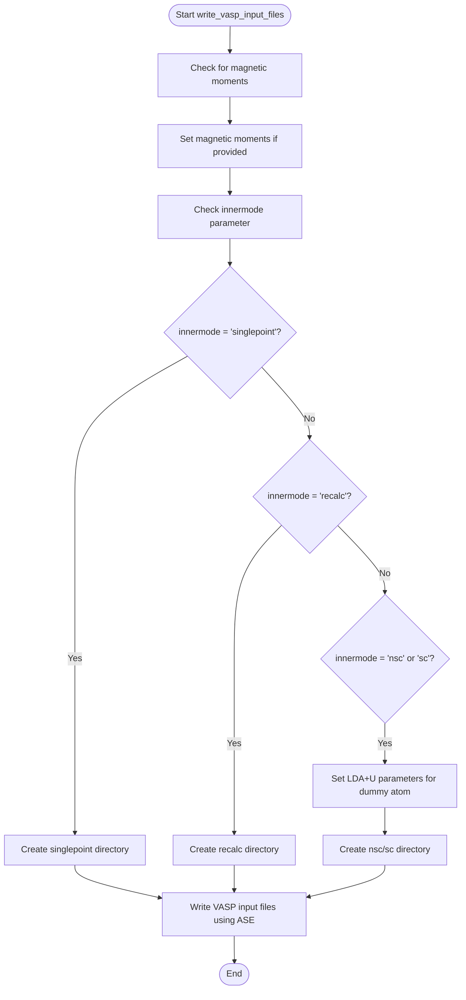
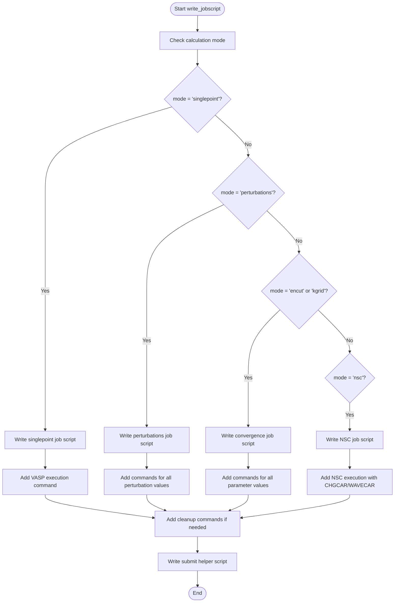
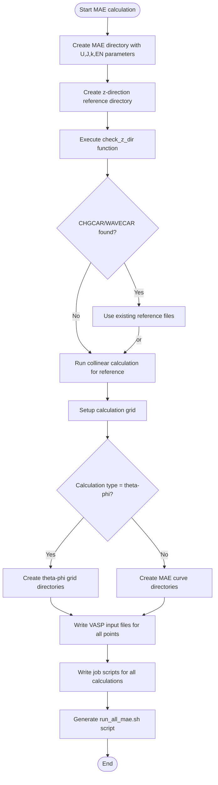

# Manual Submission System

<cite>
**Referenced Files in This Document**   
- [SubmitManual.py](file://common/SubmitManual.py)
- [write_vasp_input_files](file://common/SubmitManual.py#L526-L633)
- [write_jobscript](file://common/SubmitManual.py#L646-L853)
- [write_input](file://common/SubmitManual.py#L187-L507)
- [1_submit.py](file://4_mae/1_submit.py)
- [3_submit.py](file://4_mae/3_submit.py)
- [input_template.py](file://4_mae/input_template.py)
- [input_example_enhanced.py](file://4_mae/input_example_enhanced.py)
- [write_output.py](file://common/write_output.py)
- [write_magmoms_input.py](file://common/write_magmoms_input.py)
- [write_charges.py](file://common/write_charges.py)
- [MAE.py](file://4_mae/MAE.py)
</cite>

## Table of Contents
1. [Introduction](#introduction)
2. [Directory Structure Creation](#directory-structure-creation)
3. [VASP Input File Generation](#vasp-input-file-generation)
4. [Job Script Generation](#job-script-generation)
5. [MAE Calculation Special Handling](#mae-calculation-special-handling)
6. [Common Issues and Troubleshooting](#common-issues-and-troubleshooting)
7. [Performance Considerations](#performance-considerations)
8. [Best Practices](#best-practices)

## Introduction
The SubmitManual system provides a comprehensive framework for generating VASP input files and job scripts for manual execution without workflow management systems. This system enables researchers to perform various types of calculations including single-point, convergence tests, perturbation analysis, and magnetocrystalline anisotropy energy (MAE) calculations. The implementation is designed to organize calculations systematically by compound and calculator type, with specialized handling for different calculation modes and queue systems.

**Section sources**
- [SubmitManual.py](file://common/SubmitManual.py#L1-L50)

## Directory Structure Creation
The SubmitManual system creates a hierarchical directory structure organized by compound and calculator type. When initialized, the system reads the POSCAR file to determine the chemical formula of the compound, which becomes the basis for the directory naming convention. The root directory CalcFold is created under the AUTOMAG_PATH environment variable, with subdirectories for each compound following the pattern `{chemical_formula}{struct_suffix}`.

Within each compound directory, calculator-specific subdirectories are created (e.g., 'vasp'), and for convergence tests, additional subdirectories are generated for specific parameters like 'encut' or 'kgrid'. For MAE calculations, a specialized directory structure is created with a naming convention that includes U, J, k-point, and energy cutoff parameters: `mae_U{U:.1f}_J{J:.1f}_K{kpts}_EN{encut}`. This systematic organization allows for easy tracking and management of multiple calculations across different compounds and parameter sets.

**Diagram sources**
- [SubmitManual.py](file://common/SubmitManual.py#L100-L150)

**Section sources**
- [SubmitManual.py](file://common/SubmitManual.py#L100-L200)

## VASP Input File Generation
The VASP input file generation process is handled through the `write_vasp_input_files` method, which creates appropriate INCAR, POSCAR, KPOINTS, and POTCAR files for VASP calculations. The method supports different calculation modes through the `innermode` parameter, which can be 'singlepoint', 'recalc', 'nsc', or 'sc'. For single-point calculations, only the basic input files are generated, while for recalculation runs, both single-point and recalculation directories are created.

For perturbation calculations, the system temporarily modifies the atomic structure by replacing a specified atom with a dummy atom and copying the corresponding POTCAR file. This allows for consistent potential treatment during perturbation analysis. The system also handles non-collinear calculations by setting appropriate VASP parameters such as `lnoncollinear`, `lsorbit`, and `icharg=11` for non-self-consistent calculations that use existing WAVECAR and CHGCAR files.

**Diagram sources**
- [SubmitManual.py](file://common/SubmitManual.py#L526-L633)

**Section sources**
- [SubmitManual.py](file://common/SubmitManual.py#L187-L507)
- [SubmitManual.py](file://common/SubmitManual.py#L526-L633)

## Job Script Generation
The job script generation process is managed by the `write_jobscript` method, which creates bash scripts for executing VASP calculations on different queue systems. The system supports SLURM, PBS, and direct shell execution, automatically detecting the queue system from the job header. For SLURM systems, the script includes appropriate #SBATCH directives for job name, resource allocation, and output handling.

The job script generation varies based on the calculation mode. For single-point calculations, the script changes to the appropriate directory and executes the VASP command. For recalculation runs, the script first runs the single-point calculation, then copies the `write_magmoms_input.py` script to update magnetic moments in the INCAR file before running the recalculation. For perturbation calculations, the script handles multiple perturbation values by creating separate directories and copying WAVECAR and CHGCAR files from the single-point calculation.

For MAE calculations, the job script sets up non-self-consistent calculations by copying CHGCAR and creating a symbolic link to WAVECAR from the reference z-direction calculation. The system also generates helper scripts (`run_all_*.sh`) for submitting multiple calculations, with commands appropriate to the detected queue system (sbatch for SLURM, qsub for PBS, or sh for direct execution).

**Diagram sources**
- [SubmitManual.py](file://common/SubmitManual.py#L646-L853)

**Section sources**
- [SubmitManual.py](file://common/SubmitManual.py#L646-L853)

## MAE Calculation Special Handling
The MAE calculation implementation includes specialized handling for both theta-phi grid calculations and MAE curve calculations. The system first creates a reference directory (`z_dir`) for collinear calculations with the spin axis aligned along the z-direction. The `check_z_dir` function is responsible for locating appropriate CHGCAR and WAVECAR files for this reference calculation, with support for compatibility with the original MAE.py script.

The `check_z_dir` function first checks for k-point optimized reference calculations if the `use_kpoint_reference` parameter is enabled, searching for directories with specific k-point values. If no compatible reference is found, it searches for existing CHGCAR and WAVECAR files in the z-direction directory, recalc directory, or single-point directory. If no suitable files are found, it performs a new collinear calculation to generate the necessary reference files.

For theta-phi grid calculations, the system creates directories for each combination of theta and phi angles, with directory names formatted as `PhTh_{phi_degrees}_{theta_degrees}`. For MAE curve calculations, directories are created with the naming convention `K_{kpts}_RtMAE_{angle_degrees}`. In both cases, the SAXIS parameter is calculated based on spherical coordinates and written to the INCAR file. The job scripts for these calculations copy the CHGCAR file and create a symbolic link to the WAVECAR file from the reference z-direction calculation, ensuring consistent starting conditions for all non-self-consistent calculations.

**Diagram sources**
- [SubmitManual.py](file://common/SubmitManual.py#L187-L507)
- [1_submit.py](file://4_mae/1_submit.py#L150-L200)
- [3_submit.py](file://4_mae/3_submit.py#L150-L200)

**Section sources**
- [SubmitManual.py](file://common/SubmitManual.py#L187-L507)
- [1_submit.py](file://4_mae/1_submit.py)
- [3_submit.py](file://4_mae/3_submit.py)

## Common Issues and Troubleshooting
Several common issues may arise when using the manual submission system, primarily related to environment configuration, file handling, and job execution. The most critical environment variables are AUTOMAG_PATH, which must be set to the root directory of the automag project, and VASP_PP_PATH, which should point to the VASP pseudopotential directory. Failure to set these variables correctly will result in path resolution errors when creating directories or accessing scripts.

POTCAR handling during perturbation calculations presents a specific challenge, as the system temporarily replaces the dummy atom's POTCAR with that of the atom being calculated. This operation requires appropriate file system permissions and may fail if the POTCAR directory is read-only. Users should ensure they have write permissions in the pseudopotential directory or create a local copy of the POTCAR files.

Job script execution problems often stem from queue system configuration mismatches. The system detects the queue system from the job header (SLURM with #SBATCH, PBS with #PBS), but incorrect headers may lead to submission failures. Users should verify that their job header matches their cluster's queue system and includes all necessary resource specifications.

Other common issues include:
- Missing or corrupted CHGCAR/WAVECAR files for MAE calculations
- Incorrect magnetic moment specifications in input files
- Parameter conflicts between different calculation modes
- File permission issues when copying or modifying POTCAR files
- Path resolution errors due to incorrect AUTOMAG_PATH setting

The system includes diagnostic output to help identify these issues, such as messages indicating when reference files are found or when fallback procedures are initiated.

**Section sources**
- [SubmitManual.py](file://common/SubmitManual.py)
- [input_template.py](file://4_mae/input_template.py)
- [input_example_enhanced.py](file://4_mae/input_example_enhanced.py)

## Performance Considerations
The manual submission system offers several performance considerations for optimizing large-scale calculations. The `parallel_over_configurations` parameter controls whether separate job scripts are created for each configuration (True) or all configurations are included in a single job script (False). For systems with job submission limits, using a single job script may be more efficient, while separate job scripts provide better fault tolerance and monitoring capabilities.

For MAE calculations with large theta-phi grids, the system implements a controlled parallelization strategy through the Nparalel parameter in the original MAE.py script, which limits the number of simultaneously running jobs. This prevents overloading the queue system and ensures stable performance. Users should adjust this parameter based on their cluster's capacity and policies.

Memory usage can be optimized by setting `keep_large_files=False` in the `write_jobscript` method, which adds commands to remove WAVECAR and CHGCAR files after calculation completion. This is particularly important for large systems or long calculation series where disk space may become a limiting factor.

The system's directory structure also impacts performance, as deep directory hierarchies with many small files can slow down file system operations. The current structure balances organization with performance by grouping related calculations while avoiding excessive nesting.

**Section sources**
- [SubmitManual.py](file://common/SubmitManual.py#L646-L853)
- [MAE.py](file://4_mae/MAE.py#L50-L100)

## Best Practices
To ensure reliable and efficient operation of the manual submission system, several best practices should be followed:

1. **Environment Configuration**: Always verify that AUTOMAG_PATH and VASP_PP_PATH environment variables are correctly set before running calculations. Use absolute paths to avoid resolution issues.

2. **Input Validation**: Carefully validate input parameters, particularly for MAE calculations, ensuring that U, J, encut, and k-point values are physically reasonable and consistent with previous calculations.

3. **Directory Management**: Regularly clean up completed calculation directories to prevent disk space exhaustion, especially when removing large files like WAVECAR and CHGCAR after successful calculations.

4. **Error Handling**: Implement monitoring for job completion and automatically resubmit failed calculations when possible. The system's diagnostic output should be reviewed regularly to identify potential issues.

5. **Consistency Checks**: For MAE calculations, use the validate_consistency.py script to verify that results are consistent between the manual submission system and the original MAE.py implementation.

6. **Resource Planning**: Estimate computational requirements before launching large calculation series, considering both runtime and storage needs. Adjust the parallelization strategy based on cluster availability and policies.

7. **Backup and Recovery**: Regularly back up critical input files and results, particularly for long-running MAE calculations where interruption could result in significant time loss.

8. **Documentation**: Maintain detailed records of calculation parameters and results, using the structured directory naming convention to facilitate organization and retrieval.

Following these best practices will help ensure successful execution of manual calculations and reliable scientific results.

**Section sources**
- [input_example_enhanced.py](file://4_mae/input_example_enhanced.py)
- [SubmitManual.py](file://common/SubmitManual.py)
- [MAE.py](file://4_mae/MAE.py)