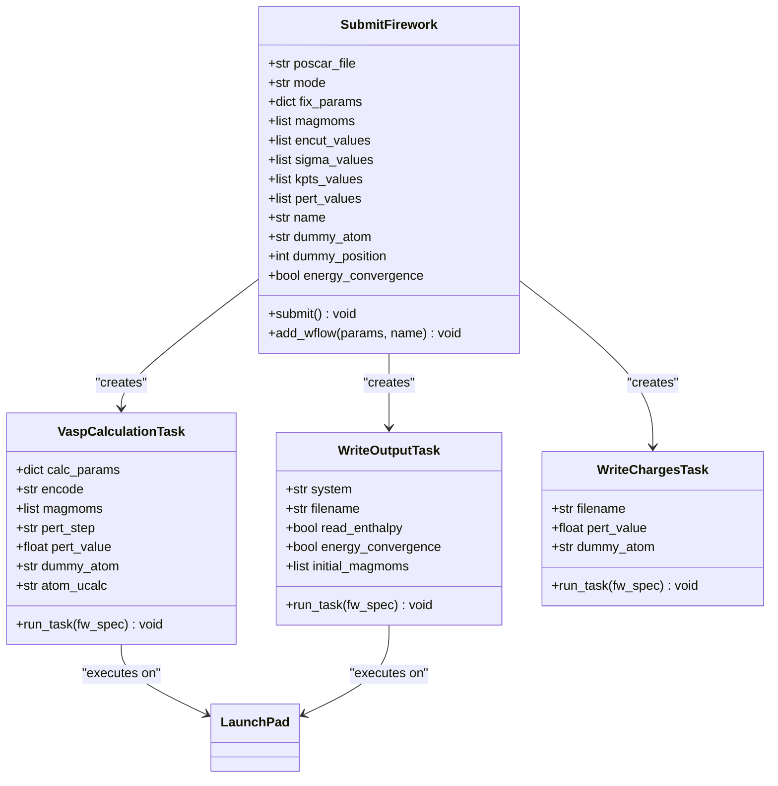
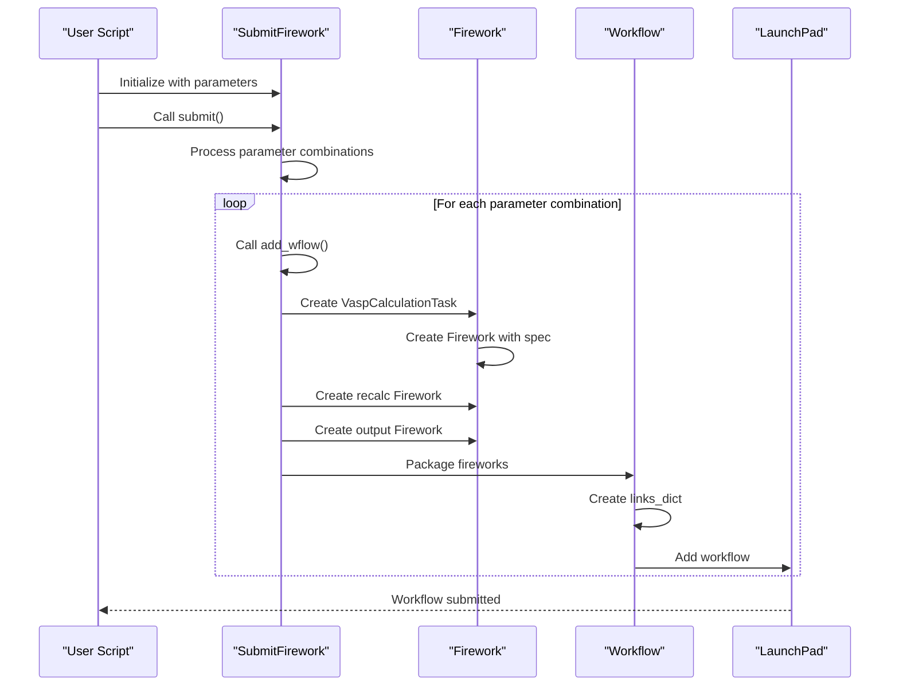
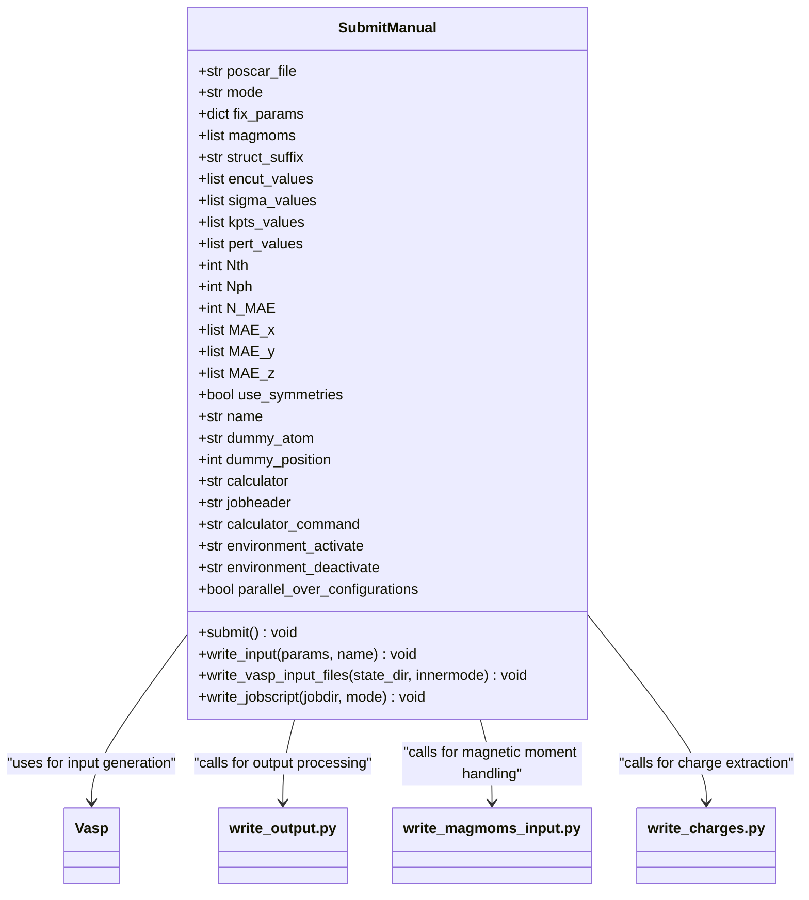
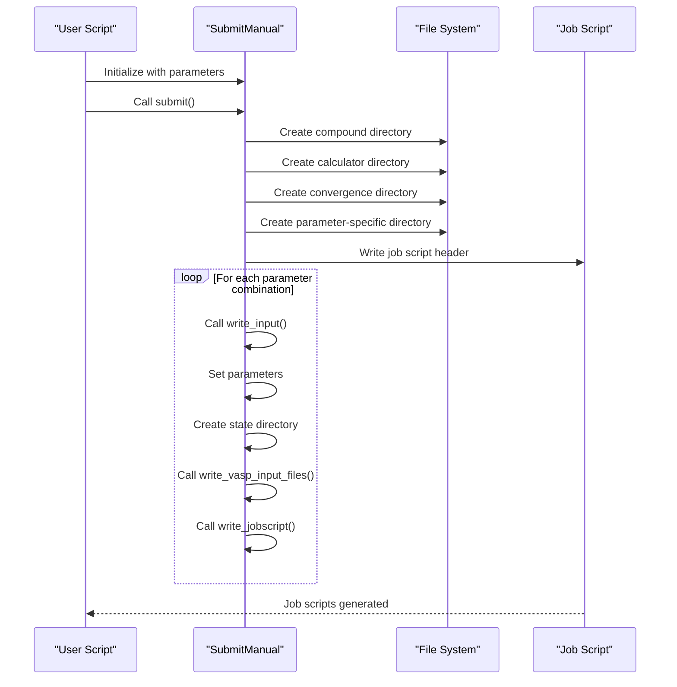
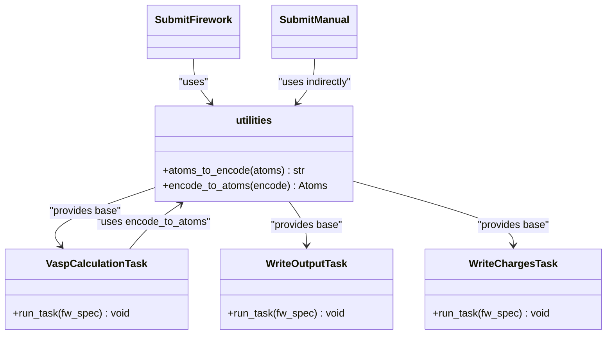
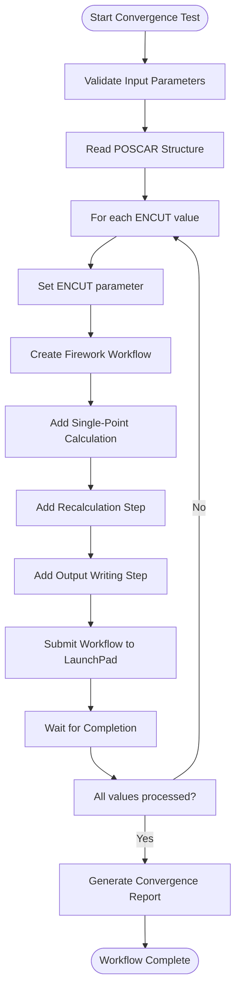
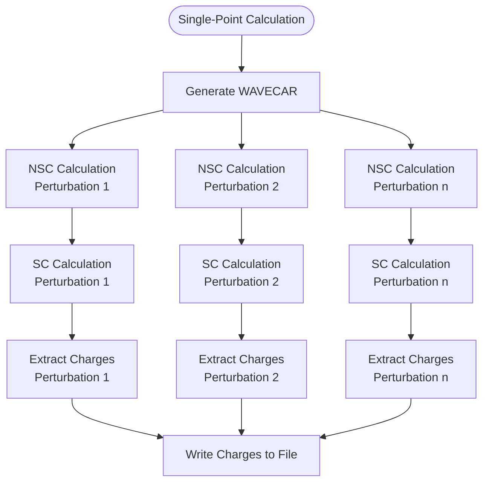

# Workflow Orchestration

<cite>
**Referenced Files in This Document**   
- [SubmitFirework.py](file://common/SubmitFirework.py)
- [SubmitManual.py](file://common/SubmitManual.py)
- [utilities.py](file://common/utilities.py)
</cite>

## Table of Contents
1. [Introduction](#introduction)
2. [FireWorks-Based Workflow Orchestration](#fireworks-based-workflow-orchestration)
3. [Manual Job Submission System](#manual-job-submission-system)
4. [Shared Utilities and Integration](#shared-utilities-and-integration)
5. [Workflow Examples](#workflow-examples)
6. [Error Handling and Common Issues](#error-handling-and-common-issues)
7. [Performance Considerations](#performance-considerations)
8. [Conclusion](#conclusion)

## Introduction
This document provides comprehensive guidance on workflow orchestration within the automag framework, focusing on two primary approaches: FireWorks-based automated workflows and manual job submission systems. The system enables efficient execution of VASP calculations for materials science research, particularly in magnetic property analysis. The FireWorks-based approach offers automated workflow management with dependency tracking and state management, while the manual submission system provides direct control over job scripts and execution. Both systems share common utilities for VASP calculation management and output processing, ensuring consistency across different execution modes.

## FireWorks-Based Workflow Orchestration

The SubmitFirework class implements a FireWorks-based workflow orchestration system that automates the submission and management of VASP calculations. This system leverages the FireWorks framework to create, manage, and track computational workflows with proper dependency handling and state management.

**Diagram sources**
- [SubmitFirework.py](file://common/SubmitFirework.py#L25-L258)
- [utilities.py](file://common/utilities.py#L64-L218)

The SubmitFirework class constructor validates input parameters based on the specified mode (encut, kgrid, perturbations, or singlepoint), ensuring that only relevant parameters are provided for each workflow type. The class maintains state through instance variables that store the POSCAR file path, calculation mode, fixed parameters, magnetic moments, and variable parameter ranges.

**Section sources**
- [SubmitFirework.py](file://common/SubmitFirework.py#L25-L77)

### Workflow Construction and Dependency Management
The submit() method orchestrates workflow creation by iterating through parameter combinations and calling add_wflow() to construct FireWorks workflows. For convergence testing modes (encut, kgrid), it generates parameter combinations using itertools.product and creates workflows with appropriate naming conventions that reflect the parameter values being tested.

**Diagram sources**
- [SubmitFirework.py](file://common/SubmitFirework.py#L79-L102)
- [SubmitFirework.py](file://common/SubmitFirework.py#L104-L258)

The add_wflow() method is responsible for constructing the actual workflow structure. It creates Firework objects with specific Firetasks (VaspCalculationTask, WriteOutputTask, WriteChargesTask) and establishes dependencies between them through the links_dict parameter in the Workflow constructor. The method handles different workflow patterns based on the calculation mode:

For standard calculations, it creates a sequence of fireworks: a single-point calculation followed by a recalculation using magnetic moments from the first step. For perturbation calculations, it creates a more complex workflow with multiple Non-Self-Consistent (NSC) and Self-Consistent (SC) calculation pairs, each followed by a WriteChargesTask to extract U parameter information.

**Section sources**
- [SubmitFirework.py](file://common/SubmitFirework.py#L104-L258)

## Manual Job Submission System

The SubmitManual class provides an alternative approach to workflow orchestration by generating VASP input files and job scripts for manual execution. This system offers greater control over the execution environment and is particularly useful for systems where FireWorks is not available or when specific job scheduling requirements must be met.

**Diagram sources**
- [SubmitManual.py](file://common/SubmitManual.py#L24-L853)

The SubmitManual class supports various calculation modes similar to SubmitFirework but focuses on generating the necessary files for execution rather than managing workflow state. It creates directory structures organized by compound, calculator type, and calculation mode, ensuring systematic organization of computational results.

**Section sources**
- [SubmitManual.py](file://common/SubmitManual.py#L25-L113)

### Job Script and Input File Generation
The submit() method in SubmitManual handles the creation of directory structures and job scripts for convergence testing calculations. It organizes calculations in a hierarchical directory structure under CalcFold, with subdirectories for each compound, calculator type, and convergence parameter type (encut, kgrid).

**Diagram sources**
- [SubmitManual.py](file://common/SubmitManual.py#L115-L185)
- [SubmitManual.py](file://common/SubmitManual.py#L187-L507)

The write_input() method is the core of the manual submission system, responsible for creating all necessary input files and job scripts for a specific calculation. It handles various calculation modes including single-point calculations, perturbation calculations, and Magnetic Anisotropy Energy (MAE) calculations with theta-phi or curve-based parameterization.

For perturbation calculations, the system temporarily modifies the POTCAR file by replacing the dummy atom's pseudopotential with that calculated, enabling U parameter determination through the linear response method.

**Section sources**
- [SubmitManual.py](file://common/SubmitManual.py#L187-L507)

## Shared Utilities and Integration

Both workflow systems rely on shared utilities defined in utilities.py, which provide essential functionality for VASP calculation management, input/output handling, and result processing. These utilities ensure consistency across both execution methods and encapsulate domain-specific knowledge for magnetic calculations.

**Diagram sources**
- [utilities.py](file://common/utilities.py#L64-L218)

The VaspCalculationTask Firetask handles the execution of VASP calculations within the FireWorks framework. It manages input structure handling (either from encoded JSON or from previous calculation outputs), applies LDA+U parameters for perturbation calculations, and handles magnetic moment initialization. The task also manages file copying (WAVECAR, CHGCAR) between calculation steps and records convergence status.

The WriteOutputTask extracts and formats calculation results including convergence status, chemical formula, space group, energy (with kinetic energy error correction for encut convergence testing), and magnetic moments. Results are appended to output files in the CalcFold directory, enabling easy aggregation and analysis.

The WriteChargesTask specifically handles charge extraction for U parameter calculations, reading charge values from OUTCAR files and applying quality checks based on magnetic moment stability and convergence status.

**Section sources**
- [utilities.py](file://common/utilities.py#L64-L218)

## Workflow Examples

### Convergence Testing Workflows
For encut convergence testing, both systems follow a similar pattern of systematically varying the ENCUT parameter while keeping other parameters fixed. The FireWorks-based approach automatically manages the workflow dependencies and state, while the manual approach generates separate job scripts for each ENCUT value.

**Diagram sources**
- [SubmitFirework.py](file://common/SubmitFirework.py#L79-L102)

For kgrid convergence testing, the system varies both SIGMA and KPOINTS parameters, creating a two-dimensional parameter space to explore. The workflow structure remains similar to encut testing but with parameter combinations generated from the Cartesian product of sigma and kpoints values.

### Perturbation Calculations
Perturbation calculations for U parameter determination follow a specialized workflow pattern. The FireWorks-based system creates a sequence of NSC and SC calculation pairs for each perturbation value, with each pair sharing the same WAVECAR from a common single-point calculation.

**Diagram sources**
- [SubmitFirework.py](file://common/SubmitFirework.py#L104-L258)

The manual submission system implements a similar pattern but through job script generation, with each perturbation value getting its own directory containing NSC and SC subdirectories. The job script copies the common WAVECAR and CHGCAR files to each NSC calculation directory before execution.

## Error Handling and Common Issues

### Workflow Submission Failures
Common issues in workflow submission include incorrect parameter validation, missing input files, and database connection problems. The SubmitFirework class includes assertion checks in the constructor to validate parameter combinations for each mode, preventing invalid workflows from being created.

For FireWorks database connectivity, the launchpad is initialized from a YAML configuration file, and connection issues typically stem from incorrect file paths or database server availability. Ensuring the launchpad file exists and contains valid connection parameters is essential for successful workflow submission.

### Job Dependency Errors
Dependency errors can occur when the expected output files from predecessor jobs are missing or corrupted. The FireWorks framework handles most dependency management automatically, but issues can arise if jobs fail unexpectedly or if file I/O operations encounter errors.

In the VaspCalculationTask, the system attempts to copy WAVECAR and CHGCAR files from the previous job's launch directory. If these files are missing or inaccessible, the calculation will fail. Implementing proper error checking and retry mechanisms can mitigate these issues.

### Inconsistent State Management
State inconsistencies can occur when workflows are partially completed or when manual interventions modify calculation directories. The FireWorks system maintains state in the database, providing a reliable source of truth for workflow progress. In contrast, the manual submission system relies on file system state, which is more susceptible to inconsistencies.

For convergence testing, ensuring that all parameter combinations are processed and that results are properly recorded is crucial. The WriteOutputTask helps maintain consistency by appending results to output files, but care must be taken to avoid race conditions when multiple processes write to the same file.

## Performance Considerations

### Large-Scale Workflow Execution
For large-scale workflow execution, several performance considerations are important. The FireWorks-based system can handle thousands of workflows efficiently, but database performance may become a bottleneck with very large numbers of jobs. Regular database maintenance and optimization can help mitigate this.

The manual submission system's performance is primarily limited by file system operations and job scheduler throughput. When generating large numbers of job scripts, writing to a single job script file in append mode (as done for convergence testing) is more efficient than creating separate job scripts for each calculation.

### Error Recovery Strategies
Effective error recovery strategies are essential for robust workflow execution. For FireWorks workflows, the framework provides built-in retry mechanisms and error handling. Failed jobs can be resubmitted, and the workflow state is preserved, allowing execution to resume from the point of failure.

For manual submissions, implementing checkpointing and status tracking is recommended. This can be achieved by creating marker files to indicate completed calculations or by maintaining a separate status file that tracks the progress of each parameter combination.

Both systems benefit from modular design, allowing failed calculations to be re-executed independently without reprocessing successful ones. The separation of input generation from execution in the manual system provides additional flexibility for error recovery, as input files can be inspected and modified before re-execution.

## Conclusion
The automag framework provides two complementary approaches to workflow orchestration: a FireWorks-based automated system and a manual job submission system. The FireWorks approach offers robust workflow management with automatic dependency handling and state tracking, making it ideal for complex, interdependent calculations. The manual submission system provides greater control over execution and is more portable across different computing environments.

Both systems share common utilities for VASP calculation management, ensuring consistency in input generation, execution, and result processing. The choice between systems depends on specific requirements: FireWorks is preferred for complex workflows with dependencies, while manual submission is suitable for simpler calculations or environments where FireWorks is not available.

Key strengths of the framework include comprehensive parameter validation, systematic directory organization, and specialized workflows for magnetic property calculations. By understanding the capabilities and limitations of each approach, users can effectively orchestrate computational workflows for materials science research.