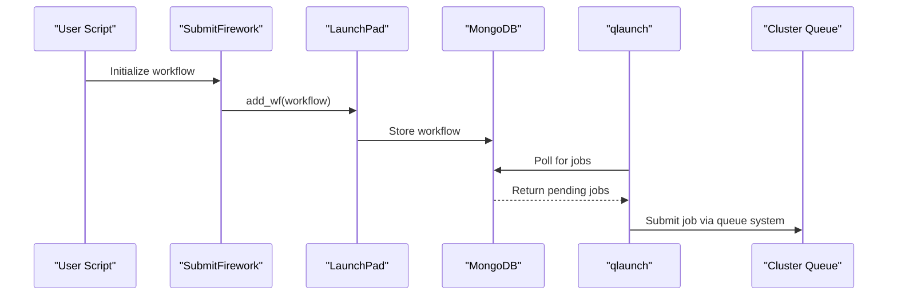

# Installation and Setup

<cite>
**Referenced Files in This Document**   
- [README.md](file://README.md)
- [ase/run_vasp.py](file://ase/run_vasp.py)
- [common/SubmitFirework.py](file://common/SubmitFirework.py)
- [requirements.txt](file://requirements.txt)
</cite>

## Table of Contents
1. [Introduction](#introduction)
2. [Repository Cloning](#repository-cloning)
3. [Python Environment Setup](#python-environment-setup)
4. [Dependency Installation](#dependency-installation)
5. [VASP Configuration](#vasp-configuration)
6. [FireWorks Integration](#fireworks-integration)
7. [Environment Variables Configuration](#environment-variables-configuration)
8. [External Dependencies](#external-dependencies)
9. [Common Issues and Troubleshooting](#common-issues-and-troubleshooting)
10. [Conclusion](#conclusion)

## Introduction

This document provides comprehensive installation and setup procedures for Automag, an automated workflow software for calculating magnetic ground states and critical temperatures of materials. The guide covers all essential configuration steps from repository cloning to environment variable setup, with detailed explanations of component relationships and integration points. The content is designed to be accessible to beginners while providing sufficient technical depth for cluster deployment scenarios.

## Repository Cloning

The installation process begins with cloning the Automag repository from its GitHub source. This creates a local copy of the entire codebase, including all scripts, configuration files, and documentation.

To clone the repository, execute the following command in your terminal:

```bash
git clone https://github.com/Kurufinve/automag.git
```

This command downloads the complete Automag project into a new directory named `automag`. After cloning, navigate into the project directory:

```bash
cd automag
```

The repository contains several key directories and files essential for the workflow:
- `0_conv_tests/`: Scripts for convergence testing of VASP parameters
- `1_lin_response/`: Tools for calculating electronic correlation parameter U
- `2_coll/`: Functions for determining the most stable magnetic state
- `3_monte_carlo/`: Components for critical temperature calculation via Monte Carlo simulation
- `ase/`: VASP interface configuration
- `common/`: Shared utilities and FireWorks integration
- `requirements.txt`: Python dependencies list

**Section sources**
- [README.md](file://README.md#L1-L277)

## Python Environment Setup

Automag requires a properly configured Python environment to ensure dependency isolation and version compatibility. The recommended approach uses Python's built-in `venv` module to create a virtual environment.

First, ensure Python 3 is installed and accessible via the `python` command, with the `wheel` and `venv` packages available. Then create a virtual environment in the project directory:

```bash
python -m venv .venv
```

This command creates a self-contained Python environment in the `.venv` directory, isolating Automag's dependencies from the system-wide Python installation. Activate the virtual environment using:

```bash
source .venv/bin/activate
```

On Windows systems, the activation command differs:

```bash
.venv\Scripts\activate
```

Once activated, your command prompt will typically display `(.venv)` to indicate the virtual environment is active. This isolated environment prevents conflicts between Automag's dependencies and other Python projects on the same system.

**Section sources**
- [README.md](file://README.md#L1-L277)

## Dependency Installation

After setting up the virtual environment, install all required Python dependencies listed in the `requirements.txt` file. This file contains a comprehensive list of packages necessary for Automag's functionality, including scientific computing libraries and workflow management tools.

Install the dependencies using pip:

```bash
pip install -r requirements.txt
```

The `requirements.txt` file includes essential packages such as:
- `ase`: Atomic Simulation Environment for interfacing with VASP
- `FireWorks`: Workflow management system for job scheduling
- `pymatgen`: Python materials analysis library
- `numpy`, `scipy`: Scientific computing foundations
- `pandas`, `matplotlib`: Data analysis and visualization
- `pymongo`: MongoDB interface for FireWorks database connectivity

These dependencies enable Automag's core functionality, including VASP job submission, materials structure manipulation, data processing, and workflow automation. The installation process resolves and installs all transitive dependencies automatically.

**Section sources**
- [requirements.txt](file://requirements.txt#L0-L56)
- [README.md](file://README.md#L1-L277)

## VASP Configuration

Proper VASP configuration is critical for Automag to execute quantum mechanical calculations. The configuration is managed through the `run_vasp.py` script located in the `ase` directory, which defines how VASP executables are invoked and which computational libraries are loaded.

The `run_vasp.py` file contains system-specific configurations for loading Intel Math Kernel Library (MKL) and Message Passing Interface (MPI) libraries, followed by calling the VASP executable. Three configuration examples are provided:

```python
# vasp 5 local
# load_mkl = 'source /home/mgalasso/intel/compilers_and_libraries_2019.5.281/linux/mkl/bin/mklvars.sh intel64'
# load_mpi = 'source /home/mgalasso/intel/compilers_and_libraries_2019.5.281/linux/mpi/intel64/bin/mpivars.sh intel64'
# exitcode = os.system('{}; {}; mpirun -n 16 /home/mgalasso/softs/vasp.5.4.4/bin/vasp_std'.format(load_mkl, load_mpi))

# vasp 5 module
# exitcode = os.system('module load intel/mkl-11.2.3 mpi/impi-5.0.3 vasp/vasp-5.4.4; mpirun vasp_std')

# vasp 6 module
exitcode = os.system('module load vasp/6.4.3; mpirun vasp_std')
```

Users must modify this file to match their cluster's environment, uncommenting and adjusting the appropriate configuration. For module-based systems, the `module load` command loads required software packages. For local installations, environment setup scripts for MKL and MPI must be sourced before executing VASP with `mpirun`.

**Section sources**
- [ase/run_vasp.py](file://ase/run_vasp.py#L0-L21)

## FireWorks Integration

Automag integrates with FireWorks for workflow management and job scheduling on computing clusters. This integration requires proper configuration of the FireWorks launchpad, which connects to a MongoDB database for workflow persistence and coordination.

The FireWorks configuration is established in `common/SubmitFirework.py`, where the `LaunchPad` object is initialized from a YAML configuration file:

```python
launchpad = LaunchPad.from_file('/home/mgalasso/.fireworks/my_launchpad.yaml')
```

This line specifies the path to the `my_launchpad.yaml` file, which contains database connection parameters, authentication credentials, and queue adapter settings. Users must edit this path to point to their own `my_launchpad.yaml` file:

```python
launchpad = LaunchPad.from_file('/PATH/TO/your/my_launchpad.yaml')
```

The FireWorks system manages the submission, execution, and monitoring of VASP calculations through a queue management system. Workflows are submitted to the database and processed by the `qlaunch` daemon, which pulls jobs from the database and submits them to the cluster's job scheduler.



**Diagram sources**
- [common/SubmitFirework.py](file://common/SubmitFirework.py#L22-L22)
- [common/SubmitFirework.py](file://common/SubmitFirework.py#L104-L258)

**Section sources**
- [common/SubmitFirework.py](file://common/SubmitFirework.py#L22-L22)
- [README.md](file://README.md#L1-L277)

## Environment Variables Configuration

Several environment variables must be configured to ensure proper operation of Automag and its components. These variables should be added to the user's shell configuration file (typically `~/.bashrc` or `~/.bash_profile`).

Add the following lines to `~/.bashrc`, replacing `/PATH/TO` with the actual path to your Automag installation:

```bash
export PYTHONPATH=/PATH/TO/automag:$PYTHONPATH
export VASP_SCRIPT=/PATH/TO/automag/ase/run_vasp.py
export VASP_PP_PATH=/PATH/TO/pp
export AUTOMAG_PATH=/PATH/TO/automag
```

Each variable serves a specific purpose:
- `PYTHONPATH`: Ensures Python can locate Automag modules when imported from any directory
- `VASP_SCRIPT`: Points to the VASP execution script configured in the previous section
- `VASP_PP_PATH`: Specifies the location of VASP pseudopotential files
- `AUTOMAG_PATH`: Provides a reference to the Automag installation directory

The `pp` directory referenced by `VASP_PP_PATH` must contain two subdirectories: `potpaw_LDA` and `potpaw_PBE`, each containing appropriate pseudopotential files (POTCAR) for the elements in your system. Missing POTCAR files are a common source of VASP calculation failures.

After modifying `~/.bashrc`, reload the configuration:

```bash
source ~/.bashrc
```

**Section sources**
- [README.md](file://README.md#L1-L277)

## External Dependencies

In addition to Python packages, Automag requires several external software dependencies that must be independently installed and configured on the computing system.

### enumlib

The `enumlib` package is required for generating magnetic configurations and must be accessible from the command line. Verify installation by checking that the following commands are available:

```bash
enum.x
makeStr.py
```

These tools are used internally by Automag for structure enumeration and manipulation. Ensure the directory containing these executables is included in your system's `PATH` environment variable.

### VASP Pseudopotentials

The VASP pseudopotential library must be properly organized in the directory specified by `VASP_PP_PATH`. The structure should be:

```
pp/
├── potpaw_LDA/
│   ├── Fe/
│   │   └── POTCAR
│   ├── O/
│   │   └── POTCAR
│   └── ...
└── potpaw_PBE/
    ├── Fe/
    │   └── POTCAR
    ├── O/
    │   └── POTCAR
    └── ...
```

Each element directory should contain the appropriate POTCAR file for that element and functional.

### Dummy Atoms for Linear Response U

For calculating the Hubbard U parameter via linear response, Automag uses a dummy atom technique. This requires modifying the pseudopotential directory to use the correct POTCAR file for a different element. For example, to calculate U for Fe using Zn as a dummy atom:

```bash
cd $VASP_PP_PATH/potpaw_PBE/Zn
mv POTCAR _POTCAR
cp ../Fe/POTCAR .
```

This replaces the Zn POTCAR with the Fe POTCAR, allowing VASP to treat a Zn atom as Fe while maintaining independent treatment in the calculation. This technique enables the perturbation of individual atoms for U parameter calculation.

**Section sources**
- [README.md](file://README.md#L1-L277)

## Common Issues and Troubleshooting

Several common issues may arise during installation and configuration. This section addresses the most frequent problems and their solutions.

### Missing POTCAR Files

VASP calculations will fail if the required POTCAR files are not found in the specified `VASP_PP_PATH`. Verify that:
1. The `VASP_PP_PATH` environment variable points to the correct directory
2. The directory contains both `potpaw_LDA` and `potpaw_PBE` subdirectories
3. Each subdirectory contains folders for all elements in your system
4. Each element folder contains a valid POTCAR file

Use the `ls` command to verify the directory structure and file presence.

### MPI Library Loading Errors

Errors related to MPI library loading typically indicate incorrect configuration in `run_vasp.py`. Check that:
1. The appropriate configuration block is uncommented
2. Path names in environment setup scripts are correct
3. Required modules are available on your system
4. The `mpirun` command is accessible in your PATH

For module-based systems, test the module load command independently:
```bash
module load vasp/6.4.3
which mpirun
```

### FireWorks Database Connection Issues

If workflows fail to submit to the database, verify that:
1. The `my_launchpad.yaml` file exists at the specified path
2. MongoDB is running and accessible
3. Network connectivity exists between your system and the MongoDB server
4. Authentication credentials in the launchpad file are correct

Test the FireWorks connection independently:
```bash
lpad -l /PATH/TO/my_launchpad.yaml status
```

### Python Import Errors

If Python modules cannot be imported, ensure that:
1. The virtual environment is activated
2. The `PYTHONPATH` includes the Automag directory
3. All dependencies were successfully installed
4. There are no conflicting package versions

Verify the installation by running a simple import test:
```python
python -c "import ase; import fireworks; print('Imports successful')"
```

**Section sources**
- [README.md](file://README.md#L1-L277)
- [ase/run_vasp.py](file://ase/run_vasp.py#L0-L21)
- [common/SubmitFirework.py](file://common/SubmitFirework.py#L22-L22)

## Conclusion

This comprehensive guide has detailed the complete installation and setup process for Automag, covering all essential configuration steps from repository cloning to environment variable setup. The integration of VASP through the `run_vasp.py` script and FireWorks via `SubmitFirework.py` creates a powerful automated workflow for magnetic property calculations. By following these procedures, users can establish a robust computational environment capable of handling complex magnetic structure analyses on computing clusters. Proper configuration of environment variables, external dependencies, and workflow management systems ensures reliable and reproducible results in materials science research.