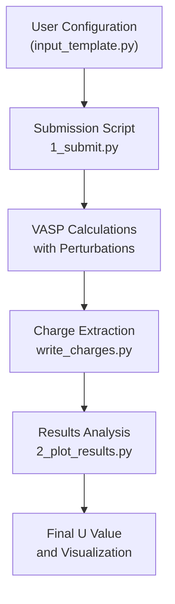
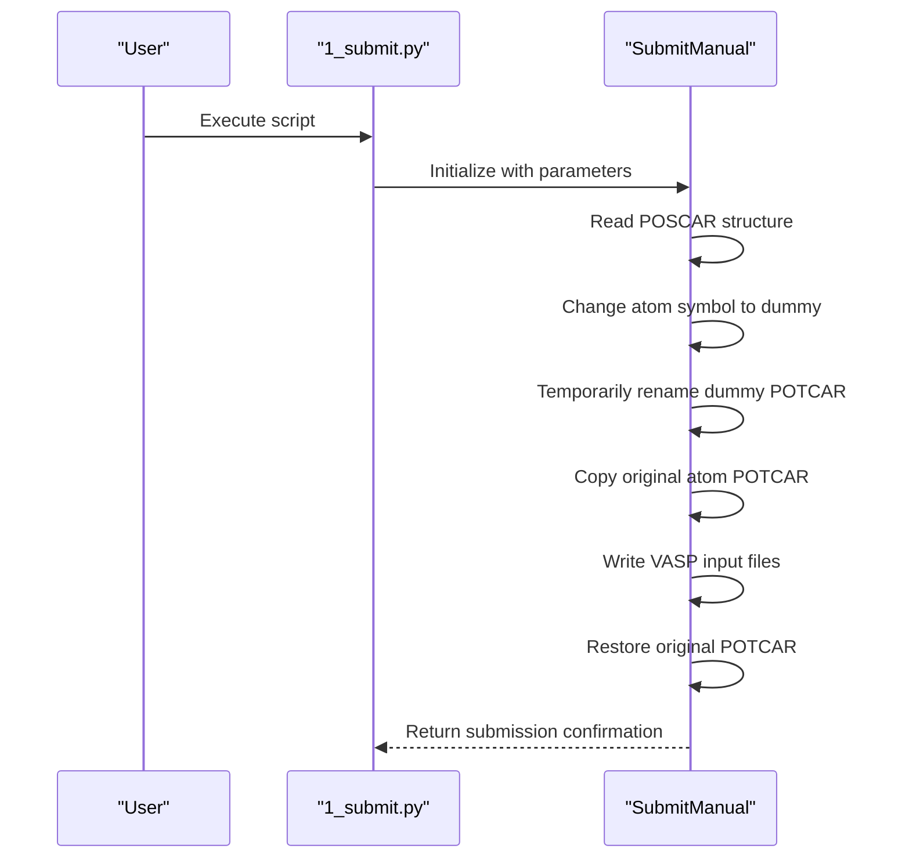
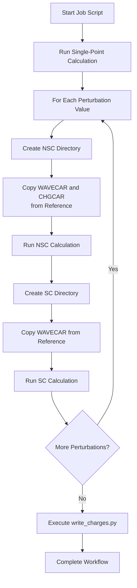
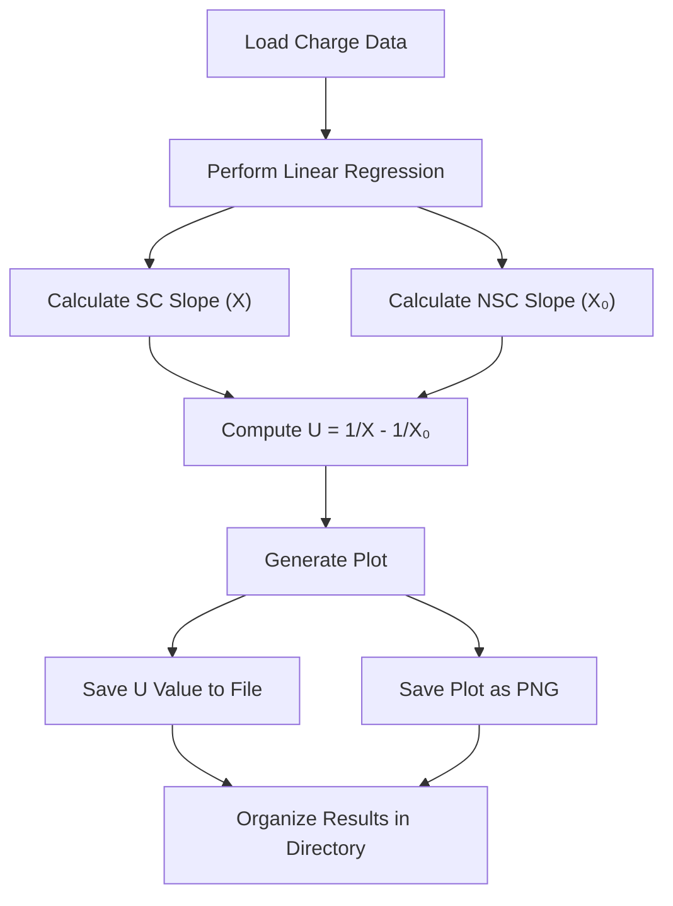

# Linear Response U Module

<cite>
**Referenced Files in This Document**   
- [input_template.py](file://1_lin_response/input_template.py)
- [1_submit.py](file://1_lin_response/1_submit.py)
- [2_plot_results.py](file://1_lin_response/2_plot_results.py)
- [SubmitManual.py](file://common/SubmitManual.py)
- [write_charges.py](file://common/write_charges.py)
- [utilities.py](file://common/utilities.py)
- [README.md](file://README.md)
</cite>

## Table of Contents
1. [Introduction](#introduction)
2. [Core Configuration Parameters](#core-configuration-parameters)
3. [Workflow Execution Flow](#workflow-execution-flow)
4. [Dummy Atom Implementation](#dummy-atom-implementation)
5. [Perturbation Application Process](#perturbation-application-process)
6. [Charge Response Analysis](#charge-response-analysis)
7. [U Value Derivation](#u-value-derivation)
8. [Common Issues and Troubleshooting](#common-issues-and-troubleshooting)
9. [Conclusion](#conclusion)

## Introduction

The Linear Response U module implements a systematic approach for calculating the Hubbard U parameter using density functional theory (DFT+U) methodology. This module follows the linear response formalism by applying controlled perturbations to a designated "dummy atom" and analyzing the resulting charge response to derive the U parameter. The implementation leverages VASP calculations through an automated workflow that manages the entire process from perturbation application to final U value calculation.

The core principle involves treating a specific atom independently from others of the same species by temporarily changing its chemical identity to a dummy atom while maintaining the original atom's pseudopotential. This allows for the application of perturbations to study the electronic response characteristics of the material. The workflow consists of three main components: configuration setup, perturbation execution, and response analysis, each handled by dedicated scripts that work in concert to produce the final U parameter.

**Section sources**
- [README.md](file://README.md#L113-L133)
- [input_template.py](file://1_lin_response/input_template.py#L1-L55)

## Core Configuration Parameters

The Linear Response U calculation is controlled through a comprehensive set of configuration parameters defined in the input template. These parameters govern the calculation's behavior, from structural details to computational settings.

### Essential Configuration Options

The primary configuration parameters include:

- **poscar_file**: Specifies the name of the POSCAR file containing the input geometry, located in the `automag/geometries` folder
- **dummy_atom**: Defines the dummy atomic species used for the perturbed atom (e.g., 'Zn')
- **dummy_position**: Indicates the position of the dummy atom in the POSCAR file (0-based indexing)
- **calculator**: Specifies the DFT calculator to use ('vasp', 'qe', or 'fplo')
- **perturbations**: Lists the perturbation values in eV to apply to the dummy atom

### VASP Parameters Configuration

The VASP-specific parameters are defined within the `params` dictionary:

```python
params = {
    'xc': 'PBE',
    'setups': 'recommended',
    'prec': 'Accurate',
    'ncore': 2,
    'encut': 650,
    'ediff': 1e-6,
    'ismear': 0,
    'sigma': 0.2,
    'kpts': 50,
    'lmaxmix': 4,
    'nelm': 200,
}
```

These parameters control the accuracy and convergence of the DFT calculations, with `encut` setting the plane-wave energy cutoff, `kpts` determining the k-point mesh density, and `ediff` specifying the electronic convergence criterion.

### Optional Configuration Parameters

Additional optional parameters provide further control:

- **magnetic_atoms**: Specifies which atomic types should be considered magnetic (defaults to transition metals)
- **configuration**: Defines the magnetic configuration for U calculation (defaults to ferromagnetic high-spin)
- **use_fireworks**: Determines whether to use FireWorks database for managing calculations

The input template also includes job submission parameters for cluster execution, such as SLURM directives in the `jobheader` variable and the VASP execution command in `calculator_command`.

**Section sources**
- [input_template.py](file://1_lin_response/input_template.py#L1-L55)
- [README.md](file://README.md#L135-L152)

## Workflow Execution Flow

The Linear Response U calculation follows a well-defined workflow executed through a series of interconnected scripts that handle different stages of the process.

### Script Invocation Relationships

The workflow is orchestrated through three primary scripts that work in sequence:

1. **Configuration and Submission**: `1_submit.py` reads the input parameters and sets up the calculation
2. **Execution**: The submitted jobs run VASP calculations with applied perturbations
3. **Analysis**: `2_plot_results.py` processes the results and calculates the final U value



**Diagram sources**
- [1_submit.py](file://1_lin_response/1_submit.py#L1-L77)
- [2_plot_results.py](file://1_lin_response/2_plot_results.py#L1-L86)

### Submission Process

The `1_submit.py` script serves as the entry point for the workflow. It first attempts to import configuration parameters from a specified input file, defaulting to `input.py` if no file is provided. The script then determines whether to use FireWorks for job management based on the `use_fireworks` parameter, importing the appropriate submission class (`SubmitFirework` or `SubmitManual`).

The submission process creates the necessary directory structure in the `CalcFold` directory and prepares input files for VASP calculations. It handles both the initial single-point calculation to obtain converged charge density and the subsequent perturbation calculations.

**Section sources**
- [1_submit.py](file://1_lin_response/1_submit.py#L1-L77)
- [README.md](file://README.md#L149-L152)

## Dummy Atom Implementation

The dummy atom technique is a crucial aspect of the linear response methodology, enabling the independent treatment of a specific atom within the system.

### POTCAR Configuration

The implementation relies on a clever trick where the chemical identity of the target atom is changed to a dummy species, but the pseudopotential (POTCAR) of the original atom is used. This is achieved by:

1. Renaming the dummy atom's POTCAR file to a backup name
2. Copying the original atom's POTCAR file to the dummy atom's directory

For example, when calculating U for Fe using Zn as a dummy atom:
```bash
cd $VASP_PP_PATH/potpaw_PBE/Zn
mv POTCAR _POTCAR
cp ../Fe/POTCAR .
```

This configuration ensures that while the system is treated as having a Zn atom (for independent perturbation), the electronic structure calculations use Fe's pseudopotential, maintaining the physical integrity of the system.

### Implementation in Code

The `SubmitManual` class handles the POTCAR manipulation during the `write_input` method execution:



**Diagram sources**
- [SubmitManual.py](file://common/SubmitManual.py#L342-L375)
- [README.md](file://README.md#L113-L133)

**Section sources**
- [SubmitManual.py](file://common/SubmitManual.py#L187-L507)
- [README.md](file://README.md#L113-L133)

## Perturbation Application Process

The perturbation application process is central to the linear response methodology, involving both self-consistent (SC) and non-self-consistent (NSC) calculations.

### Perturbation Workflow

The process begins with a single-point calculation to obtain a converged charge density and wavefunctions. This serves as the reference state for all subsequent perturbation calculations. For each perturbation value specified in the input, two calculations are performed:

1. **Non-self-consistent (NSC) calculation**: Uses the reference charge density and applies the perturbation to calculate the response
2. **Self-consistent (SC) calculation**: Fully converges the electronic structure with the applied perturbation

The perturbation is applied through the DFT+U formalism by setting the `ldauu` and `ldauj` parameters for the dummy atom in the INCAR file. The `ldaul` parameter is set to 2 for transition metals (indicating d-orbitals) or 3 for lanthanides/actinides (indicating f-orbitals).

### Job Script Generation

The `write_jobscript` method in `SubmitManual` generates a comprehensive job script that orchestrates the entire perturbation workflow:



The job script ensures proper file management by copying the converged WAVECAR and CHGCAR files from the reference calculation to the appropriate directories for each perturbation step.

**Section sources**
- [SubmitManual.py](file://common/SubmitManual.py#L646-L853)
- [1_submit.py](file://1_lin_response/1_submit.py#L1-L77)

## Charge Response Analysis

The charge response analysis extracts and processes the electronic response data from the VASP output files to prepare for U value calculation.

### Charge Extraction Process

The `write_charges.py` script performs the charge extraction by:

1. Reading the OUTCAR files from both NSC and SC calculations for each perturbation
2. Extracting the charge on the dummy atom's relevant orbitals (d-orbitals for transition metals, f-orbitals for lanthanides/actinides)
3. Validating the results by checking magnetic moment stability and convergence

The script ensures data quality by implementing validation checks:
- Magnetic moments must remain within 50-200% of their reference values
- Calculations must be properly converged
- Only valid results are written to the output file

### Data Organization

The extracted charge data is organized into a structured format in the `CalcFold` directory:

```
CalcFold/
└── [chemical_formula]/
    └── vasp/
        └── [chemical_formula]_charges_vasp.txt
```

The output file contains three columns:
1. Perturbation value (α in eV)
2. Number of electrons from NSC calculation
3. Number of electrons from SC calculation

This structured format enables straightforward analysis and visualization in the final plotting stage.

**Section sources**
- [write_charges.py](file://common/write_charges.py#L1-L125)
- [SubmitManual.py](file://common/SubmitManual.py#L646-L853)

## U Value Derivation

The final U value is derived through linear regression analysis of the charge response data, following the established linear response formalism.

### Slope Interpolation Method

The `2_plot_results.py` script implements the U value calculation using the following mathematical relationship:

U = 1/X - 1/X₀

Where:
- X is the slope of the self-consistent (SC) response line
- X₀ is the slope of the non-self-consistent (NSC) response line

The script performs linear regression on both datasets using `scipy.stats.linregress` to obtain the slopes, then calculates the U value from the difference in inverse slopes.

### Visualization and Output

The analysis produces both numerical and visual outputs:



The resulting plot displays both the NSC and SC response data points with their respective fitted lines, providing a visual representation of the linear response behavior. The final U value is saved in a text file, and all related files are organized into a dedicated directory named after the calculation.

**Diagram sources**
- [2_plot_results.py](file://1_lin_response/2_plot_results.py#L48-L86)

**Section sources**
- [2_plot_results.py](file://1_lin_response/2_plot_results.py#L1-L86)
- [README.md](file://README.md#L150-L152)

## Common Issues and Troubleshooting

Several common issues can arise during Linear Response U calculations, primarily related to configuration and convergence.

### POTCAR Setup Issues

The most frequent issue involves incorrect POTCAR configuration for the dummy atom. Users must ensure that:
- The original atom's POTCAR is properly copied to the dummy atom's directory
- The POTCAR files are from the same functional (PBE or LDA) as specified in the input
- The POTCAR version (e.g., _sv, _pv) matches the requirements of the calculation

Failure to properly configure POTCARs will result in calculations using the dummy atom's electronic structure rather than the intended atom, leading to physically meaningless results.

### Convergence Problems

Convergence issues can affect both the reference calculation and perturbation steps:
- **Insufficient convergence criteria**: The `ediff` parameter should be tight enough (typically ≤ 1e-6) to ensure accurate charge density
- **Inadequate k-point sampling**: The `kpts` parameter must provide sufficient Brillouin zone sampling
- **Energy cutoff issues**: The `encut` value should be converged with respect to total energy

The workflow includes convergence checks in the `write_charges.py` script, which validates that magnetic moments do not change drastically between reference and perturbed calculations, helping to identify convergence problems.

### Configuration Errors

Common configuration mistakes include:
- Incorrect `dummy_position` indexing (must be 0-based)
- Multiple dummy atoms in the structure (only one is supported)
- Inconsistent magnetic configurations between reference and perturbation calculations

Users should verify their input parameters carefully and ensure that the POSCAR file structure matches the specified configuration.

**Section sources**
- [README.md](file://README.md#L113-L133)
- [write_charges.py](file://common/write_charges.py#L1-L125)
- [SubmitManual.py](file://common/SubmitManual.py#L526-L633)

## Conclusion

The Linear Response U module provides a robust framework for calculating Hubbard U parameters through systematic perturbation analysis. By leveraging the dummy atom technique and carefully orchestrated workflow, it enables accurate determination of electronic correlation effects in materials. The implementation balances automation with user control, allowing researchers to configure calculations through intuitive parameters while handling the complex technical details of DFT+U methodology.

The workflow's modular design, with distinct phases for submission, execution, and analysis, ensures reproducibility and facilitates troubleshooting. The integration of validation checks throughout the process helps maintain result quality and reliability. For users, following the documented procedures for POTCAR configuration and parameter selection is essential for obtaining physically meaningful U values that accurately represent the electronic structure characteristics of their materials.