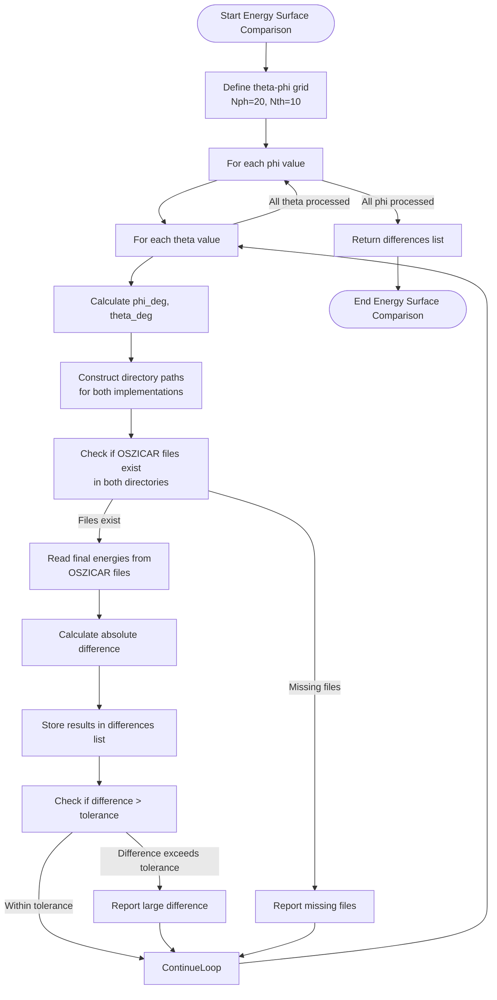
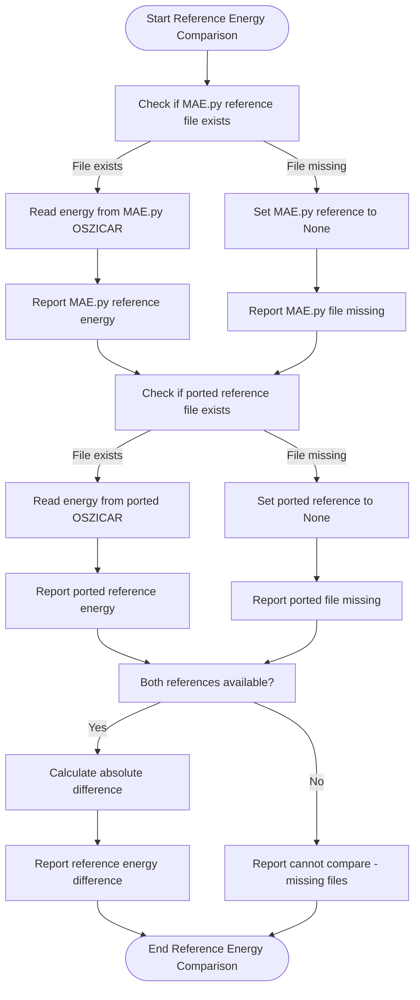
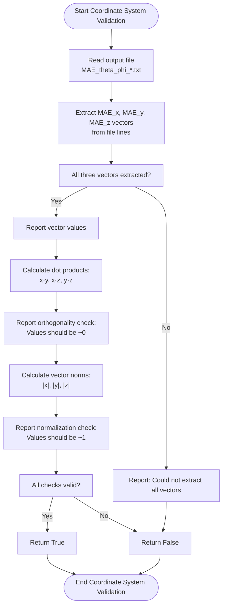
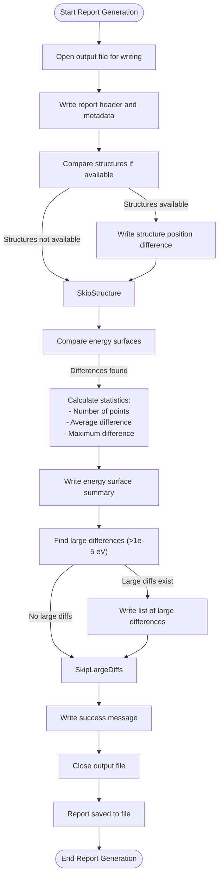

# Consistency Validation

<cite>
**Referenced Files in This Document**   
- [validate_consistency.py](file://4_mae/validate_consistency.py)
- [MAE.py](file://4_mae/MAE.py)
- [2_plot_results.py](file://4_mae/2_plot_results.py)
- [SubmitManual.py](file://common/SubmitManual.py)
- [IMPLEMENTATION_SUMMARY.md](file://4_mae/IMPLEMENTATION_SUMMARY.md)
</cite>

## Table of Contents
1. [Introduction](#introduction)
2. [Energy Surface Comparison](#energy-surface-comparison)
3. [Reference Energy Validation](#reference-energy-validation)
4. [Structure and Magnetic Moment Comparison](#structure-and-magnetic-moment-comparison)
5. [Coordinate System Validation](#coordinate-system-validation)
6. [Comparison Report Generation](#comparison-report-generation)
7. [Common Issues and Troubleshooting](#common-issues-and-troubleshooting)
8. [Conclusion](#conclusion)

## Introduction

The consistency validation framework ensures reliable comparison between the original MAE.py script and the modular implementation of magnetic anisotropy energy (MAE) calculations. The validation process systematically verifies multiple aspects of the calculations, including energy surfaces, reference energies, atomic structures, magnetic moments, and coordinate system consistency. The primary tool for this validation is the `validate_consistency.py` script, which provides comprehensive comparison capabilities and generates detailed reports highlighting any discrepancies above specified tolerances. This documentation explains the implementation of these validation procedures and provides guidance for interpreting results and troubleshooting inconsistencies.

**Section sources**
- [validate_consistency.py](file://4_mae/validate_consistency.py#L1-L357)
- [IMPLEMENTATION_SUMMARY.md](file://4_mae/IMPLEMENTATION_SUMMARY.md#L1-L222)

## Energy Surface Comparison

The energy surface comparison validates the consistency of calculated energies across different spin orientations between the original MAE.py implementation and the modular version. The `compare_energy_surfaces` function in `validate_consistency.py` performs this validation by comparing energies at each point on the theta-phi grid used for MAE calculations.

The validation uses a standard grid with 20 phi points (Nph=20) and 10 theta points (Nth=10), covering the full range of spherical coordinates. For each (phi, theta) combination, the function constructs the expected directory paths for both implementations:
- MAE.py format: `{mae_py_dir}/PhTh_{phi_deg:.2f}_{theta_deg:.2f}`
- Modular format: `{ported_dir}/PhTh_{phi_deg:.2f}_{theta_deg:.2f}/singlepoint`

The function reads the final energy values from the OSZICAR files in both directories and calculates the absolute difference. Results are collected in a list of dictionaries containing the phi and theta angles, energy values from both implementations, and the difference. Any differences exceeding the specified tolerance (default: 1e-6 eV) are reported immediately during execution. The function also handles missing files gracefully, reporting which implementation is missing the required OSZICAR file for each grid point.



**Diagram sources**
- [validate_consistency.py](file://4_mae/validate_consistency.py#L31-L85)

**Section sources**
- [validate_consistency.py](file://4_mae/validate_consistency.py#L31-L85)

## Reference Energy Validation

The reference energy comparison ensures consistency in the baseline energy used for MAE calculations between the two implementations. The `compare_reference_energies` function validates this by comparing the reference energies from the "z" direction calculations in both implementations.

The function expects the reference energy files to be located at:
- MAE.py: `{mae_py_ref_file}/z/OSZICAR`
- Modular: `{ported_ref_file}/z/singlepoint/OSZICAR`

It reads the final energy from each OSZICAR file and reports both values with six decimal places of precision. If both files exist, it calculates and reports the absolute difference between the reference energies. The function handles cases where one or both reference files are missing, providing appropriate error messages. This validation is crucial because any discrepancy in reference energies directly affects the calculated MAE values, as MAE is defined as the energy difference between different spin orientations.



**Diagram sources**
- [validate_consistency.py](file://4_mae/validate_consistency.py#L87-L118)

**Section sources**
- [validate_consistency.py](file://4_mae/validate_consistency.py#L87-L118)

## Structure and Magnetic Moment Comparison

The validation framework includes functions to compare atomic structures and magnetic moment assignments between the two implementations, ensuring that the fundamental inputs to the calculations are consistent.

### Structure Comparison

The `compare_structures` function validates that both implementations use identical atomic structures. It reads the POSCAR files from both implementations using ASE's read function and compares several key properties:
- Number of atoms in the structure
- Unit cell volume
- Atomic positions (maximum difference in Å)
- Chemical formulas

The function reports the number of atoms and volume for both structures, then calculates the maximum difference between corresponding atomic positions. It also compares the chemical formulas to ensure elemental composition is identical. This validation is essential because any structural differences would invalidate the energy comparisons, as the systems being compared would be fundamentally different.

### Magnetic Moment Comparison

The `compare_magnetic_moments` function ensures consistency in magnetic moment assignments. It handles both file-based and direct array inputs, reading magnetic moments from files if string paths are provided. A key feature of this function is its ability to handle the different formats used by the implementations:
- The modular implementation may use a non-collinear format with three values per atom (x, y, z components)
- The original MAE.py uses a single value per atom (magnitude)

When the ported implementation's magnetic moments array is three times longer than the MAE.py array, the function extracts only the z-components (third element of every triplet) for comparison. It then calculates the maximum absolute difference between corresponding magnetic moments. This conversion ensures valid comparison between the different data formats used by the implementations.

```mermaid
flowchart TD
subgraph StructureComparison
StartStruct([Start Structure Comparison]) --> ReadMAEpyStruct["Read MAE.py POSCAR"]
ReadMAEpyStruct --> ReadPortedStruct["Read ported POSCAR"]
ReadPortedStruct --> CompareAtomCount["Compare atom counts"]
CompareAtomCount --> |Different| ReportAtomDiff["Report different atom counts"]
CompareAtomCount --> |Same| CalculatePosDiff["Calculate max position difference"]
CalculatePosDiff --> CompareFormulas["Compare chemical formulas"]
CompareFormulas --> ReportResults["Report structure comparison results"]
ReportAtomDiff --> ReportResults
ReportResults --> EndStruct([End Structure Comparison])
end
subgraph MagneticMomentComparison
StartMag([Start Magnetic Moment Comparison]) --> CheckInputTypeMAEpy["Check MAE.py input type"]
CheckInputTypeMAEpy --> |String path| ReadMAEpyFile["Read from file"]
CheckInputTypeMAEpy --> |Array| UseMAEpyArray["Use as array"]
ReadMAEpyFile --> UseMAEpyArray
UseMAEpyArray --> CheckInputTypePorted["Check ported input type"]
CheckInputTypePorted --> |String path| ReadPortedFile["Read from file"]
CheckInputTypePorted --> |Array| UsePortedArray["Use as array"]
ReadPortedFile --> UsePortedArray
UsePortedArray --> CheckFormat["Check if non-collinear format\n(length = 3 * MAE.py length)"]
CheckFormat --> |Yes| ExtractZComponents["Extract z-components\n(index 2::3)"]
CheckFormat --> |No| UseAsIs["Use as is"]
ExtractZComponents --> UseAsIs
UseAsIs --> CompareLengths["Compare array lengths"]
CompareLengths --> |Different| ReportLengthDiff["Report different lengths"]
CompareLengths --> |Same| CalculateMagDiff["Calculate max magnetic moment difference"]
CalculateMagDiff --> ReportMagResults["Report magnetic moment comparison"]
ReportLengthDiff --> ReportMagResults
ReportMagResults --> EndMag([End Magnetic Moment Comparison])
end
```



**Diagram sources**
- [validate_consistency.py](file://4_mae/validate_consistency.py#L120-L153)
- [validate_consistency.py](file://4_mae/validate_consistency.py#L155-L190)

**Section sources**
- [validate_consistency.py](file://4_mae/validate_consistency.py#L120-L190)

## Coordinate System Validation

The coordinate system validation ensures the orthogonality and normalization of the MAE coordinate system vectors (MAE_x, MAE_y, MAE_z), which are critical for consistent interpretation of magnetic anisotropy results. The `validate_coordinate_system` function reads these vectors from the output file (typically named MAE_theta_phi_*.txt) and performs rigorous mathematical checks.

The function first extracts the three vectors from the output file by searching for lines containing "MAE_x:", "MAE_y:", and "MAE_z:" and parsing the vector components from within square brackets. Once all three vectors are extracted, it performs two types of validation:

### Orthogonality Check
The function calculates the dot products between each pair of vectors:
- x·y (should be approximately 0)
- x·z (should be approximately 0)
- y·z (should be approximately 0)

In a properly orthogonal coordinate system, these dot products should be very close to zero. The function reports the actual values, allowing users to assess the degree of orthogonality.

### Normalization Check
The function calculates the magnitude (norm) of each vector:
- |x| (should be approximately 1)
- |y| (should be approximately 1)
- |z| (should be approximately 1)

Each vector should be a unit vector with magnitude close to 1.0. The function reports the actual norms, enabling detection of any normalization issues.

The implementation in both MAE.py and 2_plot_results.py follows the same logic for generating these vectors:
1. MAE_x is set to the direction of minimum energy (min_vec)
2. MAE_z is calculated as the normalized cross product of min_vec and max_vec (direction of maximum energy)
3. If min_vec and max_vec are parallel (cross product magnitude < 0.0001), a deterministic fallback is used with a fixed random seed (42) to ensure reproducible results
4. MAE_y is calculated as the normalized cross product of MAE_z and MAE_x

This deterministic approach, particularly the use of a fixed random seed, ensures that the coordinate system generation is reproducible across different runs, addressing a key source of inconsistency in the original implementation.



**Diagram sources**
- [validate_consistency.py](file://4_mae/validate_consistency.py#L192-L253)
- [MAE.py](file://4_mae/MAE.py#L791-L802)
- [2_plot_results.py](file://4_mae/2_plot_results.py#L265-L277)

**Section sources**
- [validate_consistency.py](file://4_mae/validate_consistency.py#L192-L253)
- [MAE.py](file://4_mae/MAE.py#L791-L802)
- [2_plot_results.py](file://4_mae/2_plot_results.py#L265-L277)

## Comparison Report Generation

The `generate_comparison_report` function creates a comprehensive text report summarizing the validation results, providing a permanent record of the consistency check. This report serves as a valuable tool for documentation, debugging, and quality assurance.

The report generation process follows these steps:
1. **Header Information**: The report starts with a title and basic information about the compared directories.
2. **Structure Comparison**: If POSCAR files are available in both directories, the function calls `compare_structures` and includes the position difference in the report.
3. **Energy Surface Analysis**: The function calls `compare_energy_surfaces` to obtain the full set of energy differences and includes detailed statistics:
   - Number of compared points
   - Average energy difference
   - Maximum energy difference and its location (phi, theta)
   - List of all large differences (>1e-5 eV)

The report uses a clear, structured format with section headers and consistent formatting for numerical values (six decimal places). It highlights significant discrepancies, making it easy to identify problematic areas that require further investigation. The default output file is named "mae_comparison_report.txt", but a custom filename can be specified.

The main function in `validate_consistency.py` automatically generates this report after performing the individual validations, ensuring that a complete record is always created. This automation reduces the risk of human error and ensures consistent reporting across different validation runs.



**Diagram sources**
- [validate_consistency.py](file://4_mae/validate_consistency.py#L255-L298)

**Section sources**
- [validate_consistency.py](file://4_mae/validate_consistency.py#L255-L298)

## Common Issues and Troubleshooting

The validation framework addresses several common issues that can arise when comparing results between the original MAE.py script and the modular implementation. Understanding these issues and their solutions is essential for effective troubleshooting.

### File Path Mismatches

One of the most common issues is file path mismatches between the two implementations. The validation functions expect specific directory structures:
- MAE.py uses flat directory names like `PhTh_0.00_0.00`
- The modular implementation uses nested directories like `PhTh_0.00_0.00/singlepoint`

The `compare_energy_surfaces` function accounts for this difference in its path construction, but users must ensure they provide the correct base directories to the validation script. Providing the wrong directory path will result in missing file errors for all grid points.

### Numerical Precision Differences

Small numerical differences in energy calculations can occur due to:
- Different floating-point arithmetic implementations
- Variations in convergence criteria
- Slight differences in algorithm implementation

The validation uses a default tolerance of 1e-6 eV, which accounts for typical numerical noise in DFT calculations. Differences below this threshold are generally not significant. However, larger differences may indicate substantive implementation issues that require investigation.

### Implementation-Specific Issues

Based on the IMPLEMENTATION_SUMMARY.md, several specific issues have been addressed:
- **Deterministic coordinate system**: The original implementation used non-deterministic random vector generation, causing inconsistent coordinate systems between runs. This was fixed by using a fixed random seed (42).
- **Magnetic moment handling**: MAE.py uses element-based magnetic moments, while the modular version initially used calculation results. The compatibility option `use_element_based_magmoms` resolves this discrepancy.
- **Structure standardization**: Different structure processing (primitive vs original) was addressed by adding the `use_primitive_structure` option.
- **Reference energy synchronization**: Different reference energy calculation methods were harmonized by adding k-point optimized reference energy lookup with the `use_kpoint_reference` option.

When troubleshooting validation failures, users should:
1. Check that the correct directory paths are provided
2. Verify that both implementations completed successfully and generated all required output files
3. Examine the detailed output from the validation script to identify specific points of failure
4. Consider whether observed differences are within acceptable numerical tolerance
5. Review the comprehensive comparison report for patterns in the discrepancies

### Usage Guidelines

To perform validation, users should run:
```bash
python validate_consistency.py <mae_py_results_dir> <ported_results_dir> [tolerance]
```

For example:
```bash
python validate_consistency.py ./mae_py_output ./CalcFold/Fe12O18/vasp/afm1/mae_U5.2_J0.0_K20_EN830 1e-6
```

The script provides clear usage instructions when run without arguments, helping users avoid common invocation errors.

**Section sources**
- [validate_consistency.py](file://4_mae/validate_consistency.py#L300-L357)
- [IMPLEMENTATION_SUMMARY.md](file://4_mae/IMPLEMENTATION_SUMMARY.md#L133-L152)

## Conclusion

The consistency validation framework provides a comprehensive solution for verifying the equivalence of results between the original MAE.py script and the modular implementation. Through systematic comparison of energy surfaces, reference energies, atomic structures, magnetic moments, and coordinate systems, the framework ensures that both implementations produce consistent and reliable results.

The `validate_consistency.py` script serves as the central tool for this validation, offering both immediate feedback during execution and comprehensive reporting for detailed analysis. By addressing key issues such as deterministic coordinate system generation, consistent magnetic moment handling, and reference energy synchronization, the framework enables users to achieve identical results when desired while maintaining the flexibility of the modular implementation.

The validation process not only ensures result consistency but also provides valuable diagnostic information for troubleshooting and debugging. The detailed comparison reports highlight discrepancies above specified tolerances, guiding users to potential issues in their calculations. This robust validation framework supports both backward compatibility with existing workflows and forward extensibility for future development of the automag-1 project.

**Section sources**
- [IMPLEMENTATION_SUMMARY.md](file://4_mae/IMPLEMENTATION_SUMMARY.md#L218-L222)