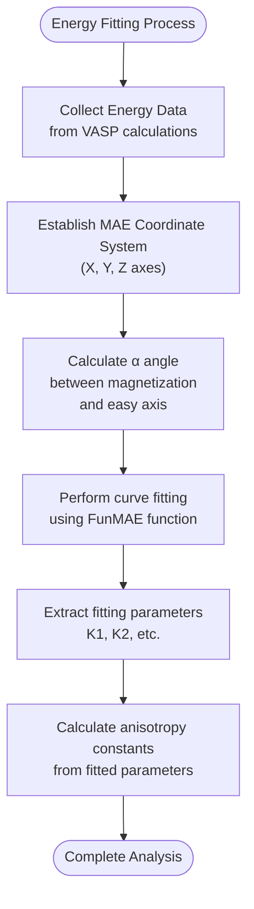
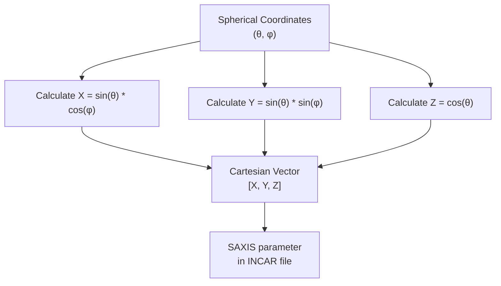
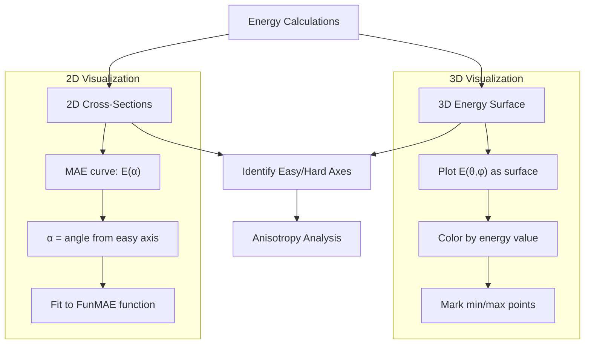
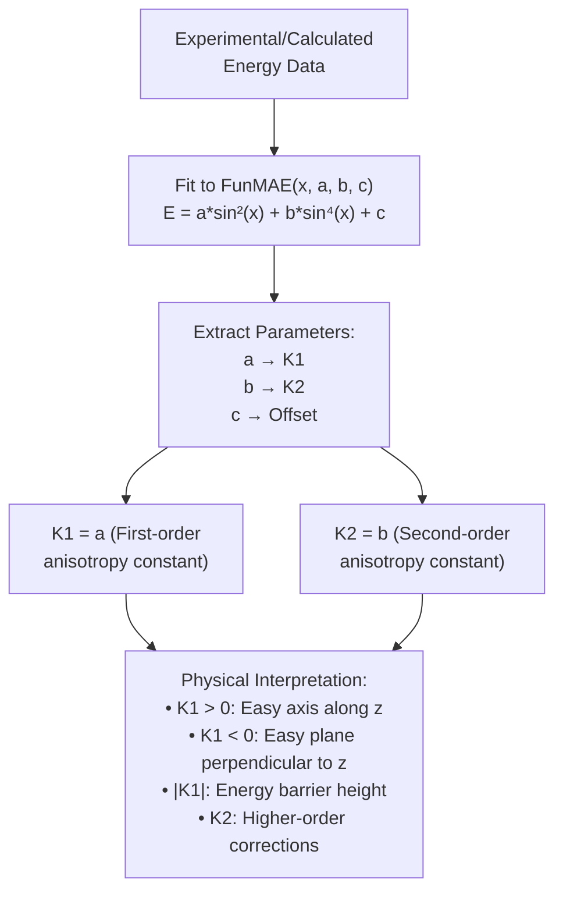
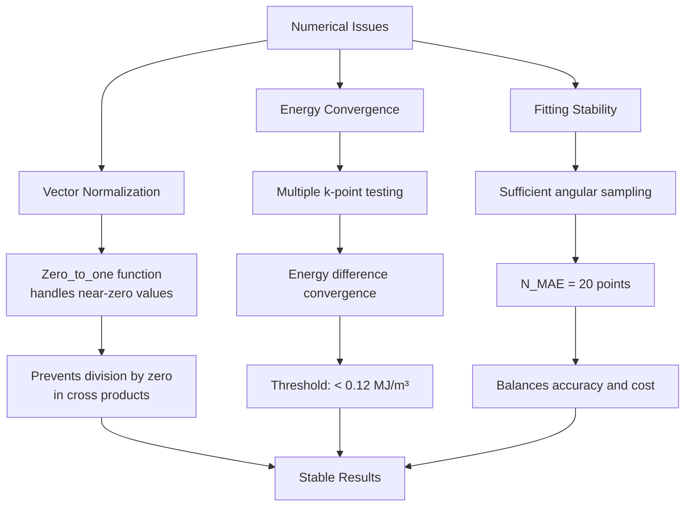

# Energy Landscape Analysis

<cite>
**Referenced Files in This Document**   
- [MAE.py](file://4_mae/MAE.py)
- [2_plot_results.py](file://4_mae/2_plot_results.py)
- [4_plot_results.py](file://4_mae/4_plot_results.py)
- [IMPLEMENTATION_SUMMARY.md](file://4_mae/IMPLEMENTATION_SUMMARY.md)
</cite>

## Table of Contents
1. [Introduction](#introduction)
2. [Energy Fitting Procedure](#energy-fitting-procedure)
3. [Coordinate Transformation](#coordinate-transformation)
4. [Visualization Workflow](#visualization-workflow)
5. [Anisotropy Constants Calculation](#anisotropy-constants-calculation)
6. [Numerical Stability and Convergence](#numerical-stability-and-convergence)
7. [Symmetry Considerations](#symmetry-considerations)
8. [Conclusion](#conclusion)

## Introduction

The energy landscape analysis in MAE (Magnetocrystalline Anisotropy Energy) calculations provides critical insights into the magnetic properties of materials by mapping the energy dependence on magnetization direction. This document details the implementation of energy fitting procedures using the FunMAE function, which models the magnetocrystalline anisotropy energy as a function of magnetization direction. The analysis workflow involves systematic sampling of magnetization directions across a spherical grid, energy calculations using VASP (Vienna Ab-initio Simulation Package), and subsequent fitting to extract anisotropy constants. The implementation in the MAE.py script follows a comprehensive approach that ensures accurate determination of easy and hard magnetization axes, which are essential for understanding the magnetic behavior of materials.

**Section sources**
- [MAE.py](file://4_mae/MAE.py#L0-L1086)
- [IMPLEMENTATION_SUMMARY.md](file://4_mae/IMPLEMENTATION_SUMMARY.md#L0-L223)

## Energy Fitting Procedure

The energy fitting procedure in MAE calculations is implemented through the FunMAE function, which serves as the mathematical model for fitting the magnetocrystalline anisotropy energy. This function takes the form of a trigonometric series that captures the angular dependence of the energy landscape. The implementation in MAE.py defines FunMAE with three parameters that correspond to different orders of anisotropy contributions.



**Diagram sources**
- [MAE.py](file://4_mae/MAE.py#L228-L229)
- [4_plot_results.py](file://4_mae/4_plot_results.py#L96-L97)

The FunMAE function is defined as `a*((np.sin(x))**2)+b*((np.sin(x))**4)+c`, where `x` represents the angle between the magnetization direction and the easy axis. The parameters `a`, `b`, and `c` correspond to the first-order, second-order, and constant terms of the anisotropy energy expansion, respectively. This functional form is specifically chosen to capture the symmetry properties of the magnetocrystalline anisotropy energy, which typically exhibits periodic behavior with respect to the magnetization direction. The curve fitting process uses the `curve_fit` function from scipy.optimize to determine the optimal values of these parameters by minimizing the difference between the calculated energies and the model predictions.

**Section sources**
- [MAE.py](file://4_mae/MAE.py#L228-L229)
- [4_plot_results.py](file://4_mae/4_plot_results.py#L96-L97)

## Coordinate Transformation

The coordinate transformation from spherical angles to Cartesian vectors is a fundamental step in the MAE calculation workflow. This transformation enables the specification of magnetization directions in the VASP input files, which require Cartesian components for the SAXIS parameter. The implementation in MAE.py includes the RotatingAngles function that performs this conversion, taking spherical coordinates (theta, phi) as input and returning the corresponding Cartesian vector components.



**Diagram sources**
- [MAE.py](file://4_mae/MAE.py#L218-L226)

The transformation follows the standard mathematical convention where theta (θ) represents the polar angle measured from the z-axis, and phi (φ) represents the azimuthal angle in the xy-plane. The resulting Cartesian vector [X, Y, Z] is then used to set the SAXIS parameter in the VASP INCAR file, which defines the quantization axis for non-collinear calculations. This coordinate system is established after identifying the easy and hard magnetization axes from the initial energy calculations. The MAE coordinate system is constructed with MAE_x aligned with the easy axis (minimum energy direction), MAE_z perpendicular to both the easy and hard axes, and MAE_y completing the right-handed coordinate system through the cross product of MAE_z and MAE_x.

**Section sources**
- [MAE.py](file://4_mae/MAE.py#L218-L226)

## Visualization Workflow

The visualization workflow for energy landscape analysis generates both 3D energy surfaces and 2D cross-sections to identify easy and hard magnetization axes. The implementation creates comprehensive visual representations that facilitate the interpretation of anisotropy properties. The 3D energy surface is constructed by sampling energy values across a grid of spherical angles (theta and phi), while 2D cross-sections provide detailed views along specific planes of interest.



**Diagram sources**
- [MAE.py](file://4_mae/MAE.py#L500-L550)
- [2_plot_results.py](file://4_mae/2_plot_results.py#L150-L200)

The visualization process begins with the creation of a spherical grid defined by Nth (number of theta points) and Nph (number of phi points) parameters. For each direction on this grid, VASP calculations are performed to obtain the total energy, which is then used to construct the 3D energy surface. The 2D cross-sections, particularly the MAE curve, are generated by calculating energies along a circular path in the plane defined by the easy and hard axes. This curve is parameterized by the angle α between the magnetization direction and the easy axis, ranging from 0 to 2π. The matplotlib library is used for all visualizations, with appropriate labeling and formatting to ensure clarity. The resulting plots are saved in the outputs directory for further analysis and reporting.

**Section sources**
- [MAE.py](file://4_mae/MAE.py#L500-L550)
- [2_plot_results.py](file://4_mae/2_plot_results.py#L150-L200)

## Anisotropy Constants Calculation

The calculation of anisotropy constants K1 and K2 from fitted parameters is a critical step in quantifying the magnetic anisotropy of materials. These constants provide physical insight into the energy barriers for magnetization rotation and are essential for predicting magnetic behavior. The implementation extracts these constants from the parameters obtained by fitting the energy data to the FunMAE function.



**Diagram sources**
- [MAE.py](file://4_mae/MAE.py#L1000-L1050)
- [4_plot_results.py](file://4_mae/4_plot_results.py#L200-L250)

The anisotropy constants are directly related to the fitted parameters of the FunMAE function. The parameter `a` corresponds to the first-order anisotropy constant K1, which dominates the energy landscape and determines the primary easy and hard axes. The parameter `b` corresponds to the second-order anisotropy constant K2, which provides higher-order corrections to the energy landscape. The physical interpretation of these constants is crucial: a positive K1 indicates uniaxial anisotropy with the easy axis along the z-direction, while a negative K1 indicates an easy plane perpendicular to the z-direction. The magnitude of K1 represents the energy barrier for magnetization rotation from the easy to the hard axis. The implementation also converts these constants from eV to SI units (MJ/m³) for consistency with standard materials science conventions.

**Section sources**
- [MAE.py](file://4_mae/MAE.py#L1000-L1050)
- [4_plot_results.py](file://4_mae/4_plot_results.py#L200-L250)

## Numerical Stability and Convergence

Numerical stability and convergence are critical considerations in MAE calculations, as they directly impact the reliability of the results. The implementation addresses several potential issues that could affect the accuracy of energy differences and curve fitting. These include numerical precision in vector operations, convergence of energy calculations, and stability of the fitting procedure.



**Diagram sources**
- [MAE.py](file://4_mae/MAE.py#L210-L216)
- [MAE.py](file://4_mae/MAE.py#L300-L350)

The implementation includes specific measures to ensure numerical stability. The Zero_to_one function is used to handle cases where vector magnitudes are close to zero, preventing division by zero errors in normalization operations. For energy convergence, the script tests multiple k-point grids and selects the one where energy differences converge below a threshold of 0.12 MJ/m³ per atom. The angular grid density is carefully chosen to balance computational cost with accuracy, using Nth=10 and Nph=20 points for the initial 3D mapping and N_MAE=20 points for the MAE curve. The curve fitting process is performed on energy differences relative to the minimum energy, which improves numerical stability by reducing the dynamic range of values being fitted.

**Section sources**
- [MAE.py](file://4_mae/MAE.py#L210-L216)
- [MAE.py](file://4_mae/MAE.py#L300-L350)

## Symmetry Considerations

Symmetry considerations play a fundamental role in energy landscape analysis, as they determine the form of the anisotropy energy expansion and influence the interpretation of results. The implementation accounts for crystal symmetry in several ways, from the choice of coordinate system to the functional form of the fitting equation. The MAE coordinate system is constructed to align with the principal symmetry axes of the energy landscape, ensuring that the extracted anisotropy constants have clear physical meaning.

```mermaid
flowchart TD
A[Crystal Symmetry] --> B[Energy Landscape Symmetry]
B --> C[Functional Form Selection]
C --> D[FunMAE: a*sin²(x) + b*sin⁴(x)]
D --> E[Even powers only]
E --> F[Invariance under M → -M]
G[Coordinate System] --> H[MAE_x: Easy axis]
G --> I[MAE_z: Perpendicular to easy/hard plane]
G --> J[MAE_y: Completes right-handed system]
H --> K[Symmetry Alignment]
I --> K
J --> K
K --> L[Accurate Anisotropy Constants]
```

**Diagram sources**
- [MAE.py](file://4_mae/MAE.py#L700-L750)
- [MAE.py](file://4_mae/MAE.py#L800-L850)

The symmetry of the energy landscape is reflected in the even powers of the sine function in the FunMAE equation, which ensures invariance under magnetization reversal (M → -M). This is a fundamental symmetry requirement for magnetocrystalline anisotropy energy. The coordinate system construction algorithm ensures that the MAE_z axis is perpendicular to the plane containing both the easy and hard axes, which respects the underlying symmetry of the system. When the cross product of the easy and hard axes vectors is zero (indicating they are parallel), a deterministic fallback method is used to generate a perpendicular vector, ensuring consistent results across different runs. The implementation also includes validation checks to verify the orthogonality of the constructed coordinate system, maintaining the integrity of the symmetry analysis.

**Section sources**
- [MAE.py](file://4_mae/MAE.py#L700-L750)
- [MAE.py](file://4_mae/MAE.py#L800-L850)

## Conclusion

The energy landscape analysis implemented in the MAE.py script provides a comprehensive framework for calculating and interpreting magnetocrystalline anisotropy energy. The workflow combines systematic sampling of magnetization directions, precise energy calculations, and robust fitting procedures to extract meaningful anisotropy constants. The implementation addresses key challenges such as numerical stability, convergence, and symmetry considerations, ensuring reliable results. The visualization capabilities enable clear identification of easy and hard magnetization axes, while the calculation of K1 and K2 constants provides quantitative measures of magnetic anisotropy. This comprehensive approach facilitates the understanding of magnetic properties in materials, supporting both fundamental research and practical applications in magnetic materials design. The modular structure and detailed documentation make the implementation accessible to researchers while maintaining the technical rigor required for accurate anisotropy analysis.