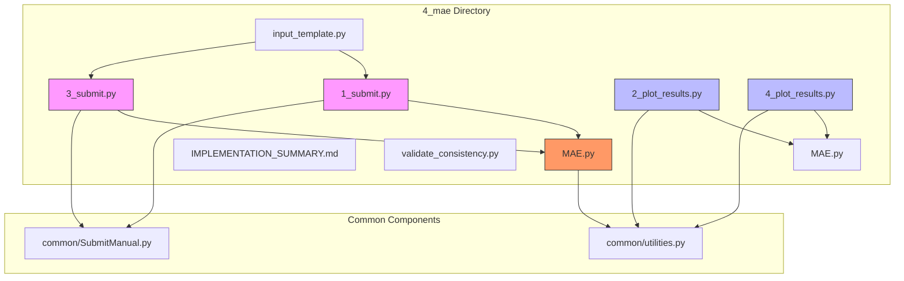
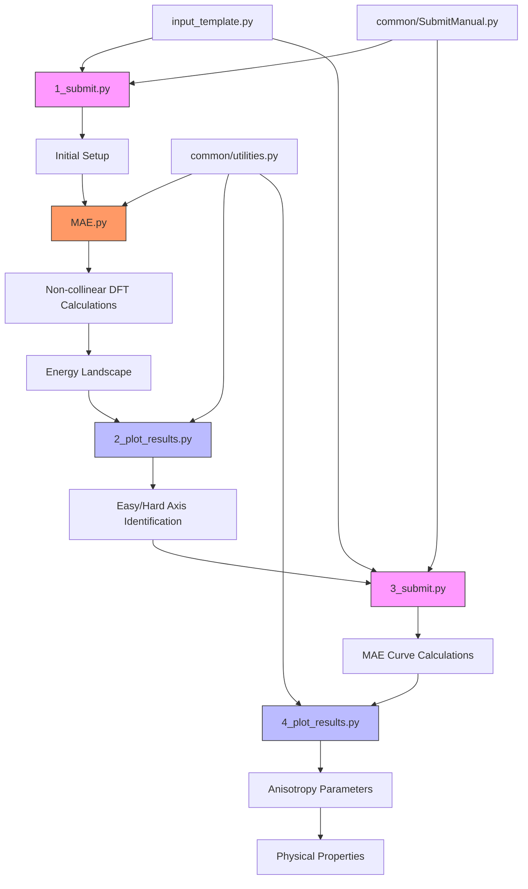
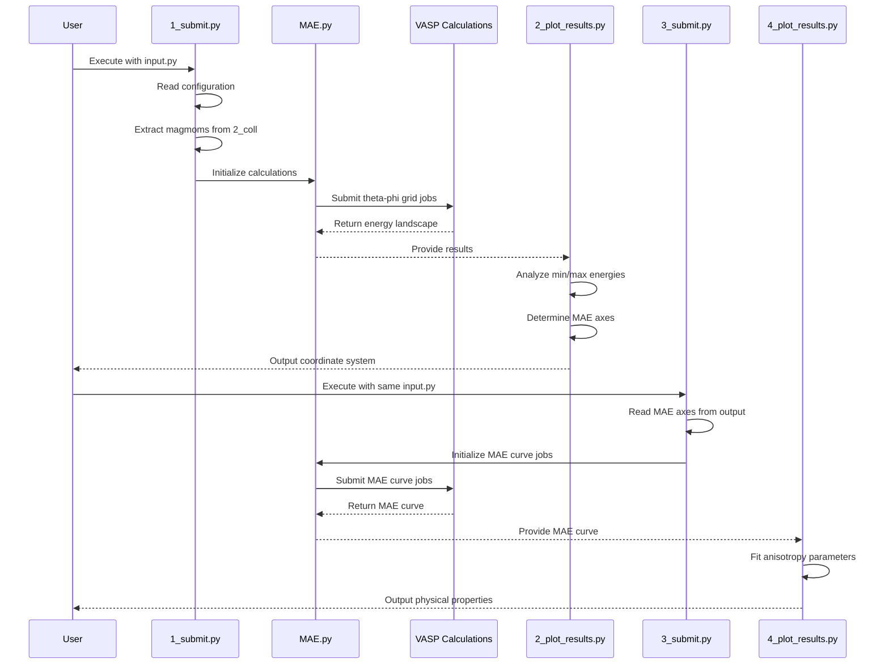
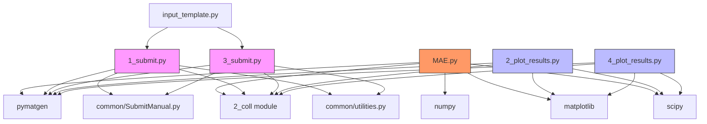

# MAE Calculation Module

<cite>
**Referenced Files in This Document**   
- [MAE.py](file://4_mae/MAE.py)
- [1_submit.py](file://4_mae/1_submit.py)
- [3_submit.py](file://4_mae/3_submit.py)
- [2_plot_results.py](file://4_mae/2_plot_results.py)
- [4_plot_results.py](file://4_mae/4_plot_results.py)
- [input_template.py](file://4_mae/input_template.py)
- [IMPLEMENTATION_SUMMARY.md](file://4_mae/IMPLEMENTATION_SUMMARY.md)
</cite>

## Table of Contents
1. [Introduction](#introduction)
2. [Project Structure](#project-structure)
3. [Core Components](#core-components)
4. [Architecture Overview](#architecture-overview)
5. [Detailed Component Analysis](#detailed-component-analysis)
6. [Dependency Analysis](#dependency-analysis)
7. [Performance Considerations](#performance-considerations)
8. [Troubleshooting Guide](#troubleshooting-guide)
9. [Conclusion](#conclusion)

## Introduction
The MAE Calculation Module is designed for comprehensive analysis of magnetocrystalline anisotropy energy (MAE) in magnetic materials. This module implements a systematic workflow for non-collinear density functional theory (DFT) calculations to determine magnetic anisotropy properties. The system follows a multi-stage approach that begins with collinear reference calculations, proceeds through non-collinear DFT calculations across various magnetization directions, and concludes with energy landscape analysis and anisotropy parameter determination. The implementation supports both automated and manual calculation workflows through dual submission scripts (1_submit.py and 3_submit.py) that handle different calculation stages. The module provides extensive configuration options for spin-orbit coupling, k-point sampling, and magnetic moment initialization, making it adaptable to various magnetic systems. Results are processed through dedicated plotting scripts that generate energy landscapes and extract key magnetic properties such as anisotropy constants and hardening parameters.

## Project Structure
The MAE calculation module is organized in the 4_mae directory with a comprehensive structure supporting the complete MAE analysis workflow. The directory contains dual submission scripts (1_submit.py and 3_submit.py) for different calculation stages, paired with corresponding plotting scripts (2_plot_results.py and 4_plot_results.py) for results visualization. The core computational logic is implemented in MAE.py, which handles non-collinear DFT calculations and energy landscape analysis. Configuration templates are provided in input_template.py and input_example_enhanced.py, offering guidance for setting up calculations. The IMPLEMENTATION_SUMMARY.md document details compatibility between the original MAE.py script and the modular implementation. Sample input files for specific compounds like Fe12O18 are included to demonstrate usage patterns. The module integrates with common utilities from the parent repository for VASP calculations and result processing. This structure enables a seamless workflow from calculation setup through execution to analysis and visualization.



**Diagram sources**
- [1_submit.py](file://4_mae/1_submit.py)
- [3_submit.py](file://4_mae/3_submit.py)
- [2_plot_results.py](file://4_mae/2_plot_results.py)
- [4_plot_results.py](file://4_mae/4_plot_results.py)
- [MAE.py](file://4_mae/MAE.py)

**Section sources**
- [4_mae](file://4_mae)

## Core Components
The MAE calculation module consists of several core components that work together to compute magnetocrystalline anisotropy energy. The primary computational engine is MAE.py, which implements non-collinear DFT calculations with spin-orbit coupling to determine energy landscapes across different magnetization directions. This script handles coordinate transformations for magnetization vectors and manages the submission of VASP calculations through job scripts. The submission workflow is controlled by two main scripts: 1_submit.py initiates the initial phase of calculations across a grid of theta and phi angles, while 3_submit.py handles the subsequent MAE curve calculations along specific axes determined from the initial analysis. Results processing is performed by 2_plot_results.py, which analyzes the energy landscape from the first stage to identify easy and hard magnetization axes, and 4_plot_results.py, which fits the MAE curve to extract anisotropy parameters. Configuration is managed through input_template.py, which defines parameters for k-point sampling, energy cutoffs, and magnetic moment initialization. The implementation ensures compatibility with both the original MAE.py script and modern modular approaches through configurable options for structure handling and magnetic moment assignment.

**Section sources**
- [MAE.py](file://4_mae/MAE.py)
- [1_submit.py](file://4_mae/1_submit.py)
- [3_submit.py](file://4_mae/3_submit.py)
- [2_plot_results.py](file://4_mae/2_plot_results.py)
- [4_plot_results.py](file://4_mae/4_plot_results.py)
- [input_template.py](file://4_mae/input_template.py)

## Architecture Overview
The MAE calculation module follows a modular architecture with distinct phases for calculation, analysis, and visualization. The workflow begins with 1_submit.py, which prepares the initial structure and magnetic moments based on collinear calculation results from the 2_coll module. This script then submits non-collinear DFT calculations across a grid of magnetization directions defined by theta and phi angles. The core MAE.py script manages the VASP calculation workflow, including K-point and energy cutoff convergence tests, wavefunction initialization from collinear calculations, and systematic rotation of magnetization vectors using spherical coordinates. After completing the initial energy landscape calculations, 2_plot_results.py analyzes the results to identify the easy and hard magnetization axes by finding energy minima and maxima. This information is used to define the coordinate system for the second phase of calculations managed by 3_submit.py, which computes the MAE curve along specific axes. Finally, 4_plot_results.py processes the MAE curve data, fitting it to analytical models to extract anisotropy parameters and converting results to physical units. The architecture supports both FireWorks-based workflow management and manual submission through the common/SubmitManual.py interface, providing flexibility for different computing environments.



**Diagram sources**
- [1_submit.py](file://4_mae/1_submit.py)
- [3_submit.py](file://4_mae/3_submit.py)
- [2_plot_results.py](file://4_mae/2_plot_results.py)
- [4_plot_results.py](file://4_mae/4_plot_results.py)
- [MAE.py](file://4_mae/MAE.py)
- [common/SubmitManual.py](file://common/SubmitManual.py)
- [common/utilities.py](file://common/utilities.py)

## Detailed Component Analysis

### MAE.py Implementation
The MAE.py script implements the core functionality for non-collinear DFT calculations with spin-orbit coupling. It begins by performing convergence tests for K-points and energy cutoffs using collinear calculations to establish reference parameters. The script then prepares non-collinear calculations by copying wavefunctions from converged collinear runs, ensuring proper initialization of the electronic structure. For the energy landscape analysis, MAE.py systematically rotates the magnetization direction across a grid of theta (0-180°) and phi (0-360°) angles, with the RotatingAngles function converting spherical coordinates to Cartesian vectors for the SAXIS parameter in VASP. The coordinate transformation follows the standard physics convention where x = sin(θ)cos(φ), y = sin(θ)sin(φ), and z = cos(θ). Energy values are collected from the OSZICAR outputs and converted to SI units using physical constants for Bohr magneton, vacuum permeability, electron volt, and angstrom. The script handles job submission and monitoring, automatically resubmitting failed calculations and managing parallel execution to optimize computational resources.

**Section sources**
- [MAE.py](file://4_mae/MAE.py#L0-L1086)

### Submission Scripts Workflow
The dual submission scripts 1_submit.py and 3_submit.py implement a two-stage calculation workflow for MAE determination. The first script (1_submit.py) initializes the calculation by reading the magnetic structure from collinear results in the 2_coll module, extracting magnetic moments for the specified configuration. It supports two modes for magnetic moment assignment: using element-based moments (compatible with the original MAE.py) or using moments from collinear calculations. The script prepares the input structure, either using the primitive cell or the original structure based on configuration options, and submits calculations across the theta-phi grid. The second script (3_submit.py) operates on the results from the first stage, reading the easy and hard magnetization axes from the output of 2_plot_results.py to define the coordinate system for the MAE curve calculation. It extracts the MAE_x, MAE_y, and MAE_z vectors that form the orthogonal coordinate system for the anisotropy analysis and submits calculations along the specified rotation axis. Both scripts use the SubmitManual class to manage job submission, with identical interfaces that ensure consistency in calculation setup.



**Diagram sources**
- [1_submit.py](file://4_mae/1_submit.py)
- [3_submit.py](file://4_mae/3_submit.py)
- [2_plot_results.py](file://4_mae/2_plot_results.py)
- [4_plot_results.py](file://4_mae/4_plot_results.py)
- [MAE.py](file://4_mae/MAE.py)

### Results Processing and Analysis
The results processing pipeline consists of two plotting scripts that analyze different aspects of the MAE calculations. The 2_plot_results.py script processes the energy landscape from the theta-phi grid calculations, reading OUTCAR files from each magnetization direction to extract total energies. It identifies the minimum and maximum energy configurations to determine the easy and hard magnetization axes, then constructs an orthogonal coordinate system (MAE_x, MAE_y, MAE_z) for the subsequent analysis. When the cross product of the easy and hard axis vectors is negligible (indicating they are nearly parallel), the script uses a deterministic random vector with a fixed seed to ensure reproducible results. The 4_plot_results.py script analyzes the MAE curve data, fitting the energy versus rotation angle to the analytical function E(α) = K₁sin²(α) + K₂sin⁴(α) + C using scipy's curve_fit function. The fitting parameters provide the anisotropy constants K₁ and K₂, which are converted to physical units and used to calculate additional magnetic properties such as the maximum energy product (BH)max and anisotropy field (μ₀Hₐ).

```mermaid
flowchart TD
A[Read OSZICAR/OUTCAR] --> B[Extract Total Energies]
B --> C[Convert to SI Units]
C --> D{First Stage?}
D --> |Yes| E[Find Energy Min/Max]
D --> |No| F[Fit MAE Curve]
E --> G[Determine MAE Axes]
G --> H[Construct Orthogonal System]
H --> I[Output MAE_x, MAE_y, MAE_z]
F --> J[Extract K1, K2 Parameters]
J --> K[Calculate Physical Properties]
K --> L[MAE, (BH)max, μ₀Hₐ]
L --> M[Generate Plots]
M --> N[Save Results]
style D fill:#f96,stroke:#333
style E fill:#bbf,stroke:#333
style F fill:#bbf,stroke:#333
```

**Diagram sources**
- [2_plot_results.py](file://4_mae/2_plot_results.py)
- [4_plot_results.py](file://4_mae/4_plot_results.py)

## Dependency Analysis
The MAE calculation module has a well-defined dependency structure that ensures proper workflow execution. The primary dependency is on the 2_coll module, from which both submission scripts retrieve the initial magnetic structure and moments for the specified configuration. All components depend on pymatgen for structure handling and VASP output parsing, with specific reliance on Structure, Outcar, Oszicar, and Eigenval classes. The submission scripts depend on common/SubmitManual.py for job submission functionality, while the plotting scripts utilize matplotlib for visualization and scipy for curve fitting. The MAE.py script has direct dependencies on numpy for numerical operations and matplotlib for intermediate plotting during convergence tests. The implementation maintains compatibility with the original MAE.py script through shared functions for magnetic moment handling and coordinate system generation, as documented in IMPLEMENTATION_SUMMARY.md. Configuration dependencies are managed through input_template.py, which defines default parameters that can be overridden by user-specific input files. The module also depends on environment variables, particularly AUTOMAG_PATH, to locate input structures and calculation results.



**Diagram sources**
- [MAE.py](file://4_mae/MAE.py)
- [1_submit.py](file://4_mae/1_submit.py)
- [3_submit.py](file://4_mae/3_submit.py)
- [2_plot_results.py](file://4_mae/2_plot_results.py)
- [4_plot_results.py](file://4_mae/4_plot_results.py)
- [common/SubmitManual.py](file://common/SubmitManual.py)
- [common/utilities.py](file://common/utilities.py)

## Performance Considerations
The MAE calculation module involves computationally intensive non-collinear DFT calculations with spin-orbit coupling, requiring careful consideration of performance optimization. The most significant computational cost comes from the large number of VASP calculations needed to sample the energy landscape across magnetization directions. The default grid of 20 phi angles and 10 theta angles requires 200 separate calculations, each involving electronic structure convergence with spin-orbit coupling. To mitigate this, the implementation includes parallel execution capabilities through the Nparalel parameter, allowing multiple calculations to run simultaneously and reducing total wall time. The workflow is optimized by reusing wavefunctions from collinear calculations as starting points for non-collinear runs, significantly reducing convergence time. Memory usage is managed by removing large files like WAVECAR and CHGCAR after they are no longer needed. The convergence testing phase for K-points and energy cutoffs is designed to minimize unnecessary calculations by systematically testing parameters and selecting optimal values. For large systems, the use of appropriate K-point sampling and energy cutoffs is crucial to balance accuracy and computational cost. The implementation also includes automatic job resubmission for failed calculations, ensuring robustness in long-running workflows.

## Troubleshooting Guide
Common issues in the MAE calculation module typically involve convergence problems, configuration errors, and numerical instabilities. For spin-orbit coupling calculations, convergence issues may arise due to insufficient K-point sampling or energy cutoff values; these can be addressed by examining the convergence test results in the initial phase and adjusting ENCUT and kpoints parameters accordingly. If calculations fail with "Signal 9" or "Signal 11" errors, increasing memory limits or adjusting the ulimit settings in job scripts may resolve the issue. Numerical instability in anisotropy fitting can occur when the energy differences are very small compared to the total energy; this is mitigated by using high-precision arithmetic and ensuring adequate sampling density in the MAE curve. Configuration errors often stem from incorrect specification of the magnetic atom (MagAtom parameter) or mismatched magnetic moments between the collinear reference and MAE calculation; verifying these parameters in the input file and checking the output logs can identify such issues. When the easy and hard magnetization axes are nearly parallel, leading to numerical issues in coordinate system construction, the implementation uses a deterministic fallback vector to ensure reproducible results. Users should also verify that the AUTOMAG_PATH environment variable is correctly set and that input structures are accessible from the specified paths.

**Section sources**
- [MAE.py](file://4_mae/MAE.py)
- [1_submit.py](file://4_mae/1_submit.py)
- [3_submit.py](file://4_mae/3_submit.py)
- [2_plot_results.py](file://4_mae/2_plot_results.py)
- [4_plot_results.py](file://4_mae/4_plot_results.py)
- [IMPLEMENTATION_SUMMARY.md](file://4_mae/IMPLEMENTATION_SUMMARY.md)

## Conclusion
The MAE Calculation Module provides a comprehensive framework for determining magnetocrystalline anisotropy energy through non-collinear DFT calculations. The implementation successfully integrates the original MAE.py functionality into a modular workflow with improved maintainability and flexibility. The dual submission script architecture (1_submit.py and 3_submit.py) enables a systematic approach to anisotropy analysis, first mapping the energy landscape across magnetization directions and then focusing on the critical axes for precise parameter determination. The module offers extensive configuration options through input_template.py, allowing users to customize calculation parameters for different magnetic systems while maintaining compatibility with the original implementation. Results processing scripts (2_plot_results.py and 4_plot_results.py) provide robust analysis of energy landscapes and anisotropy parameters, with careful attention to numerical stability and reproducibility. The implementation addresses common challenges in magnetic anisotropy calculations, including convergence of spin-orbit coupling calculations and construction of consistent coordinate systems. This module serves as a reliable tool for researchers studying magnetic materials, providing both the computational power needed for accurate DFT calculations and the analytical framework to extract meaningful physical properties from the results.