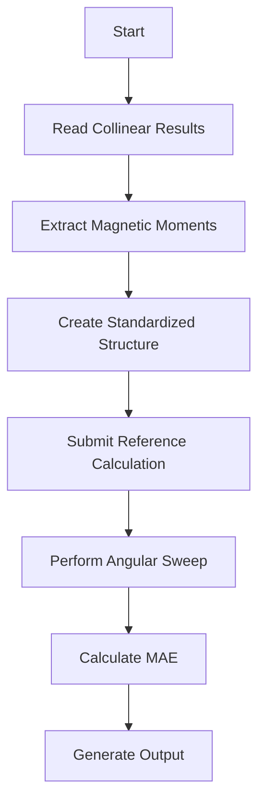
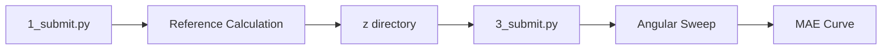
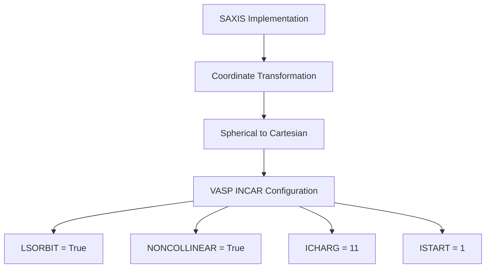
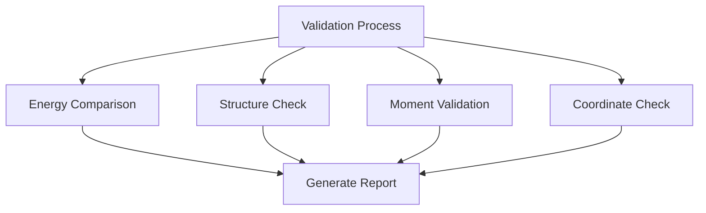

# Non-Collinear DFT Calculations

<cite>
**Referenced Files in This Document**   
- [1_submit.py](file://4_mae/1_submit.py)
- [3_submit.py](file://4_mae/3_submit.py)
- [MAE.py](file://4_mae/MAE.py)
- [input_template.py](file://4_mae/input_template.py)
- [input_example_enhanced.py](file://4_mae/input_example_enhanced.py)
- [SubmitManual.py](file://common/SubmitManual.py)
- [validate_consistency.py](file://4_mae/validate_consistency.py)
- [IMPLEMENTATION_SUMMARY.md](file://4_mae/IMPLEMENTATION_SUMMARY.md)
</cite>

## Table of Contents
1. [Introduction](#introduction)
2. [Workflow Overview](#workflow-overview)
3. [Configuration Parameters](#configuration-parameters)
4. [Dual Submission Process](#dual-submission-process)
5. [Magnetic Moment Handling](#magnetic-moment-handling)
6. [SAXIS Parameter Implementation](#saxis-parameter-implementation)
7. [Angular Resolution Control](#angular-resolution-control)
8. [Common Issues and Troubleshooting](#common-issues-and-troubleshooting)
9. [Validation and Consistency](#validation-and-consistency)
10. [Conclusion](#conclusion)

## Introduction

The MAE (Magnetocrystalline Anisotropy Energy) module implements non-collinear DFT calculations to determine magnetic anisotropy in materials. This documentation details the implementation of spin-orbit coupling in VASP through SAXIS parameter manipulation and INCAR configuration. The workflow begins with collinear reference calculations and progresses to non-collinear energy evaluations across spherical angles. The system supports both the original MAE.py script and a ported modular implementation, with comprehensive compatibility options to ensure consistent results between implementations.

**Section sources**
- [1_submit.py](file://4_mae/1_submit.py#L1-L215)
- [MAE.py](file://4_mae/MAE.py#L1-L1086)
- [IMPLEMENTATION_SUMMARY.md](file://4_mae/IMPLEMENTATION_SUMMARY.md#L1-L223)

## Workflow Overview

The non-collinear DFT calculation workflow follows a two-stage process: first establishing a reference state through collinear calculations, then performing angular sweeps for non-collinear evaluations. The process begins in the `4_mae` directory with the `1_submit.py` script, which coordinates the entire workflow.

The workflow starts by locating collinear calculation results from the `2_coll` directory, extracting magnetic moments from these calculations, and using them as the basis for non-collinear calculations. The system creates standardized structures and submits calculations through either Fireworks or manual submission methods. For VASP calculations, the implementation ensures proper spin-orbit coupling by configuring the `LSORBIT` and `NONCOLLINEAR` flags in the INCAR file.

The process involves creating a reference calculation with the magnetic moment aligned along the z-axis (stored in the 'z' directory), then performing calculations at various spherical angles defined by theta and phi parameters. Energy values from these calculations are used to construct the magnetocrystalline anisotropy energy surface.

**Diagram sources**
- [1_submit.py](file://4_mae/1_submit.py#L1-L215)
- [MAE.py](file://4_mae/MAE.py#L1-L1086)

**Section sources**
- [1_submit.py](file://4_mae/1_submit.py#L1-L215)
- [MAE.py](file://4_mae/MAE.py#L1-L1086)

## Configuration Parameters

The MAE calculations are controlled through configuration parameters defined in input files such as `input_template.py` and `input_example_enhanced.py`. These parameters include both grid settings for angular resolution and compatibility options for ensuring consistency between different implementations.

Key configuration parameters include:
- `Nph`: Number of grid points for phi angle rotation (0-360 degrees)
- `Nth`: Number of grid points for theta angle rotation (0-180 degrees)
- `N_MAE`: Number of grid points for MAE curve (0-360 degrees)
- `poscar_file`: Name of the POSCAR file to use from the geometries folder
- `configuration`: Specific magnetic configuration to use for MAE calculation
- `calculator`: Calculator to use ('vasp', 'qe', or 'fplo')

The system also includes compatibility options that allow users to match the behavior of the original MAE.py script:
- `use_mae_py_compatibility`: Master switch for MAE.py compatibility mode
- `use_element_based_magmoms`: Use element-based magnetic moments instead of calculation results
- `use_primitive_structure`: Use primitive structure instead of original structure
- `use_kpoint_reference`: Use k-point optimized reference energy calculation

**Section sources**
- [input_template.py](file://4_mae/input_template.py#L1-L124)
- [input_example_enhanced.py](file://4_mae/input_example_enhanced.py#L1-L192)

## Dual Submission Process

The MAE module implements a dual submission process that first establishes a reference state and then performs angular sweeps. This process is coordinated through the `1_submit.py` and `3_submit.py` scripts, which handle the two main phases of MAE calculation.

The first phase, handled by `1_submit.py`, establishes the reference state by:
1. Locating collinear calculation results from the `2_coll` directory
2. Extracting magnetic moments from the collinear results
3. Creating a standardized structure with the magnetic moment aligned along the z-axis
4. Submitting the reference calculation to generate WAVECAR and CHGCAR files

The second phase, handled by `3_submit.py`, performs the angular sweep by:
1. Reading the MAE coordinate system (MAE_x, MAE_y, MAE_z) from previous results
2. Creating calculations at various angles along the MAE curve
3. Using the reference calculation's WAVECAR and CHGCAR files as starting points
4. Submitting non-self-consistent calculations for each angle

This dual approach ensures that all non-collinear calculations start from the same electronic structure, improving consistency and reducing computational cost.

**Diagram sources**
- [1_submit.py](file://4_mae/1_submit.py#L1-L215)
- [3_submit.py](file://4_mae/3_submit.py#L1-L241)

**Section sources**
- [1_submit.py](file://4_mae/1_submit.py#L1-L215)
- [3_submit.py](file://4_mae/3_submit.py#L1-L241)

## Magnetic Moment Handling

The system provides flexible magnetic moment handling with options for both element-based assignment and calculation-based extraction. The choice between these methods is controlled by the `use_element_based_magmoms` parameter, which defaults to False for the ported implementation but can be set to True for compatibility with the original MAE.py script.

When using calculation-based magnetic moments (the default), the system:
1. Reads the magnetic moments from collinear calculation results stored in `CalcFold`
2. Extracts the final magnetic moments from the output file
3. Applies these moments to the standardized structure
4. Uses them as the basis for non-collinear calculations

When using element-based magnetic moments (MAE.py compatibility mode), the system:
1. Assigns magnetic moments based on element types using predefined values
2. Uses the `magnetic_elements` dictionary to determine moment values
3. Applies these predefined moments regardless of collinear calculation results

The system also handles structure standardization through the `use_primitive_structure` parameter, which determines whether to use the primitive cell (default for ported version) or the original structure (MAE.py compatibility mode).

**Section sources**
- [1_submit.py](file://4_mae/1_submit.py#L1-L215)
- [input_template.py](file://4_mae/input_template.py#L1-L124)

## SAXIS Parameter Implementation

The implementation of spin-orbit coupling in VASP is achieved through careful manipulation of the SAXIS parameter and INCAR configuration. The SAXIS parameter defines the quantization axis for non-collinear calculations and is critical for accurate MAE determination.

In the MAE module, the SAXIS parameter is dynamically set for each calculation based on spherical coordinates:
- For theta-phi grid calculations: SAXIS is set to [sin(θ)cos(φ), sin(θ)sin(φ), cos(θ)]
- For MAE curve calculations: SAXIS is set to cos(α)·MAE_x + sin(α)·MAE_y

The INCAR configuration for non-collinear calculations includes the following key parameters:
- `LSORBIT = True`: Enables spin-orbit coupling
- `NONCOLLINEAR = True`: Enables non-collinear magnetism
- `ICHARG = 11`: Performs non-self-consistent calculation using existing charge density
- `ISTART = 1`: Reads existing WAVECAR file
- `LCHARG = False`: Does not write CHGCAR to save disk space
- `LWAVE = False`: Does not write WAVECAR to save disk space

The system ensures proper initialization by first performing a collinear calculation with the magnetic moment aligned along the z-axis, then using the resulting WAVECAR and CHGCAR files as starting points for all non-collinear calculations.

**Diagram sources**
- [1_submit.py](file://4_mae/1_submit.py#L1-L215)
- [SubmitManual.py](file://common/SubmitManual.py#L1-L870)

**Section sources**
- [1_submit.py](file://4_mae/1_submit.py#L1-L215)
- [SubmitManual.py](file://common/SubmitManual.py#L1-L870)

## Angular Resolution Control

Angular resolution in MAE calculations is controlled through the `Nph`, `Nth`, and `N_MAE` parameters, which determine the number of grid points for phi, theta, and MAE curve calculations respectively. These parameters directly impact both computational cost and accuracy of the results.

The `Nph` and `Nth` parameters control the resolution of the theta-phi grid used for initial MAE surface mapping:
- Higher values provide finer angular resolution and more accurate MAE determination
- Lower values reduce computational cost but may miss important anisotropy features
- Typical values are Nph=20 and Nth=10, providing a balance between accuracy and efficiency

The `N_MAE` parameter controls the resolution of the final MAE curve along the principal anisotropy axis:
- This parameter determines how finely the energy variation is sampled along the MAE curve
- Higher values provide smoother curves and more precise determination of easy and hard axes
- The default value of 20 provides adequate resolution for most applications

The computational cost scales approximately linearly with the product of these parameters, making optimization important for large systems. Users should balance the need for accuracy against available computational resources when selecting these parameters.

**Section sources**
- [input_template.py](file://4_mae/input_template.py#L1-L124)
- [1_submit.py](file://4_mae/1_submit.py#L1-L215)

## Common Issues and Troubleshooting

Several common issues can arise during non-collinear DFT calculations, particularly with spin-orbit coupling and magnetic moment initialization. Understanding these issues and their solutions is critical for successful MAE calculations.

**Convergence challenges with spin-orbit coupling:**
- Spin-orbit coupling can make convergence more difficult due to the additional complexity in the Hamiltonian
- Solution: Use appropriate mixing parameters and ensure sufficient k-point sampling
- The system automatically sets `voskown = 1` to use the Vosko-Wilk-Nusair correlation functional, which can improve convergence

**Numerical instabilities in magnetic moment initialization:**
- Improper initialization can lead to convergence failures or unphysical results
- Solution: Ensure consistent magnetic moment handling between collinear and non-collinear stages
- The system provides options to use either calculation-based or element-based magnetic moments

**Reference calculation issues:**
- Missing or corrupted WAVECAR/CHGCAR files can prevent non-collinear calculations
- Solution: Verify the reference calculation completed successfully
- The system includes fallback logic to regenerate reference files if needed

**Coordinate system inconsistencies:**
- Non-deterministic coordinate system generation can lead to irreproducible results
- Solution: The system uses fixed coordinate systems based on the MAE_x, MAE_y, and MAE_z vectors
- For compatibility with MAE.py, a fixed random seed (42) ensures reproducible results

**Section sources**
- [1_submit.py](file://4_mae/1_submit.py#L1-L215)
- [MAE.py](file://4_mae/MAE.py#L1-L1086)
- [SubmitManual.py](file://common/SubmitManual.py#L1-L870)

## Validation and Consistency

The MAE module includes comprehensive validation tools to ensure consistency between the original MAE.py script and the ported modular implementation. The `validate_consistency.py` script provides automated comparison of results, helping to identify and debug any discrepancies.

Key validation capabilities include:
- Energy surface comparison with configurable tolerance
- Structure and magnetic moment validation
- Coordinate system orthogonality checking
- Automated report generation

The validation process checks several critical aspects:
1. **Energy surfaces**: Compares energy values at corresponding angular points
2. **Reference energies**: Ensures consistent reference energy calculations
3. **Structures**: Verifies identical atomic positions and cell parameters
4. **Magnetic moments**: Confirms consistent moment assignments
5. **Coordinate systems**: Validates orthogonality and normalization of MAE vectors

The system also provides compatibility options that can be used to match the behavior of the original MAE.py script exactly:
- `use_mae_py_compatibility = True`: Enables all MAE.py compatible options
- Individual compatibility flags for granular control

These validation tools ensure that users can achieve identical results between implementations when needed, while maintaining the flexibility and modularity of the ported version.

**Diagram sources**
- [validate_consistency.py](file://4_mae/validate_consistency.py#L1-L358)
- [IMPLEMENTATION_SUMMARY.md](file://4_mae/IMPLEMENTATION_SUMMARY.md#L1-L223)

**Section sources**
- [validate_consistency.py](file://4_mae/validate_consistency.py#L1-L358)
- [IMPLEMENTATION_SUMMARY.md](file://4_mae/IMPLEMENTATION_SUMMARY.md#L1-L223)

## Conclusion

The MAE module provides a robust framework for non-collinear DFT calculations with comprehensive support for spin-orbit coupling in VASP. The implementation through SAXIS parameter manipulation and INCAR configuration enables accurate determination of magnetocrystalline anisotropy energy. The dual submission process, which first establishes a reference state and then performs angular sweeps, ensures consistency and efficiency in calculations.

Key features of the implementation include:
- Flexible magnetic moment handling with compatibility options
- Precise control over angular resolution through Nph, Nth, and N_MAE parameters
- Comprehensive validation tools for ensuring consistency
- Robust error handling and troubleshooting capabilities

The system successfully bridges the original MAE.py script and the ported modular implementation, providing users with both backward compatibility and forward extensibility. By understanding the configuration options and potential issues, users can effectively perform non-collinear DFT calculations and obtain reliable MAE results.

**Section sources**
- [1_submit.py](file://4_mae/1_submit.py#L1-L215)
- [MAE.py](file://4_mae/MAE.py#L1-L1086)
- [IMPLEMENTATION_SUMMARY.md](file://4_mae/IMPLEMENTATION_SUMMARY.md#L1-L223)