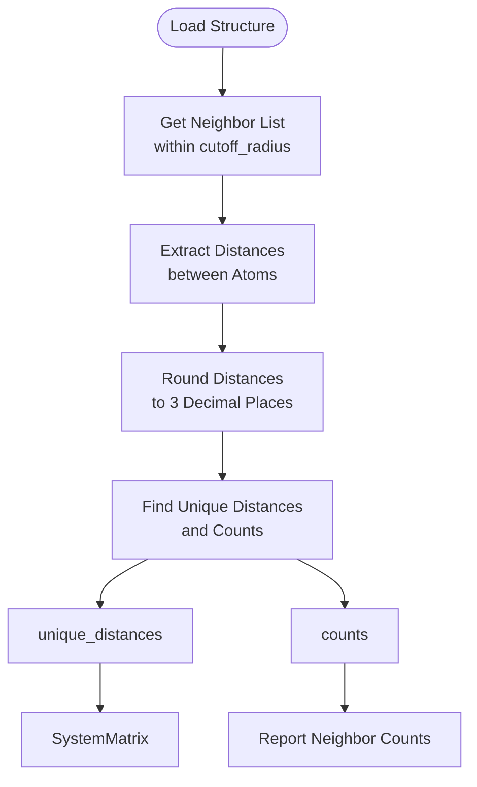
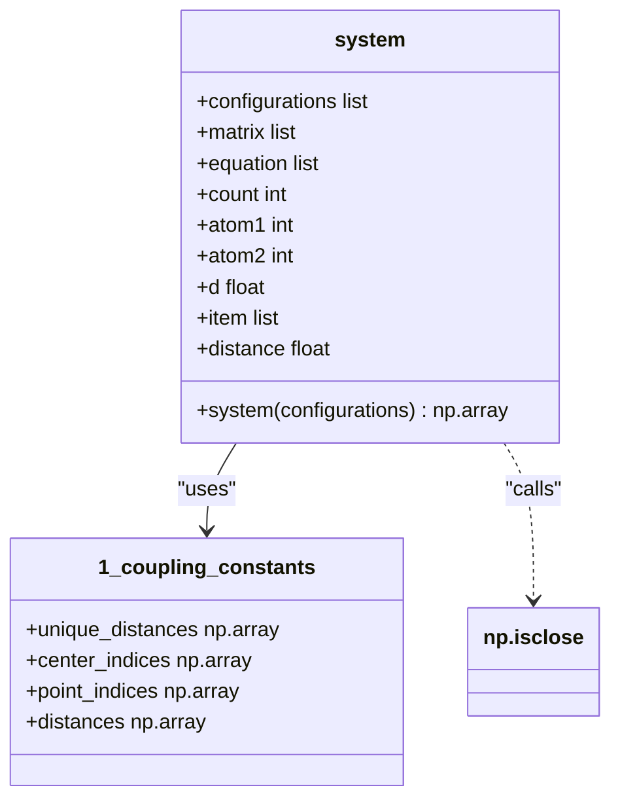
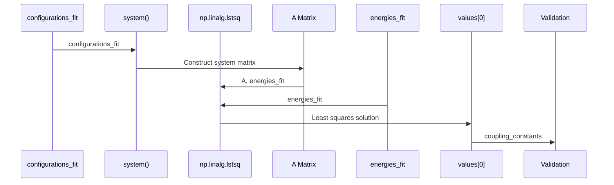
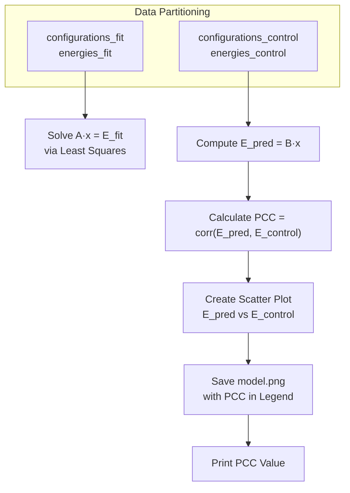
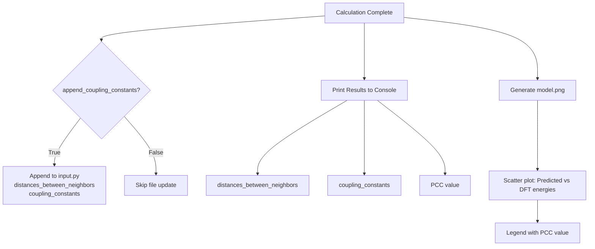

<cite>
**Referenced Files in This Document**   
- [1_coupling_constants.py](file://3_monte_carlo/1_coupling_constants.py)
- [example_input.py](file://3_monte_carlo/example_input.py)
</cite>

## Table of Contents
1. [Introduction](#introduction)
2. [Core Implementation](#core-implementation)
3. [Neighbor List and Distance Partitioning](#neighbor-list-and-distance-partitioning)
4. [System Matrix Construction](#system-matrix-construction)
5. [Linear Least Squares Regression](#linear-least-squares-regression)
6. [Model Validation with Pearson Correlation](#model-validation-with-pearson-correlation)
7. [Input Parameters and Configuration](#input-parameters-and-configuration)
8. [Output and Results Persistence](#output-and-results-persistence)
9. [Common Issues and Troubleshooting](#common-issues-and-troubleshooting)
10. [Conclusion](#conclusion)

## Introduction

The coupling constants calculation component is a critical module in the automated magnetic properties analysis pipeline, responsible for mapping first-principles Density Functional Theory (DFT) energies to an effective Heisenberg spin Hamiltonian. This document provides a comprehensive explanation of how the script `1_coupling_constants.py` computes exchange coupling constants between magnetic atoms by fitting a linear model to collinear magnetic configuration energies. The implementation leverages pymatgen for structural analysis, NumPy for numerical computation, and matplotlib for model validation visualization. The process involves constructing a system of linear equations from spin configurations and atomic distances, solving it via least squares regression, and validating the model's accuracy using the Pearson Correlation Coefficient (PCC) on a control dataset. This approach enables the extraction of physically meaningful coupling constants that can be used in subsequent Monte Carlo simulations.

**Section sources**
- [1_coupling_constants.py](file://3_monte_carlo/1_coupling_constants.py#L1-L50)

## Core Implementation

The core implementation in `1_coupling_constants.py` follows a systematic workflow to derive coupling constants from DFT-computed energies of collinear magnetic configurations. The script begins by loading the crystal structure from a POSCAR file using pymatgen and retrieving the magnetic configurations and their corresponding energies from the previous collinear calculations step. Magnetic atoms are identified either as transition metals by default or as specified in the input configuration. Non-magnetic atoms are removed from the structure to focus the analysis exclusively on magnetic interactions. The heart of the implementation lies in the construction of a system matrix that encodes the spin-spin interactions for each magnetic configuration, which is then solved using linear least squares regression to obtain the coupling constants. The model's predictive power is rigorously validated by comparing Heisenberg model predictions against DFT energies on a held-out control group, with results visualized in a scatter plot and quantified by the PCC.

**Section sources**
- [1_coupling_constants.py](file://3_monte_carlo/1_coupling_constants.py#L51-L100)

## Neighbor List and Distance Partitioning

The script utilizes pymatgen's `get_neighbor_list` method to compute atomic distances within a user-defined `cutoff_radius`, which determines the maximum distance for considering magnetic interactions. This method returns arrays of center atom indices, neighboring atom indices, offset vectors, and interatomic distances for all pairs within the cutoff. The distances are then processed to identify unique neighbor distances by rounding to three decimal places and applying NumPy's `unique` function with `return_counts=True` to obtain both the distinct distances and their occurrence frequencies. This partitioning is crucial as it groups atomic pairs by their separation distance, allowing the model to assign a single coupling constant to all pairs at approximately the same distance. The `cutoff_radius` parameter directly controls the number of unique distances and thus the complexity of the resulting Heisenberg model, with larger cutoffs potentially capturing longer-range interactions but increasing the risk of overfitting or introducing noise from weak couplings.

**Diagram sources**
- [1_coupling_constants.py](file://3_monte_carlo/1_coupling_constants.py#L107-L113)

## System Matrix Construction

The system matrix is constructed through the `system` function, which transforms magnetic configurations into a set of linear equations based on the Heisenberg Hamiltonian. For each collinear spin configuration, the function generates a row in the matrix where the first element is 1 (representing the constant energy offset) and subsequent elements correspond to the sum of spin products for each unique distance group. Specifically, for each unique distance, the function iterates through all atom pairs, checks if their distance matches the current unique distance within a 0.02 Å tolerance using `np.isclose`, and accumulates the product of their spins. This sum is then divided by -2 and appended to the equation, following the convention of the Heisenberg Hamiltonian H = Σ J_ij S_i·S_j. The resulting matrix A has dimensions [N_configs × (1 + N_distances)], where each row represents an energy equation for a specific spin configuration, enabling the linear system A·x = E to be solved for the coupling constants.

**Diagram sources**
- [1_coupling_constants.py](file://3_monte_carlo/1_coupling_constants.py#L98-L109)

## Linear Least Squares Regression

The coupling constants are derived by solving an overdetermined system of linear equations using NumPy's `linalg.lstsq` function, which implements linear least squares regression. The system is formulated as A·x = b, where A is the system matrix constructed from spin configurations, x is the vector of unknowns (energy offset and coupling constants), and b is the vector of DFT energies. The script partitions the data into fit and control groups based on the `control_group_size` parameter, using only the fit group (typically 60% of configurations) for regression to prevent overfitting. The `lstsq` function returns the least-squares solution that minimizes the sum of squared residuals between predicted and actual energies. Before solving, the script checks if the system is well-determined by comparing the matrix rank of A to the number of unknowns (1 + number of unique distances). If the system is underdetermined (rank < unknowns), an error is raised, indicating insufficient magnetic configurations to uniquely determine all coupling constants.

**Diagram sources**
- [1_coupling_constants.py](file://3_monte_carlo/1_coupling_constants.py#L115-L125)

## Model Validation with Pearson Correlation

Model accuracy is rigorously assessed using the Pearson Correlation Coefficient (PCC) between predicted Heisenberg energies and DFT-computed energies on the control group. After obtaining the coupling constants from the fit group, the system matrix is reconstructed for the control configurations using the same `system` function. The predicted energies are computed by matrix multiplication of the control system matrix B with the solution vector, yielding predictions that are then compared to the actual DFT energies in the control group. The PCC is calculated using `np.corrcoef`, which returns a correlation matrix, with the off-diagonal element representing the linear correlation strength. A PCC close to 1.0 indicates excellent agreement between the Heisenberg model and DFT results, validating the model's predictive power. The results are visualized in a scatter plot saved as `model.png`, with the PCC value displayed in the legend, providing both quantitative and qualitative assessment of model quality.

**Diagram sources**
- [1_coupling_constants.py](file://3_monte_carlo/1_coupling_constants.py#L146-L165)

## Input Parameters and Configuration

The behavior of the coupling constants calculation is controlled by several key parameters defined in the input configuration file, such as `example_input.py`. The `cutoff_radius` parameter (default 4.1 Å) determines the maximum distance for considering magnetic interactions, directly affecting the number of unique neighbor distances and coupling constants in the model. The `control_group_size` parameter (default 0.4) specifies the fraction of magnetic configurations reserved for validation, with the remaining used for fitting, implementing a simple train-test split to assess model generalization. The `append_coupling_constants` boolean flag controls whether the computed results are automatically appended to the input file for downstream use. Additional parameters include `poscar_file` for specifying the crystal structure, `calculator` for the DFT code used, and optional `magnetic_atoms` to explicitly define which elements are considered magnetic. These parameters provide a flexible interface for tailoring the analysis to different materials and computational requirements.

**Section sources**
- [example_input.py](file://3_monte_carlo/example_input.py#L1-L15)

## Output and Results Persistence

The script produces both visual and programmatic outputs to document the coupling constants calculation results. The primary output is `model.png`, a scatter plot comparing Heisenberg model predictions against DFT energies for the control group, annotated with the PCC value. This visualization serves as an immediate quality check of the model fit. The coupling constants themselves are printed to the console in units of joules, along with the corresponding interatomic distances and neighbor counts. When `append_coupling_constants` is set to `True`, the script automatically appends the `distances_between_neighbors` and `coupling_constants` arrays to the local `input.py` file, prefixed with comments indicating they were added by the script. This feature enables seamless integration with subsequent workflow steps, such as Monte Carlo simulation setup, by making the computed parameters readily available without manual intervention. The results are saved in a format directly usable by Python, ensuring compatibility with the rest of the automation pipeline.

**Diagram sources**
- [1_coupling_constants.py](file://3_monte_carlo/1_coupling_constants.py#L166-L181)

## Common Issues and Troubleshooting

Several common issues can arise during coupling constants calculation, each with specific diagnostic indicators and solutions. An underdetermined system occurs when the number of independent equations (magnetic configurations) is less than the number of unknowns (1 + number of unique distances), resulting in the error message about insufficient independent equations. This is resolved by either computing additional magnetic configurations or reducing the `cutoff_radius` to decrease the number of unique distances. Poor PCC values (significantly less than 0.9) indicate inadequate model fit, which may stem from an insufficient `cutoff_radius` missing important interactions, non-collinear magnetic states not captured by the model, or numerical noise in DFT energies. Convergence with respect to neighbor distance can be checked by systematically varying the `cutoff_radius` and monitoring PCC stability; a plateau in PCC suggests adequate cutoff. Users should also verify that magnetic atoms are correctly identified and that the structure contains sufficient magnetic configurations (typically > 2^N_magnetic_sites for robust fitting).

**Section sources**
- [1_coupling_constants.py](file://3_monte_carlo/1_coupling_constants.py#L175-L181)

## Conclusion

The coupling constants calculation component provides a robust framework for extracting effective exchange parameters from first-principles calculations, bridging quantum mechanical DFT results with classical spin Hamiltonian models. By systematically constructing a linear system from collinear magnetic configurations and solving it via least squares regression, the implementation reliably computes physically meaningful coupling constants that capture the essential magnetic interactions in a material. The integration of pymatgen for structural analysis, NumPy for numerical computation, and matplotlib for validation visualization creates a comprehensive workflow that automates the most challenging aspect of magnetic property prediction. The careful partitioning of data into fit and control groups, coupled with PCC-based validation, ensures model reliability and prevents overfitting. This component serves as a critical link in the automated materials discovery pipeline, enabling accurate Monte Carlo simulations of magnetic behavior based on first-principles inputs, and exemplifies how systematic computational approaches can extract meaningful physical insights from complex quantum mechanical data.