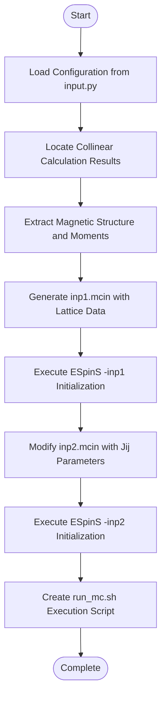
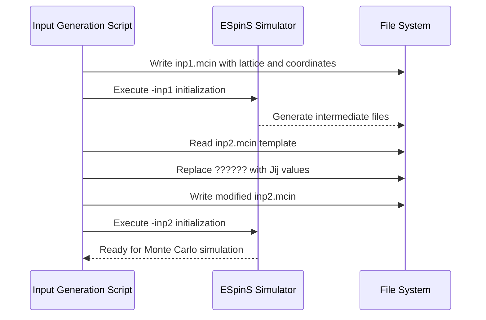
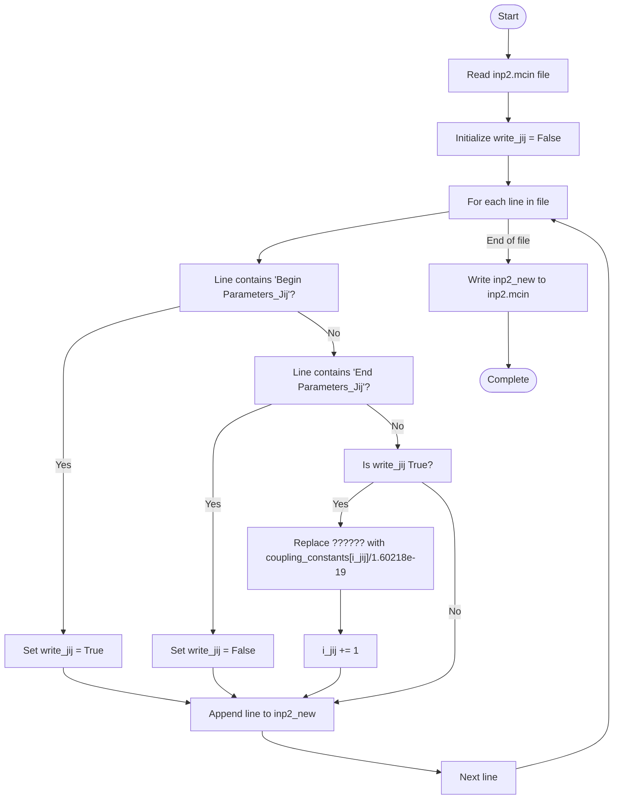
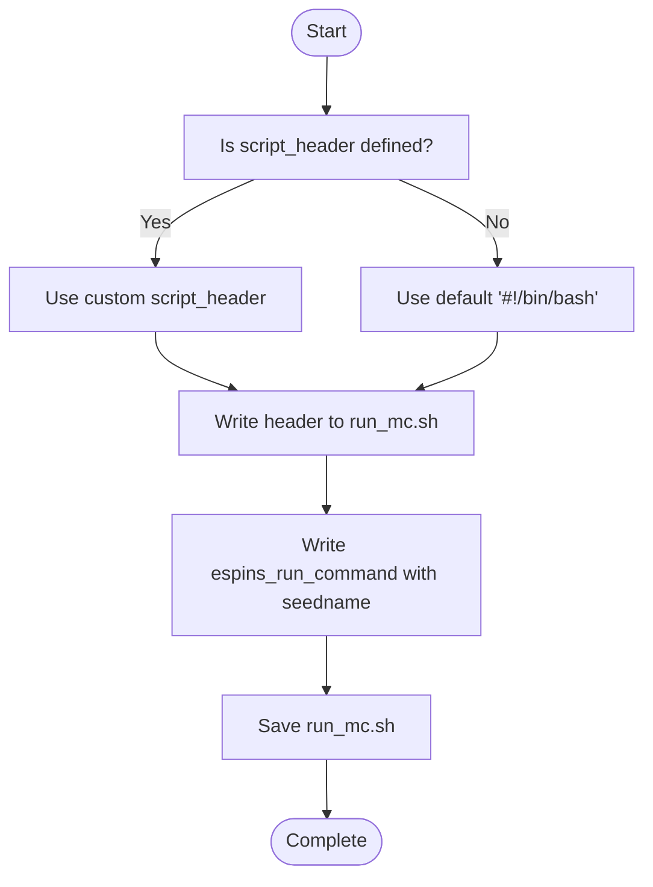

# ESpinS Input File Generation

<cite>
**Referenced Files in This Document**   
- [3_monte_carlo/4_write_espins_mcin.py](file://3_monte_carlo/4_write_espins_mcin.py)
- [3_monte_carlo/input_template.py](file://3_monte_carlo/input_template.py)
- [3_monte_carlo/Fe12O18/input.py](file://3_monte_carlo/Fe12O18/input.py)
- [3_monte_carlo/example_input.py](file://3_monte_carlo/example_input.py)
- [3_monte_carlo/1_coupling_constants.py](file://3_monte_carlo/1_coupling_constants.py)
- [3_monte_carlo/Fe12O18/espins/run_mc.sh](file://3_monte_carlo/Fe12O18/espins/run_mc.sh)
</cite>

## Table of Contents
1. [Introduction](#introduction)
2. [Input Generation Workflow](#input-generation-workflow)
3. [Seedname Construction](#seedname-construction)
4. [Two-Step Initialization Process](#two-step-initialization-process)
5. [Exchange Coupling Constants Injection](#exchange-coupling-constants-injection)
6. [Advanced Interaction Support](#advanced-interaction-support)
7. [Run Script Generation](#run-script-generation)
8. [Common Issues and Debugging](#common-issues-and-debugging)
9. [Validation Techniques](#validation-techniques)

## Introduction
The ESpinS input generation component automates the preparation of input files for Monte Carlo simulations in magnetic systems. This system extracts magnetic structure information and exchange coupling constants to generate properly formatted `.inp1.mcin` and `.inp2.mcin` files required by the ESpinS simulation package. The process begins with identifying the magnetic configuration from collinear calculations and proceeds through a two-step initialization workflow that ensures proper setup of the simulation environment.

**Section sources**
- [3_monte_carlo/4_write_espins_mcin.py](file://3_monte_carlo/4_write_espins_mcin.py#L0-L45)
- [3_monte_carlo/input_template.py](file://3_monte_carlo/input_template.py#L0-L21)

## Input Generation Workflow
The input generation workflow follows a systematic process to prepare ESpinS simulations. It begins by loading configuration parameters from input files, then locates the appropriate magnetic structure data from collinear calculation results. The script identifies magnetic atoms within the structure and extracts their initial moments corresponding to the selected configuration. Using this information, it creates a reduced structure containing only magnetic species and computes neighbor lists within a specified cutoff radius. The workflow then proceeds to generate the two required input files through a sequential initialization process.

**Diagram sources**
- [3_monte_carlo/4_write_espins_mcin.py](file://3_monte_carlo/4_write_espins_mcin.py#L45-L111)

## Seedname Construction
The seedname for ESpinS simulations is constructed programmatically by combining the chemical formula with the configuration label. The chemical formula is extracted from the atomic structure using ASE's `get_chemical_formula` method with 'metal' mode, which orders elements by electronegativity. This is then concatenated with the configuration identifier (e.g., 'afm1', 'fm1') using an underscore separator. For example, an antiferromagnetic configuration of Fe12O18 would produce the seedname "Fe12O18_afm1". This naming convention ensures unique identifiers for different magnetic states of the same compound.

**Section sources**
- [3_monte_carlo/4_write_espins_mcin.py](file://3_monte_carlo/4_write_espins_mcin.py#L95-L100)

## Two-Step Initialization Process
The ESpinS input generation employs a two-step initialization process to properly configure Monte Carlo simulations. The first step involves writing lattice parameters and atomic coordinates to the `.inp1.mcin` file, which contains the structural foundation of the simulation. After this file is processed by ESpinS, the second step modifies the `.inp2.mcin` file by injecting exchange coupling constants into the Parameters_Jij block. This sequential approach ensures that ESpinS can properly interpret the structural information before applying magnetic interaction parameters.

**Diagram sources**
- [3_monte_carlo/4_write_espins_mcin.py](file://3_monte_carlo/4_write_espins_mcin.py#L111-L147)

## Exchange Coupling Constants Injection
The script dynamically replaces placeholder values ('??????') in the `.inp2.mcin` file with actual exchange coupling constants from the input configuration. These coupling constants, calculated in eV units by the `1_coupling_constants.py` script, are converted to atomic units by dividing by the elementary charge (1.60218e-19). The replacement process iterates through the inp2 file lines, identifying the Parameters_Jij block and substituting each placeholder with the corresponding Jij value from the coupling_constants array. This ensures that all exchange interactions are properly scaled and injected into the simulation input.

**Diagram sources**
- [3_monte_carlo/4_write_espins_mcin.py](file://3_monte_carlo/4_write_espins_mcin.py#L144-L169)

**Section sources**
- [3_monte_carlo/4_write_espins_mcin.py](file://3_monte_carlo/4_write_espins_mcin.py#L144-L169)
- [3_monte_carlo/Fe12O18/input.py](file://3_monte_carlo/Fe12O18/input.py#L38-L39)

## Advanced Interaction Support
The input generation system supports advanced magnetic interactions beyond simple Heisenberg exchange. Biquadratic (Ham_bij) and Dzyaloshinskii-Moriya (Ham_dij) interactions can be enabled through configuration parameters. When Ham_bij is set to True, the system automatically sets Shells_bij to the number of coupling constants if not explicitly defined. Similarly, when Ham_dij is enabled, Shells_dij is assigned the length of the coupling_constants array by default. This design allows flexible inclusion of higher-order interactions while maintaining backward compatibility with standard Heisenberg models.

**Section sources**
- [3_monte_carlo/4_write_espins_mcin.py](file://3_monte_carlo/4_write_espins_mcin.py#L75-L83)

## Run Script Generation
The final step in the input generation process creates a `run_mc.sh` script to execute the Monte Carlo simulation. This script includes a customizable header (script_header) that can contain job scheduler directives like SLURM parameters. If a custom header is defined in the input configuration, it is used; otherwise, a default bash shebang is applied. The script then appends the full ESpinS execution command, including environment setup and the executable path, followed by the generated seedname. This approach provides flexibility for different computing environments while ensuring consistent execution parameters.

**Diagram sources**
- [3_monte_carlo/4_write_espins_mcin.py](file://3_monte_carlo/4_write_espins_mcin.py#L180-L189)
- [3_monte_carlo/Fe12O18/espins/run_mc.sh](file://3_monte_carlo/Fe12O18/espins/run_mc.sh#L0-L8)

## Common Issues and Debugging
Several common issues can arise during ESpinS input generation. Failed initialization due to malformed inp1 files often results from incorrect lattice vector formatting or invalid fractional coordinates. Incorrect Jij indexing in inp2 typically occurs when the number of coupling constants doesn't match the expected number of exchange shells. Path resolution problems with espins_run_command frequently stem from missing environment variables or incorrect module loading sequences. Debugging strategies include verifying the existence of required input files, checking the format of numerical values, and ensuring proper environment setup before execution.

**Section sources**
- [3_monte_carlo/4_write_espins_mcin.py](file://3_monte_carlo/4_write_espins_mcin.py#L144-L189)
- [3_monte_carlo/Fe12O18/input.py](file://3_monte_carlo/Fe12O18/input.py#L22-L22)

## Validation Techniques
Effective validation of generated inputs involves multiple verification steps. First, confirm that the magnetic structure in inp1 accurately reflects the intended configuration by comparing atomic moments with the original collinear calculation. Second, verify that all '??????' placeholders in inp2 have been properly replaced by checking the final file content. Third, ensure the run_mc.sh script has the correct permissions and contains valid execution commands. Additionally, cross-check the number of coupling constants against the number of exchange shells and validate that energy units have been correctly converted from eV to atomic units.

**Section sources**
- [3_monte_carlo/4_write_espins_mcin.py](file://3_monte_carlo/4_write_espins_mcin.py#L144-L169)
- [3_monte_carlo/1_coupling_constants.py](file://3_monte_carlo/1_coupling_constants.py#L150-L155)