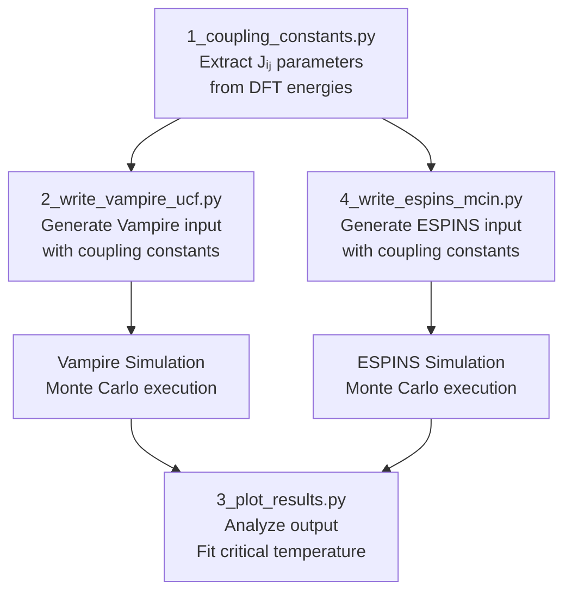
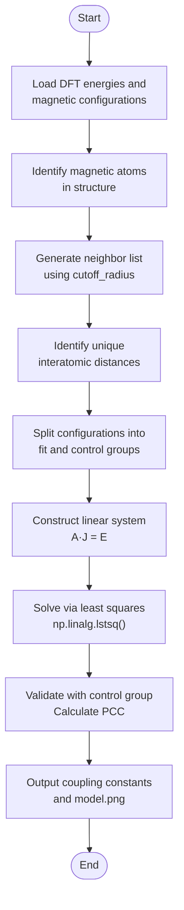
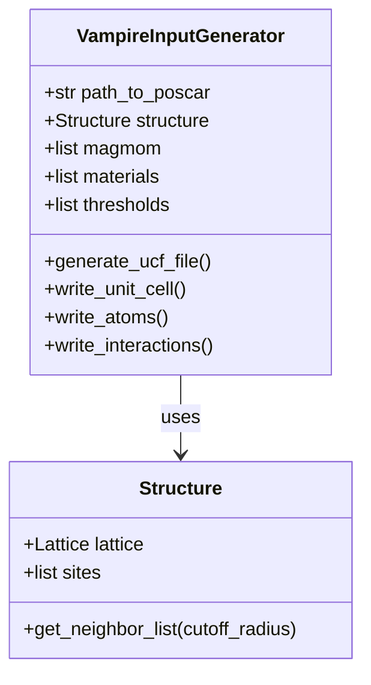
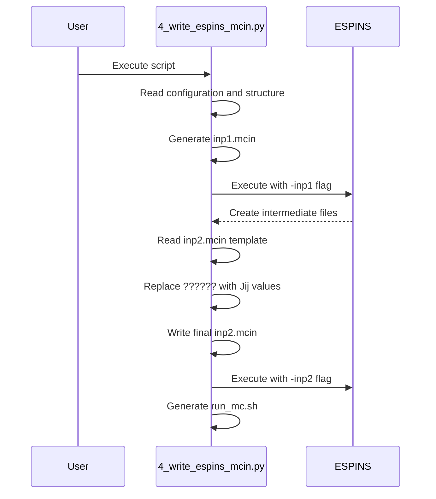

# Monte Carlo Simulation Module

<cite>
**Referenced Files in This Document**  
- [1_coupling_constants.py](file://3_monte_carlo/1_coupling_constants.py)
- [2_write_vampire_ucf.py](file://3_monte_carlo/2_write_vampire_ucf.py)
- [4_write_espins_mcin.py](file://3_monte_carlo/4_write_espins_mcin.py)
- [3_plot_results.py](file://3_monte_carlo/3_plot_results.py)
- [input_template.py](file://3_monte_carlo/input_template.py)
</cite>

## Table of Contents
1. [Introduction](#introduction)
2. [Workflow Overview](#workflow-overview)
3. [Heisenberg Model Parameterization](#heisenberg-model-parameterization)
4. [Coupling Constant Calculation](#coupling-constant-calculation)
5. [Input Generation for Simulation Software](#input-generation-for-simulation-software)
6. [Critical Temperature Fitting](#critical-temperature-fitting)
7. [Configuration Options](#configuration-options)
8. [Common Issues and Troubleshooting](#common-issues-and-troubleshooting)
9. [Conclusion](#conclusion)

## Introduction

The Monte Carlo simulation module in the automag framework enables the study of magnetic materials through computational thermodynamics. This module implements a complete workflow from first-principles data to thermodynamic predictions, focusing on the Heisenberg spin model. The system is designed to be accessible to researchers new to computational magnetism while providing the technical depth required for advanced materials analysis. The workflow leverages density functional theory (DFT) results from collinear calculations to parameterize spin Hamiltonians, which are then used in Monte Carlo simulations to predict magnetic behavior across temperature ranges.

## Workflow Overview

The Monte Carlo simulation workflow follows a sequential progression through four main scripts that transform DFT data into thermodynamic predictions. The process begins with coupling constant extraction and concludes with critical temperature analysis.



**Diagram sources**
- [1_coupling_constants.py](file://3_monte_carlo/1_coupling_constants.py)
- [2_write_vampire_ucf.py](file://3_monte_carlo/2_write_vampire_ucf.py)
- [4_write_espins_mcin.py](file://3_monte_carlo/4_write_espins_mcin.py)
- [3_plot_results.py](file://3_monte_carlo/3_plot_results.py)

**Section sources**
- [1_coupling_constants.py](file://3_monte_carlo/1_coupling_constants.py)
- [2_write_vampire_ucf.py](file://3_monte_carlo/2_write_vampire_ucf.py)
- [4_write_espins_mcin.py](file://3_monte_carlo/4_write_espins_mcin.py)
- [3_plot_results.py](file://3_monte_carlo/3_plot_results.py)

## Heisenberg Model Parameterization

The module implements the classical Heisenberg model for magnetic systems, where the Hamiltonian is expressed as H = -∑JᵢⱼSᵢ·Sⱼ, with Jᵢⱼ representing the exchange coupling constants between spins Sᵢ and Sⱼ. The parameterization process maps DFT-calculated total energies of various magnetic configurations to this spin Hamiltonian form. The system automatically identifies magnetic atoms in the structure, either by detecting transition metals or using user-specified magnetic atoms. Non-magnetic species are removed from the analysis to focus computational resources on the relevant magnetic subsystem.

The model validation process employs a train-test split methodology, where a portion of magnetic configurations (determined by `control_group_size`) serves as a validation set to assess model accuracy. This approach ensures that the derived coupling constants generalize well to unseen magnetic states, providing confidence in subsequent Monte Carlo predictions.

**Section sources**
- [1_coupling_constants.py](file://3_monte_carlo/1_coupling_constants.py#L100-L150)

## Coupling Constant Calculation

The coupling constant calculation script (1_coupling_constants.py) implements a linear least-squares fitting procedure to extract exchange parameters from DFT energy data. The algorithm constructs a system of linear equations where each magnetic configuration contributes one equation relating the observed energy to the sum of pairwise spin interactions.



**Diagram sources**
- [1_coupling_constants.py](file://3_monte_carlo/1_coupling_constants.py#L50-L180)

**Section sources**
- [1_coupling_constants.py](file://3_monte_carlo/1_coupling_constants.py#L50-L180)

The Pearson Correlation Coefficient (PCC) evaluation provides a quantitative measure of model accuracy by comparing predicted Heisenberg energies against actual DFT energies for the control group configurations. A high PCC value (close to 1.0) indicates excellent agreement between the spin Hamiltonian and first-principles results. The script automatically generates a scatter plot (model.png) visualizing this correlation, with the PCC value displayed in the legend. When `append_coupling_constants` is set to True, the derived parameters are automatically written to the input.py file for use in subsequent steps.

## Input Generation for Simulation Software

The framework supports two Monte Carlo simulation engines: Vampire and ESPINS. Separate scripts generate the appropriate input files for each software package, ensuring compatibility with their specific formatting requirements.

### Vampire Input Generation

The 2_write_vampire_ucf.py script creates Vampire input files in the UCF format, which specifies the unit cell, atomic positions, and exchange interactions. The script reconstructs the magnetic configuration corresponding to the selected state and generates the complete unit cell description including lattice vectors and fractional coordinates.



**Diagram sources**
- [2_write_vampire_ucf.py](file://3_monte_carlo/2_write_vampire_ucf.py#L50-L130)

**Section sources**
- [2_write_vampire_ucf.py](file://3_monte_carlo/2_write_vampire_ucf.py#L50-L130)

### ESPINS Input Generation

The 4_write_espins_mcin.py script handles ESPINS input generation through a two-step process that accommodates ESPINS's initialization requirements. The script first creates an initial input file (inp1.mcin) with structural information, then executes ESPINS to generate intermediate files, and finally creates a second input file (inp2.mcin) with the exchange parameters.



**Diagram sources**
- [4_write_espins_mcin.py](file://3_monte_carlo/4_write_espins_mcin.py#L50-L190)

**Section sources**
- [4_write_espins_mcin.py](file://3_monte_carlo/4_write_espins_mcin.py#L50-L190)

The dynamic replacement of "??????" placeholders with actual coupling constant values demonstrates an elegant solution to ESPINS's requirement for pre-processing before full parameter specification. The generated run_mc.sh script provides a convenient command to execute the final Monte Carlo simulation.

## Critical Temperature Fitting

The 3_plot_results.py script analyzes simulation output to determine critical magnetic properties, particularly the Curie or Néel temperature (Tc) and critical exponent (β). The analysis fits the temperature-dependent magnetization data to a power-law function near the phase transition.

```mermaid
flowchart LR
A[Load output file] --> B[Extract temperature and magnetization]
B --> C[Define fitting function<br>curve(x, Tc, beta)]
C --> D[Perform curve fitting<br>scipy.optimize.curve_fit]
D --> E[Generate fitted curve]
E --> F[Create comparison plot]
F --> G[Output Tc and beta values]
```

**Diagram sources**
- [3_plot_results.py](file://3_monte_carlo/3_plot_results.py#L10-L40)

**Section sources**
- [3_plot_results.py](file://3_monte_carlo/3_plot_results.py#L10-L40)

The fitting function implements the form m(T) = (1-T/Tc)β for T<Tc and m(T) = 0 for T≥Tc, which describes the mean-field behavior of second-order phase transitions. The resulting critical temperature provides a fundamental characterization of the material's magnetic properties, while the critical exponent offers insight into the universality class of the phase transition.

## Configuration Options

The Monte Carlo module is controlled through configuration parameters in the input.py file, with default values provided in input_template.py. These options allow users to customize the simulation workflow without modifying the core scripts.

| Parameter | Default Value | Description |
|---------|-------------|-------------|
| `configuration` | 'afm1' | Magnetic configuration to use as reference state for simulation |
| `cutoff_radius` | 4.1 | Maximum distance (Å) for identifying spin-spin interactions |
| `control_group_size` | 0.4 | Proportion of configurations reserved for model validation |
| `append_coupling_constants` | False | Whether to automatically write coupling constants to input.py |
| `poscar_file` | 'Fe2O3-alpha_conventional.vasp' | Structure file name in geometries directory |
| `calculator` | 'vasp' | DFT code used for energy calculations |

**Section sources**
- [input_template.py](file://3_monte_carlo/input_template.py)

The `cutoff_radius` parameter is particularly important as it determines the range of exchange interactions considered in the model. Too small a value may miss significant long-range interactions, while too large a value may introduce noise from weak, physically irrelevant couplings. The optimal value typically corresponds to the distance where exchange interactions decay to negligible levels, often 2-3 atomic shells beyond nearest neighbors.

## Common Issues and Troubleshooting

Several common issues may arise during the Monte Carlo workflow, primarily related to model accuracy and convergence.

### Poor Model Accuracy (Low PCC)

When the Pearson Correlation Coefficient is significantly below 0.9, it indicates poor agreement between the Heisenberg model and DFT energies. This can be addressed by:

1. **Adjusting cutoff_radius**: If magnetic interactions extend beyond the current cutoff, increase this value to capture longer-range couplings.
2. **Checking magnetic configurations**: Ensure the collinear calculations include a diverse set of magnetic states that adequately sample the energy landscape.
3. **Verifying magnetic atoms**: Confirm that all magnetic species are properly identified, either through automatic detection or explicit specification in `magnetic_atoms`.

### Convergence with Respect to Neighbor Distance

The stability of coupling constants across different cutoff radii provides insight into the convergence of the model. Users should perform a convergence test by running 1_coupling_constants.py with incrementally increasing cutoff_radius values. When the derived Jᵢⱼ parameters for shorter distances stabilize (change by less than 5%), the model can be considered converged with respect to interaction range.

### Insufficient Rank Error

The script may report "ERROR: SYSTEM OF X INDEPENDENT EQUATIONS IN Y UNKNOWNS!" when the number of linearly independent equations is less than the number of unknown coupling constants. This occurs when:
- Too few magnetic configurations are available from collinear calculations
- The configurations lack sufficient diversity in spin arrangements
- The system is overparameterized relative to available data

Solutions include generating additional magnetic configurations or reducing the cutoff_radius to decrease the number of unknown parameters.

**Section sources**
- [1_coupling_constants.py](file://3_monte_carlo/1_coupling_constants.py#L140-L160)

## Conclusion

The Monte Carlo simulation module provides a comprehensive framework for bridging first-principles calculations with thermodynamic predictions of magnetic materials. By systematically extracting exchange parameters from DFT data and leveraging established simulation packages like Vampire and ESPINS, the workflow enables accurate prediction of critical temperatures and magnetic phase transitions. The modular design separates concerns into distinct scripts, each handling a specific stage of the workflow, while maintaining data consistency through standardized input/output formats. For beginners, the automated parameterization and validation features reduce the barrier to entry for computational magnetism studies. For advanced users, the transparent implementation and configurable parameters allow for detailed investigation of spin Hamiltonian mapping and Monte Carlo thermodynamics. The integration of model validation through PCC evaluation and the systematic approach to convergence testing ensure reliable and physically meaningful results.