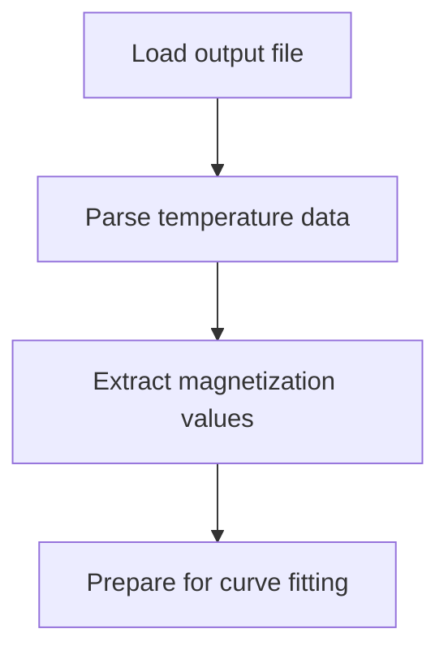
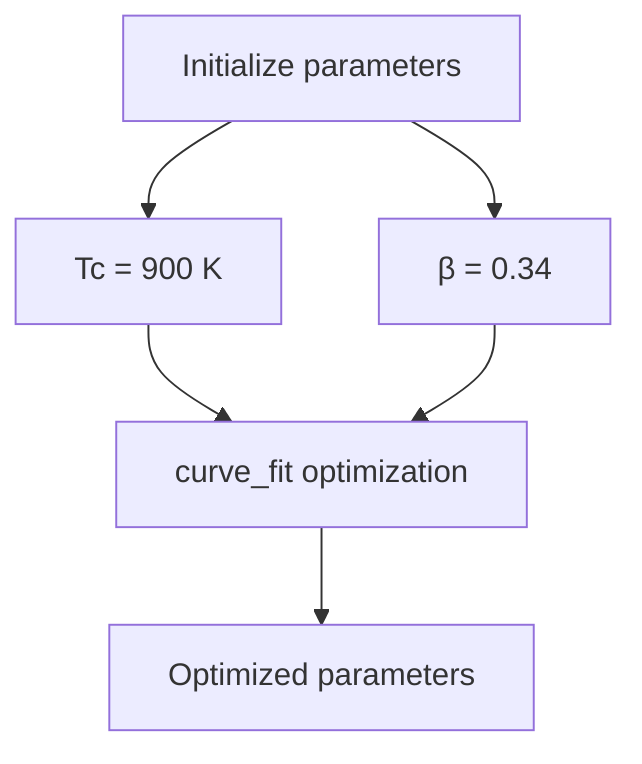
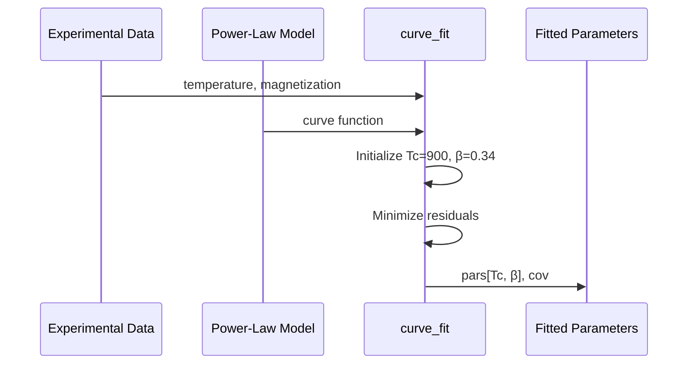
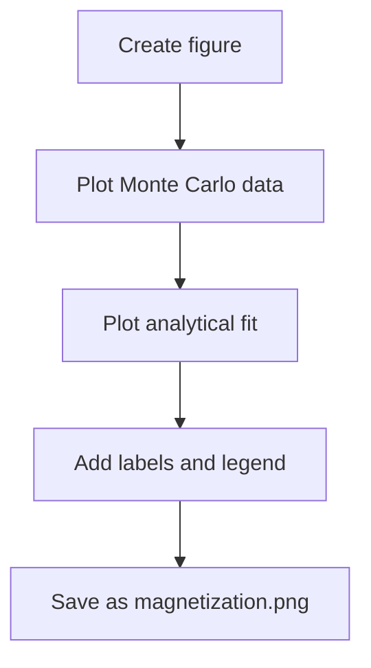
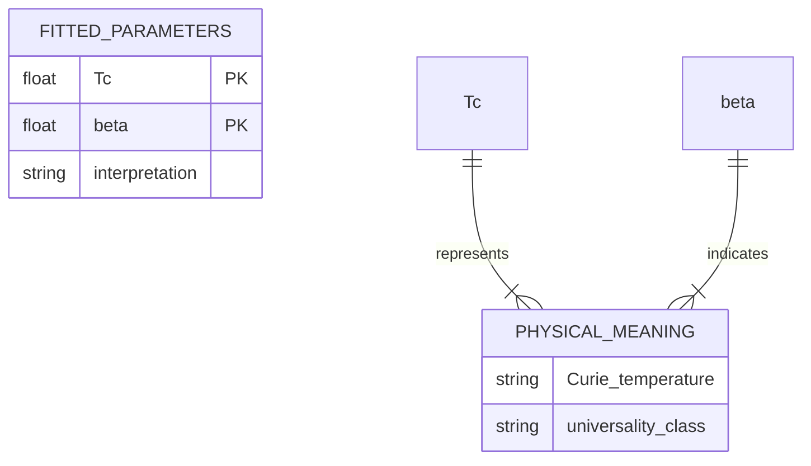
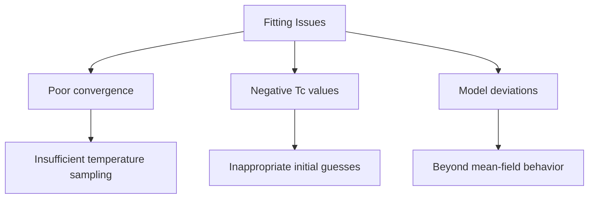

# Results Plotting and Critical Temperature Analysis

<cite>
**Referenced Files in This Document**  
- [3_plot_results.py](file://3_monte_carlo/3_plot_results.py)
- [1_coupling_constants.py](file://3_monte_carlo/1_coupling_constants.py)
- [2_write_vampire_ucf.py](file://3_monte_carlo/2_write_vampire_ucf.py)
- [example_input.py](file://3_monte_carlo/example_input.py)
- [README.md](file://README.md)
</cite>

## Table of Contents
1. [Introduction](#introduction)
2. [Data Loading and Preprocessing](#data-loading-and-preprocessing)
3. [Nonlinear Curve Fitting Implementation](#nonlinear-curve-fitting-implementation)
4. [Power-Law Model Definition](#power-law-model-definition)
5. [Curve Fitting Execution](#curve-fitting-execution)
6. [Results Visualization](#results-visualization)
7. [Parameter Interpretation](#parameter-interpretation)
8. [Model Reliability Assessment](#model-reliability-assessment)
9. [Common Fitting Issues](#common-fitting-issues)
10. [Advanced Analysis Extensions](#advanced-analysis-extensions)

## Introduction

The `3_plot_results.py` script in the Automag workflow performs critical analysis of Monte Carlo simulation results from magnetic systems, specifically focusing on determining the critical temperature (Tc) and critical exponent (β) through nonlinear curve fitting of temperature-magnetization data. This component bridges the gap between simulation output and physical interpretation, enabling researchers to extract fundamental magnetic properties from computational results. The script processes output from VAMPIRE or ESpinS simulations, applies a power-law model to the magnetization data, and generates visualizations that support scientific interpretation of phase transitions in magnetic materials.

**Section sources**
- [3_plot_results.py](file://3_monte_carlo/3_plot_results.py#L1-L43)
- [README.md](file://README.md#L217-L242)

## Data Loading and Preprocessing

The analysis begins with loading temperature-magnetization data from the simulation output file. The script reads the `output` file generated by VAMPIRE or ESpinS simulations using NumPy's `loadtxt` function, which parses the two-column data format where the first column represents temperature in Kelvin and the last column contains the mean magnetization length. This data structure allows for straightforward extraction of the relevant physical quantities needed for critical temperature analysis.



**Diagram sources**
- [3_plot_results.py](file://3_monte_carlo/3_plot_results.py#L18-L20)

**Section sources**
- [3_plot_results.py](file://3_monte_carlo/3_plot_results.py#L18-L20)

## Nonlinear Curve Fitting Implementation

The core analysis functionality is implemented using `scipy.optimize.curve_fit`, which performs nonlinear least squares fitting of the power-law model to the experimental data. The fitting process requires initial parameter guesses to converge to optimal values, with the script using 900 K for critical temperature (Tc) and 0.34 for the critical exponent (β) as starting points. These initial values represent typical physical expectations for magnetic systems and help guide the optimization algorithm toward physically meaningful solutions.



**Diagram sources**
- [3_plot_results.py](file://3_monte_carlo/3_plot_results.py#L22-L23)

## Power-Law Model Definition

The physical model implemented in the analysis follows the power-law behavior expected near the critical point of a second-order phase transition. The `curve` function defines the relationship M(T) ∝ (1 - T/Tc)^β for temperatures below Tc, with magnetization set to zero above the critical temperature. This implementation uses NumPy's `where` function to create a piecewise definition that ensures physical correctness across the entire temperature range. The model incorporates the sign function to handle potential numerical issues with fractional exponents when (1 - T/Tc) is negative.

```mermaid
classDiagram
class curve
curve : +x : float
curve : +Tc : float
curve : +beta : float
curve : +return : float
curve : +np.where(x < Tc, np.sign(1 - x/Tc) * np.abs(1 - x/Tc) ** beta, 0)
```

**Diagram sources**
- [3_plot_results.py](file://3_monte_carlo/3_plot_results.py#L15-L16)

**Section sources**
- [3_plot_results.py](file://3_monte_carlo/3_plot_results.py#L15-L16)

## Curve Fitting Execution

The curve fitting process executes the optimization using the defined power-law model and experimental data. The `curve_fit` function returns both the optimized parameter values (pars) and their covariance matrix (cov), which provides information about parameter uncertainties. The fitting algorithm minimizes the residual sum of squares between the experimental magnetization values and the model predictions across the temperature range, effectively finding the best-fit values for Tc and β that describe the phase transition behavior observed in the simulation.



**Diagram sources**
- [3_plot_results.py](file://3_monte_carlo/3_plot_results.py#L22-L23)

**Section sources**
- [3_plot_results.py](file://3_monte_carlo/3_plot_results.py#L22-L23)

## Results Visualization

The script generates comprehensive visualizations of both the raw simulation data and the analytical fit. Using Matplotlib, it creates a publication-quality plot with the Monte Carlo simulation results displayed as a reference curve and the fitted power-law model overlaid for comparison. The visualization includes proper axis labeling with physical units, a legend distinguishing the data sources, and is saved as `magnetization.png` for reporting and analysis purposes. The plot serves as a qualitative assessment of the fitting quality and provides immediate visual feedback on the agreement between simulation and theory.



**Diagram sources**
- [3_plot_results.py](file://3_monte_carlo/3_plot_results.py#L25-L36)

**Section sources**
- [3_plot_results.py](file://3_monte_carlo/3_plot_results.py#L25-L36)

## Parameter Interpretation

The fitted parameters provide fundamental physical insights into the magnetic system under study. The critical temperature (Tc) represents the Curie or Néel temperature, marking the phase transition point between ordered and disordered magnetic states. The critical exponent (β) serves as an indicator of the system's universality class, revealing information about the dimensionality and interaction range of the magnetic system. These parameters are printed to the console with appropriate formatting, providing researchers with immediate access to the key results of the analysis.



**Section sources**
- [3_plot_results.py](file://3_monte_carlo/3_plot_results.py#L38-L39)

## Model Reliability Assessment

The reliability of the fitted parameters is intrinsically linked to the quality of the underlying simulation data and the validity of the physical model assumptions. The coupling constants used in the Monte Carlo simulation, computed by `1_coupling_constants.py`, directly influence the accuracy of the temperature-magnetization relationship. A high-quality Heisenberg model, validated by a strong Pearson Correlation Coefficient (PCC) between DFT and predicted energies, increases confidence in the extracted critical parameters. The fitting quality serves as a secondary validation metric, with good agreement between simulation and power-law model supporting the appropriateness of mean-field assumptions for the system.

**Section sources**
- [1_coupling_constants.py](file://3_monte_carlo/1_coupling_constants.py#L1-L183)
- [README.md](file://README.md#L217-L242)

## Common Fitting Issues

Several common issues can affect the convergence and physical validity of the curve fitting process. Insufficient temperature sampling near the critical region can lead to poor fitting quality, as the algorithm lacks sufficient data points to accurately determine the transition behavior. Unphysical negative values for Tc may indicate problems with the initial parameter guesses or insufficient data range. Deviations from mean-field behavior, particularly in low-dimensional systems or those with strong fluctuations, can result in poor agreement between the power-law model and simulation data, suggesting the need for more sophisticated theoretical models.



**Section sources**
- [3_plot_results.py](file://3_monte_carlo/3_plot_results.py#L22-L23)
- [README.md](file://README.md#L217-L242)

## Advanced Analysis Extensions

The basic analysis framework can be extended to provide more comprehensive insights into the magnetic system. Error estimation can be implemented using the covariance matrix returned by `curve_fit` to calculate confidence intervals for the fitted parameters. This would involve extracting the diagonal elements of the covariance matrix to determine parameter uncertainties and propagating these errors to derived quantities. Comparative analysis across different magnetic systems can be facilitated by standardizing the output format and creating ensemble plots that highlight differences in critical behavior. Additionally, the script could be enhanced to support multiple fitting models, allowing researchers to compare the quality of different theoretical descriptions for the same dataset.

**Section sources**
- [3_plot_results.py](file://3_monte_carlo/3_plot_results.py#L22-L23)
- [example_input.py](file://3_monte_carlo/example_input.py#L1-L30)