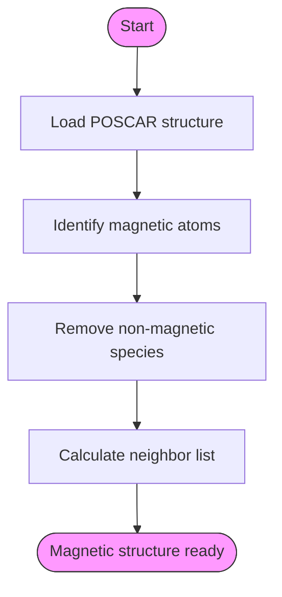
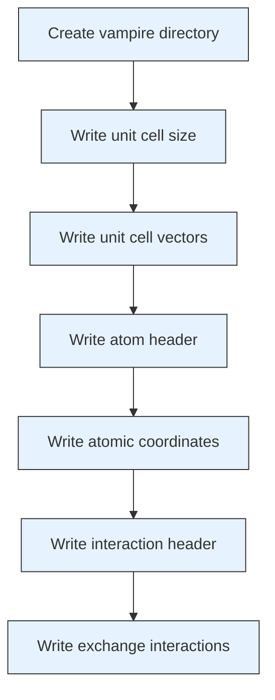
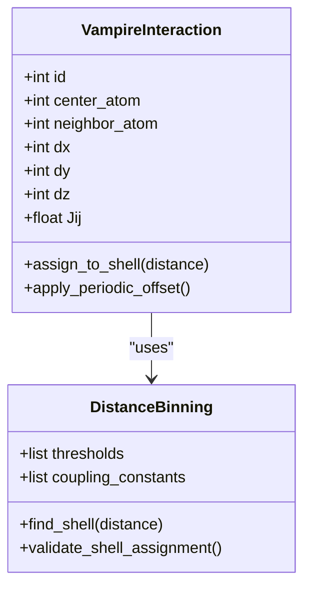
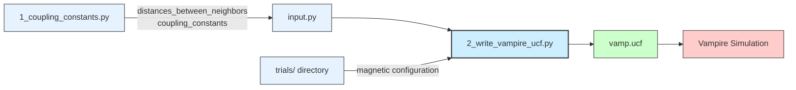

# Vampire Input File Generation

<cite>
**Referenced Files in This Document**   
- [2_write_vampire_ucf.py](file://3_monte_carlo/2_write_vampire_ucf.py)
- [1_coupling_constants.py](file://3_monte_carlo/1_coupling_constants.py)
- [input.py](file://3_monte_carlo/Fe12O18/input.py)
- [example_input.py](file://3_monte_carlo/example_input.py)
- [Al10Fe20Mo10/input.py](file://3_monte_carlo/Al10Fe20Mo10/input.py)
</cite>

## Table of Contents
1. [Introduction](#introduction)
2. [Magnetic Structure Construction](#magnetic-structure-construction)
3. [Vampire Input File Generation](#vampire-input-file-generation)
4. [Interatomic Interaction Mapping](#interatomic-interaction-mapping)
5. [Workflow Integration](#workflow-integration)
6. [Common Issues and Troubleshooting](#common-issues-and-troubleshooting)
7. [Validation and Verification](#validation-and-verification)

## Introduction

The Vampire input generation component is responsible for creating the `vamp.ucf` configuration file required for Monte Carlo simulations of magnetic materials. This process transforms DFT-derived magnetic configurations and coupling constants into a format compatible with the Vampire micromagnetic simulation software. The workflow begins with magnetic configuration selection from collinear calculations and culminates in the generation of a complete unit cell file that defines atomic positions, materials, and exchange interactions.

**Section sources**
- [2_write_vampire_ucf.py](file://3_monte_carlo/2_write_vampire_ucf.py#L1-L50)
- [1_coupling_constants.py](file://3_monte_carlo/1_coupling_constants.py#L1-L30)

## Magnetic Structure Construction

The input generation process begins by constructing a pymatgen Structure object containing only magnetic atoms. The script first identifies magnetic species based on either default transition metal classification or user-specified magnetic atoms from the input configuration.



**Diagram sources**
- [2_write_vampire_ucf.py](file://3_monte_carlo/2_write_vampire_ucf.py#L78-L85)

**Section sources**
- [2_write_vampire_ucf.py](file://3_monte_carlo/2_write_vampire_ucf.py#L78-L85)
- [1_coupling_constants.py](file://3_monte_carlo/1_coupling_constants.py#L100-L105)

## Vampire Input File Generation

The `vamp.ucf` file is generated with a structured format containing unit cell parameters, atomic coordinates, and material assignments. The script creates this file in a dedicated `vampire` directory and writes information in the following sequence:

1. Unit cell dimensions in angstroms
2. Unit cell vectors (normalized)
3. Atomic positions with material assignments
4. Interatomic interactions with exchange parameters



**Diagram sources**
- [2_write_vampire_ucf.py](file://3_monte_carlo/2_write_vampire_ucf.py#L104-L132)

**Section sources**
- [2_write_vampire_ucf.py](file://3_monte_carlo/2_write_vampire_ucf.py#L104-L132)

## Interatomic Interaction Mapping

The core of the input generation involves mapping interatomic interactions using distance-based binning. The process uses pre-calculated `distances_between_neighbors` and `coupling_constants` arrays to assign exchange parameters (Jij) to specific neighbor shells.

### Distance Threshold Calculation

The script calculates thresholds between consecutive neighbor distances to define interaction shells:

```python
thresholds = [(a + b) / 2 for a, b in zip(distances_between_neighbors[:-1], distances_between_neighbors[1:])]
thresholds = [0.0] + thresholds + [100.0]
```

This creates boundary values that separate different coordination shells, ensuring each interatomic distance is assigned to exactly one interaction parameter.

### Interaction Definition with Periodic Boundaries

For each neighbor pair, the script records:
- Central atom index (i)
- Neighbor atom index (j)
- Offset vectors (dx, dy, dz) representing periodic boundary conditions
- Exchange interaction parameter (Jij) based on distance binning



**Diagram sources**
- [2_write_vampire_ucf.py](file://3_monte_carlo/2_write_vampire_ucf.py#L120-L132)

**Section sources**
- [2_write_vampire_ucf.py](file://3_monte_carlo/2_write_vampire_ucf.py#L112-L132)
- [input.py](file://3_monte_carlo/Fe12O18/input.py#L35-L39)

## Workflow Integration

The Vampire input generation is integrated into a broader computational workflow that connects DFT calculations with Monte Carlo simulations.



**Diagram sources**
- [2_write_vampire_ucf.py](file://3_monte_carlo/2_write_vampire_ucf.py#L1-L50)
- [1_coupling_constants.py](file://3_monte_carlo/1_coupling_constants.py#L1-L30)

**Section sources**
- [2_write_vampire_ucf.py](file://3_monte_carlo/2_write_vampire_ucf.py#L1-L50)
- [1_coupling_constants.py](file://3_monte_carlo/1_coupling_constants.py#L1-L30)
- [input.py](file://3_monte_carlo/Fe12O18/input.py#L1-L40)

## Common Issues and Troubleshooting

### Overlapping Distance Shells

When neighbor distances are too close, threshold-based binning may lead to ambiguous shell assignments. This occurs when the difference between consecutive distances is smaller than the numerical precision:

```python
# Problem: Close distances create narrow thresholds
distances_between_neighbors = [2.898, 2.969]  # Difference: 0.071 Å
threshold = (2.898 + 2.969) / 2 = 2.9335
```

**Solution**: Adjust the `cutoff_radius` parameter in `input.py` to ensure sufficient separation between neighbor shells, or manually edit the distance thresholds.

### Atom Indexing Mismatches

The script uses pymatgen's neighbor list indices, which must correspond correctly to the atomic positions in the final structure. After removing non-magnetic species, the indexing must remain consistent.

**Section sources**
- [2_write_vampire_ucf.py](file://3_monte_carlo/2_write_vampire_ucf.py#L85-L87)
- [2_write_vampire_ucf.py](file://3_monte_carlo/2_write_vampire_ucf.py#L120-L125)

### Unit Conversion of Coupling Constants

The coupling constants are converted from eV to SI units (Joules) in `1_coupling_constants.py`:

```python
coupling_constants = values[0][1:] * 1.60218e-19  # eV to Joules
```

This conversion is critical as Vampire expects interaction parameters in Joules. Verify that the input.py file contains values in the correct units.

**Section sources**
- [1_coupling_constants.py](file://3_monte_carlo/1_coupling_constants.py#L160-L165)

## Validation and Verification

To ensure the correctness of generated `vamp.ucf` files, perform the following validation steps:

1. **Structure Verification**: Confirm that only magnetic atoms are present in the output structure
2. **Distance Consistency**: Check that interatomic distances match the expected neighbor shells
3. **Parameter Units**: Verify coupling constants are in Joules (typically 10^-21 to 10^-22 range)
4. **Periodic Boundaries**: Ensure offset vectors correctly represent the periodic nature of the crystal

The generated file should be inspected for proper formatting and physical plausibility before initiating Vampire simulations.

**Section sources**
- [2_write_vampire_ucf.py](file://3_monte_carlo/2_write_vampire_ucf.py#L104-L132)
- [1_coupling_constants.py](file://3_monte_carlo/1_coupling_constants.py#L160-L165)