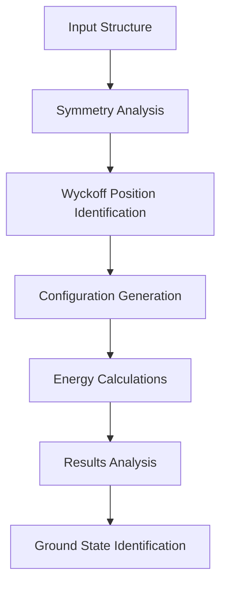
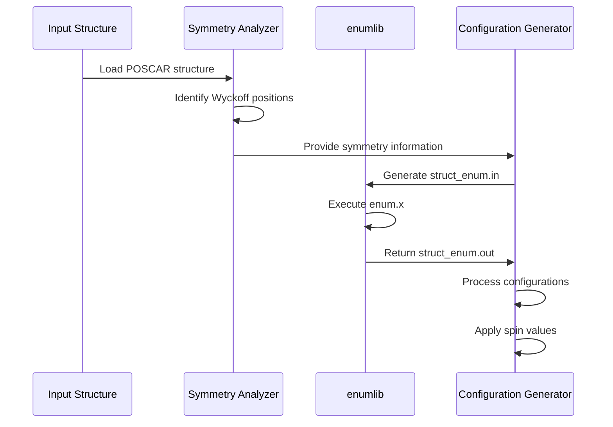
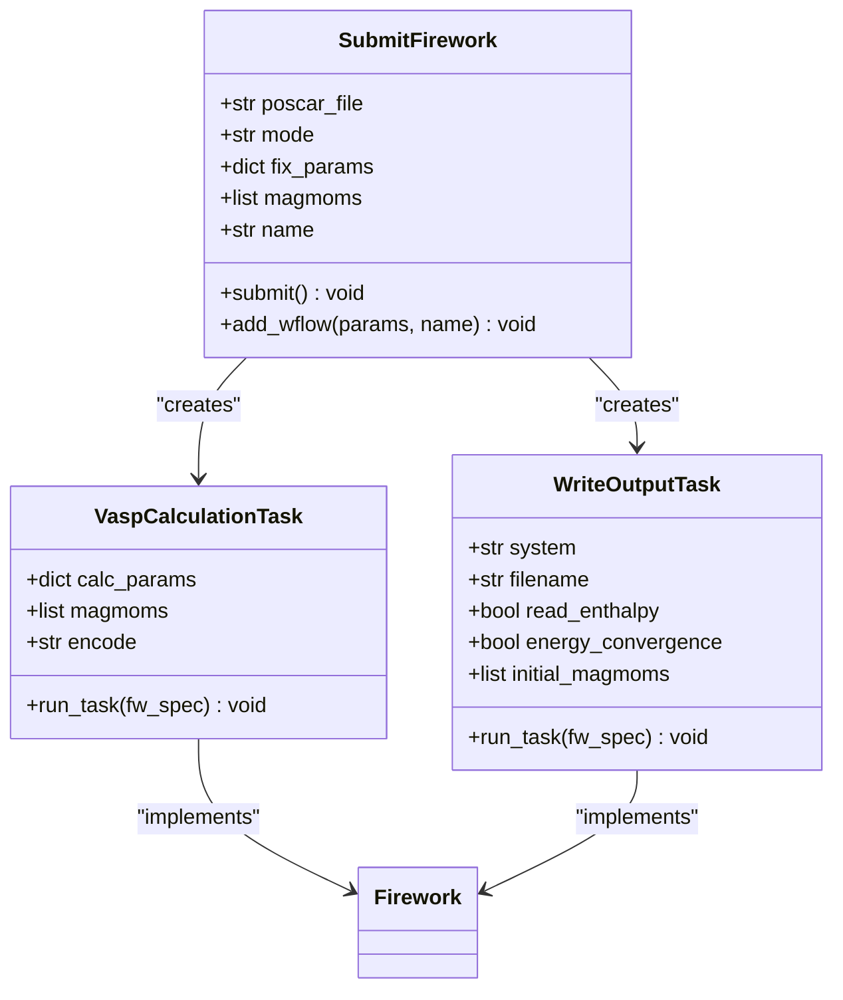
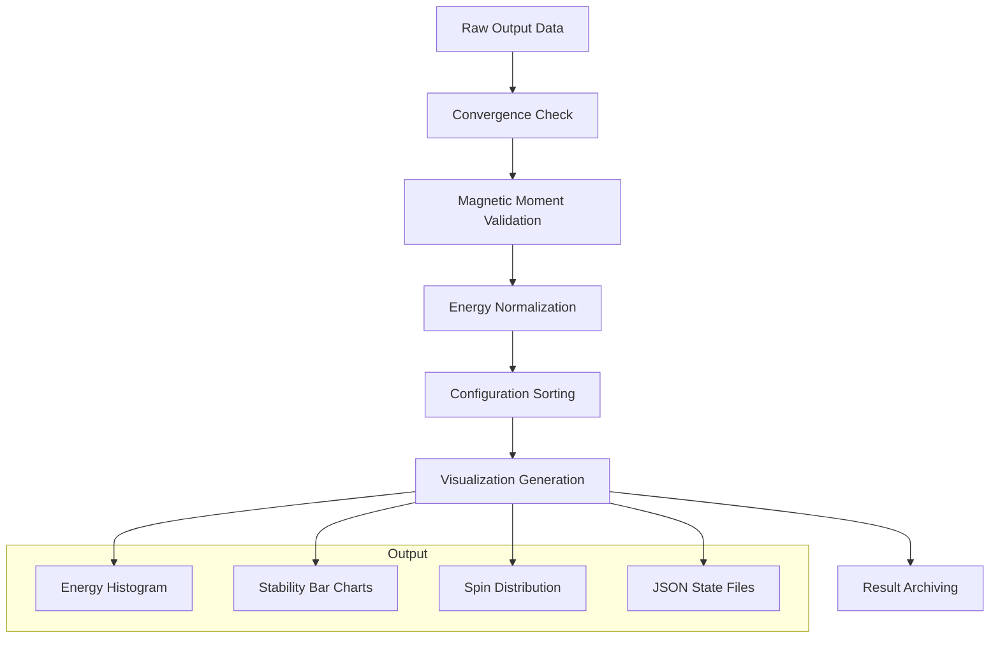
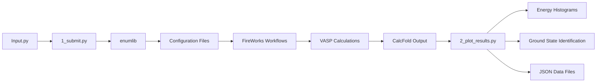

# Collinear Magnetic Configuration Search

<cite>
**Referenced Files in This Document**  
- [README.md](file://README.md#L150-L204)
- [2_coll/1_submit.py](file://2_coll/1_submit.py)
- [2_coll/2_plot_results.py](file://2_coll/2_plot_results.py)
- [2_coll/input_template.py](file://2_coll/input_template.py)
- [common/SubmitFirework.py](file://common/SubmitFirework.py)
- [common/utilities.py](file://common/utilities.py)
</cite>

## Table of Contents
1. [Introduction](#introduction)
2. [Core Functionality](#core-functionality)
3. [Configuration Generation with enumlib](#configuration-generation-with-enumlib)
4. [Energy Calculation Workflow](#energy-calculation-workflow)
5. [Results Analysis and Visualization](#results-analysis-and-visualization)
6. [Input Parameters and Configuration](#input-parameters-and-configuration)
7. [Data Flow and Processing Pipeline](#data-flow-and-processing-pipeline)
8. [Common Issues and Best Practices](#common-issues-and-best-practices)
9. [Integration with Subsequent Analyses](#integration-with-subsequent-analyses)

## Introduction

The Collinear Magnetic Configuration Search module is a critical component of the Automag workflow, designed to systematically identify the ground state magnetic configuration of a given material structure. This module operates by generating all possible collinear magnetic configurations across Wyckoff positions and determining the most thermodynamically stable state through comparative energy calculations. The approach enables comprehensive exploration of ferromagnetic (FM), antiferromagnetic (AFM), non-magnetic (NM), and ferrimagnetic (FiM) states, providing a robust foundation for subsequent magnetic property analyses.

**Section sources**
- [README.md](file://README.md#L150-L204)

## Core Functionality

The collinear magnetic configuration search module systematically explores the magnetic configuration space by generating trial configurations that differ in unit cell choice and magnetic moment initialization. The module leverages symmetry analysis to efficiently generate configurations while respecting crystallographic constraints. For each magnetic atom, users can specify one or two absolute values for magnetization, enabling exploration of both high-spin (HS) and low-spin (LS) states. When two values are provided, the module generates all possible combinations of HS and LS initialization across Wyckoff positions, significantly expanding the configuration space.

The module's core functionality includes:
- Systematic generation of FM, AFM, NM, and FiM configurations
- Support for multiple spin values representing HS and LS states
- Symmetry-aware configuration generation using Wyckoff positions
- Energy-based ranking of configurations to identify the ground state

**Diagram sources**
- [2_coll/1_submit.py](file://2_coll/1_submit.py)
- [2_coll/2_plot_results.py](file://2_coll/2_plot_results.py)

**Section sources**
- [README.md](file://README.md#L150-L204)
- [2_coll/1_submit.py](file://2_coll/1_submit.py#L1-L50)

## Configuration Generation with enumlib

The configuration generation process is powered by enumlib, a specialized library for enumerating crystallographic configurations. The module initiates this process by analyzing the input structure's symmetry using pymatgen's SpacegroupAnalyzer to identify equivalent sites and Wyckoff positions. For each Wyckoff position occupied by magnetic atoms, the module generates configurations with ferromagnetic, antiferromagnetic, or non-magnetic initialization, considering all possible combinations.

The enumlib integration follows a systematic approach:
1. Creation of a `struct_enum.in` input file containing lattice parameters and site information
2. Execution of `enum.x` to generate symmetry-distinct configurations
3. Post-processing of `struct_enum.out` to resolve formatting issues
4. Conversion of enumerated structures to VASP format using `makeStr.py`

For configurations requiring high-spin and low-spin state exploration, the module implements a multiplier system that tracks spin magnitude variations across equivalent sites. When multiple spin values are specified for a magnetic species, the module generates additional configuration branches that explore all combinations of these values across Wyckoff positions.

**Diagram sources**
- [2_coll/1_submit.py](file://2_coll/1_submit.py#L100-L200)
- [common/utilities.py](file://common/utilities.py#L64-L151)

**Section sources**
- [2_coll/1_submit.py](file://2_coll/1_submit.py#L100-L300)

## Energy Calculation Workflow

The energy calculation workflow is orchestrated through FireWorks, a Python library for defining, managing, and executing scientific workflows. The module uses the SubmitFirework class to create and submit Firework workflows for each generated magnetic configuration. Each workflow consists of a series of computational tasks that perform single-point energy calculations using VASP.

The workflow architecture includes:
- **VaspCalculationTask**: Executes VASP calculations with specified parameters
- **WriteOutputTask**: Aggregates results and writes to output files
- Workflow management through LaunchPad and Firework classes

For each configuration, the workflow first performs a single-point energy calculation with initial magnetic moments, followed by a recalculation using the final magnetic moments from the previous step. This two-step approach ensures convergence of magnetic moments and provides more accurate energy comparisons. The NM (non-magnetic) configuration is handled as a special case with a simplified workflow.

**Diagram sources**
- [common/SubmitFirework.py](file://common/SubmitFirework.py)
- [common/utilities.py](file://common/utilities.py#L64-L218)

**Section sources**
- [common/SubmitFirework.py](file://common/SubmitFirework.py)
- [2_coll/1_submit.py](file://2_coll/1_submit.py#L300-L387)

## Results Analysis and Visualization

The results analysis component, implemented in `2_plot_results.py`, processes the output from completed energy calculations to identify the ground state configuration and generate comprehensive visualizations. The script reads energy and magnetic moment data from the central results file in the CalcFold directory, then performs several analytical steps to extract meaningful insights.

Key analysis steps include:
1. **Data aggregation**: Collecting energy and magnetic moment information for all configurations
2. **Convergence filtering**: Excluding non-converged calculations from analysis
3. **Magnetic moment validation**: Ensuring final magnetic moments maintain the intended collinear pattern
4. **Energy normalization**: Converting energies to relative values in meV/atom
5. **Configuration ranking**: Sorting configurations by energy to identify the most stable state

The module produces several output files and visualizations:
- Energy histograms showing the distribution of configuration energies
- Bar charts displaying relative energies of all valid configurations
- JSON files containing magnetic states and energies for subsequent analyses
- Spin distribution histograms
- Archive containing all relevant results

The script implements intelligent handling of large configuration sets by splitting bar charts into multiple figures when the number of configurations exceeds a threshold, ensuring readability of results.

**Diagram sources**
- [2_coll/2_plot_results.py](file://2_coll/2_plot_results.py)
- [common/utilities.py](file://common/utilities.py#L155-L218)

**Section sources**
- [2_coll/2_plot_results.py](file://2_coll/2_plot_results.py)

## Input Parameters and Configuration

The module is configured through an input file that specifies key parameters for the magnetic configuration search. The primary input parameters include:

- **poscar_file**: Name of the POSCAR file containing the input geometry
- **supercell_size**: Maximum supercell size for generating distinct magnetic configurations
- **spin_values**: Dictionary specifying one or two magnetization values (in Bohr magnetons) for each magnetic atom
- **params**: Collection of VASP parameters for single-point energy calculations
- **lower_cutoff**: Minimum magnetic moment value for configuration inclusion in critical temperature estimation

The `supercell_size` parameter controls the extent of configuration space exploration, with larger values enabling more complex magnetic orderings but exponentially increasing computational cost. The `spin_values` parameter is particularly important, as specifying two values (e.g., `[5, 3]` for iron) enables exploration of both high-spin and low-spin states across all Wyckoff positions.

Additional optional parameters allow fine-tuning of the calculation workflow, including calculator selection (VASP, Quantum Espresso, or FPLO), job submission settings, and parallelization options. The module also supports manual job submission through SLURM when FireWorks integration is disabled.

**Section sources**
- [2_coll/input_template.py](file://2_coll/input_template.py)
- [README.md](file://README.md#L180-L190)

## Data Flow and Processing Pipeline

The collinear magnetic configuration search follows a well-defined data flow from input specification to final results. The pipeline begins with the input structure in POSCAR format, which is processed to identify magnetic atoms and their Wyckoff positions. Configuration generation proceeds through symmetry analysis and enumlib enumeration, producing a comprehensive set of trial magnetic states.

The processing pipeline can be summarized as:
1. **Input Processing**: Reading the input structure and parameters
2. **Symmetry Analysis**: Identifying equivalent sites and Wyckoff positions
3. **Configuration Generation**: Creating all possible FM, AFM, NM, and FiM combinations
4. **Workflow Creation**: Generating FireWorks workflows for each configuration
5. **Energy Calculation**: Executing VASP calculations through the cluster queue
6. **Results Aggregation**: Collecting and processing output data
7. **Analysis and Visualization**: Identifying the ground state and generating plots

Data flows between components through standardized file formats and database interactions. Configuration information is stored in text files with standardized naming conventions, while energy and magnetic moment data are aggregated in a central results file. The final output includes both human-readable visualizations and machine-readable data files for downstream analyses.

**Diagram sources**
- [2_coll/1_submit.py](file://2_coll/1_submit.py)
- [2_coll/2_plot_results.py](file://2_coll/2_plot_results.py)

**Section sources**
- [2_coll/1_submit.py](file://2_coll/1_submit.py)
- [2_coll/2_plot_results.py](file://2_coll/2_plot_results.py)

## Common Issues and Best Practices

The collinear magnetic configuration search module is susceptible to combinatorial explosion, particularly with large supercell sizes or materials with multiple magnetic species. A supercell size of 2 or greater can generate thousands of configurations, leading to prohibitively long calculation times. To mitigate this issue, users should:

1. **Start with small supercells**: Begin with `supercell_size = 1` to identify the dominant magnetic ordering
2. **Use appropriate spin values**: Select spin values based on chemical knowledge of the material system
3. **Monitor calculation progress**: Use the FireWorks dashboard to track workflow status
4. **Validate magnetic moment convergence**: Check that initial and final magnetic moments are consistent

Best practices for configuration include:
- Setting realistic `lower_cutoff` values to filter out low-moment configurations
- Using symmetry-adapted spin values that reflect expected magnetic behavior
- Verifying VASP parameter settings for magnetic calculations
- Ensuring proper FireWorks configuration and database connectivity

When encountering non-converged calculations, users should examine the VASP output files to determine whether the issue stems from magnetic moment instability, electronic convergence problems, or other factors.

**Section sources**
- [README.md](file://README.md#L150-L204)
- [2_coll/1_submit.py](file://2_coll/1_submit.py)
- [2_coll/2_plot_results.py](file://2_coll/2_plot_results.py)

## Integration with Subsequent Analyses

The collinear magnetic configuration search module serves as the foundation for subsequent magnetic property analyses, particularly Monte Carlo simulations for critical temperature estimation. The module outputs JSON files containing the magnetic states and energies of all valid configurations, which are used as input for the Heisenberg model parameterization in the Monte Carlo module.

The integration workflow proceeds as follows:
1. The most stable configuration identified by the collinear search is used as the reference state
2. Magnetic coupling constants are calculated based on energy differences between configurations
3. The Heisenberg model is validated using a control group of configurations
4. Monte Carlo simulations are performed using the parameterized model

This seamless integration enables a comprehensive workflow from ground state identification to finite-temperature magnetic property prediction. The module's output format is specifically designed to facilitate this downstream analysis, ensuring compatibility with the Monte Carlo simulation tools in the Automag suite.

**Section sources**
- [README.md](file://README.md#L150-L204)
- [2_coll/2_plot_results.py](file://2_coll/2_plot_results.py#L200-L300)