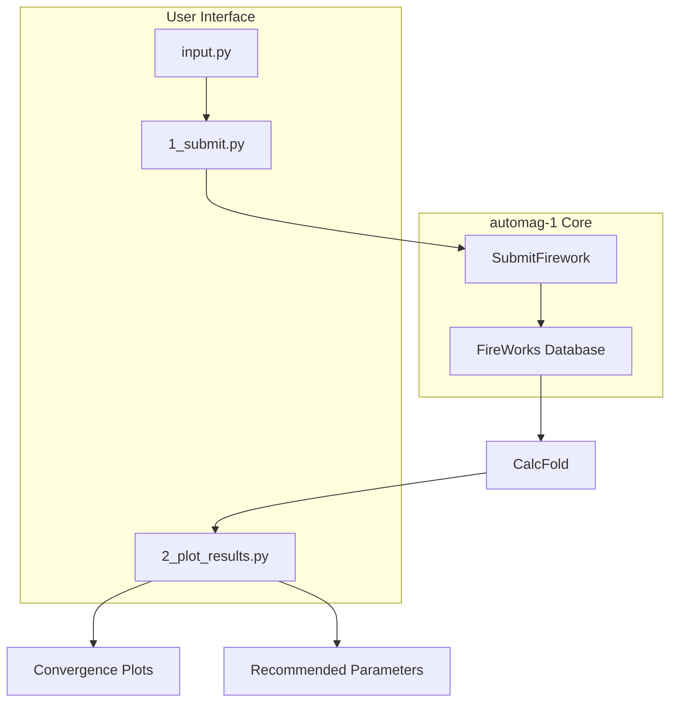
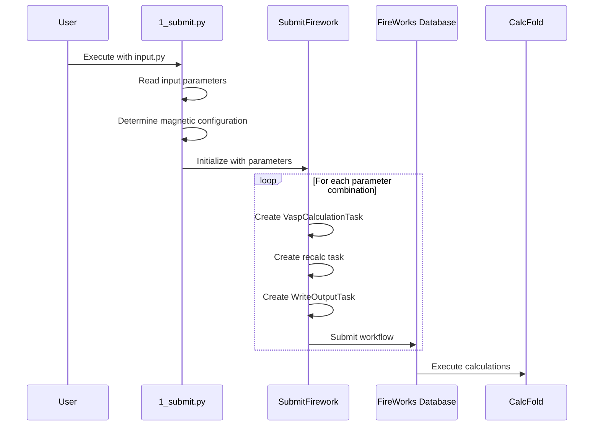
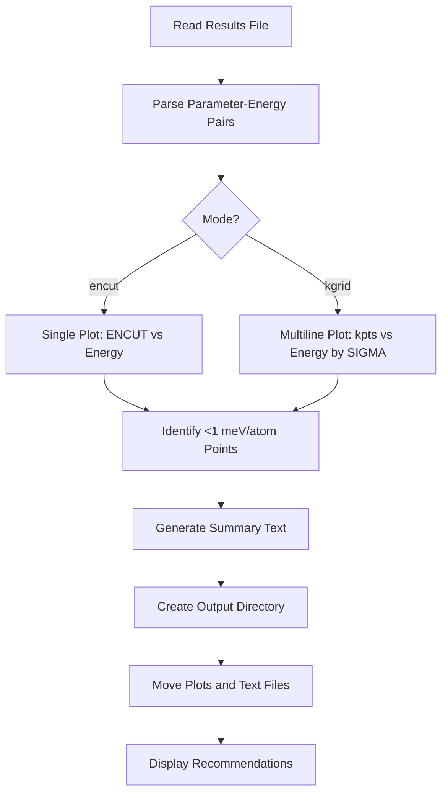

# Convergence Testing

<cite>
**Referenced Files in This Document**   
- [0_conv_tests/1_submit.py](file://0_conv_tests/1_submit.py)
- [0_conv_tests/2_plot_results.py](file://0_conv_tests/2_plot_results.py)
- [common/SubmitFirework.py](file://common/SubmitFirework.py)
- [README.md](file://README.md)
</cite>

## Table of Contents
1. [Introduction](#introduction)
2. [Module Architecture](#module-architecture)
3. [Input Configuration](#input-configuration)
4. [Workflow Execution](#workflow-execution)
5. [Results Processing and Analysis](#results-processing-and-analysis)
6. [Integration with FireWorks and qlaunch](#integration-with-fireworks-and-qlaunch)
7. [Results Storage in CalcFold](#results-storage-in-calcfold)
8. [Common Issues and Troubleshooting](#common-issues-and-troubleshooting)
9. [Optimization Tips](#optimization-tips)
10. [Conclusion](#conclusion)

## Introduction
The convergence testing module in automag-1 is designed to systematically evaluate key VASP parameters—ENCUT, SIGMA, and kpts—to ensure accurate and reliable DFT calculations. This module enables users to determine optimal computational parameters by analyzing energy convergence with respect to these variables. The process involves configuring input parameters, generating automated workflows via FireWorks, executing VASP calculations, and analyzing output to identify parameter values that yield energy errors below 1 meV/atom. This documentation provides a comprehensive overview of the module's architecture, functionality, and practical usage.

## Module Architecture
The convergence testing module is structured around two primary scripts: `1_submit.py` for workflow generation and `2_plot_results.py` for result analysis. The module resides in the `0_conv_tests` directory and relies on configuration from `input.py`. It integrates with core components in the `common` directory, particularly `SubmitFirework.py`, which handles FireWorks workflow creation and submission. The architecture supports two modes: 'encut' for energy cutoff convergence and 'kgrid' for simultaneous evaluation of SIGMA and kpts parameters. This modular design enables systematic parameter sweeps while maintaining compatibility with the broader automag-1 workflow system.

**Diagram sources**
- [0_conv_tests/1_submit.py](file://0_conv_tests/1_submit.py)
- [0_conv_tests/2_plot_results.py](file://0_conv_tests/2_plot_results.py)
- [common/SubmitFirework.py](file://common/SubmitFirework.py)

**Section sources**
- [0_conv_tests/1_submit.py](file://0_conv_tests/1_submit.py)
- [0_conv_tests/2_plot_results.py](file://0_conv_tests/2_plot_results.py)
- [common/SubmitFirework.py](file://common/SubmitFirework.py)

## Input Configuration
The convergence testing module is configured through the `input.py` file, which accepts both required and optional parameters. The `mode` parameter determines whether the test evaluates ENCUT ('encut') or SIGMA and kpts ('kgrid'). The `poscar_file` parameter specifies the input geometry file located in the `geometries` directory. The `params` dictionary contains fixed VASP parameters for single-point energy calculations. Optional parameters include `magnetic_atoms` (defaults to transition metals), `configuration` (defaults to ferromagnetic high-spin), and customizable parameter ranges: `encut_values` (default: 500-1000 eV in 10 eV steps), `sigma_values` (default: 0.05-0.20 eV in 0.05 eV steps), and `kpts_values` (default: 20-100 A⁻¹ in 10 A⁻¹ steps). These defaults can be overridden to suit specific computational requirements.

**Section sources**
- [README.md](file://README.md#L54-L82)

## Workflow Execution
The `1_submit.py` script orchestrates the convergence testing workflow by reading configuration from `input.py` and generating FireWorks workflows. When executed, it first determines the magnetic configuration, defaulting to 4.0 Bohr magnetons for magnetic atoms (typically transition metals) and 0.0 for non-magnetic atoms. For 'encut' mode, it creates workflows varying the ENCUT parameter while keeping SIGMA and kpts fixed. For 'kgrid' mode, it generates workflows that simultaneously vary SIGMA and kpts values. The script uses the `SubmitFirework` class to create Firework objects that encapsulate VASP calculation tasks, including single-point energy calculations and recalculation with updated magnetic moments. Each parameter combination is submitted as a separate workflow to the FireWorks database, enabling parallel execution and job management through the cluster's queue system.

**Diagram sources**
- [0_conv_tests/1_submit.py](file://0_conv_tests/1_submit.py#L46-L96)
- [common/SubmitFirework.py](file://common/SubmitFirework.py#L96-L135)

**Section sources**
- [0_conv_tests/1_submit.py](file://0_conv_tests/1_submit.py)
- [common/SubmitFirework.py](file://common/SubmitFirework.py)

## Results Processing and Analysis
The `2_plot_results.py` script processes output data from completed convergence tests to generate comprehensive analysis. It reads energy values from the results file in `CalcFold` and creates convergence plots showing energy per atom versus the varied parameter(s). For 'encut' mode, it produces a simple plot of ENCUT versus energy. For 'kgrid' mode, it generates multiple curves showing energy versus kpts for different SIGMA values. The script identifies parameter combinations where the energy error is less than 1 meV/atom compared to the most accurate (highest parameter value) result. It outputs both visual plots and text summaries identifying recommended parameter values. The results are organized into a dedicated folder named after the chemical formula, with plots and text files automatically moved into this directory for easy access and record-keeping.

**Diagram sources**
- [0_conv_tests/2_plot_results.py](file://0_conv_tests/2_plot_results.py#L47-L86)

**Section sources**
- [0_conv_tests/2_plot_results.py](file://0_conv_tests/2_plot_results.py)

## Integration with FireWorks and qlaunch
The convergence testing module integrates with FireWorks for workflow management and job orchestration. The `SubmitFirework` class creates Firework objects that represent individual VASP calculation steps, including single-point energy calculations, recalculation with updated magnetic moments, and output writing tasks. These fireworks are organized into workflows with proper dependencies and submitted to the FireWorks database. Users then employ `qlaunch` to execute these workflows on the computing cluster. The typical command `nohup qlaunch -r rapidfire -m 10 --nlaunches=infinite &` runs in the background, continuously checking for new workflows and submitting them to the cluster queue while limiting concurrent jobs to 10. This integration enables efficient resource utilization, fault tolerance, and seamless management of potentially hundreds of parameter combinations in the convergence study.

**Section sources**
- [README.md](file://README.md#L77-L82)

## Results Storage in CalcFold
All convergence test results are stored in the `CalcFold` directory, which serves as the central repository for computational outputs in automag-1. Within `CalcFold`, results are organized hierarchically by chemical formula, calculator type, and convergence parameter. The `2_plot_results.py` script reads energy values from text files in this directory, specifically from files named according to the pattern `{chemical_formula}_{mode}.txt`. After processing, the script creates a dedicated folder for each convergence test, named after the chemical formula, and moves all generated plots and summary files into this folder. This structured storage approach ensures that results are easily locatable, prevents file clutter, and maintains a clear record of all convergence studies for future reference and comparison.

**Section sources**
- [0_conv_tests/2_plot_results.py](file://0_conv_tests/2_plot_results.py#L51-L52)

## Common Issues and Troubleshooting
Common issues in convergence testing include incorrect POSCAR file paths and missing pseudopotentials. If the `poscar_file` parameter references a file not present in the `geometries` directory, the workflow generation will fail. Users should verify that POSCAR files are correctly placed and that filenames match exactly, including case sensitivity. Missing pseudopotentials can cause VASP calculations to fail; users must ensure that the `VASP_PP_PATH` environment variable points to a directory containing both `potpaw_LDA` and `potpaw_PBE` subdirectories with appropriate POTCAR files. Other issues include insufficient computational resources for high-parameter calculations and convergence failures in VASP. Monitoring the `is_converged` files in calculation directories can help identify non-converged runs that may require parameter adjustments or additional computational resources.

**Section sources**
- [README.md](file://README.md#L62-L63)
- [common/SubmitFirework.py](file://common/SubmitFirework.py#L238-L258)

## Optimization Tips
To balance accuracy and computational cost in convergence testing, users should strategically select parameter ranges. For ENCUT, starting from the default 500 eV and increasing in 10 eV increments is generally efficient, as energy typically converges rapidly beyond the recommended cutoff. For kpts, beginning with coarser grids (e.g., 20-40 A⁻¹) and refining only if necessary can save significant computational time. Users should also consider the physical characteristics of their material—systems with strong electronic correlations may require denser k-point grids, while materials with weak dispersion may converge with coarser sampling. Running preliminary tests with reduced parameter ranges can help estimate computational requirements before committing to full convergence studies. Additionally, monitoring energy differences between consecutive parameter values can identify convergence plateaus, allowing users to terminate calculations early when further parameter increases yield negligible energy changes.

**Section sources**
- [README.md](file://README.md#L73-L76)

## Conclusion
The convergence testing module in automag-1 provides a robust framework for systematically evaluating VASP parameters to ensure accurate DFT calculations. By leveraging the `1_submit.py` and `2_plot_results.py` scripts, users can efficiently generate and analyze parameter sweeps for ENCUT, SIGMA, and kpts. The integration with FireWorks enables scalable workflow management, while the structured results processing provides clear recommendations for optimal computational parameters. Proper configuration through `input.py` and attention to common issues such as file paths and pseudopotential availability are essential for successful convergence studies. By following optimization strategies and leveraging the module's automated analysis, researchers can achieve reliable results while minimizing computational costs, establishing a solid foundation for subsequent magnetic property calculations in the automag-1 workflow.