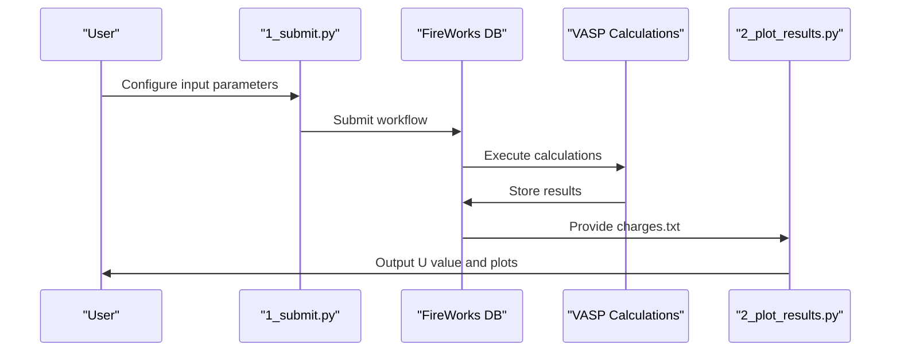
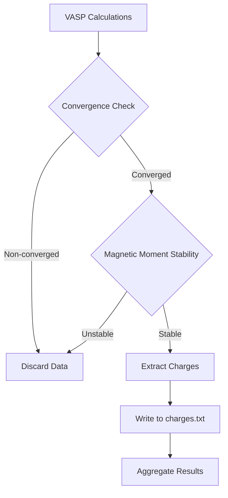

# Linear Response U Calculation

<cite>
**Referenced Files in This Document**   
- [README.md](file://README.md)
- [1_lin_response/1_submit.py](file://1_lin_response/1_submit.py)
- [1_lin_response/2_plot_results.py](file://1_lin_response/2_plot_results.py)
- [1_lin_response/input_template.py](file://1_lin_response/input_template.py)
- [common/SubmitFirework.py](file://common/SubmitFirework.py)
- [common/utilities.py](file://common/utilities.py)
- [common/write_charges.py](file://common/write_charges.py)
</cite>

## Table of Contents
1. [Introduction](#introduction)
2. [Theoretical Foundation](#theoretical-foundation)
3. [Workflow Implementation](#workflow-implementation)
4. [Input Configuration](#input-configuration)
5. [Data Processing and Analysis](#data-processing-and-analysis)
6. [Integration with FireWorks](#integration-with-fireworks)
7. [Common Pitfalls and Best Practices](#common-pitfalls-and-best-practices)
8. [Relationship to Magnetic Property Pipeline](#relationship-to-magnetic-property-pipeline)

## Introduction

The Linear Response U Calculation module in automag-1 implements a systematic approach for determining the Hubbard U parameter for magnetic atoms in materials. This parameter is crucial for accurate modeling of strongly correlated electron systems in density functional theory (DFT) calculations. The module follows the linear response formalism, which applies small perturbations to a target magnetic atom and analyzes the resulting charge response to extract the Hubbard U value.

The implementation consists of two primary scripts: `1_submit.py` for launching VASP calculations and `2_plot_results.py` for analyzing the results. The workflow is designed to integrate seamlessly with FireWorks for job management on computing clusters, while also supporting manual execution. This documentation provides a comprehensive overview of the theoretical basis, implementation details, and practical usage of this module.

**Section sources**
- [README.md](file://README.md#L130-L185)

## Theoretical Foundation

The linear response method for calculating the Hubbard U parameter is based on applying a series of small perturbations to a magnetic atom and measuring the system's response. The core principle involves treating the target atom as a "dummy" species while maintaining its electronic properties through careful POTCAR file management.

The key theoretical concept involves the relationship between the applied perturbation potential (α) and the induced change in electron occupation (Δn). Two response functions are measured:
- **Non-selfconsistent (NSCF) response (X₀)**: The immediate charge response without allowing the system to fully relax
- **Selfconsistent (SCF) response (X)**: The fully relaxed charge response after the system reaches equilibrium

The Hubbard U parameter is then calculated using the formula:
**U = 1/X - 1/X₀**

This approach leverages the fact that the difference between the selfconsistent and non-selfconsistent responses isolates the electron-electron interaction energy, which corresponds to the Hubbard U parameter.

The dummy atom technique is essential for this method. By changing the chemical identity of the target atom (e.g., setting `dummy_atom = 'Zn'` for an Fe system), the atom is treated independently from other atoms of the same species. However, by placing the original atom's POTCAR file in the dummy atom's directory, the electronic properties remain those of the original atom. This creates a system that is chemically identical to the original but allows independent perturbation of the target atom.

**Section sources**
- [README.md](file://README.md#L130-L155)

## Workflow Implementation

The linear response U calculation workflow is implemented through a coordinated process involving VASP calculations and result analysis. The workflow begins with the `1_submit.py` script, which orchestrates the submission of multiple VASP calculations to determine the Hubbard U parameter.



**Diagram sources**
- [1_lin_response/1_submit.py](file://1_lin_response/1_submit.py#L1-L77)
- [1_lin_response/2_plot_results.py](file://1_lin_response/2_plot_results.py#L1-L86)

The implementation follows these key steps:

1. **Initial Setup**: The user configures the input parameters in `input.py`, specifying the POSCAR file, dummy atom, perturbation values, and VASP parameters.

2. **Workflow Generation**: The `1_submit.py` script reads the input configuration and generates a FireWorks workflow (or manual submission scripts) that will execute the necessary VASP calculations.

3. **Perturbation Application**: For each perturbation value specified in the input, two VASP calculations are performed:
   - A non-selfconsistent (NSCF) calculation with the perturbation applied
   - A selfconsistent (SCF) calculation with the same perturbation

4. **Result Collection**: The charge responses from both calculation types are collected and stored in the `charges.txt` file in the `CalcFold` directory.

5. **Analysis**: The `2_plot_results.py` script reads the `charges.txt` file, performs linear regression on the response data, and calculates the final U value using the U = 1/X - 1/X₀ formula.

The workflow is designed to be robust and automated, minimizing manual intervention while ensuring accurate results.

**Section sources**
- [1_lin_response/1_submit.py](file://1_lin_response/1_submit.py#L1-L77)
- [1_lin_response/2_plot_results.py](file://1_lin_response/2_plot_results.py#L1-L86)

## Input Configuration

The linear response U calculation is configured through the `input.py` file in the `1_lin_response` directory. Users can customize the calculation by setting various parameters, with template values provided in `input_template.py`.

### Required Parameters

The following parameters must be specified for a successful calculation:

- **poscar_file**: Name of the POSCAR file containing the input geometry, located in the `automag/geometries` directory
- **dummy_atom**: Chemical symbol of the dummy atom to use (e.g., 'Zn' for Fe systems)
- **dummy_position**: Position index (0-based) of the atom to be perturbed in the POSCAR file
- **perturbations**: List of perturbation values (in eV) to apply to the dummy atom
- **params**: Dictionary of VASP parameters for the calculations

### VASP Parameters Configuration

The `params` dictionary contains essential VASP calculation settings:

```python
params = {
    'xc': 'PBE',
    'setups': 'recommended',
    'prec': 'Accurate',
    'ncore': 2,
    'encut': 650,
    'ediff': 1e-6,
    'ismear': 0,
    'sigma': 0.2,
    'kpts': 50,
    'lmaxmix': 4,
    'nelm': 200,
}
```

Key parameters include:
- **encut**: Energy cutoff for plane waves (typically 600-800 eV for transition metals)
- **kpts**: k-point mesh density for Brillouin zone sampling
- **lmaxmix**: Maximum l-quantum number for charge density mixing (set to 4 for d-electron systems, 6 for f-electron systems)
- **ldau**: Automatically set to True during perturbation calculations

### Optional Parameters

Additional parameters can be specified to customize the calculation:

- **magnetic_atoms**: List of atomic types to consider magnetic (defaults to transition metals)
- **configuration**: Specific magnetic configuration to use (overrides default ferromagnetic high-spin)
- **use_fireworks**: Boolean flag to use FireWorks database (default: False)
- **calculator**: Computational backend ('vasp', 'qe', or 'fplo')

When using FireWorks, users must ensure the `my_launchpad.yaml` file path is correctly configured in `SubmitFirework.py`. For manual execution, job submission headers and environment activation commands can be specified.

**Section sources**
- [1_lin_response/input_template.py](file://1_lin_response/input_template.py#L1-L55)
- [README.md](file://README.md#L156-L185)

## Data Processing and Analysis

The data processing and analysis phase is handled by the `2_plot_results.py` script, which reads the charge response data and calculates the Hubbard U parameter. This process involves several key steps to ensure accurate and reliable results.

### Data Collection and Storage

During the calculation phase, charge response data is collected and stored in the `charges.txt` file located in the `CalcFold` directory. This file contains three columns:
1. Perturbation value (α) in eV
2. Non-selfconsistent charge response (Δn_NSCF)
3. Selfconsistent charge response (Δn_SCF)

The data collection is managed by the `WriteChargesTask` Firework, which extracts charge information from VASP output files (OUTCAR) and writes it to the shared `charges.txt` file. The task performs validation checks to ensure data quality, including:
- Verification of calculation convergence
- Monitoring of magnetic moment stability (discarding results where moments change by more than 50% or 200% from initial values)



**Diagram sources**
- [common/write_charges.py](file://common/write_charges.py#L1-L125)
- [common/utilities.py](file://common/utilities.py#L221-L276)

### U Parameter Calculation

The `2_plot_results.py` script performs the final analysis by:

1. Reading the `charges.txt` file and extracting perturbation values and charge responses
2. Performing linear regression on both NSCF and SCF response data
3. Calculating the slopes (X₀ and X) of the response lines
4. Computing the Hubbard U parameter using U = 1/X - 1/X₀
5. Generating visualization plots

The linear regression is implemented using SciPy's `stats.linregress` function, which provides the slope, intercept, correlation coefficient, and standard error for each response line. The resulting U value is written to a text file and displayed on screen.

The script also generates a comprehensive plot showing:
- NSCF response data points and fitted line
- SCF response data points and fitted line
- Slope values for both responses
- Perturbation values on the x-axis
- Charge response on the y-axis

This visualization allows users to assess the quality of the linear response and identify any potential issues with the data.

**Section sources**
- [1_lin_response/2_plot_results.py](file://1_lin_response/2_plot_results.py#L1-L86)
- [common/write_charges.py](file://common/write_charges.py#L1-L125)

## Integration with FireWorks

The linear response U calculation module integrates with FireWorks to enable automated workflow management on computing clusters. This integration provides robust job scheduling, dependency management, and error handling capabilities.

### Workflow Architecture

The FireWorks integration is implemented through the `SubmitFirework` class in `common/SubmitFirework.py`. When `use_fireworks = True` is set in the input configuration, the `1_submit.py` script uses this class to create and submit workflows to the FireWorks database.

```mermaid
classDiagram
class SubmitFirework {
+poscar_file : str
+mode : str
+fix_params : dict
+magmoms : list
+pert_values : list
+dummy_atom : str
+dummy_position : int
+submit()
+add_wflow()
}
class VaspCalculationTask {
+calc_params : dict
+encode : str
+magmoms : list/array
+pert_step : str
+pert_value : float
+dummy_atom : str
+atom_ucalc : str
+run_task()
}
class WriteChargesTask {
+filename : str
+pert_value : float
+dummy_atom : str
+run_task()
}
SubmitFirework --> VaspCalculationTask : "creates"
SubmitFirework --> WriteChargesTask : "creates"
VaspCalculationTask --> "VASP" : "executes"
WriteChargesTask --> "charges.txt" : "writes"
```

**Diagram sources**
- [common/SubmitFirework.py](file://common/SubmitFirework.py#L25-L258)
- [common/utilities.py](file://common/utilities.py#L64-L151)

### Workflow Execution Sequence

The FireWorks workflow for linear response calculations follows this sequence:

1. **Initial SCF Calculation**: A standard selfconsistent calculation to establish the baseline electronic structure
2. **Recalculation with Updated MAGMOMs**: A second calculation using magnetic moments from the first step
3. **Perturbation Loop**: For each perturbation value:
   - NSCF calculation with perturbation
   - SCF calculation with perturbation
   - Charge extraction and storage
4. **Result Aggregation**: Collection of all charge response data

The workflow is designed with proper dependencies between Fireworks, ensuring that calculations proceed in the correct order. The `links_dict` in the `add_wflow` method establishes these dependencies, creating a directed acyclic graph (DAG) of computational tasks.

### Configuration Requirements

To use the FireWorks integration, users must:
1. Install and configure FireWorks with access to a MongoDB database
2. Set up job queue management integration (e.g., SLURM, PBS)
3. Configure the `my_launchpad.yaml` file with correct database and queue settings
4. Update the path to `my_launchpad.yaml` in `SubmitFirework.py`

The FireWorks integration enables efficient resource utilization by allowing multiple perturbation calculations to run in parallel, significantly reducing total computation time compared to sequential execution.

**Section sources**
- [common/SubmitFirework.py](file://common/SubmitFirework.py#L25-L258)
- [1_lin_response/1_submit.py](file://1_lin_response/1_submit.py#L1-L77)

## Common Pitfalls and Best Practices

Successful execution of linear response U calculations requires attention to several critical factors. This section outlines common pitfalls and provides best practices to ensure reliable results.

### POTCAR Configuration Issues

The most critical setup requirement is proper POTCAR configuration. The dummy atom technique relies on using the correct pseudopotential file:

```bash
# Correct setup for Fe system using Zn as dummy atom
cd $VASP_PP_PATH/potpaw_PBE/Zn
mv POTCAR _POTCAR
cp ../Fe/POTCAR .
```

**Common mistakes:**
- Forgetting to copy the original atom's POTCAR to the dummy atom directory
- Using inconsistent functional versions (PBE vs LDA)
- Not backing up the original dummy atom POTCAR

### Perturbation Range Selection

The choice of perturbation values significantly impacts result quality:

**Best practices:**
- Use symmetric perturbations around zero (e.g., [-0.08, -0.05, -0.02, 0.02, 0.05, 0.08])
- Ensure perturbations are small enough to remain in the linear response regime (< ±0.1 eV)
- Include at least 5-6 perturbation points for robust linear fitting
- Avoid perturbations that cause magnetic moment collapse

### Convergence and Stability

Several parameters affect calculation stability:

**Recommended settings:**
- **ENCUT**: At least 1.3× the highest ENMAX value in POTCAR files
- **KPOINTS**: Sufficiently dense mesh to achieve energy convergence
- **EDIFF**: 1e-6 eV or smaller for accurate force calculations
- **NELM**: Sufficient iterations (200+) to ensure convergence

### Data Quality Checks

The system includes built-in validation, but users should verify:
- All calculations converge properly
- Magnetic moments remain stable (within 50-200% of initial values)
- Charge response shows clear linear behavior
- R² values for linear fits are > 0.95

### Execution Tips

**For reliable results:**
1. Perform initial convergence tests for ENCUT and k-points
2. Verify the dummy atom position is correctly specified
3. Monitor calculation progress and check for errors
4. Examine the generated plots for linearity
5. Compare results with literature values when available

Following these best practices helps ensure accurate and reproducible Hubbard U parameter calculations.

**Section sources**
- [README.md](file://README.md#L130-L185)
- [1_lin_response/input_template.py](file://1_lin_response/input_template.py#L1-L55)

## Relationship to Magnetic Property Pipeline

The linear response U calculation module is an integral component of automag-1's broader magnetic property analysis pipeline. It serves as a foundational step that enables more accurate subsequent calculations by providing system-specific Hubbard U parameters.

### Pipeline Integration

The U parameter calculation fits into the overall workflow as follows:

1. **Convergence Testing** (`0_conv_tests`): Establish optimal ENCUT and k-point settings
2. **Hubbard U Calculation** (`1_lin_response`): Determine system-specific U parameter
3. **Magnetic Ground State Search** (`2_coll`): Find most stable magnetic configuration using the calculated U
4. **Critical Temperature Calculation** (`3_monte_carlo`): Compute Curie/Néel temperature using the Heisenberg model


**Diagram sources**
- [README.md](file://README.md#L100-L275)

### Parameter Propagation

The calculated U parameter influences subsequent stages by:
- Enabling more accurate DFT+U calculations in the ground state search
- Improving the reliability of magnetic moment predictions
- Enhancing the accuracy of exchange coupling constants
- Providing physically meaningful input for Monte Carlo simulations

### Inter-module Dependencies

The linear response module shares several components with other pipeline stages:
- **Common Utilities**: Functions for structure handling, output writing, and charge analysis
- **FireWorks Integration**: Consistent workflow management across all modules
- **Input/Output Formats**: Standardized data exchange through text files and JSON structures

This modular design allows each component to be executed independently while maintaining compatibility across the pipeline. The calculated U value can be manually incorporated into subsequent calculations or automatically propagated through shared configuration files.

The linear response U calculation thus serves as a critical bridge between basic DFT calculations and advanced magnetic property predictions, ensuring that the entire pipeline is grounded in accurate, system-specific electronic structure parameters.

**Section sources**
- [README.md](file://README.md#L100-L275)