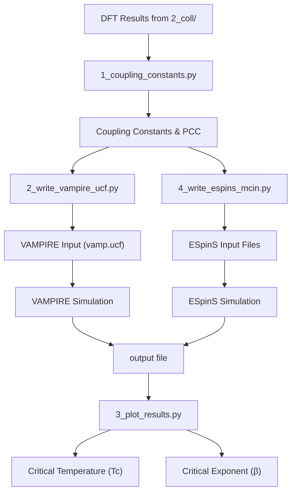
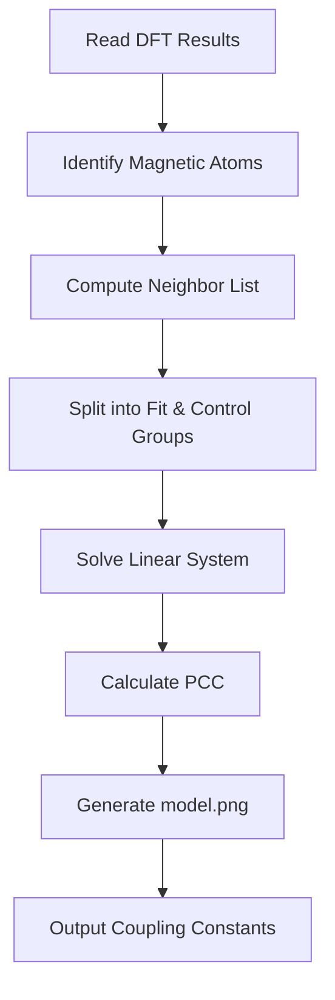
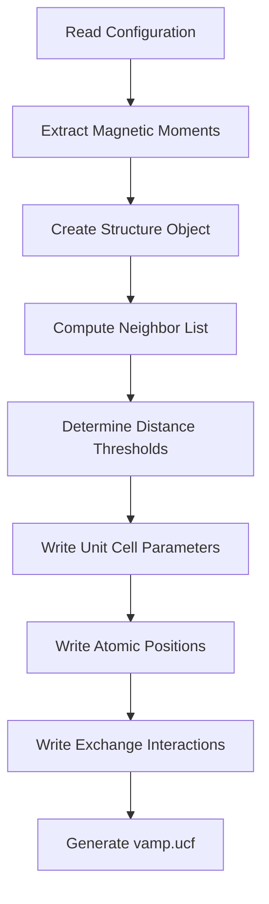
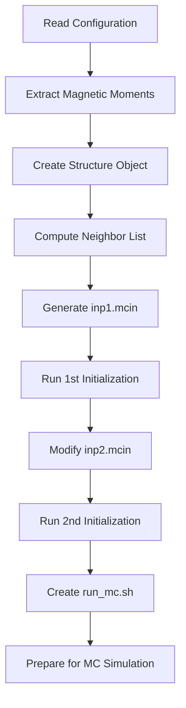
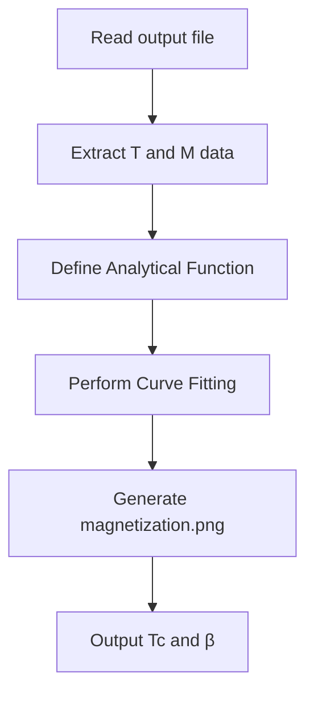
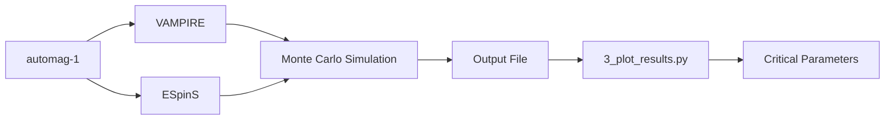

# Monte Carlo Simulation

<cite>
**Referenced Files in This Document**  
- [1_coupling_constants.py](file://3_monte_carlo/1_coupling_constants.py)
- [2_write_vampire_ucf.py](file://3_monte_carlo/2_write_vampire_ucf.py)
- [3_plot_results.py](file://3_monte_carlo/3_plot_results.py)
- [4_write_espins_mcin.py](file://3_monte_carlo/4_write_espins_mcin.py)
- [input_template.py](file://3_monte_carlo/input_template.py)
- [example_input.py](file://3_monte_carlo/example_input.py)
- [README.md](file://README.md)
</cite>

## Table of Contents
1. [Introduction](#introduction)
2. [Workflow Overview](#workflow-overview)
3. [Coupling Constants Calculation](#coupling-constants-calculation)
4. [VAMPIRE Input Generation](#vampire-input-generation)
5. [ESpinS Input Preparation](#espins-input-preparation)
6. [Results Analysis and Critical Temperature Extraction](#results-analysis-and-critical-temperature-extraction)
7. [Input Configuration and Parameters](#input-configuration-and-parameters)
8. [Integration with External Simulation Tools](#integration-with-external-simulation-tools)
9. [Model Validation and Best Practices](#model-validation-and-best-practices)
10. [Troubleshooting Common Issues](#troubleshooting-common-issues)

## Introduction

The Monte Carlo simulation module in automag-1 provides a systematic framework for estimating critical temperatures of magnetic materials by simulating the Heisenberg model derived from Density Functional Theory (DFT)-calculated coupling constants. This module bridges first-principles electronic structure calculations with statistical mechanics simulations, enabling accurate prediction of magnetic phase transitions.

The core methodology involves computing exchange interaction parameters between magnetic atoms from DFT energy calculations of various magnetic configurations, then using these parameters in Monte Carlo simulations to determine the critical temperature (Tc) where the material transitions from magnetically ordered to paramagnetic state. The accuracy of the Heisenberg model is rigorously validated using the Pearson Correlation Coefficient (PCC) between DFT energies and model-predicted energies.

This documentation details the implementation workflow, configuration parameters, integration with external tools, and best practices for reliable results.

**Section sources**
- [README.md](file://README.md#L250-L276)

## Workflow Overview

The Monte Carlo simulation workflow in automag-1 consists of four sequential scripts that transform DFT results into critical temperature predictions:

1. **1_coupling_constants.py**: Computes exchange interaction parameters (coupling constants) from DFT energies of magnetic configurations
2. **2_write_vampire_ucf.py**: Generates input files for the VAMPIRE micromagnetic simulation package
3. **4_write_espins_mcin.py**: Prepares input files for the ESpinS spin dynamics code
4. **3_plot_results.py**: Analyzes simulation output to extract critical temperature and exponent



**Diagram sources**
- [1_coupling_constants.py](file://3_monte_carlo/1_coupling_constants.py#L1-L183)
- [2_write_vampire_ucf.py](file://3_monte_carlo/2_write_vampire_ucf.py#L1-L133)
- [4_write_espins_mcin.py](file://3_monte_carlo/4_write_espins_mcin.py#L1-L191)
- [3_plot_results.py](file://3_monte_carlo/3_plot_results.py#L1-L43)

**Section sources**
- [README.md](file://README.md#L250-L276)

## Coupling Constants Calculation

The `1_coupling_constants.py` script computes the exchange coupling constants for the Heisenberg model by solving a linear system of equations derived from DFT energies of various magnetic configurations. The script implements a rigorous validation process using a control group to assess model accuracy.

The algorithm follows these steps:
1. Reads magnetic configurations and corresponding DFT energies from the collinear calculations (2_coll/) directory
2. Identifies magnetic atoms based on element type or user-specified list
3. Computes neighbor lists within the specified cutoff radius
4. Constructs a linear system where coupling constants are solved via least squares fitting
5. Evaluates model accuracy using Pearson Correlation Coefficient (PCC) on a control group of configurations

The script outputs the computed coupling constants, neighbor distances, and PCC value, while also generating a scatter plot (`model.png`) comparing Heisenberg model energies against DFT energies.

Key implementation details include:
- Automatic detection of magnetic atoms (transition metals by default)
- Configurable control group size for model validation
- Dynamic path resolution for input files
- Matrix rank checking to ensure solvability of the linear system



**Diagram sources**
- [1_coupling_constants.py](file://3_monte_carlo/1_coupling_constants.py#L1-L183)

**Section sources**
- [1_coupling_constants.py](file://3_monte_carlo/1_coupling_constants.py#L1-L183)
- [README.md](file://README.md#L260-L268)

## VAMPIRE Input Generation

The `2_write_vampire_ucf.py` script generates the unit cell file (`vamp.ucf`) required by the VAMPIRE micromagnetic simulation package. This script transforms the computed coupling constants and structural information into the specific format expected by VAMPIRE for Monte Carlo simulations.

The input generation process involves:
1. Reading the target magnetic configuration from the trials directory
2. Extracting the magnetic moment directions to define materials in VAMPIRE
3. Creating a pymatgen Structure object from the VASP setting file
4. Computing neighbor lists using the same cutoff radius as in coupling constant calculation
5. Writing the unit cell parameters, atomic positions, and exchange interactions in VAMPIRE format

The generated `vamp.ucf` file contains:
- Unit cell dimensions and vectors
- Fractional coordinates of magnetic atoms
- Material assignments based on spin direction
- Exchange interaction parameters (Jij) with periodic boundary conditions

The script handles periodic images through offset vectors and uses distance thresholds to match coupling constants to specific neighbor shells. It creates a `vampire/` subdirectory to organize the output file.



**Diagram sources**
- [2_write_vampire_ucf.py](file://3_monte_carlo/2_write_vampire_ucf.py#L1-L133)

**Section sources**
- [2_write_vampire_ucf.py](file://3_monte_carlo/2_write_vampire_ucf.py#L1-L133)
- [README.md](file://README.md#L269-L272)

## ESpinS Input Preparation

The `4_write_espins_mcin.py` script prepares input files for the ESpinS spin dynamics code, providing an alternative to VAMPIRE for Monte Carlo simulations. This script implements a two-step initialization process required by ESpinS.

The input preparation workflow includes:
1. Reading the target magnetic configuration and extracting spin directions
2. Creating a pymatgen Structure object from the VASP setting file
3. Computing neighbor lists within the specified cutoff radius
4. Generating the first input file (`*.inp1.mcin`) with structural information
5. Executing the first initialization step
6. Modifying the second input file (`*.inp2.mcin`) by replacing placeholders with actual coupling constants
7. Executing the second initialization step
8. Creating a shell script (`run_mc.sh`) to launch the Monte Carlo simulation

The script supports advanced magnetic interactions through optional parameters:
- Biquadratic interactions (Ham_bij)
- Dzyaloshinskii-Moriya interactions (Ham_dij)
- Configurable number of interaction shells

The seedname for ESpinS files is automatically generated from the chemical formula and configuration name. The script handles the execution of initialization steps through system calls and creates an organized `espins/` directory for all output files.



**Diagram sources**
- [4_write_espins_mcin.py](file://3_monte_carlo/4_write_espins_mcin.py#L1-L191)

**Section sources**
- [4_write_espins_mcin.py](file://3_monte_carlo/4_write_espins_mcin.py#L1-L191)

## Results Analysis and Critical Temperature Extraction

The `3_plot_results.py` script analyzes the output from Monte Carlo simulations to extract the critical temperature (Tc) and critical exponent (β). This script implements a curve fitting procedure based on the analytical form of the mean magnetization near the critical point.

The analysis process follows these steps:
1. Reads the simulation output file (default: `output`)
2. Extracts temperature and mean magnetization data
3. Fits the data to the analytical function: M(T) = sign(1-T/Tc) * |1-T/Tc|^β for T<Tc, 0 otherwise
4. Generates a plot comparing Monte Carlo results with the analytical fit
5. Outputs the fitted critical temperature and exponent

The curve fitting uses scipy's `curve_fit` function with initial parameters of Tc=900K and β=0.34, which are typical values for many magnetic systems. The resulting plot (`magnetization.png`) provides a visual assessment of the quality of the fit.

The critical exponent β provides information about the universality class of the phase transition, while the critical temperature Tc indicates the thermal stability of the magnetic order. These parameters are essential for characterizing magnetic materials in both fundamental research and technological applications.



**Diagram sources**
- [3_plot_results.py](file://3_monte_carlo/3_plot_results.py#L1-L43)

**Section sources**
- [3_plot_results.py](file://3_monte_carlo/3_plot_results.py#L1-L43)
- [README.md](file://README.md#L273-L276)

## Input Configuration and Parameters

The Monte Carlo simulation module is controlled through an input file (`input.py`) that specifies key parameters for the calculation. The `input_template.py` file provides a template with all available options and their default values.

Key configuration parameters include:

| Parameter | Description | Default Value | Example |
|---------|-------------|---------------|---------|
| `configuration` | Name of the magnetic configuration to use for simulation | None | 'afm1' |
| `cutoff_radius` | Maximum distance (Å) for considering interacting neighbors | None | 4.1 |
| `control_group_size` | Relative size of control group for model validation | 0.4 | 0.3 |
| `append_coupling_constants` | Whether to append computed constants to input.py | False | True |
| `magnetic_atoms` | List of atomic types to consider magnetic | Transition metals | ['Mn', 'Fe'] |
| `poscar_file` | Name of POSCAR file in geometries/ directory | None | 'Fe2O3.vasp' |
| `calculator` | Name of calculator used for DFT calculations | 'vasp' | 'vasp' |
| `struct_suffix` | Suffix for structure directories | '' | '_mp-1221736' |
| `espins_run_command` | Command to run ESpinS | None | 'module load intel2021/mkl/latest; /path/to/mc.x' |

The `example_input.py` file demonstrates a complete configuration with computed coupling constants:

```python
configuration = 'afm1'
cutoff_radius = 4.1
control_group_size = 0.4
append_coupling_constants = False
poscar_file = 'Fe2O3-alpha_conventional.vasp'
espins_run_command = 'module load intel2021/mkl/latest; /home/dpoletaev/soft/ESpinS/mc.x'
calculator = 'vasp'
distances_between_neighbors = [2.898, 2.969, 3.362, 3.703, 3.981]
coupling_constants = [-3.40156121e-22, -3.72027152e-22, -5.33069829e-21, -3.56077373e-21, -1.12825138e-21]
```

The `append_coupling_constants` parameter controls whether the computed coupling constants are automatically appended to the input file, facilitating workflow automation. When set to `True`, subsequent scripts can directly read these values without manual intervention.

**Section sources**
- [input_template.py](file://3_monte_carlo/input_template.py#L1-L22)
- [example_input.py](file://3_monte_carlo/example_input.py#L1-L30)
- [README.md](file://README.md#L255-L260)

## Integration with External Simulation Tools

The Monte Carlo module integrates with external simulation tools through specialized input generation scripts. This architecture allows automag-1 to serve as a preprocessing framework while leveraging established, high-performance simulation codes for the computationally intensive Monte Carlo calculations.

### VAMPIRE Integration

The integration with VAMPIRE follows this workflow:
1. `2_write_vampire_ucf.py` generates the `vamp.ucf` file containing structural and interaction data
2. Users provide additional input files (simulation parameters, material properties) based on VAMPIRE requirements
3. The VAMPIRE simulation is executed on the cluster
4. The output file is copied back to the 3_monte_carlo/ directory
5. `3_plot_results.py` analyzes the output

Although sample VAMPIRE input and material files are mentioned in the documentation, they were not found in the repository. Users must create these files according to VAMPIRE's specifications, typically including simulation parameters like temperature range, number of Monte Carlo steps, and system size.

### ESpinS Integration

The integration with ESpinS is more automated:
1. `4_write_espins_mcin.py` generates all necessary input files
2. The script automatically executes the two initialization steps required by ESpinS
3. A shell script (`run_mc.sh`) is created to launch the Monte Carlo simulation
4. The simulation output is processed by `3_plot_results.py`

The `espins_run_command` parameter in the input file allows users to specify the exact command needed to run ESpinS on their system, including module loads and path specifications. This flexibility accommodates different cluster environments and software installations.



**Section sources**
- [2_write_vampire_ucf.py](file://3_monte_carlo/2_write_vampire_ucf.py#L1-L133)
- [4_write_espins_mcin.py](file://3_monte_carlo/4_write_espins_mcin.py#L1-L191)
- [README.md](file://README.md#L270-L272)

## Model Validation and Best Practices

Proper validation of the Heisenberg model is crucial for obtaining reliable critical temperature predictions. The automag-1 framework provides built-in validation through the Pearson Correlation Coefficient (PCC) calculated on a control group of magnetic configurations.

### Model Accuracy Assessment

The PCC value indicates how well the Heisenberg model reproduces DFT energies:
- PCC > 0.95: Excellent model accuracy
- 0.90 < PCC ≤ 0.95: Good model accuracy
- 0.85 < PCC ≤ 0.90: Acceptable model accuracy
- PCC ≤ 0.85: Poor model accuracy, model may be inadequate

A low PCC suggests that the Heisenberg model with pairwise interactions may not adequately describe the magnetic system, possibly due to:
- Significant higher-order interactions (biquadratic, four-spin, etc.)
- Strong non-collinear or non-coplanar magnetic states
- Complex magnetic frustration
- Inadequate sampling of magnetic configurations

### Convergence Testing

The `cutoff_radius` parameter should be systematically tested to ensure convergence:
1. Start with a small cutoff radius (e.g., 3.0 Å)
2. Gradually increase the radius in 0.5 Å increments
3. Monitor the PCC and coupling constants
4. Stop when both PCC and coupling constants stabilize

The README recommends running `1_coupling_constants.py` multiple times with `append_coupling_constants=False` to investigate convergence before finalizing the model.

### Best Practices

1. **Control Group Size**: Use `control_group_size=0.4` as recommended, providing sufficient data for validation while maintaining statistical power for fitting.

2. **Cutoff Radius Selection**: Choose the smallest radius that yields a PCC > 0.90, balancing accuracy with computational efficiency.

3. **Input File Management**: Use `append_coupling_constants=True` only after finalizing the model to prevent overwriting during convergence testing.

4. **Configuration Selection**: Use the lowest-energy magnetic configuration from the collinear search as the starting point for Monte Carlo simulations.

5. **Cross-Validation**: Compare results from both VAMPIRE and ESpinS when possible to assess consistency.

6. **Error Analysis**: Examine the residuals from the magnetization curve fit to identify systematic deviations from the analytical form.

**Section sources**
- [1_coupling_constants.py](file://3_monte_carlo/1_coupling_constants.py#L1-L183)
- [README.md](file://README.md#L265-L268)

## Troubleshooting Common Issues

This section addresses common issues encountered when using the Monte Carlo simulation module and provides solutions and workarounds.

### Poor PCC Values

**Symptoms**: PCC < 0.85, indicating poor correlation between Heisenberg model and DFT energies.

**Possible Causes and Solutions**:
- **Insufficient magnetic configurations**: The collinear search may not have sampled enough configurations. Solution: Rerun the collinear search with a larger supercell size.
- **Inadequate cutoff radius**: Important interactions may be excluded. Solution: Increase `cutoff_radius` and recompute coupling constants.
- **Non-Heisenberg behavior**: The system may have significant higher-order interactions. Solution: Consider alternative models or include biquadratic terms if supported by the simulation code.
- **Magnetic complexity**: The system may have non-collinear or non-coplanar ground states. Solution: Verify the collinear assumption is valid for your system.

### Convergence Issues

**Symptoms**: Coupling constants or PCC do not stabilize with increasing cutoff radius.

**Solutions**:
- Check for numerical instability in the linear system solution by examining the matrix rank.
- Ensure sufficient sampling of magnetic configurations in the collinear search.
- Verify that the magnetic atoms are correctly identified (use `magnetic_atoms` parameter if needed).
- Consider the possibility of long-range interactions requiring special treatment.

### File and Path Issues

**Common Problems**:
- **Missing DFT results**: Ensure the 2_coll/ directory contains the required setting, states, and energies files.
- **Incorrect POSCAR file**: Verify the `poscar_file` exists in the geometries/ directory.
- **Environment variables**: Confirm `AUTOMAG_PATH` is properly set in your environment.

**Error Messages and Solutions**:
- `"No setting file found"`: Check the path_to_coll construction and ensure collinear calculations completed successfully.
- `"configuration not found"`: Verify the configuration name matches exactly with those generated in the collinear search.
- `"ERROR: SYSTEM OF X INDEPENDENT EQUATION(S) IN Y UNKNOWNS!"`: The linear system is underdetermined. Solution: Reduce the number of unknowns by decreasing the cutoff radius or increase the number of equations by including more magnetic configurations.

### Integration Issues

**VAMPIRE-specific**:
- Missing input or material files: Create these files according to VAMPIRE documentation, using the vamp.ucf file as the unit cell definition.
- Simulation failures: Check that the system size in the VAMPIRE input file is appropriate for the unit cell defined in vamp.ucf.

**ESpinS-specific**:
- Initialization failures: Ensure the `espins_run_command` is correct for your system and that all required modules are loaded.
- Placeholder replacement issues: Verify that the number of coupling constants matches the number of interaction shells expected by ESpinS.

**Section sources**
- [1_coupling_constants.py](file://3_monte_carlo/1_coupling_constants.py#L1-L183)
- [2_write_vampire_ucf.py](file://3_monte_carlo/2_write_vampire_ucf.py#L1-L133)
- [4_write_espins_mcin.py](file://3_monte_carlo/4_write_espins_mcin.py#L1-L191)
- [README.md](file://README.md#L260-L276)