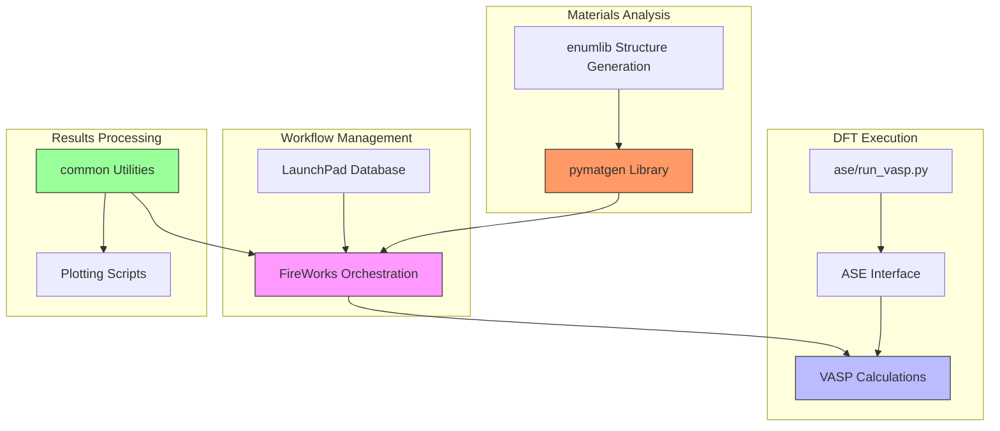
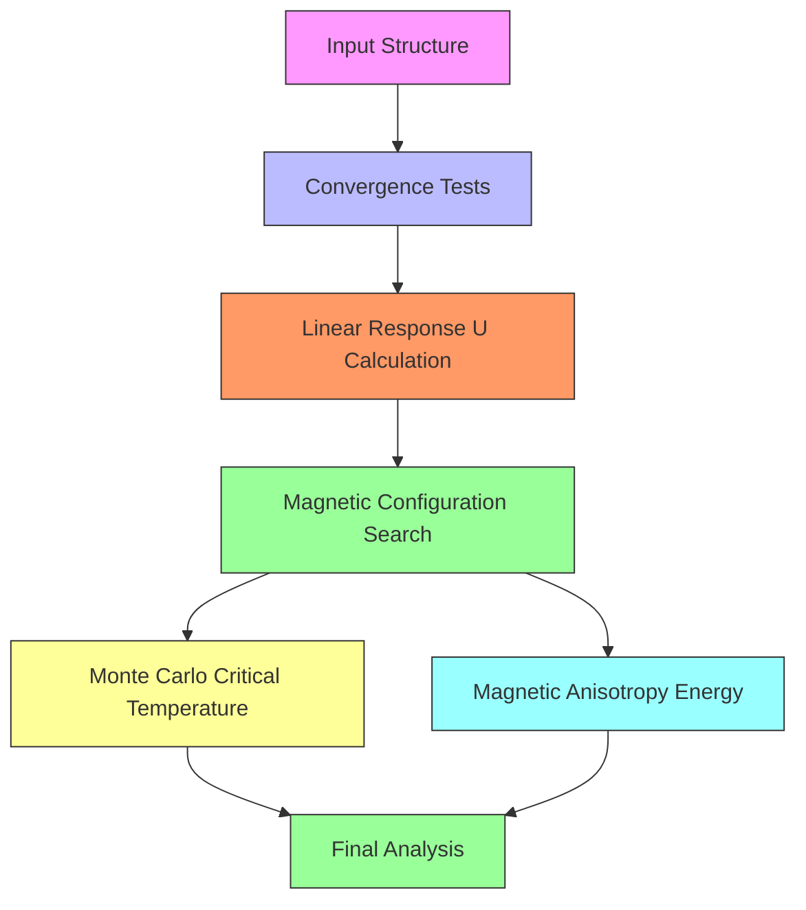
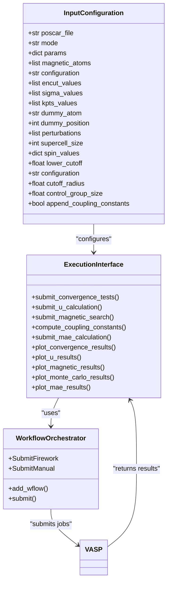
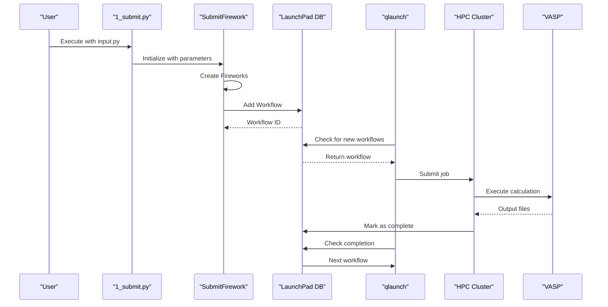

# Project Overview

<cite>
**Referenced Files in This Document**   
- [README.md](file://README.md)
- [0_conv_tests/1_submit.py](file://0_conv_tests/1_submit.py)
- [1_lin_response/1_submit.py](file://1_lin_response/1_submit.py)
- [2_coll/1_submit.py](file://2_coll/1_submit.py)
- [3_monte_carlo/1_coupling_constants.py](file://3_monte_carlo/1_coupling_constants.py)
- [4_mae/1_submit.py](file://4_mae/1_submit.py)
- [common/SubmitFirework.py](file://common/SubmitFirework.py)
- [common/utilities.py](file://common/utilities.py)
- [ase/run_vasp.py](file://ase/run_vasp.py)
- [4_mae/MAE.py](file://4_mae/MAE.py)
</cite>

## Table of Contents
1. [Introduction](#introduction)
2. [Architecture Overview](#architecture-overview)
3. [Core Modules and Workflows](#core-modules-and-workflows)
4. [Public Interfaces and Configuration](#public-interfaces-and-configuration)
5. [Technical Implementation Details](#technical-implementation-details)
6. [Practical Examples](#practical-examples)

## Introduction

The automag-1 project is an automated workflow framework designed for computational materials science, specifically targeting magnetic properties calculations in materials. The framework enables researchers to systematically determine ground state magnetic configurations and estimate critical temperatures for magnetic phase transitions through a series of integrated computational steps. Built as a modular Python-based system, automag-1 orchestrates Density Functional Theory (DFT) calculations using VASP, manages computational workflows through FireWorks, and leverages scientific libraries like pymatgen and ASE for materials analysis and manipulation.

The framework addresses the complex workflow required for magnetic materials characterization by automating sequential computational tasks that would otherwise require manual intervention. This includes convergence testing of DFT parameters, calculation of electronic correlation parameters (Hubbard U), identification of ground state magnetic configurations, and determination of critical temperatures through Monte Carlo simulations. By providing a structured approach to these calculations, automag-1 ensures reproducibility and reduces the potential for human error in computational materials science research.

**Section sources**
- [README.md](file://README.md#L1-L20)

## Architecture Overview

automag-1 implements a modular architecture that integrates multiple computational materials science tools into a cohesive workflow system. The framework is organized into distinct functional modules, each responsible for a specific aspect of magnetic properties calculation, with shared utilities that provide common functionality across the system. At its core, automag-1 uses FireWorks for workflow orchestration, enabling the management of complex computational pipelines on high-performance computing clusters.

The system architecture follows a layered approach with four main components: workflow management, DFT execution, materials analysis, and results processing. FireWorks serves as the workflow engine, managing the submission, execution, and monitoring of computational jobs through a MongoDB database. VASP performs the actual DFT calculations, with ASE providing the interface between Python and VASP. Pymatgen handles materials structure analysis, symmetry operations, and data conversion between different formats. The common utilities module contains shared functionality for workflow submission, output processing, and data management.

This architecture enables a seamless pipeline from initial structure input to final magnetic properties analysis, with each module building upon the results of previous calculations. The modular design allows researchers to execute specific stages of the workflow independently or run the complete pipeline, providing flexibility for different research needs.

**Diagram sources **
- [common/SubmitFirework.py](file://common/SubmitFirework.py#L1-L259)
- [ase/run_vasp.py](file://ase/run_vasp.py#L1-L21)
- [README.md](file://README.md#L1-L276)

**Section sources**
- [README.md](file://README.md#L1-L276)
- [common/SubmitFirework.py](file://common/SubmitFirework.py#L1-L259)

## Core Modules and Workflows

The automag-1 framework consists of five primary modules that implement a comprehensive workflow for magnetic properties calculation. Each module corresponds to a directory in the project structure and contains specialized scripts for executing specific computational tasks. These modules are designed to be executed sequentially, with the output of one module serving as input for subsequent calculations.

The **convergence testing module** (0_conv_tests) evaluates the convergence of key VASP parameters including energy cutoff (ENCUT), electronic smearing (SIGMA), and k-point mesh density (kpts). This module provides researchers with the ability to determine optimal computational parameters for subsequent calculations, ensuring both accuracy and efficiency. The workflow generates multiple single-point energy calculations across a range of parameter values and produces convergence plots to identify appropriate settings.

The **linear response U calculation module** (1_lin_response) implements the linear response formalism for determining the Hubbard U parameter, which accounts for electronic correlation effects in DFT+U calculations. This module applies perturbations to a designated "dummy atom" while maintaining the chemical identity of the system through a clever POTCAR file manipulation technique. The resulting charge responses are analyzed to calculate the U parameter from the difference in slopes between self-consistent and non-self-consistent calculations.

The **magnetic configuration search module** (2_coll) systematically explores possible magnetic configurations to identify the ground state. Using enumlib for structure generation, this module creates multiple supercell configurations with different magnetic moment arrangements (ferromagnetic, antiferromagnetic, ferrimagnetic, and non-magnetic) and calculates their energies. The configuration with the lowest energy is identified as the ground state, providing the foundation for subsequent critical temperature calculations.

The **Monte Carlo module** (3_monte_carlo) calculates the critical temperature of the magnetic phase transition by implementing a Heisenberg model. This module computes coupling constants between magnetic atoms, validates the model accuracy using a control group of configurations, and generates input files for the VAMPIRE software package to perform Monte Carlo simulations. The resulting temperature-dependent magnetization data is analyzed to extract the critical temperature and critical exponent.

The **magnetic anisotropy energy module** (4_mae) calculates the magnetocrystalline anisotropy energy by performing non-collinear DFT calculations with spin-orbit coupling. This module systematically rotates the magnetization direction across a spherical grid and calculates the energy differences to determine the easy and hard magnetization axes of the material.

**Diagram sources **
- [README.md](file://README.md#L1-L276)
- [0_conv_tests/1_submit.py](file://0_conv_tests/1_submit.py#L1-L97)
- [1_lin_response/1_submit.py](file://1_lin_response/1_submit.py#L1-L77)
- [2_coll/1_submit.py](file://2_coll/1_submit.py#L1-L386)
- [3_monte_carlo/1_coupling_constants.py](file://3_monte_carlo/1_coupling_constants.py#L1-L182)
- [4_mae/1_submit.py](file://4_mae/1_submit.py#L1-L215)

**Section sources**
- [README.md](file://README.md#L1-L276)
- [0_conv_tests/1_submit.py](file://0_conv_tests/1_submit.py#L1-L97)
- [1_lin_response/1_submit.py](file://1_lin_response/1_submit.py#L1-L77)
- [2_coll/1_submit.py](file://2_coll/1_submit.py#L1-L386)
- [3_monte_carlo/1_coupling_constants.py](file://3_monte_carlo/1_coupling_constants.py#L1-L182)
- [4_mae/1_submit.py](file://4_mae/1_submit.py#L1-L215)

## Public Interfaces and Configuration

automag-1 provides a clear public interface through configuration files and script entry points that allow users to customize and execute the computational workflows. The primary interface consists of input.py configuration files in each module directory and standardized script entry points (1_submit.py and 2_plot_results.py) that initiate and analyze calculations.

The input.py files serve as the main configuration mechanism, allowing users to specify parameters for each computational module. These configuration files follow a consistent pattern across modules, with required parameters such as poscar_file (input structure), mode (calculation type), and params (VASP parameters), along with optional parameters that provide additional control over the calculations. For example, in the convergence testing module, users can specify the mode as "encut" or "kgrid" and provide corresponding parameter ranges for testing.

Each module follows a standardized execution pattern with two primary scripts: 1_submit.py for launching calculations and 2_plot_results.py for analyzing results. The 1_submit.py scripts read the input configuration, set up the computational workflow, and submit jobs to the cluster through FireWorks or direct job submission. The 2_plot_results.py scripts process the output data, generate visualizations, and extract key results such as converged parameter values or critical temperatures.

The framework also provides template input files (input_template.py) in each module directory to guide users in setting up their calculations. These templates include documentation of available parameters and their expected formats, making it easier for new users to configure their workflows correctly.

**Diagram sources **
- [0_conv_tests/1_submit.py](file://0_conv_tests/1_submit.py#L1-L97)
- [1_lin_response/1_submit.py](file://1_lin_response/1_submit.py#L1-L77)
- [2_coll/1_submit.py](file://2_coll/1_submit.py#L1-L386)
- [3_monte_carlo/1_coupling_constants.py](file://3_monte_carlo/1_coupling_constants.py#L1-L182)
- [4_mae/1_submit.py](file://4_mae/1_submit.py#L1-L215)

**Section sources**
- [README.md](file://README.md#L1-L276)
- [0_conv_tests/1_submit.py](file://0_conv_tests/1_submit.py#L1-L97)
- [1_lin_response/1_submit.py](file://1_lin_response/1_submit.py#L1-L77)
- [2_coll/1_submit.py](file://2_coll/1_submit.py#L1-L386)

## Technical Implementation Details

The technical implementation of automag-1 leverages FireWorks for workflow orchestration, providing a robust system for managing complex computational pipelines on high-performance computing clusters. The SubmitFirework class in the common module serves as the core workflow submission mechanism, creating Firework objects that encapsulate VASP calculations and organizing them into workflows with appropriate dependencies.

The FireWorks integration enables sophisticated workflow patterns, including sequential execution of single-point and recalculation steps, parallel execution of parameter variations, and conditional workflows based on calculation outcomes. Each Firework represents a discrete computational task, such as a VASP calculation or output processing step, with dependencies defined between fireworks to ensure proper execution order. The LaunchPad database stores workflow definitions and tracks their execution status, allowing for fault tolerance and restart capabilities.

The framework implements a flexible task system through the VaspCalculationTask, WriteOutputTask, and WriteChargesTask classes, which inherit from FiretaskBase. These tasks encapsulate specific computational operations and can be combined into complex workflows. The VaspCalculationTask handles VASP execution with support for various calculation modes, including perturbation calculations for U parameter determination. The WriteOutputTask processes calculation results and aggregates them into summary files, while the WriteChargesTask specifically handles charge analysis for linear response calculations.

Data persistence and transfer between workflow steps are managed through JSON serialization of atomic structures and calculation parameters. The atoms_to_encode and encode_to_atoms functions convert between ASE Atoms objects and JSON strings, enabling the transfer of structural information between workflow steps without requiring file I/O. This approach improves workflow efficiency and reliability by minimizing dependencies on external files.

The system also implements error handling and convergence checking through the is_converged file created after each VASP calculation. This allows subsequent workflow steps to verify calculation success and take appropriate actions based on convergence status. The output processing tasks aggregate convergence information from multiple calculations, providing users with comprehensive feedback on workflow execution.

**Diagram sources **
- [common/SubmitFirework.py](file://common/SubmitFirework.py#L1-L259)
- [common/utilities.py](file://common/utilities.py#L1-L277)

**Section sources**
- [common/SubmitFirework.py](file://common/SubmitFirework.py#L1-L259)
- [common/utilities.py](file://common/utilities.py#L1-L277)

## Practical Examples

The automag-1 framework provides practical examples in the README that demonstrate how to set up and execute key calculations. For convergence testing, users navigate to the 0_conv_tests directory and configure the input.py file with parameters such as mode ("encut" or "kgrid"), poscar_file (input structure), and parameter ranges for testing. After configuration, executing python 1_submit.py creates a series of VASP calculations that are automatically submitted to the cluster through FireWorks. Once calculations complete, running python 2_plot_results.py generates convergence plots and identifies parameter values that achieve convergence within 1 meV/atom.

For linear response U calculations, users configure the 1_lin_response module with parameters including the dummy_atom (a chemically similar element used for perturbation), dummy_position (atom index to perturb), and perturbations (list of perturbation values). Before execution, users must manually configure the POTCAR files as described in the README, placing the appropriate POTCAR for the target element in the dummy atom's directory. After running 1_submit.py and completing the calculations, 2_plot_results.py analyzes the charge responses and calculates the U parameter using the specified formula.

The magnetic configuration search is initiated by configuring the 2_coll module with parameters such as supercell_size (maximum supercell size for configuration generation), spin_values (high-spin and low-spin magnetic moment values), and the VASP parameters for single-point calculations. Executing 1_submit.py launches the enumlib-based configuration generation and submits energy calculations for all configurations. The 2_plot_results.py script then produces energy histograms and identifies the lowest-energy configuration.

These practical examples illustrate the framework's user-friendly design, where complex computational workflows are reduced to configuring input parameters and executing standardized scripts. The examples also highlight the integration between different modules, as the output of the magnetic configuration search (the ground state configuration) serves as input for subsequent critical temperature and magnetic anisotropy calculations.

**Section sources**
- [README.md](file://README.md#L1-L276)
- [0_conv_tests/1_submit.py](file://0_conv_tests/1_submit.py#L1-L97)
- [1_lin_response/1_submit.py](file://1_lin_response/1_submit.py#L1-L77)
- [2_coll/1_submit.py](file://2_coll/1_submit.py#L1-L386)