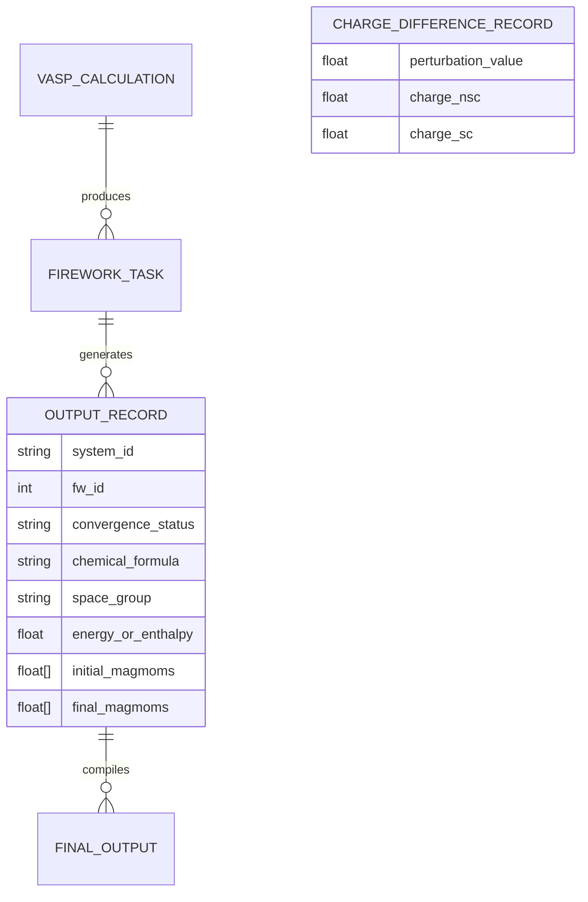
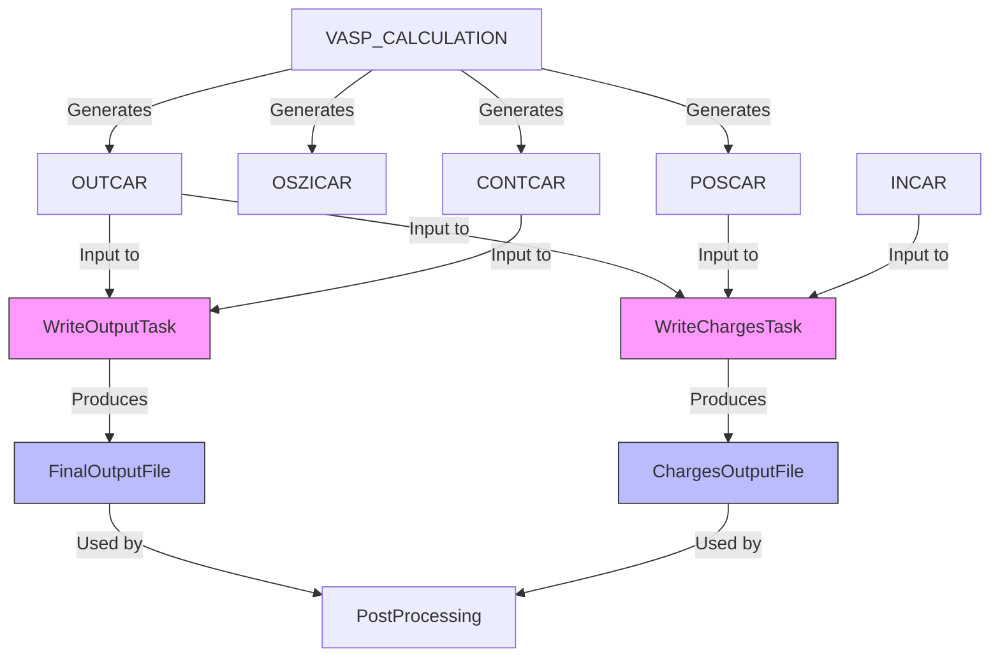
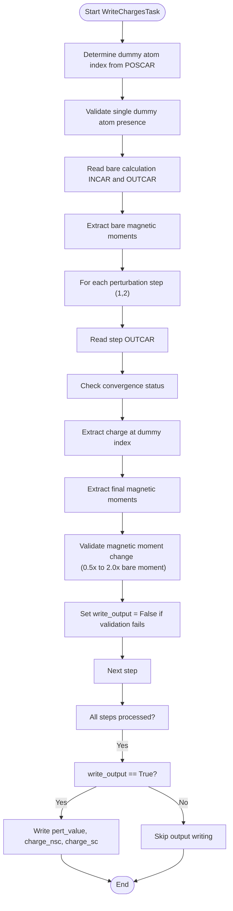
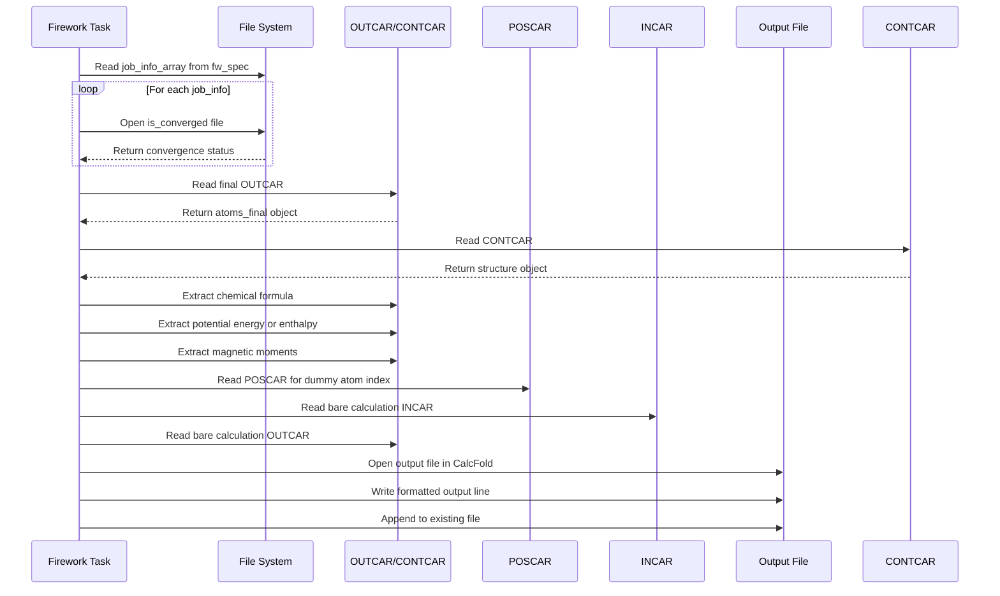
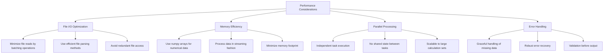
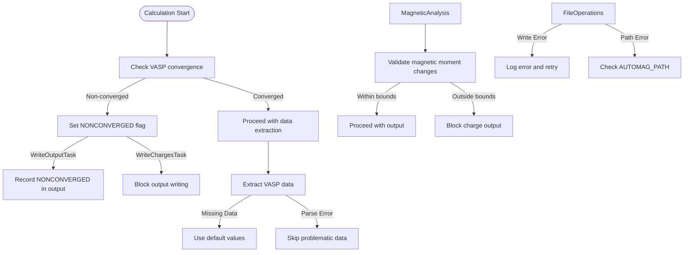
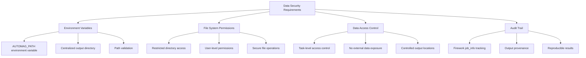

# Data Processing and Output Utilities

<cite>
**Referenced Files in This Document**   
- [utilities.py](file://common/utilities.py)
- [write_charges.py](file://common/write_charges.py)
- [write_output.py](file://common/write_output.py)
</cite>

## Table of Contents
1. [Introduction](#introduction)
2. [Data Model Overview](#data-model-overview)
3. [Entity Relationships](#entity-relationships)
4. [WriteOutputTask Field Definitions](#writeoutputtask-field-definitions)
5. [WriteChargesTask Validation and Business Logic](#writechargestask-validation-and-business-logic)
6. [Sample Data Outputs](#sample-data-outputs)
7. [Data Access Patterns](#data-access-patterns)
8. [Performance Considerations](#performance-considerations)
9. [Error Handling Strategies](#error-handling-strategies)
10. [Data Security Requirements](#data-security-requirements)

## Introduction
This document provides comprehensive documentation for the data processing pipeline in the automag-1 computational materials science framework. The system processes VASP calculation outputs through specialized Firework tasks to generate structured output files containing critical materials properties. The pipeline centers around two primary components: WriteOutputTask for general materials characterization and WriteChargesTask for Hubbard U parameter calculations. These components extract and validate data from VASP result files (OUTCAR, OSZICAR, CONTCAR) and compile them into standardized output formats for post-processing analysis.

## Data Model Overview
The data processing pipeline transforms raw VASP calculation outputs into structured data records through a series of Firework tasks. The core data model revolves around materials properties extracted from quantum mechanical calculations, with emphasis on convergence status, thermodynamic properties, crystallographic information, and magnetic characteristics. The system maintains a clear separation between input specifications, intermediate calculation results, and final output products, ensuring reproducibility and traceability throughout the computational workflow.



**Diagram sources**
- [utilities.py](file://common/utilities.py#L155-L218)
- [utilities.py](file://common/utilities.py#L221-L276)

**Section sources**
- [utilities.py](file://common/utilities.py#L155-L276)

## Entity Relationships
The data processing pipeline establishes relationships between Firework outputs, VASP result files, and final output formats through a well-defined dependency chain. Each Firework task consumes VASP output files from previous calculations and produces structured data records that contribute to final output files. The relationship network ensures data provenance and enables comprehensive post-processing analysis.



**Diagram sources**
- [utilities.py](file://common/utilities.py#L155-L218)
- [utilities.py](file://common/utilities.py#L221-L276)
- [write_output.py](file://common/write_output.py#L1-L147)
- [write_charges.py](file://common/write_charges.py#L1-L125)

**Section sources**
- [utilities.py](file://common/utilities.py#L155-L276)

## WriteOutputTask Field Definitions
The WriteOutputTask class extracts and formats key materials properties from VASP calculations into a standardized output format. Each field in the output record serves a specific purpose in characterizing the calculated material system.

```mermaid
classDiagram
class WriteOutputTask {
+string system
+string filename
+bool read_enthalpy
+bool energy_convergence
+float[] initial_magmoms
+run_task(fw_spec) void
}
WriteOutputTask : +system : USPEX structure ID
WriteOutputTask : +filename : Output file name
WriteOutputTask : +read_enthalpy : Flag to read enthalpy instead of energy
WriteOutputTask : +energy_convergence : Flag to apply kinetic energy correction
WriteOutputTask : +initial_magmoms : Initial magnetic moments array
```

**Diagram sources**
- [utilities.py](file://common/utilities.py#L155-L163)

The output record generated by WriteOutputTask contains the following fields:

| Field Name | Data Type | Description | Source File |
|------------|-----------|-------------|-------------|
| system ID | string | USPEX structure identifier | [utilities.py](file://common/utilities.py#L166) |
| Firework ID | integer | Unique identifier for the Firework | [utilities.py](file://common/utilities.py#L167) |
| convergence status | string | Convergence status for each VASP run | [utilities.py](file://common/utilities.py#L170-L173) |
| chemical formula | string | Chemical formula in metal mode | [utilities.py](file://common/utilities.py#L175) |
| space group | string | Space group symbol from structure analysis | [utilities.py](file://common/utilities.py#L178) |
| energy/enthalpy | float | Final energy or enthalpy value with optional correction | [utilities.py](file://common/utilities.py#L180-L202) |
| initial_magmoms | float array | Initial magnetic moments for magnetic calculations | [utilities.py](file://common/utilities.py#L204-L208) |
| final_magmoms | float array | Final magnetic moments from converged calculation | [utilities.py](file://common/utilities.py#L209-L213) |

**Section sources**
- [utilities.py](file://common/utilities.py#L155-L218)

## WriteChargesTask Validation and Business Logic
The WriteChargesTask implements specific validation rules for Hubbard U calculations, ensuring the reliability of charge difference computations. The task follows a precise business logic flow to extract and validate charge data from perturbed VASP calculations.



**Diagram sources**
- [utilities.py](file://common/utilities.py#L221-L276)

The data validation rules in WriteChargesTask ensure calculation integrity through the following criteria:
- **Dummy atom validation**: Confirms exactly one dummy atom exists in the structure
- **Magnetic moment stability**: Requires final magnetic moments to remain within 50-200% of bare calculation values
- **Convergence requirement**: Rejects results from non-converged calculations
- **Charge extraction**: Prioritizes f-electron charges, falling back to d-electron charges when f-electrons are unavailable

The business logic for charge difference computation follows these steps:
1. Identify the dummy atom index from the POSCAR file
2. Extract bare calculation magnetic moments as reference values
3. For each perturbation step, extract the charge at the dummy atom site
4. Validate magnetic moment stability and convergence status
5. Only write output if all validation checks pass

**Section sources**
- [utilities.py](file://common/utilities.py#L221-L276)

## Sample Data Outputs
The data processing pipeline generates standardized output files with consistent formatting for post-processing. Sample outputs demonstrate the structure and content of files produced by WriteOutputTask and WriteChargesTask.

**Sample WriteOutputTask output:**
```
mp-12345     1234  singlepoint=converged     Fe2O3     Pbnm    enthalpy=-1234.56789          initial_magmoms=[5.0 5.0 0.6]  final_magmoms=[4.8 4.9 0.5]
```

**Sample WriteChargesTask output:**
```
 0.10  0.456  0.789
 0.20  0.452  0.792
 0.30  0.448  0.795
```

These output formats enable straightforward parsing and analysis in subsequent processing stages. The WriteOutputTask produces single-line records with comprehensive materials characterization, while WriteChargesTask generates tabular data suitable for plotting charge response versus perturbation strength.

**Section sources**
- [utilities.py](file://common/utilities.py#L215-L218)
- [utilities.py](file://common/utilities.py#L274-L276)

## Data Access Patterns
The data processing pipeline follows consistent access patterns for retrieving VASP calculation results and writing final outputs. These patterns ensure reliable data extraction and proper file organization.



**Diagram sources**
- [utilities.py](file://common/utilities.py#L166-L218)
- [utilities.py](file://common/utilities.py#L228-L276)

The primary data access patterns include:
- Reading convergence status from is_converged files in each launch directory
- Extracting atomic structure and energy information from OUTCAR files
- Determining crystal symmetry from CONTCAR files using SpacegroupAnalyzer
- Identifying dummy atom positions from POSCAR files
- Reading reference magnetic moments from bare calculation INCAR and OUTCAR files
- Writing outputs to the CalcFold directory specified by AUTOMAG_PATH environment variable

**Section sources**
- [utilities.py](file://common/utilities.py#L166-L218)
- [utilities.py](file://common/utilities.py#L228-L276)

## Performance Considerations
The data processing pipeline incorporates several performance optimizations for handling large-scale calculations efficiently. These considerations address both computational efficiency and I/O operations.



Key performance considerations include:
- **File I/O optimization**: The system minimizes file reads by accessing each VASP output file only once per task execution
- **Memory efficiency**: Utilizes numpy arrays for numerical data and processes information in a streaming fashion
- **Computational efficiency**: Employs vectorized operations through numpy for mathematical computations
- **Scalability**: Designed to handle large numbers of calculations through independent task execution
- **Resource management**: Avoids loading unnecessary data into memory and processes files incrementally

The pipeline is optimized for high-throughput computational materials science workflows, where thousands of calculations may be processed in sequence.

**Section sources**
- [utilities.py](file://common/utilities.py#L155-L276)

## Error Handling Strategies
The data processing pipeline implements comprehensive error handling strategies to ensure robust operation even with non-converged or problematic calculations.



**Diagram sources**
- [utilities.py](file://common/utilities.py#L170-L173)
- [utilities.py](file://common/utilities.py#L255-L265)

The error handling strategies include:
- **Convergence-based filtering**: WriteChargesTask suppresses output for non-converged calculations
- **Magnetic moment validation**: Rejects results where magnetic moments change by more than factor of 2
- **Robust file handling**: Gracefully handles missing files or parsing errors
- **Defensive programming**: Uses try-except blocks for magnetic moments extraction
- **Data validation**: Validates dummy atom presence and quantity before processing
- **Error propagation**: Preserves convergence status in output files for diagnosis

These strategies ensure that only reliable, validated data is written to output files, maintaining data quality throughout the computational pipeline.

**Section sources**
- [utilities.py](file://common/utilities.py#L155-L276)

## Data Security Requirements
The data processing pipeline incorporates security measures to protect sensitive calculation results and control access to computational resources.



**Diagram sources**
- [utilities.py](file://common/utilities.py#L215)
- [utilities.py](file://common/utilities.py#L274)

The data security requirements are implemented through:
- **Environment variable access control**: Uses AUTOMAG_PATH environment variable to specify the output directory, allowing administrators to control where results are written
- **Centralized output management**: All outputs are written to the CalcFold subdirectory within the AUTOMAG_PATH, enabling centralized monitoring and access control
- **Path validation**: Relies on environment variables rather than hardcoded paths, reducing security risks
- **Controlled file operations**: Uses standard file writing operations with append mode to prevent data overwriting
- **Audit trail**: Maintains provenance through Firework job_info that tracks the origin of all processed data

Access to sensitive calculation results is controlled through standard file system permissions on the AUTOMAG_PATH directory, with additional protection provided by the Fireworks workflow management system.

**Section sources**
- [utilities.py](file://common/utilities.py#L155-L276)