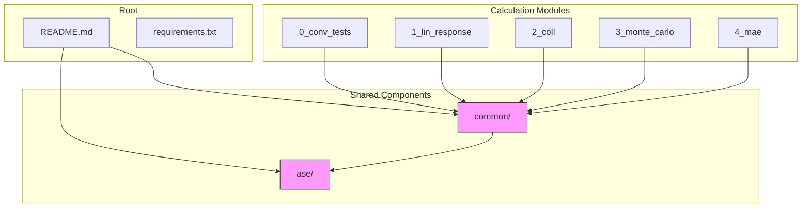
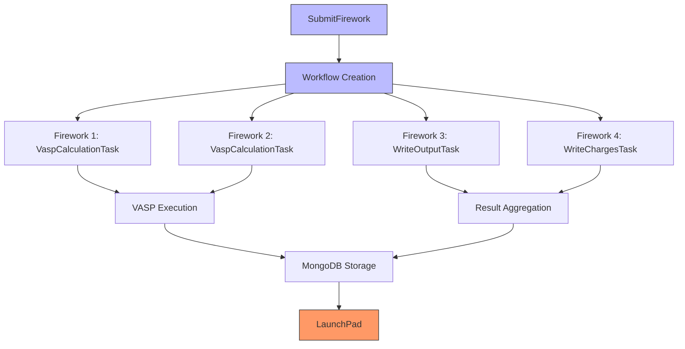
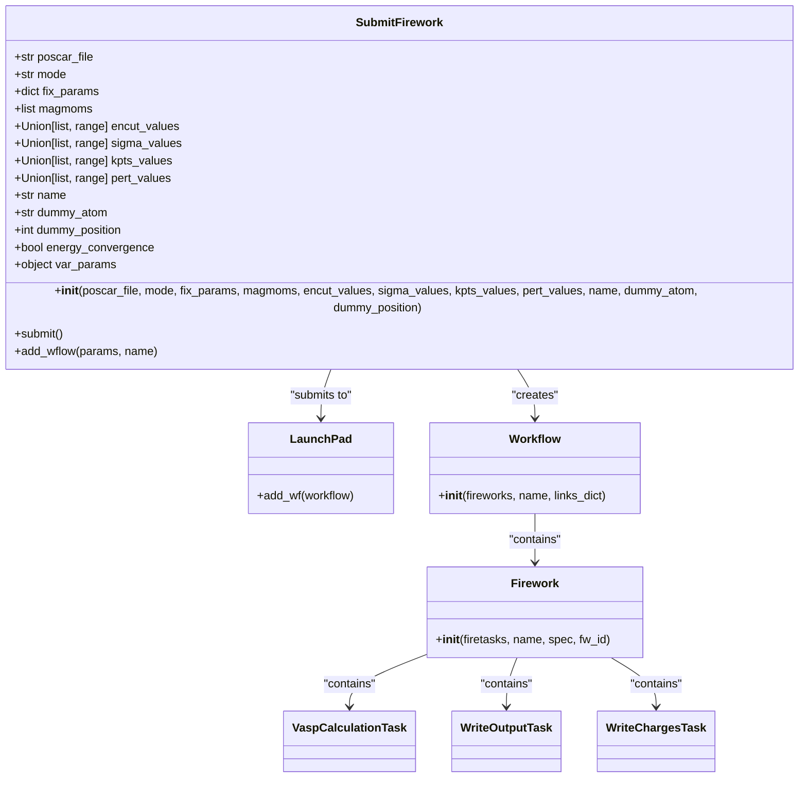
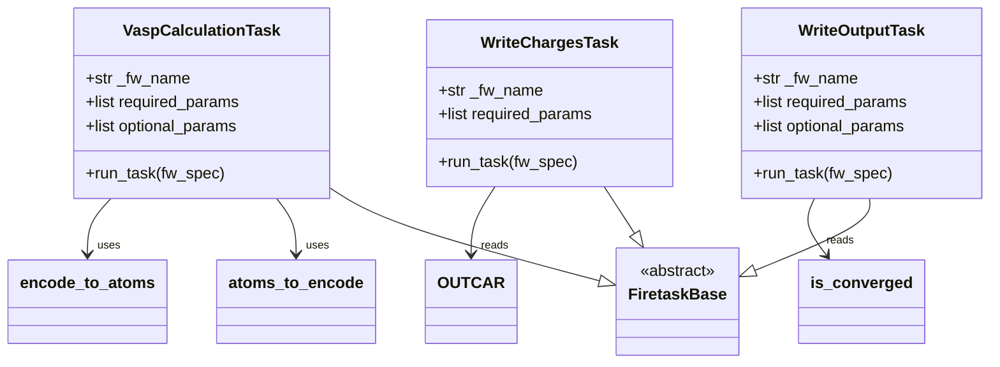
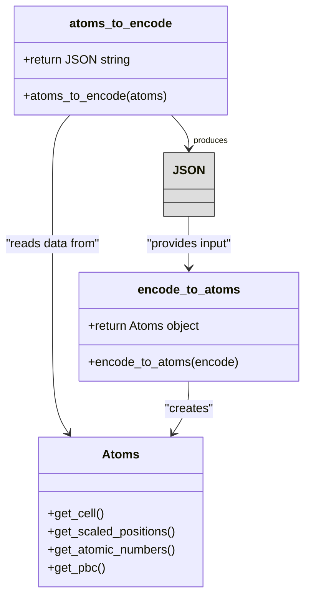
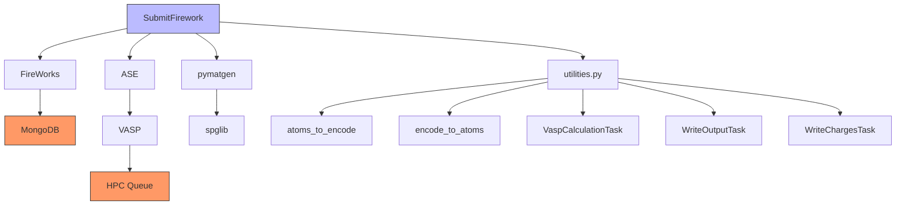

# FireWorks Integration

<cite>
**Referenced Files in This Document**   
- [common/SubmitFirework.py](file://common/SubmitFirework.py)
- [common/utilities.py](file://common/utilities.py)
- [4_mae/1_submit.py](file://4_mae/1_submit.py)
- [common/write_output.py](file://common/write_output.py)
- [common/write_charges.py](file://common/write_charges.py)
- [common/get_magmoms_vasp.py](file://common/get_magmoms_vasp.py)
- [common/write_output_vasp.py](file://common/write_output_vasp.py)
- [ase/run_vasp.py](file://ase/run_vasp.py)
- [README.md](file://README.md)
- [requirements.txt](file://requirements.txt)
</cite>

## Table of Contents
1. [Introduction](#introduction)
2. [Project Structure](#project-structure)
3. [Core Components](#core-components)
4. [Architecture Overview](#architecture-overview)
5. [Detailed Component Analysis](#detailed-component-analysis)
6. [Dependency Analysis](#dependency-analysis)
7. [Performance Considerations](#performance-considerations)
8. [Troubleshooting Guide](#troubleshooting-guide)
9. [Conclusion](#conclusion)

## Introduction

The FireWorks integration in the Automag workflow system provides a robust framework for orchestrating computational materials science calculations, particularly focused on magnetic property analysis. This documentation details the architectural design of workflow orchestration using the SubmitFirework class and its interaction with various Firetask components. The system enables automated execution of VASP calculations for determining magnetic ground states, calculating Hubbard U parameters, and estimating critical temperatures through Monte Carlo simulations. The integration leverages FireWorks' workflow management capabilities to coordinate complex sequences of computational tasks while maintaining data integrity through JSON-based structure serialization. The architecture supports multiple calculation modes including convergence testing, perturbation analysis, and magnetocrystalline anisotropy energy (MAE) calculations, with comprehensive error handling for non-converged calculations and job recovery mechanisms.

**Section sources**
- [README.md](file://README.md#L1-L277)

## Project Structure

The project follows a modular structure with distinct directories for different types of calculations and a common module containing shared functionality. The root directory contains configuration files and documentation, while numbered directories represent different stages of the magnetic analysis workflow. The common directory houses reusable components for workflow submission and task execution, while the ase directory contains VASP-specific execution scripts. This organization enables separation of concerns between workflow orchestration, calculation logic, and infrastructure configuration.



**Diagram sources**
- [README.md](file://README.md#L1-L277)
- [project_structure](file://project_structure#L1-L50)

## Core Components

The core components of the FireWorks integration include the SubmitFirework class for workflow orchestration, Firetask components for specific calculation types, and utility functions for structure serialization. The SubmitFirework class serves as the primary interface for creating and submitting workflows, while specialized Firetask classes handle VASP calculations, output processing, and charge analysis. The architecture employs JSON encoding for structure serialization through atoms_to_encode and encode_to_atoms functions, enabling reliable transmission of atomic structure data between workflow steps. Infrastructure requirements include MongoDB for workflow state persistence and LaunchPad configuration for job submission to HPC environments.

**Section sources**
- [common/SubmitFirework.py](file://common/SubmitFirework.py#L1-L259)
- [common/utilities.py](file://common/utilities.py#L1-L277)

## Architecture Overview

The FireWorks integration architecture follows a workflow orchestration pattern where the SubmitFirework class creates and manages Firework objects that execute specific computational tasks. Workflows are constructed with explicit dependencies between Fireworks using a links_dict that defines the execution sequence. Each Firework contains one or more Firetask components that perform atomic operations such as VASP calculations or data processing. The architecture separates workflow definition from execution, allowing workflows to be submitted to a remote LaunchPad database for distributed execution. Result aggregation occurs through specialized Firetasks that collect and process output from completed calculations, with error handling built into each task to manage non-converged calculations.



**Diagram sources**
- [common/SubmitFirework.py](file://common/SubmitFirework.py#L1-L259)
- [common/utilities.py](file://common/utilities.py#L1-L277)

## Detailed Component Analysis

### SubmitFirework Class Analysis

The SubmitFirework class serves as the central orchestrator for computational workflows, managing the creation and submission of Fireworks to the LaunchPad database. It supports multiple calculation modes including convergence testing, perturbation analysis, and single-point calculations, with configurable parameters for each mode. The class handles workflow generation by creating Firework objects with appropriate Firetask components and establishing dependencies between them through the links_dict mechanism. For perturbation analysis, it creates parallel branches of Fireworks for non-self-consistent and self-consistent calculations, followed by charge output tasks.



**Diagram sources**
- [common/SubmitFirework.py](file://common/SubmitFirework.py#L25-L258)

**Section sources**
- [common/SubmitFirework.py](file://common/SubmitFirework.py#L1-L259)

### Firetask Components Analysis

The Firetask components implement specific computational operations within the FireWorks workflow. VaspCalculationTask executes VASP calculations with configurable parameters, handling both standard and perturbation-based calculations. WriteOutputTask aggregates results from completed calculations and writes them to output files, while WriteChargesTask specifically processes charge data from Hubbard U calculations. These components inherit from FiretaskBase and implement the run_task method to define their execution logic. They leverage the _job_info specification to access information about previous workflow steps, enabling data flow between dependent Fireworks.



**Diagram sources**
- [common/utilities.py](file://common/utilities.py#L64-L276)

**Section sources**
- [common/utilities.py](file://common/utilities.py#L1-L277)

### Workflow Generation Process

The workflow generation process begins with the SubmitFirework.submit() method, which iterates through parameter combinations and creates workflows for each configuration. The add_wflow method constructs the workflow by creating Firework objects for each calculation step and establishing dependencies between them. For standard calculations, it creates a sequence of single-point and recalculation Fireworks followed by output processing. For perturbation analysis, it creates parallel branches for non-self-consistent and self-consistent calculations. The links_dict maps Firework IDs to their successors, defining the execution sequence and enabling parallel execution where possible.

```mermaid
flowchart TD
Start([submit()]) --> CheckParams["Check calculation mode and parameters"]
CheckParams --> CreateAtoms["Create atoms object from POSCAR"]
CreateAtoms --> EncodeAtoms["Encode atoms to JSON"]
EncodeAtoms --> CreateFireworks["Create Firework objects"]
CreateFireworks --> SinglePoint["Create single-point Firework"]
SinglePoint --> Recalc["Create recalc Firework"]
Recalc --> Output["Create output Firework"]
CreateFireworks --> CheckPerturbations["Is perturbation mode?"]
CheckPerturbations --> |Yes| CreatePertBranches["Create NSC/SC Firework branches"]
CreatePertBranches --> CreateChargeTasks["Create WriteChargesTasks"]
CheckPerturbations --> |No| UseOutputTask["Use WriteOutputTask"]
UseOutputTask --> CreateLinks["Create links_dict"]
CreateChargeTasks --> CreateLinks
CreateLinks --> CreateWorkflow["Create Workflow object"]
CreateWorkflow --> SubmitToLaunchPad["Submit to LaunchPad"]
SubmitToLaunchPad --> End([Workflow submitted])
```

**Diagram sources**
- [common/SubmitFirework.py](file://common/SubmitFirework.py#L1-L259)

**Section sources**
- [common/SubmitFirework.py](file://common/SubmitFirework.py#L1-L259)

### JSON Encoding for Structure Serialization

The JSON encoding mechanism provides a reliable method for serializing atomic structure data between workflow steps. The atoms_to_encode function converts ASE Atoms objects to JSON strings containing cell parameters, scaled positions, atomic numbers, and periodic boundary conditions. The encode_to_atoms function performs the reverse operation, reconstructing Atoms objects from JSON strings. This serialization approach ensures data integrity during workflow execution and enables efficient transmission of structure data between Fireworks. The encoding process preserves all essential structural information while providing a lightweight, text-based format compatible with FireWorks' data handling.



**Diagram sources**
- [common/utilities.py](file://common/utilities.py#L24-L60)

**Section sources**
- [common/utilities.py](file://common/utilities.py#L1-L277)

## Dependency Analysis

The FireWorks integration has a well-defined dependency structure with clear separation between workflow orchestration, calculation execution, and result processing. The system depends on FireWorks for workflow management, ASE for atomic structure handling, and pymatgen for crystallographic analysis. VASP execution is managed through the ase/run_vasp.py script, which configures the computational environment and launches VASP calculations. The dependency graph shows a hierarchical structure with the SubmitFirework class at the top level, coordinating lower-level Firetask components that perform specific operations. External dependencies include MongoDB for workflow state storage and HPC queue systems for job execution.



**Diagram sources**
- [requirements.txt](file://requirements.txt#L1-L57)
- [ase/run_vasp.py](file://ase/run_vasp.py#L1-L22)

**Section sources**
- [requirements.txt](file://requirements.txt#L1-L57)
- [ase/run_vasp.py](file://ase/run_vasp.py#L1-L22)

## Performance Considerations

The FireWorks integration is designed with performance optimization in mind, particularly for high-throughput computational materials science workflows. The architecture supports parallel execution of independent Fireworks within a workflow, enabling efficient utilization of HPC resources. Workflow submission is optimized by batching multiple parameter combinations into a single workflow where possible, reducing database overhead. The system minimizes data transfer between workflow steps by using JSON-encoded structure data rather than large binary files. For large-scale calculations, the architecture allows distribution of workflow execution across multiple compute nodes through the LaunchPad system. Performance is further enhanced by caching frequently accessed data and minimizing redundant calculations through careful workflow design.

## Troubleshooting Guide

The FireWorks integration includes comprehensive error handling mechanisms for common issues in computational materials science workflows. For non-converged calculations, the VaspCalculationTask writes "NONCONVERGED" to the is_converged file, which is then processed by subsequent tasks to prevent propagation of unreliable results. Job recovery is supported through the LaunchPad system, which can resume workflows from the last completed step. Compatibility with different HPC environments is achieved through queue adapters specified in Firework specifications. Common issues include missing POTCAR files for dummy atoms in perturbation calculations, which must be manually configured as described in the README. Database connectivity issues can be diagnosed by verifying the LaunchPad configuration and MongoDB accessibility. Calculation failures should be investigated by examining the VASP output files (OUTCAR, OSZICAR) in the execution directory.

**Section sources**
- [common/utilities.py](file://common/utilities.py#L64-L276)
- [README.md](file://README.md#L1-L277)

## Conclusion

The FireWorks integration in the Automag system provides a robust and flexible framework for automating complex computational materials science workflows. The architecture effectively combines workflow orchestration with specialized calculation tasks, enabling systematic exploration of magnetic properties across diverse materials systems. Key strengths include the modular design of Firetask components, reliable data serialization through JSON encoding, and comprehensive error handling for non-converged calculations. The system's integration with HPC environments through queue adapters and its support for job recovery make it suitable for production-scale calculations. Future enhancements could include improved monitoring capabilities, enhanced error recovery mechanisms, and tighter integration with data analysis pipelines. The documented architecture provides a solid foundation for extending the system to support additional calculation types and analysis methods.