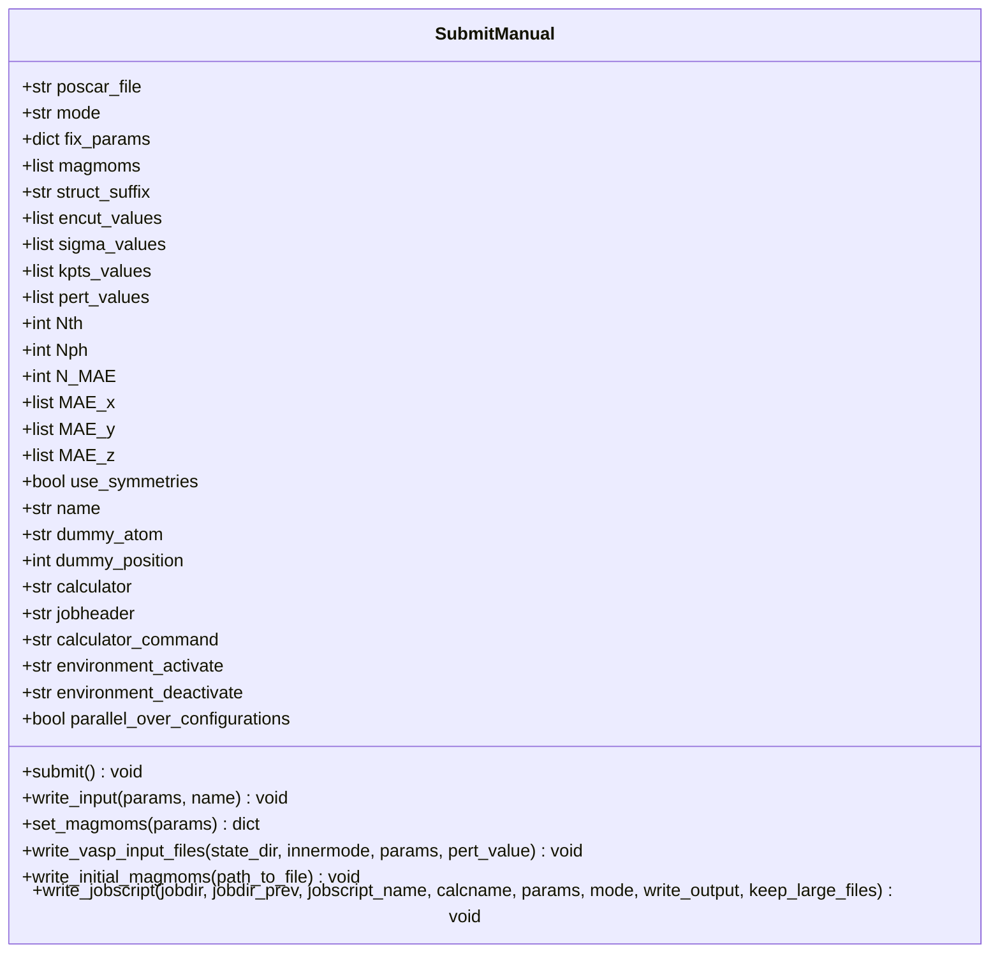
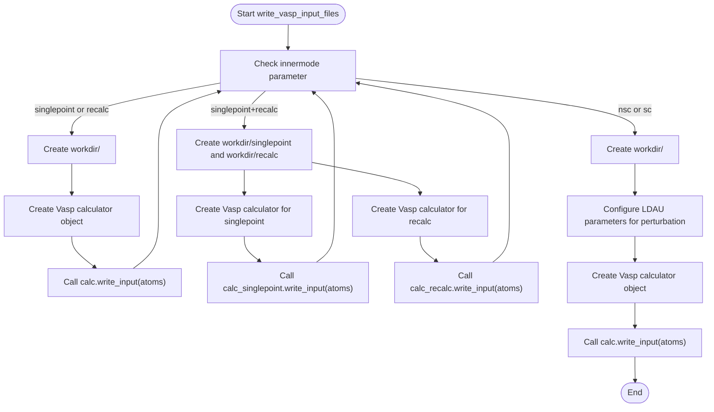
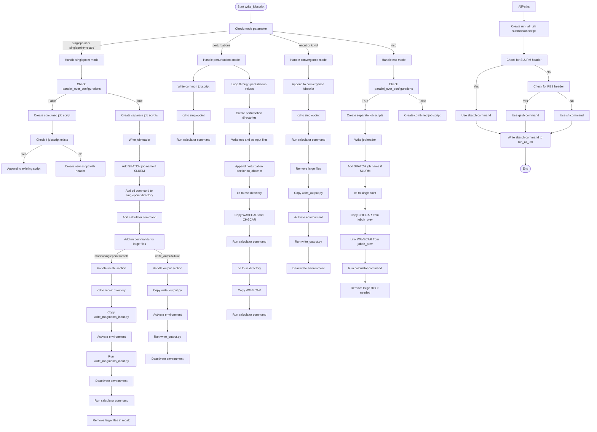
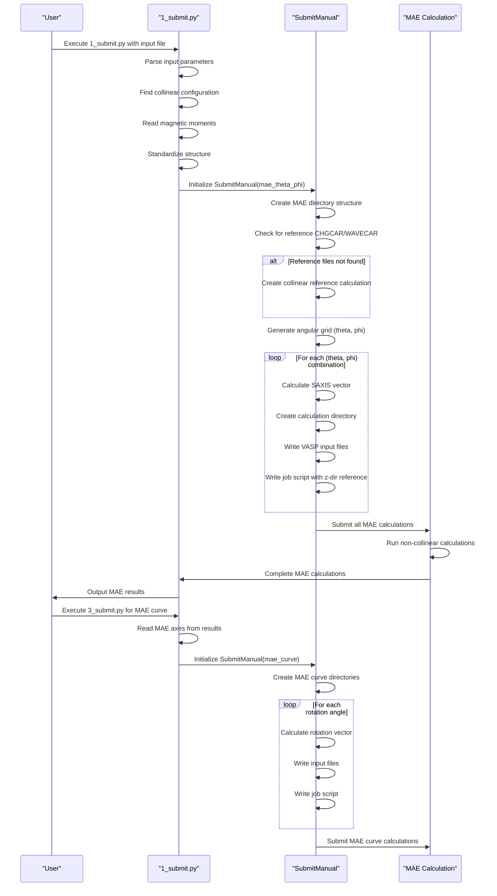
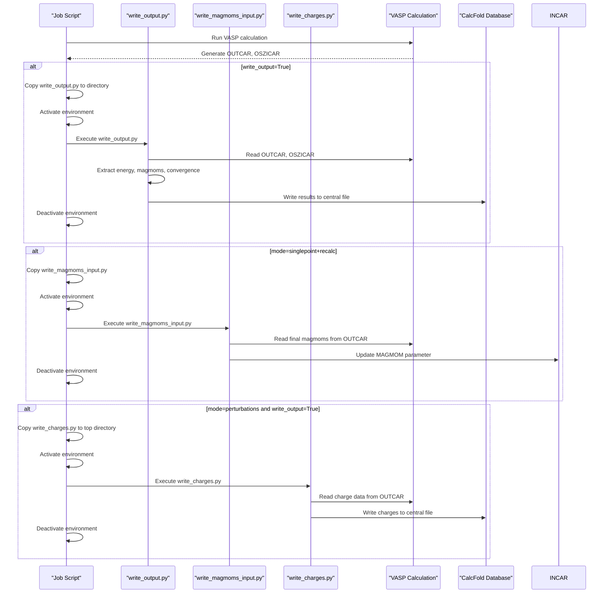

# Manual Submission System

<cite>
**Referenced Files in This Document**   
- [SubmitManual.py](file://common/SubmitManual.py)
- [write_output.py](file://common/write_output.py)
- [write_magmoms_input.py](file://common/write_magmoms_input.py)
- [1_submit.py](file://4_mae/1_submit.py)
- [3_submit.py](file://4_mae/3_submit.py)
- [input_template.py](file://4_mae/input_template.py)
- [MAE.py](file://4_mae/MAE.py)
</cite>

## Table of Contents
1. [Introduction](#introduction)
2. [SubmitManual Class Configuration](#submitmanual-class-configuration)
3. [Directory Structure Creation](#directory-structure-creation)
4. [Input File Generation with ASE Vasp Calculator](#input-file-generation-with-ase-vasp-calculator)
5. [Job Script Templating with SLURM Support](#job-script-templating-with-slurm-support)
6. [MAE Calculation Setup](#mae-calculation-setup)
7. [Convergence Testing Workflows](#convergence-testing-workflows)
8. [POTCAR Handling in Perturbation Calculations](#potcar-handling-in-perturbation-calculations)
9. [CHGCAR/WAVECAR Transfer Between Calculations](#chargcarwavecar-transfer-between-calculations)
10. [Performance Optimization for Batch Jobs](#performance-optimization-for-batch-jobs)
11. [Integration with External Scripts](#integration-with-external-scripts)

## Introduction
The manual submission system in Automag provides a comprehensive framework for managing ab initio calculations through the SubmitManual class. This system enables researchers to configure various calculation modes, generate appropriate input files, and submit jobs to high-performance computing clusters using SLURM or other job schedulers. The system is designed to handle complex workflows including convergence testing, magnetic anisotropy energy (MAE) calculations, and perturbation studies, with robust error handling and optimization features.

**Section sources**
- [SubmitManual.py](file://common/SubmitManual.py#L0-L869)

## SubmitManual Class Configuration
The SubmitManual class serves as the core component for managing ab initio calculations, offering multiple calculation modes through its configuration parameters. The class supports several calculation modes including 'encut', 'kgrid', 'perturbations', 'singlepoint', 'mae_theta_phi', and 'mae_curve', each with specific configuration requirements.

For convergence testing, the 'encut' mode requires encut_values while disabling other parameters like sigma_values and kpts_values. Similarly, 'kgrid' mode requires both sigma_values and kpts_values. The perturbation mode ('perturbations') requires pert_values along with dummy_atom and dummy_position specifications. For MAE calculations, 'mae_theta_phi' mode requires Nth and Nph parameters defining the angular grid, while 'mae_curve' mode requires N_MAE, MAE_x, MAE_y, and MAE_z parameters for defining the rotation axis.

The class initializes with various parameters including poscar_file, mode, fix_params (fixed VASP parameters), magmoms (magnetic moments), and calculator-specific settings. Additional configuration options include jobheader for job script templates, calculator_command for execution commands, and environment management scripts for activating and deactivating computational environments.

**Diagram sources**
- [SubmitManual.py](file://common/SubmitManual.py#L24-L153)

**Section sources**
- [SubmitManual.py](file://common/SubmitManual.py#L24-L153)

## Directory Structure Creation
The SubmitManual class implements a systematic directory structure creation process that organizes calculations hierarchically based on compound, calculator type, and calculation mode. The directory structure follows a consistent pattern: CalcFold/{compound}/{calculator}/, with additional subdirectories for different calculation types.

For convergence testing, the system creates dedicated directories under a 'convergence' folder, with specific subdirectories for 'encut' and 'kgrid' modes. The create_mae_dir function generates specialized directories for MAE calculations with naming conventions that include U, J, k-points, and energy cutoff parameters in the format 'mae_U{U:.1f}_J{J:.1f}_K{kpts}_EN{encut}'.

The directory creation process is implemented in the submit() and write_input() methods, which use os.makedirs() with exist_ok=True to ensure directories are created without errors if they already exist. The system creates different directory structures based on the calculation mode: singlepoint calculations create simple directory hierarchies, while MAE calculations create complex nested structures with multiple subdirectories for different angular orientations.

For MAE calculations, the system creates a main MAE directory, a 'z' directory for the reference collinear calculation, and individual directories for each angular combination (PhTh_phi_theta). The system also creates temporary directories for perturbation calculations and handles special cases like k-point reference calculations when use_kpoint_reference is enabled.

**Section sources**
- [SubmitManual.py](file://common/SubmitManual.py#L115-L185)
- [SubmitManual.py](file://common/SubmitManual.py#L187-L507)

## Input File Generation with ASE Vasp Calculator
The input file generation process in the SubmitManual system leverages the ASE Vasp calculator to create VASP input files (INCAR, POSCAR, KPOINTS, POTCAR) for ab initio calculations. The write_vasp_input_files() method serves as the primary interface for input file generation, handling different calculation modes through the innermode parameter.

The method supports several inner modes: 'singlepoint', 'recalc', 'singlepoint+recalc', 'nsc' (non-self-consistent), and 'sc' (self-consistent). For singlepoint calculations, it creates a directory and uses the Vasp calculator to write input files. For singlepoint+recalc mode, it creates both singlepoint and recalc directories, allowing for sequential calculations where the recalc step uses magnetic moments from the singlepoint calculation.

The system handles magnetic moments through the set_magmoms() method, which processes the magmoms parameter and sets appropriate VASP parameters like 'lorbit' and 'ispin'. For perturbation calculations, the method configures LDAU parameters (ldaul, ldauu, ldauj) based on the dummy atom and perturbation value, setting ldau=True and ldautype=3 for DFT+U calculations.

The input generation process integrates with the VASP calculator by creating a Vasp object with the specified parameters and atoms object, then calling write_input() to generate the necessary files. The system also handles special cases like creating initial_magmoms.txt files for subsequent processing by external scripts.

**Diagram sources**
- [SubmitManual.py](file://common/SubmitManual.py#L526-L633)

**Section sources**
- [SubmitManual.py](file://common/SubmitManual.py#L526-L633)

## Job Script Templating with SLURM Support
The job script templating system in SubmitManual provides flexible job submission capabilities with native SLURM support. The write_jobscript() method generates job scripts based on the specified jobheader, with automatic detection of SLURM directives (identified by '#SBATCH') to enable SLURM-specific features.

The system supports multiple calculation modes through the mode parameter, generating different job script structures for 'singlepoint', 'singlepoint+recalc', 'perturbations', 'encut', 'kgrid', and 'nsc' modes. For SLURM jobs, the system automatically adds job name specifications using the compound formula and calculation mode, printing informational messages about SLURM usage.

The job script generation handles both parallel and sequential configuration processing through the parallel_over_configurations flag. When enabled, separate job scripts are created for each configuration; when disabled, a single job script is created with appended commands for all configurations. The system creates appropriate run_all_.sh submission scripts that use the correct execution command (sbatch for SLURM, qsub for PBS, or sh for shell scripts).

For MAE calculations, the system creates specialized job scripts that transfer CHGCAR and WAVECAR files from the reference 'z' directory using symbolic links (ln -s) to conserve disk space. The job scripts include commands to remove large files (WAVECAR, CHG) when keep_large_files=False, optimizing storage usage for batch calculations.

The system also integrates with external Python scripts (write_output.py, write_magmoms_input.py) by copying them to the calculation directory and executing them within the job script, enabling post-processing and magnetic moment updating functionality.

**Diagram sources**
- [SubmitManual.py](file://common/SubmitManual.py#L646-L853)

**Section sources**
- [SubmitManual.py](file://common/SubmitManual.py#L646-L853)

## MAE Calculation Setup
The MAE calculation setup in the SubmitManual system is implemented through two specialized modes: 'mae_theta_phi' and 'mae_curve'. These modes enable comprehensive magnetic anisotropy energy calculations using non-collinear DFT with spin-orbit coupling.

The 'mae_theta_phi' mode creates a 2D angular grid by defining Nth (number of theta points) and Nph (number of phi points) parameters. The system generates a mesh of spherical angles using np.linspace() and np.meshgrid(), creating calculations for each (theta, phi) combination. For each angular orientation, the system calculates the corresponding SAXIS vector using the RotatingAngles() helper function and sets it in the VASP parameters.

The 'mae_curve' mode enables 1D rotation along a defined plane, requiring N_MAE (number of points), MAE_x, MAE_y, and MAE_z parameters. The system calculates rotation vectors as linear combinations of MAE_x and MAE_y components, enabling precise control over the rotation path. This mode is particularly useful for characterizing easy and hard magnetization axes.

Both MAE modes require a reference collinear calculation with magnetization along the z-axis (stored in the 'z' directory). The system implements a sophisticated check_z_dir() function that searches for appropriate CHGCAR and WAVECAR files from various sources, including k-point optimized calculations (for MAE.py compatibility) and recalc/singlepoint directories. If suitable charge and wavefunction files are not found, the system automatically creates a collinear reference calculation.

The MAE workflow integrates with the 1_submit.py and 3_submit.py scripts in the 4_mae module, which handle the complete MAE calculation pipeline from structure preparation to job submission. The input_template.py file provides default parameters for MAE calculations, including grid resolution, VASP parameters, and compatibility options with the original MAE.py implementation.

**Diagram sources**
- [1_submit.py](file://4_mae/1_submit.py#L0-L215)
- [3_submit.py](file://4_mae/3_submit.py#L0-L240)
- [input_template.py](file://4_mae/input_template.py#L0-L123)

**Section sources**
- [1_submit.py](file://4_mae/1_submit.py#L0-L215)
- [3_submit.py](file://4_mae/3_submit.py#L0-L240)
- [input_template.py](file://4_mae/input_template.py#L0-L123)

## Convergence Testing Workflows
The convergence testing workflows in the SubmitManual system provide systematic evaluation of VASP calculation parameters, specifically for energy cutoff (encut) and k-point grid (kgrid) convergence. These workflows are implemented in the 0_conv_tests module and utilize the SubmitManual class with specific configuration modes.

For encut convergence testing, the system requires encut_values parameter (a list or range of energy cutoff values) while disabling other variable parameters. The workflow creates a dedicated 'encut' directory under the convergence folder and generates separate calculations for each encut value. Similarly, for kgrid convergence testing, the system requires both sigma_values (electronic smearing) and kpts_values (k-point mesh density) parameters, creating a 'kgrid' directory for these calculations.

The convergence testing workflow is initiated through the 1_submit.py script in the 0_conv_tests directory, which reads input parameters from an input.py file. The script supports both FireWorks and manual submission modes, with manual submission using the SubmitManual class. The input parameters include mode ('encut' or 'kgrid'), poscar_file (structure file), and VASP parameters in the params dictionary.

The system automatically generates job scripts that append calculation commands sequentially, enabling efficient batch processing. After calculations complete, the 2_plot_results.py script analyzes the output to determine convergence, plotting energy versus the tested parameter and identifying values where energy differences fall below specified thresholds (typically 1 meV/atom).

The convergence testing system integrates with the write_output.py script to extract energy values from VASP output files, ensuring consistent data collection across all calculations. The results are written to a central output file in the CalcFold directory, enabling easy comparison and analysis of convergence behavior.

**Section sources**
- [1_submit.py](file://0_conv_tests/1_submit.py#L0-L97)

## POTCAR Handling in Perturbation Calculations
The POTCAR handling system in perturbation calculations implements a sophisticated method for treating specific atoms independently in DFT+U calculations. This approach enables the calculation of Hubbard U parameters through linear response theory by temporarily changing the chemical identity of the target atom to a "dummy" atom while maintaining its electronic properties.

The system implements this functionality in the 'perturbations' mode of the SubmitManual class. When initializing a perturbation calculation, users specify dummy_atom (the temporary chemical symbol) and dummy_position (the index of the atom to perturb). The system then performs a series of operations to ensure the correct pseudopotential is used:

First, it identifies the path to the VASP pseudopotential library (VASP_PP_PATH) and locates the POTCAR files for both the original atom (atom_ucalc) and the dummy atom. It then temporarily renames the dummy atom's POTCAR file (adding a '_' prefix) and copies the original atom's POTCAR file to the dummy atom's directory. This effectively makes the dummy atom behave electronically like the original atom while being treated as a distinct species by VASP.

During the calculation, the system creates input files for both non-self-consistent (nsc) and self-consistent (sc) runs at each perturbation value. The job script transfers WAVECAR and CHGCAR files from the initial singlepoint calculation to ensure consistent starting conditions. After all perturbation calculations are complete, the system restores the original POTCAR file names, maintaining the integrity of the pseudopotential library.

This approach allows for accurate U parameter calculations while avoiding the need for specialized VASP modifications or complex input file manipulations. The system handles various PAW potential versions (sv, pv, GW) through the setups parameter and supports both transition metals (ldaul=2) and lanthanides/actinides (ldaul=3).

**Section sources**
- [SubmitManual.py](file://common/SubmitManual.py#L187-L507)

## CHGCAR/WAVECAR Transfer Between Calculations
The CHGCAR/WAVECAR transfer system in SubmitManual ensures efficient data sharing between related calculations while maintaining computational accuracy. This system is critical for non-self-consistent calculations that require pre-computed charge density and wavefunctions as starting points.

The primary implementation is in the check_z_dir() function, which systematically searches for appropriate CHGCAR and WAVECAR files for MAE calculations. The system first checks for k-point optimized reference calculations (MAE.py compatibility mode) by searching through standard k-point directories (K_0.07, K_0.08, etc.) for existing CHGCAR files. If found, it copies these files to the z-directory for use as reference states.

If k-point reference files are not available, the system searches for suitable files in three locations: the z/singlepoint directory, the parent state_dir/recalc directory, and the parent state_dir/singlepoint directory. It verifies both the existence and non-zero size of CHGCAR and WAVECAR files to ensure they contain valid data. When appropriate files are found, the system copies the entire recalc or singlepoint directory to z/singlepoint, preserving the complete calculation state.

When no suitable reference files are found, the system automatically creates a collinear reference calculation by setting appropriate VASP parameters (lnoncollinear=True, lsorbit=True, icharg=2, istart=0) and generating input files for a fresh calculation. This ensures that MAE calculations always have valid starting conditions.

For actual MAE calculations, the system uses symbolic links (ln -s) to reference WAVECAR files from the z/singlepoint directory, conserving disk space while maintaining file integrity. The job scripts include explicit commands to copy CHGCAR and create symbolic links to WAVECAR, ensuring reliable file transfer between calculation steps.

The transfer system also handles special cases like the use_kpoint_reference parameter, which enables compatibility with the original MAE.py script by prioritizing k-point optimized reference calculations. This ensures consistent results between the modular implementation and the original script.

**Section sources**
- [SubmitManual.py](file://common/SubmitManual.py#L187-L507)

## Performance Optimization for Batch Jobs
The performance optimization features in the SubmitManual system enhance efficiency for large-scale calculations through several key strategies. The parallel_over_configurations parameter controls whether calculations are submitted as individual jobs or combined into batch scripts, allowing users to optimize based on cluster policies and job scheduler characteristics.

For SLURM-based systems, the system automatically generates appropriate SBATCH directives in job scripts, including job names, resource requests, and output/error file specifications. The run_all_.sh submission scripts use sbatch for SLURM, qsub for PBS, or sh for direct execution, ensuring compatibility with different job schedulers.

The system implements file size optimization by optionally removing large files (WAVECAR, CHG) after calculations complete, controlled by the keep_large_files parameter. This is particularly important for batch MAE calculations that can generate hundreds of large files. The integration with external scripts is optimized by copying scripts only when needed and executing them conditionally based on the write_output parameter.

Memory usage is optimized through the use of symbolic links for WAVECAR files in MAE calculations, reducing disk space requirements by avoiding file duplication. The system also implements efficient directory creation with os.makedirs(exist_ok=True), preventing unnecessary file system operations.

For convergence testing, the system batches multiple calculations into a single job script, reducing job scheduler overhead. The MAE calculation workflow minimizes redundant operations by reusing reference charge and wavefunction files across multiple angular calculations.

The system's modular design allows for easy configuration of computational resources through the jobheader parameter, enabling users to specify node counts, CPU tasks, wall time limits, and partition requirements tailored to their specific calculations and cluster capabilities.

**Section sources**
- [SubmitManual.py](file://common/SubmitManual.py#L646-L853)

## Integration with External Scripts
The SubmitManual system integrates with several external Python scripts to extend functionality and enable post-processing of calculation results. These integrations are implemented through file copying and execution within job scripts, creating a seamless workflow from calculation submission to result extraction.

The primary integration is with write_output.py, which extracts key information from VASP output files and writes it to a central database. The system copies this script to calculation directories and executes it at the end of jobs when write_output=True. The script extracts energies, magnetic moments, convergence status, and symmetry information, writing results to files in the CalcFold directory for subsequent analysis.

Another critical integration is with write_magmoms_input.py, used in singlepoint+recalc calculations. This script reads final magnetic moments from OUTCAR files and updates the MAGMOM parameter in INCAR files for subsequent calculations. The system copies this script to recalc directories and executes it within the job script, enabling self-consistent magnetic moment refinement.

The system also integrates with write_charges.py for perturbation calculations, which extracts charge information from VASP output for U parameter calculations. This script is copied to the top-level directory and executed after all perturbation calculations complete.

These external scripts are referenced through class attributes (write_output_script_path, write_magmoms_script_path, write_charges_script_path) that construct paths using the AUTOMAG_PATH environment variable. This ensures consistent access to scripts regardless of installation location.

The integration system uses environment activation and deactivation commands (environment_activate, environment_deactivate) to ensure scripts execute in the correct Python environment, typically containing required dependencies like pymatgen and ase.

**Diagram sources**
- [write_output.py](file://common/write_output.py#L0-L147)
- [write_magmoms_input.py](file://common/write_magmoms_input.py#L0-L50)

**Section sources**
- [write_output.py](file://common/write_output.py#L0-L147)
- [write_magmoms_input.py](file://common/write_magmoms_input.py#L0-L50)