# Shared Utilities and Workflow Management

<cite>
**Referenced Files in This Document**   
- [SubmitFirework.py](file://common/SubmitFirework.py)
- [SubmitManual.py](file://common/SubmitManual.py)
- [utilities.py](file://common/utilities.py)
- [write_charges.py](file://common/write_charges.py)
- [write_output.py](file://common/write_output.py)
- [write_magmoms_input.py](file://common/write_magmoms_input.py)
- [get_magmoms_vasp.py](file://common/get_magmoms_vasp.py)
- [write_output_vasp.py](file://common/write_output_vasp.py)
</cite>

## Table of Contents
1. [Introduction](#introduction)
2. [Workflow Orchestration](#workflow-orchestration)
3. [Data Processing Pipelines](#data-processing-pipelines)
4. [Output Formatting Standards](#output-formatting-standards)
5. [Component Interactions](#component-interactions)
6. [Hybrid Execution Models](#hybrid-execution-models)
7. [Infrastructure Requirements](#infrastructure-requirements)
8. [System Context Diagrams](#system-context-diagrams)
9. [Cross-Cutting Concerns](#cross-cutting-concerns)

## Introduction
The shared utilities component provides a comprehensive framework for managing computational materials science workflows, particularly focused on magnetic property calculations. This system implements dual execution paradigms through FireWorks-based automated workflow management and manual job submission modes. The architecture enables systematic exploration of material properties through convergence testing, perturbation analysis, and magnetic anisotropy calculations. The component integrates tightly with VASP (Vienna Ab initio Simulation Package) for electronic structure calculations while providing robust data processing, error handling, and result aggregation capabilities.

## Workflow Orchestration
The workflow management system provides two complementary approaches for executing computational workflows: automated FireWorks orchestration and manual job submission. The FireWorks-based approach enables distributed, fault-tolerant execution of complex calculation sequences, while the manual mode provides direct control over job submission for environments without workflow management infrastructure.

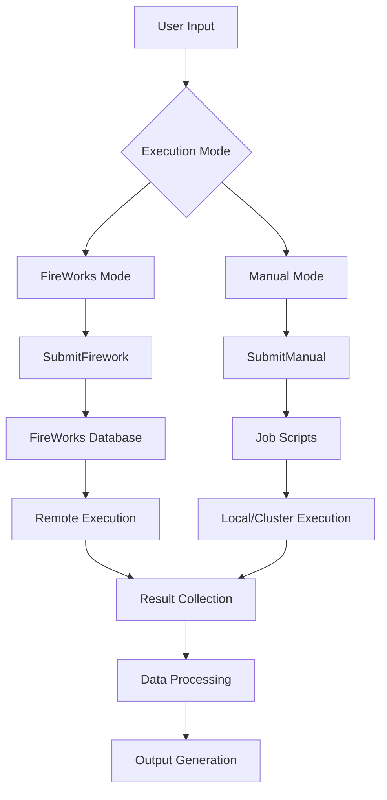

**Diagram sources**
- [SubmitFirework.py](file://common/SubmitFirework.py#L25-L258)
- [SubmitManual.py](file://common/SubmitManual.py#L24-L853)

**Section sources**
- [SubmitFirework.py](file://common/SubmitFirework.py#L25-L258)
- [SubmitManual.py](file://common/SubmitManual.py#L24-L853)

## Data Processing Pipelines
The system implements specialized data processing pipelines for magnetic moments and charge analysis, with different implementations for FireWorks and manual execution modes. These pipelines extract, validate, and transform raw calculation outputs into scientifically meaningful results.

### Magnetic Moments Processing
The magnetic moments pipeline follows a two-stage approach: initial moment extraction from converged calculations and subsequent validation against convergence criteria. The system captures both initial and final magnetic moments, enabling analysis of magnetic configuration evolution during self-consistent field calculations.

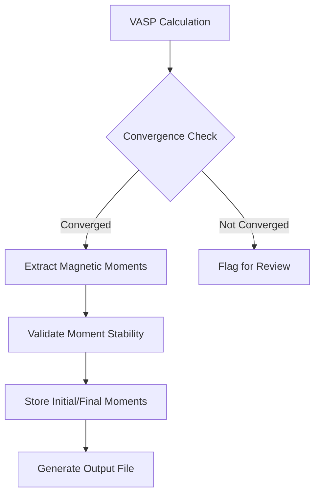

**Diagram sources**
- [get_magmoms_vasp.py](file://common/get_magmoms_vasp.py#L1-L42)
- [write_magmoms_input.py](file://common/write_magmoms_input.py#L1-L50)

### Charges Processing Pipeline
The charge analysis pipeline focuses on extracting charge information for perturbation calculations, particularly for Hubbard U parameter determination. The system implements validation logic to ensure result reliability by checking magnetic moment stability and convergence status.

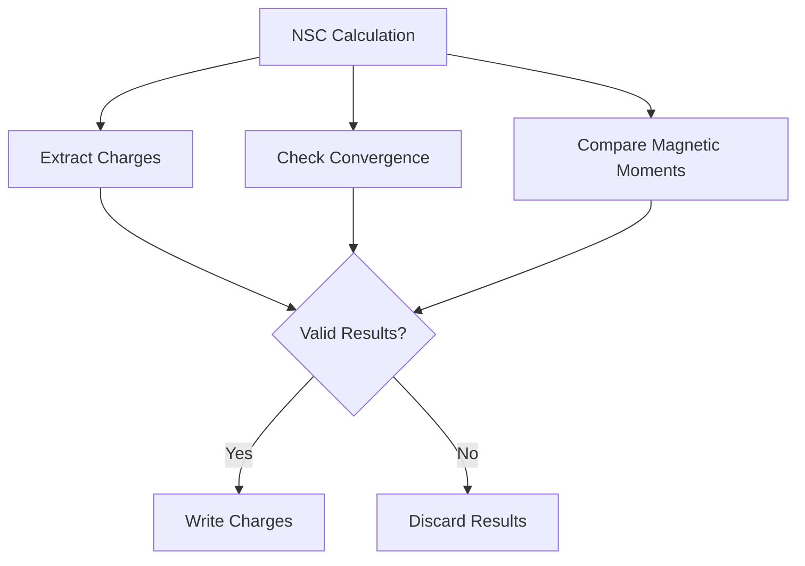

**Diagram sources**
- [write_charges.py](file://common/write_charges.py#L1-L125)
- [utilities.py](file://common/utilities.py#L221-L276)

**Section sources**
- [write_charges.py](file://common/write_charges.py#L1-L125)
- [utilities.py](file://common/utilities.py#L221-L276)

## Output Formatting Standards
The system implements consistent output formatting standards across different calculation types and execution modes. Output files contain structured information including calculation metadata, convergence status, chemical formula, crystallographic information, and physical properties.

### Output Structure
Output files follow a standardized format with the following fields:
- **System identifier**: Unique identifier for the calculation
- **Firework ID**: Workflow tracking identifier (FireWorks mode)
- **Convergence status**: Per-step convergence information
- **Chemical formula**: Standardized chemical formula
- **Space group**: Crystallographic space group symbol
- **Energy/Enthalpy**: Total energy or enthalpy with correction
- **Magnetic moments**: Initial and final magnetic moments (when applicable)

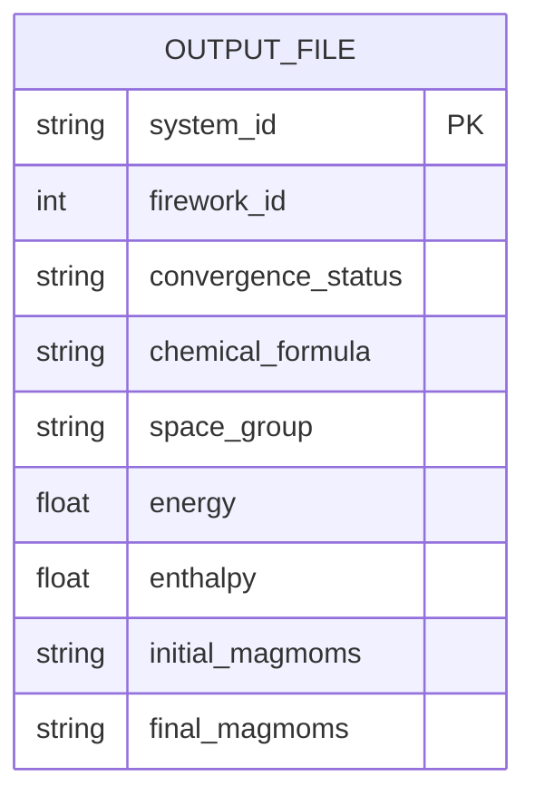

**Diagram sources**
- [write_output.py](file://common/write_output.py#L1-L147)
- [write_output_vasp.py](file://common/write_output_vasp.py#L1-L113)

**Section sources**
- [write_output.py](file://common/write_output.py#L1-L147)
- [write_output_vasp.py](file://common/write_output_vasp.py#L1-L113)

## Component Interactions
The system architecture features well-defined interactions between core components, enabling modular design and separation of concerns. The SubmitFirework and VaspCalculationTask components form the backbone of the automated workflow system, while supporting utilities handle data processing and output generation.

### SubmitFirework and VaspCalculationTask Interaction
The SubmitFirework class orchestrates workflow creation by instantiating VaspCalculationTask instances for each calculation step. This interaction enables parameterized execution of VASP calculations within the FireWorks framework.

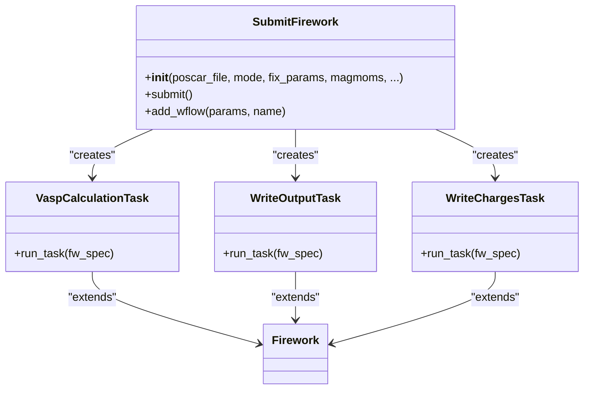

**Diagram sources**
- [SubmitFirework.py](file://common/SubmitFirework.py#L25-L258)
- [utilities.py](file://common/utilities.py#L64-L276)

### Structure Encoding Utilities
The system implements utilities for encoding and decoding atomic structures to facilitate workflow persistence and data exchange. The atoms_to_encode and encode_to_atoms functions provide bidirectional conversion between ASE Atoms objects and JSON-serializable representations.

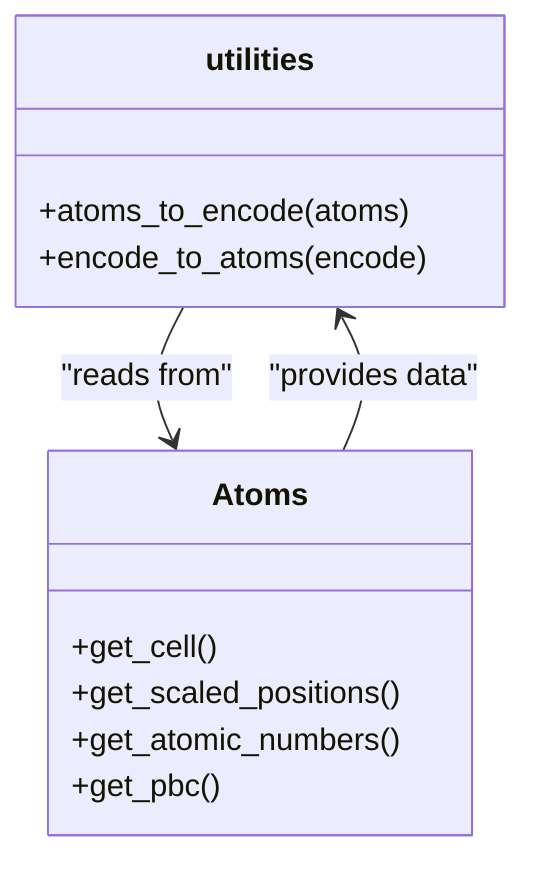

**Diagram sources**
- [utilities.py](file://common/utilities.py#L1-L62)

**Section sources**
- [utilities.py](file://common/utilities.py#L1-L62)

## Hybrid Execution Models
The system implements a hybrid execution model that supports both automated workflow management through FireWorks and manual job submission. This dual approach provides flexibility for different computational environments and user requirements.

### Technical Implementation
The hybrid model is implemented through parallel class hierarchies: SubmitFirework for automated execution and SubmitManual for script-based submission. Both classes share similar interfaces and configuration parameters, enabling consistent workflow definition across execution modes.

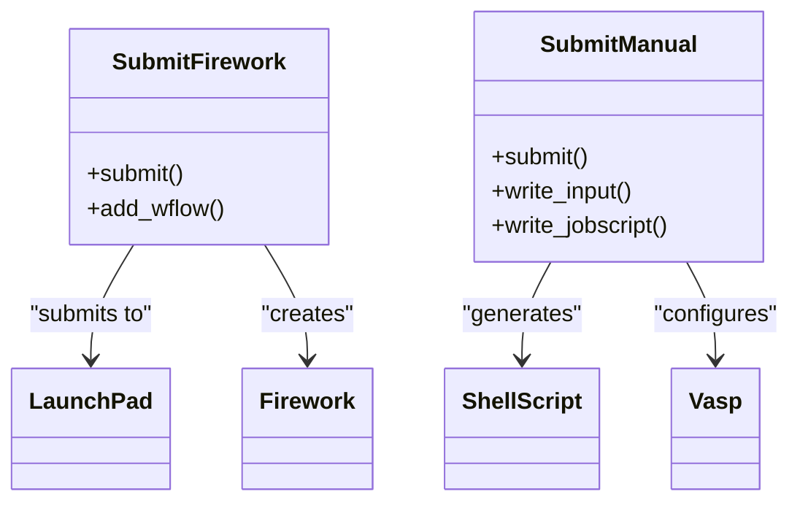

**Diagram sources**
- [SubmitFirework.py](file://common/SubmitFirework.py#L25-L258)
- [SubmitManual.py](file://common/SubmitManual.py#L24-L853)

### Error Handling in Job Submission
The system implements comprehensive error handling for job submission, with different strategies for the two execution modes. The FireWorks mode leverages the framework's built-in fault tolerance, while the manual mode implements validation checks and recovery procedures.

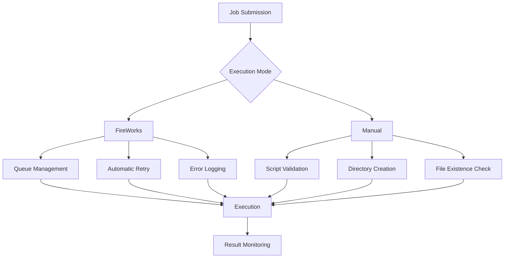

**Section sources**
- [SubmitFirework.py](file://common/SubmitFirework.py#L25-L258)
- [SubmitManual.py](file://common/SubmitManual.py#L24-L853)

## Infrastructure Requirements
The system has specific infrastructure requirements that differ between the two execution modes, particularly regarding database and queue management systems.

### FireWorks Mode Requirements
The automated workflow mode requires:
- **MongoDB**: Database backend for FireWorks workflow persistence
- **FireWorks server**: Workflow management service
- **Queue adapter**: Integration with HPC job schedulers (SLURM, PBS, etc.)
- **LaunchPad configuration**: YAML file with database connection parameters

### Manual Mode Requirements
The script-based execution mode requires:
- **Shell environment**: Bash or compatible shell
- **Job scheduler access**: SLURM, PBS, or similar (optional)
- **Directory structure**: Properly configured calculation directories
- **Environment modules**: Python and VASP dependencies

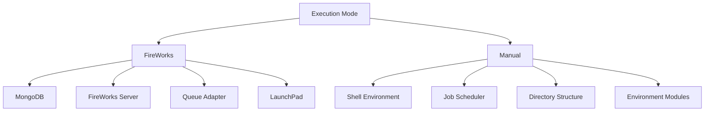

**Section sources**
- [SubmitFirework.py](file://common/SubmitFirework.py#L1-L25)
- [SubmitManual.py](file://common/SubmitManual.py#L1-L23)

## System Context Diagrams
The system context diagrams illustrate the complete workflow generation, execution, and result collection process for both execution modes.

### FireWorks Workflow Context
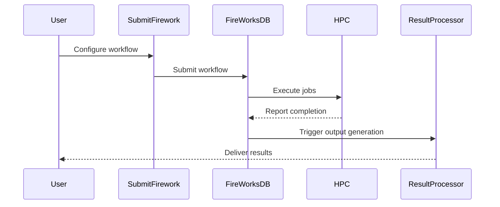

**Diagram sources**
- [SubmitFirework.py](file://common/SubmitFirework.py#L25-L258)

### Manual Execution Context
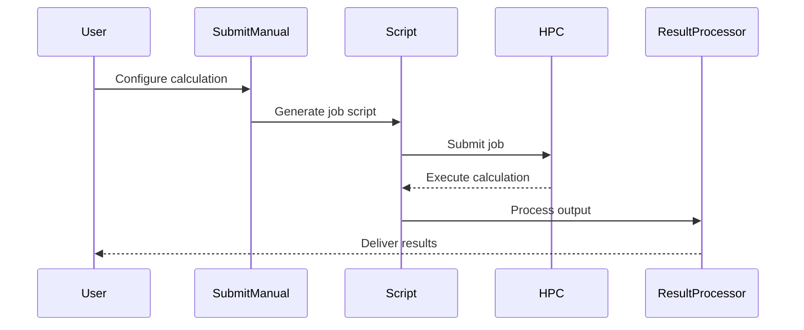

**Diagram sources**
- [SubmitManual.py](file://common/SubmitManual.py#L24-L853)

## Cross-Cutting Concerns
The system addresses several cross-cutting concerns that impact multiple components and execution modes.

### Logging and Monitoring
The system implements comprehensive logging at multiple levels:
- **Workflow logging**: FireWorks job information and execution status
- **Calculation logging**: VASP output and convergence information
- **Error logging**: Exception handling and failure reporting
- **Progress logging**: Step-by-step execution tracking

### Error Recovery
The system implements several error recovery mechanisms:
- **Automatic retry**: FireWorks workflow resilience
- **Checkpointing**: State preservation between calculation steps
- **Validation checks**: Pre-execution verification of inputs and directories
- **Fallback procedures**: Alternative execution paths when primary methods fail

### HPC Environment Compatibility
The system is designed to work across different HPC environments through:
- **Configurable job headers**: Support for SLURM, PBS, and other schedulers
- **Environment activation/deactivation**: Module loading and unloading
- **Path configuration**: Environment variable-based path resolution
- **Flexible directory structure**: Adaptable to different filesystem layouts

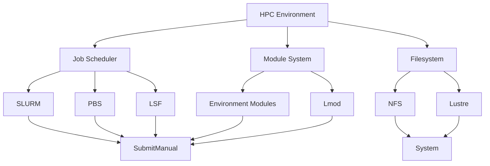

**Section sources**
- [SubmitManual.py](file://common/SubmitManual.py#L24-L853)