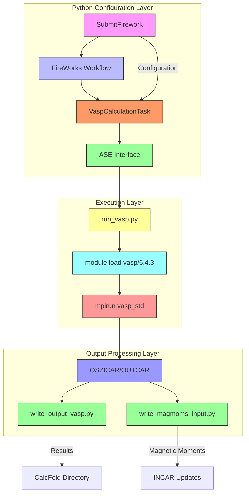
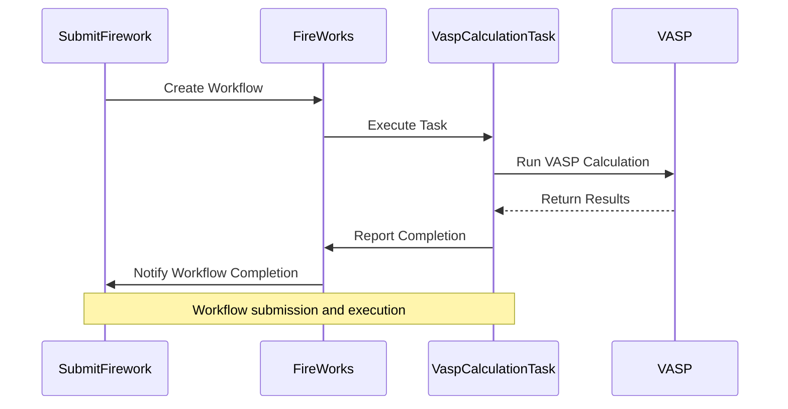
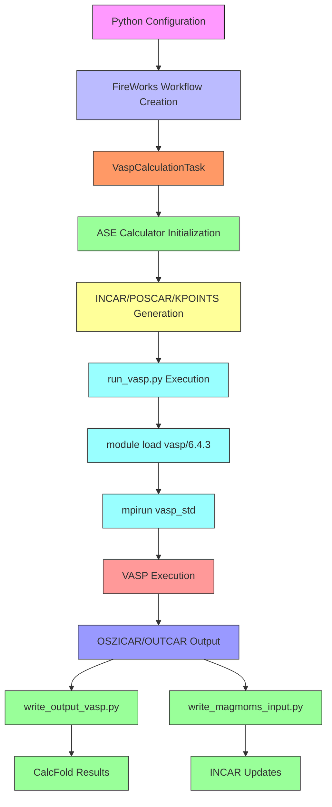
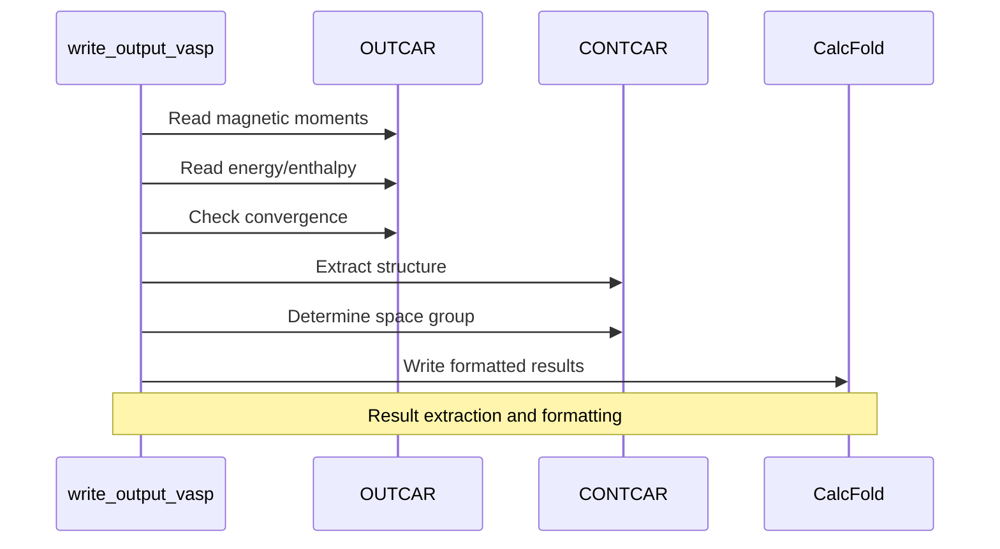

# VASP Integration Layer

<cite>
**Referenced Files in This Document**   
- [run_vasp.py](file://ase/run_vasp.py)
- [write_magmoms_input.py](file://common/write_magmoms_input.py)
- [write_output_vasp.py](file://common/write_output_vasp.py)
- [SubmitFirework.py](file://common/SubmitFirework.py)
- [utilities.py](file://common/utilities.py)
- [README.md](file://README.md)
</cite>

## Table of Contents
1. [Introduction](#introduction)
2. [Architecture Overview](#architecture-overview)
3. [Core Components](#core-components)
4. [Data Flow and Execution Workflow](#data-flow-and-execution-workflow)
5. [MAGMOM Initialization and Result Extraction](#magmom-initialization-and-result-extraction)
6. [Infrastructure Requirements](#infrastructure-requirements)
7. [Cross-Cutting Concerns](#cross-cutting-concerns)
8. [Conclusion](#conclusion)

## Introduction

The VASP integration layer in the Automag workflow provides a comprehensive framework for executing VASP calculations, managing input/output operations, and processing results within a high-performance computing environment. This documentation details the architectural design of the integration layer, focusing on the execution workflow from Python configuration through ASE interface to VASP execution and result parsing. The system leverages FireWorks for workflow management, enabling reliable execution of complex computational materials science workflows. The integration layer handles critical aspects such as MAGMOM initialization, output parsing from OSZICAR/OUTCAR files, and infrastructure requirements for MPI, MKL, and VASP licensing.

## Architecture Overview

The VASP integration layer follows a modular architecture that separates concerns between workflow management, calculation execution, input generation, and output processing. The system is designed to work within a high-performance computing environment, utilizing module systems for software management and MPI for parallel execution.

**Diagram sources**
- [run_vasp.py](file://ase/run_vasp.py)
- [SubmitFirework.py](file://common/SubmitFirework.py)
- [utilities.py](file://common/utilities.py)
- [write_output_vasp.py](file://common/write_output_vasp.py)
- [write_magmoms_input.py](file://common/write_magmoms_input.py)

## Core Components

### VASP Execution through ASE

The VASP execution mechanism is implemented through the ASE (Atomic Simulation Environment) interface, which provides a standardized way to interact with various computational chemistry software packages. The `run_vasp.py` script serves as the bridge between ASE and the VASP executable, handling the environment setup and execution command.

The execution process follows a module-based approach, where the VASP environment is loaded using the system's module system. This approach ensures consistent environment configuration across different computing environments and simplifies version management. The current implementation uses VASP 6.4.3, loaded via the command `module load vasp/6.4.3`, followed by MPI execution of the VASP standard executable.

**Section sources**
- [run_vasp.py](file://ase/run_vasp.py)

### INCAR/POSCAR/KPOINTS Generation

The integration layer generates VASP input files (INCAR, POSCAR, KPOINTS) through the ASE interface, which translates Python-based configuration parameters into the appropriate VASP input format. The `VaspCalculationTask` class in `utilities.py` handles the creation of VASP calculators with specified parameters, including electronic structure settings, convergence criteria, and magnetic properties.

Input parameters are passed as a dictionary to the VASP calculator, which then generates the corresponding INCAR file. The POSCAR file is generated from the atomic structure representation in ASE, while KPOINTS are specified through the `kpts` parameter in the calculation configuration. This approach provides a flexible and programmable way to generate VASP input files, enabling automated parameter sweeps and convergence testing.

**Section sources**
- [utilities.py](file://common/utilities.py#L64-L151)

### Output Parsing from OSZICAR/OUTCAR

The integration layer extracts results from VASP output files (OSZICAR and OUTCAR) using specialized parsing functions. The `write_output_vasp.py` script handles the extraction of key information such as energy convergence, enthalpy, magnetic moments, and structural properties.

The parsing process involves reading the OUTCAR file to extract the final energy, magnetic moments, and convergence status. The OSZICAR file is used to monitor energy convergence during the calculation. The extracted information is then formatted and written to output files in the CalcFold directory, providing a structured record of calculation results for subsequent analysis.

**Section sources**
- [write_output_vasp.py](file://common/write_output_vasp.py)

### FireWorks Task Integration

The integration with FireWorks enables robust workflow management and job scheduling. The `SubmitFirework` class orchestrates the creation of FireWorks workflows that include VASP calculations as individual firetasks. Each workflow consists of one or more `VaspCalculationTask` instances, which represent individual VASP runs.

The workflow structure supports sequential execution of calculations, such as single-point energy calculations followed by recalculation with updated magnetic moments. The FireWorks framework handles job submission, monitoring, and error recovery, providing a reliable execution environment for complex computational workflows.

**Diagram sources**
- [SubmitFirework.py](file://common/SubmitFirework.py#L25-L258)
- [utilities.py](file://common/utilities.py#L64-L151)

## Data Flow and Execution Workflow

The data flow in the VASP integration layer follows a well-defined sequence from Python configuration to shell execution and result ingestion. The workflow begins with Python-based configuration of calculation parameters, which are then translated into VASP input files through the ASE interface.

**Diagram sources**
- [SubmitFirework.py](file://common/SubmitFirework.py)
- [utilities.py](file://common/utilities.py)
- [run_vasp.py](file://ase/run_vasp.py)
- [write_output_vasp.py](file://common/write_output_vasp.py)
- [write_magmoms_input.py](file://common/write_magmoms_input.py)

The workflow begins with the `SubmitFirework` class creating a FireWorks workflow based on the specified calculation parameters. The workflow contains one or more `VaspCalculationTask` instances, each representing a VASP calculation. When executed, the `VaspCalculationTask` initializes an ASE VASP calculator with the specified parameters, which generates the necessary input files (INCAR, POSCAR, KPOINTS).

The calculation is then executed through the `run_vasp.py` script, which loads the VASP environment using module commands and launches the VASP executable via MPI. The VASP calculation produces output files (OSZICAR, OUTCAR, CONTCAR), which are then processed by output handling scripts.

The `write_output_vasp.py` script extracts key results from the output files and writes them to structured output files in the CalcFold directory. The `write_magmoms_input.py` script extracts magnetic moments from the OUTCAR file and updates the INCAR file for subsequent calculations, enabling iterative refinement of magnetic configurations.

**Section sources**
- [SubmitFirework.py](file://common/SubmitFirework.py)
- [utilities.py](file://common/utilities.py)
- [run_vasp.py](file://ase/run_vasp.py)
- [write_output_vasp.py](file://common/write_output_vasp.py)
- [write_magmoms_input.py](file://common/write_magmoms_input.py)

## MAGMOM Initialization and Result Extraction

### write_magmoms_input for MAGMOM Initialization

The `write_magmoms_input.py` script handles the initialization of magnetic moments in VASP calculations. This component reads magnetic moments from a previous calculation's OUTCAR file and updates the MAGMOM parameter in the INCAR file for subsequent calculations.

The script first reads the atomic structure and magnetic moments from the OUTCAR file using ASE's `read` function. If magnetic moments are not available, it initializes them to zero. The script then searches for the existing MAGMOM parameter in the INCAR file using a regular expression pattern, replaces the values with those extracted from the previous calculation, and writes the updated content back to the file.

This approach enables iterative refinement of magnetic configurations, where the magnetic moments from a converged calculation are used as the initial guess for subsequent calculations. This is particularly important for complex magnetic systems where the initial magnetic moment configuration can significantly impact convergence.

**Section sources**
- [write_magmoms_input.py](file://common/write_magmoms_input.py)

### write_output_vasp for Result Extraction

The `write_output_vasp.py` script handles the extraction and formatting of results from VASP calculations. It processes the OUTCAR and CONTCAR files to extract key information such as energy convergence, enthalpy, magnetic moments, and structural properties.

The script determines the calculation mode (singlepoint, recalc) from the directory structure and reads the appropriate output files. It checks convergence status by reading the `is_converged` file generated by the VASP calculation task. The final energy is extracted from the OUTCAR file, with an option to use enthalpy instead of energy.

Magnetic moments are extracted from both the initial configuration (read from a text file) and the final configuration (read from the OUTCAR file). The script also extracts the space group information from the CONTCAR file using pymatgen's SpacegroupAnalyzer. All extracted information is formatted into a structured output line and appended to a results file in the CalcFold directory.

**Diagram sources**
- [write_output_vasp.py](file://common/write_output_vasp.py)

## Infrastructure Requirements

### MPI, MKL, and VASP Licensing

The VASP integration layer has specific infrastructure requirements to ensure proper execution of calculations. The system relies on MPI (Message Passing Interface) for parallel execution of VASP calculations, enabling efficient utilization of multiple CPU cores. The current implementation uses the system's module system to load the appropriate MPI library, ensuring compatibility with the computing environment.

MKL (Math Kernel Library) is required for optimized mathematical operations in VASP. While the current implementation uses module loading to handle MKL dependencies, the commented code in `run_vasp.py` shows alternative approaches for loading MKL in environments where module systems are not available.

VASP licensing is a critical requirement, as VASP is commercial software that requires a valid license for use. The integration layer assumes that VASP is properly installed and accessible through the system's module system. The pseudopotential library (PP) is also required, with specific directory structure expectations (potpaw_LDA and potpaw_PBE subdirectories).

**Section sources**
- [run_vasp.py](file://ase/run_vasp.py)
- [README.md](file://README.md#L22-L52)

### Environment Configuration

The integration layer requires specific environment variables to be set for proper operation. These include:

- `PYTHONPATH`: Points to the Automag installation directory
- `VASP_SCRIPT`: Specifies the path to the `run_vasp.py` script
- `VASP_PP_PATH`: Points to the VASP pseudopotential library
- `AUTOMAG_PATH`: Specifies the Automag installation directory

These environment variables are typically set in the user's `.bashrc` file to ensure they are available in all shell sessions. The FireWorks configuration also requires a `my_launchpad.yaml` file to specify the MongoDB database connection for workflow management.

The system is designed to run on computing clusters with job scheduling systems (e.g., SLURM), as evidenced by the job header comments in configuration files. Resource allocation is managed through the job scheduler, with specifications for nodes, tasks, walltime, and partition.

**Section sources**
- [README.md](file://README.md#L22-L52)

## Cross-Cutting Concerns

### Job Reliability

The integration layer addresses job reliability through several mechanisms. The FireWorks workflow management system provides built-in error handling and job monitoring, ensuring that calculations are properly tracked and can be resumed in case of failures. The `qlaunch` command with the `rapidfire` option enables continuous job submission, maintaining a steady flow of calculations through the queue system.

Each VASP calculation task includes convergence checking, with results written to an `is_converged` file. This allows subsequent processing steps to verify successful completion before proceeding. The workflow structure supports sequential execution with dependency management, ensuring that recalculation steps only proceed after successful completion of initial calculations.

The system also includes mechanisms for handling non-converged calculations, with appropriate flags written to output files to indicate convergence status. This enables automated filtering of results based on convergence criteria during post-processing.

**Section sources**
- [utilities.py](file://common/utilities.py#L147-L151)
- [SubmitFirework.py](file://common/SubmitFirework.py)

### Resource Allocation

Resource allocation is managed through the combination of FireWorks configuration and job scheduler directives. The `qlaunch` command includes a `-m` parameter that limits the maximum number of jobs in the queue, preventing over-subscription of cluster resources. This parameter can be adjusted based on cluster policies and available resources.

For direct job submission (when not using FireWorks), the system supports SLURM directives through the `jobheader` variable in configuration files. This includes specifications for nodes, tasks, walltime, partition, and output/error file naming. The reservation system is also supported, allowing users to reserve resources for extended calculations.

The MPI execution is configured through the `mpirun` command, with the number of processes determined by the system's module configuration. This allows for flexible resource allocation based on the specific requirements of each calculation.

**Section sources**
- [input_example_enhanced.py](file://4_mae/input_example_enhanced.py#L139-L176)

### Version Compatibility

The integration layer demonstrates careful consideration of version compatibility across different components. The use of module systems for software management (VASP, MPI, MKL) enables easy switching between different versions of these components. The current implementation targets VASP 6.4.3, but the architecture supports other versions through simple configuration changes.

The Python codebase shows compatibility with different VASP releases through conditional parameter handling and flexible input generation. The ASE interface provides an abstraction layer that insulates the workflow from changes in VASP's input format, enhancing long-term maintainability.

The system also addresses compatibility between different calculation modes (standard vs. MAE.py compatibility mode), providing options to match the behavior of legacy scripts. This ensures reproducibility of results across different versions of the workflow.

**Section sources**
- [input_example_enhanced.py](file://4_mae/input_example_enhanced.py)
- [run_vasp.py](file://ase/run_vasp.py)

## Conclusion

The VASP integration layer in the Automag workflow provides a robust and flexible framework for executing VASP calculations within a high-performance computing environment. The architecture effectively separates concerns between workflow management, calculation execution, input generation, and output processing, enabling reliable and scalable computational materials science workflows.

Key strengths of the integration layer include its use of FireWorks for workflow management, which provides robust job scheduling and error handling; the modular design that separates configuration, execution, and processing concerns; and the flexible infrastructure that supports different computing environments through module systems.

The layer effectively handles critical aspects of VASP calculations, including MAGMOM initialization for magnetic systems, comprehensive output parsing, and infrastructure requirements for MPI, MKL, and VASP licensing. The cross-cutting concerns of job reliability, resource allocation, and version compatibility are addressed through thoughtful design choices and configuration options.

Future enhancements could include more sophisticated error recovery mechanisms, enhanced monitoring and reporting capabilities, and improved support for different job scheduling systems beyond SLURM. The current architecture provides a solid foundation for these extensions while maintaining the core functionality required for computational materials science research.